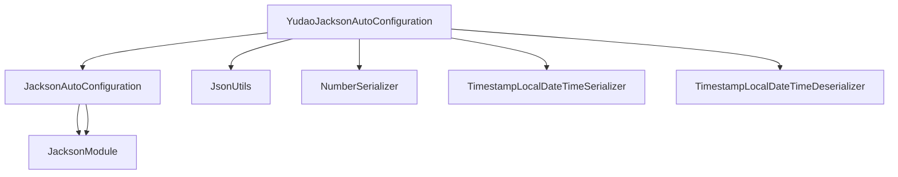
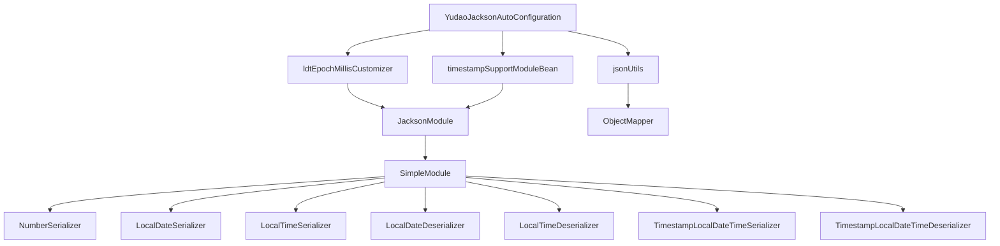

# YudaoJacksonAutoConfiguration 模块文档

## 模块概述

YudaoJacksonAutoConfiguration 是 Yudao 框架中用于配置 Jackson JSON 序列化/反序列化的自动配置类。它位于 `yudao-framework/yudao-spring-boot-starter-web` 模块中，负责自定义 Jackson 的行为以满足业务需求，特别是处理 Java 时间类型和 Long 类型的精度问题。

该配置类在 Spring Boot 的 Jackson 自动配置之后运行，通过提供自定义的序列化器和反序列化器来增强默认的 Jackson 功能。

## 核心功能

1. **自定义序列化/反序列化配置**：通过自定义的 Jackson Module 提供特殊类型的处理
2. **Java 时间类型支持**：提供 LocalDate、LocalTime 和 LocalDateTime 的序列化和反序列化
3. **Long 类型精度保护**：将 Long 类型序列化为字符串以避免 JavaScript 精度丢失问题
4. **全局 JsonUtils 初始化**：将 Spring 创建的 ObjectMapper 注入到工具类中供全局使用

## 架构设计

### 模块定位
```
yudao-framework/yudao-spring-boot-starter-web
└── src/main/java/cn/iocoder/yudao/framework/jackson/config/
    └── YudaoJacksonAutoConfiguration.java
```

### 依赖关系


### 核心组件关系


## 详细组件说明

### YudaoJacksonAutoConfiguration 类

**位置**: `yudao-framework/yudao-spring-boot-starter-web/src/main/java/cn/iocoder/yudao/framework/jackson/config/YudaoJacksonAutoConfiguration.java`

**作用**: Spring Boot 自动配置类，用于自定义 Jackson 的 JSON 处理行为

**关注点**: 
- `@AutoConfiguration(after = JacksonAutoConfiguration.class)` - 确保在 Spring Boot 的 Jackson 自动配置之后加载
- `@Slf4j` - 使用 Lombok 的日志功能

#### Bean 定义

##### 1. ldtEpochMillisCustomizer
```java
@Bean
public JsonMapperBuilderCustomizer ldtEpochMillisCustomizer(JacksonModule timestampSupportModuleBean) {
    return builder -> builder.addModule(timestampSupportModuleBean);
}
```
**作用**: 自定义 Jackson 的 JsonMapperBuilder，添加自定义的时间戳支持模块
**依赖**: 需要 timestampSupportModuleBean 作为参数
**关键点**: 使用 `addModule` 方法而非 `handledType` 以避免类型冲突

##### 2. timestampSupportModuleBean
```java
@Bean
public JacksonModule timestampSupportModuleBean() {
    SimpleModule m = new SimpleModule("TimestampSupportModule");
    // Long -> Number，避免前端精度丢失
    m.addSerializer(Long.class, NumberSerializer.INSTANCE);
    m.addSerializer(Long.TYPE, NumberSerializer.INSTANCE);
    // LocalDate / LocalTime
    m.addSerializer(LocalDate.class, LocalDateSerializer.INSTANCE);
    m.addDeserializer(LocalDate.class, LocalDateDeserializer.INSTANCE);
    m.addSerializer(LocalTime.class, LocalTimeSerializer.INSTANCE);
    m.addDeserializer(LocalTime.class, LocalTimeDeserializer.INSTANCE);
    // LocalDateTime <-> EpochMillis
    m.addSerializer(LocalDateTime.class, TimestampLocalDateTimeSerializer.INSTANCE);
    m.addDeserializer(LocalDateTime.class, TimestampLocalDateTimeDeserializer.INSTANCE);
    return m;
}
```
**作用**: 创建并配置自定义的 Jackson Module，包含以下序列化/反序列化器：
- **NumberSerializer**: 将 Long 类型序列化为字符串，防止 JavaScript 精度丢失
- **LocalDateSerializer/Deserializer**: 处理 LocalDate 类型
- **LocalTimeSerializer/Deserializer**: 处理 LocalTime 类型
- **TimestampLocalDateTimeSerializer/Deserializer**: 将 LocalDateTime 与时间戳（毫秒）相互转换

##### 3. jsonUtils
```java
@Bean
@SuppressWarnings("InstantiationOfUtilityClass")
public JsonUtils jsonUtils(ObjectMapper objectMapper) {
    JsonUtils.init(objectMapper);
    log.debug("[init][初始化 JsonUtils 成功]");
    return new JsonUtils();
}
```
**作用**: 将 Spring 创建的 ObjectMapper 注入到 JsonUtils 工具类中，使得全局可以使用自定义配置的 ObjectMapper
**依赖**: 需要 Spring 自动装配的 ObjectMapper
**日志**: 初始化成功时输出调试日志

## 依赖组件说明

### JsonUtils 工具类
提供 JSON 序列化和反序列化的静态工具方法，包括：
- `toJsonString(Object)`: 对象转 JSON 字符串
- `toJsonByte(Object)`: 对象转 JSON 字节数组
- `toJsonPrettyString(Object)`: 对象转格式化 JSON 字符串
- `parseObject(String, Class)`: JSON 字符串解析为对象
- `parseObject(String, String, Class)`: JSON 字符串路径解析为对象
- `parseObject(String, Type)`: JSON 字符串解析为泛型类型
- `parseObject(byte[], Type)`: JSON 字节数组解析为泛型类型
- `parseObject2(String, Class)`: 使用 JSONUtil 解析（处理特殊类型信息）

### 自定义序列化器/反序列化器

#### NumberSerializer
将 Long 类型序列化为字符串以避免 JavaScript 在处理大整数时的精度丢失问题。

#### TimestampLocalDateTimeSerializer
将 LocalDateTime 序列化为毫秒时间戳（Long）。

#### TimestampLocalDateTimeDeserializer
将毫秒时间戳（Long）反序列化为 LocalDateTime 对象。

#### LocalDateSerializer/LocalDateDeserializer
处理 LocalDate 类型的标准序列化和反序列化。

#### LocalTimeSerializer/LocalTimeDeserializer
处理 LocalTime 类型的标准序列化和反序列化。

## 工作原理

1. **启动时初始化**：当 Spring Boot 应用启动时，YudaoJacksonAutoConfiguration 自动配置类被加载
2. **模块注册**：通过 `timestampSupportModuleBean()` 创建自定义的 Jackson Module 并注册所需的序列化器/反序列化器
3. **Builder 自定义**：通过 `ldtEpochMillisCustomizer()` 将自定义模块添加到 Jackson 的 JsonMapperBuilder
4. **工具初始化**：通过 `jsonUtils()` 将 Spring 配置好的 ObjectMapper 注入到 JsonUtils 工具类中
5. **全局生效**：所有使用 Jackson 的地方（如 @RestController 响应、TestUtil 转换等）都会使用这些自定义配置

## 配置顺序

由于使用了 `@AutoConfiguration(after = JacksonAutoConfiguration.class)` 注解，此配置类在 Spring Boot 的 Jackson 自动配置之后加载，确保我们的自定义配置能够正确覆盖默认行为。

## 使用场景

1. **REST API 响应**：所有使用 @RestController 返回的对象将使用自定义的序列化规则
2. **请求参数绑定**: 所有使用 @RequestBody 接收的 JSON 将使用自定义的反序列化规则
3. **工具类使用**: 通过 JsonUtils 进行的所有 JSON 操作将使用自定义配置
4. **缓存序列化**: 使用 Redis 等缓存时的对象序列化/反序列化

## 配置属性

此配置类没有可配置的属性，所有行为都是硬编码的。如果需要修改行为，需要修改源码。

## 与其他模块的关系

### 被以下模块依赖
- YudaoWebAutoConfiguration: Web 层的自动配置，依赖 Jackson 进行请求/响应处理
- 各种业务模块的 Controller: 通过 @RestController 使用 JSON 序列化/反序列化

### 依赖以下组件
- JacksonAutoConfiguration: Spring Boot 的 Jackson 自动配置基础
- JsonUtils: JSON 工具类
- 各种自定义序列化器/反序列化器: 处理特殊类型

## 最佳实践

1. **时间戳处理**: 使用时间戳而非 ISO 字符串格式可以减少网络传输大小，并且在需要精确时间戳的场景中更合适
2. **Long 精度保护**: 在前端是 JavaScript 的应用中，将大整数作为字符串传输可以避免精度丢失问题
3. **一致性**: 通过全局配置确保整个应用中的 JSON 处理行为保持一致
4. **性能**: 使用单例实例（INSTANCE）减少对象创建开销

## 注意事项

1. **时区依赖**: TimestampLocalDateTimeDeserializer 使用系统默认时区进行转换，在分布式系统中需要确保所有时区一致
2. **前端兼容性**: 前端需要能够正确处理作为字符串传输的 Long 值和时间戳格式的日期时间
3. **排他性**: 此配置替换了默认的 Java 时间类型处理方式，如果需要保留默认行为需要额外配置

## 示例效果

### 序列化示例
```java
// Java 对象
public class Example {
    private Long id;                    id;                    // 123456789012345L
    private LocalDateTime createTime;   // 2023-01-01T12:00:00
}

// JSON 输出
{
    "id": "123456789012345",           // 字符串形式，避免精度丢失
    "createTime": 1672574400000        // 毫秒时间戳
}
```

### 反序列化示例
```json
// JSON 输入
{
    "id": "98765432109876",
    "updateTime": 1672660800000
}

// Java 对象
public class Example {
    private Long         id;          // 98765432109876L
    private LocalDateTime updateTime; // 2023-01-02T12:00:00
}
```

## 性能考量

1. **序列化开销**: 自定义序列化器相比默认序列化器略有开销，但在实际应用中影响可忽略不计
2. **对象创建**: 所有自定义序列化器/反序列化器都使用单例模式，避免了频繁创建对象
3. **内存使用**: 时间戳格式相比 ISO 字符串格式可以节省约 50% 的存储空间

## 错误处理

所有自定义序列化器/反序列化器都继承自 Jackson 的基类，异常处理遵循 Jackson 的标准机制：
- 序列化异常会包装为 JsonGenerationException
- 反序列化异常会包装为 JsonParsingException
- 这些异常最终会被 Spring MVC 的异常处理机制捕获并转换为适当的 HTTP 响应

## 测试建议

1. **单元测试**: 测试每个自定义序列化器/反序列化器的正确性
2. **集成测试**: 验证完整的请求/响应循环中 JSON 处理是否符合预期
3. **边界情况**: 测试 null 值、极大值、时区边界情况等
4. **性能测试**: 在高并发场景下验证性能影响是否在可接受范围内

## 版本历史

- **版本 1.0.0**: 初始版本，提供基本的 Long 精度保护和 Java 时间类型支持
- **后续版本**: 根据业务需求可能添加更多类型的自定义处理

## 结论

YudaoJacksonAutoConfiguration 是 Yudao 框架中一个重要的基础设施组件，它通过自定义 Jackson 的行为解决了实际开发中常见的问题：
1. JavaScript 精度丢失问题（通过将 Long 序列化为字符串）
2. Java 时间类型的序列化需求（通过时间戳格式）
3. 提供一致的 JSON 处理体验（通过全局工具类初始化）

该配置简洁高效，遵循 Spring Boot 的自动配置最佳实践，为整个框架提供了可靠的 JSON 处理基础。