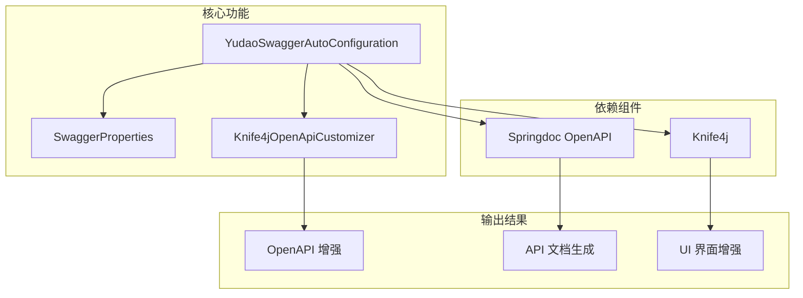

# config_22 模块 - Swagger/OpenAPI 自动配置

## 模块概述

config_22 模块是 Yudao 框架中负责 Swagger/OpenAPI 文档自动配置的核心组件。该模块基于 Springdoc OpenAPI 和 Knife4j 实现，提供了完整的 API 文档生成功能，包括全局配置、分组配置、安全方案以及自定义增强特性。

该模块主要由三个核心组件构成：
1. `SwaggerProperties` - Swagger 配置属性类
2. `Knife4jOpenApiCustomizer` - Knife4j 扩展自定义器
3. `YudaoSwaggerAutoConfiguration` - Swagger 自动配置主类

## 架构设计



## 核心组件说明

### 1. SwaggerProperties

Swagger 配置属性类，用于绑定和验证 Swagger 相关的配置参数。

**位置**：`yudao-framework/yudao-spring-boot-starter-web/src/main/java/cn/iocoder/yudao/framework/swagger/config/SwaggerProperties.java`

**主要属性**：
- `title`：API 文档标题（必填）
- `description`：API 文档描述（必填）
- `author`：API 作者信息（必填）
- `version`：API 版本号（必填）
- `url`：扫描的 package 路径（必填）
- `email`：联系邮箱（必填）
- `license`：许可证名称（必填）
- `licenseUrl`：许可证 URL（必填）

**特点**：
- 使用 `@ConfigurationProperties("yudao.swagger")` 绑定配置前缀
- 使用 Lombok 的 `@Data` 注解自动生成 getter/setter 方法
- 所有属性使用 `@NotEmpty` 进行非空验证，确保配置完整性

### 2. Knife4jOpenApiCustomizer

Knife4j 扩展自定义器，用于增强 OpenAPI 规范中的特定功能，特别是解决 Spring Boot 3.4 以上版本的兼容性问题。

**位置**：`yudao-framework/yudao-spring-boot-starter-web/src/main/java/cn/iocoder/yudao/framework/swagger/config/Knife4jOpenApiCustomizer.java`

**主要功能**：
- 继承自 `com.github.xiaoymin.knife4j.spring.extension.Knife4jOpenApiCustomizer`
- 实现 `GlobalOpenApiCustomizer` 接口以自定义全局 OpenAPI 对象
- 添加 Knife4j 扩展属性（如 markdown 文件支持）
- 为 OpenAPI 中的 tags 字段添加 x-order 属性以控制排序
- 扫描带有 `@ApiSupport` 注解的 RestController 类来确定 tag 顺序

**实现细节**：
1. 当 Knife4j 启用时，解析初始化 OpenApiExtensionResolver
2. 添加全局扩展属性设置和 markdown 文件引用
3. 通过包扫描找到带有 `@ApiSupport` 注解的控制器
4. 根据 ApiSupport 的 order 值为对应的 tag 添加 x-order 扩展属性

### 3. YudaoSwaggerAutoConfiguration

Swagger 自动配置主类，负责创建和配置 OpenAPI 实例以及相关 Bean。

**位置**：`yudao-framework/yudao-spring-boot-starter-web/src/main/java/cn/iocoder/yudao/framework/swagger/config/YudaoSwaggerAutoConfiguration.java`

**关注点**：
- `@AutoConfiguration(before = Knife4jAutoConfiguration.class)`：确保在 Knife4j 自动配置之前加载，以便覆写 Knife4jOpenApiCustomizer
- `@ConditionalOnClass({OpenAPI.class})`：仅当 OpenAPI 类存在时启用自动配置
- `@EnableConfigurationProperties(SwaggerProperties.class)`：启用 SwaggerProperties 配置属性绑定
- `@ConditionalOnProperty(prefix = "springdoc.api-docs", name = "enabled", havingValue = "true", matchIfMissing = true)`：基于 springdoc.api-docs.enabled 属性条件启用
- `@Import(Knife4jOpenApiCustomizer.class)`：导入 Knife4j 扩展自定义器

**主要 Bean 定义**：
1. `createAPI(SwaggerProperties properties)`：创建 OpenAPI 实例，配置基本信息和安全方案
2. `openApiBuilder(...)`：创建 OpenAPIService 实例，标记为 @Primary 以避免冲突
3. `allGroupedOpenApi()`：创建包含所有模块 API 的分组
4. `buildGroupedOpenApi(String group, String path)`：构建分组 OpenAPI 配置
5. `buildTenantHeaderParameter()`：构建租户编号请求头参数
6. `buildSecurityHeaderParameter()`：构建认证 Token 请求头参数
7. `buildOperationIdCustomizer()`：自定义 OperationId 生成规则（类名前缀 + 方法名）

## 详细功能说明

### 全局 OpenAPI 配置

在 `createApi` 方法中，模块创建了一个完整的 OpenAPI 实例：

1. **API 基础信息**：通过 `buildInfo` 方法设置标题、描述、版本、作者联系信息和许可证信息
2. **安全方案配置**：通过 `buildSecuritySchemes` 方法配置 API Key 认证方案，使用 Authorization 请求头传递 Token
3. **全局安全要求**：为所有 API 添加默认的安全要求（Authorization 头）

### 分组 OpenAPI 配置

模块提供了灵活的 API 分组机制：

1. **全局分组**：`allGroupedOpenApi()` 创建名为 "all" 的分组，匹配所有路径
2. **自定义分组**：`buildGroupedOpenApi` 方法允许创建特定模块的 API 分组
3. **路径匹配**：分组支持匹配 `/admin-api/{path}/**` 和 `/app-api/{path}/**` 两种路径前缀
4. **操作增强**：为每个操作添加租户编号和认证 Token 请求头参数
5. **OperationId 自定义**：使用类名前缀 + 方法名的方式生成唯一的 OperationId（解决前端生成代码时的命名冲突问题）

### 特殊增强功能

1. **租户支持**：自动为所有 API 操作添加 `X-Tenant-Id` 请求头参数，默认值为 1
2. **认证支持**：自动为所有 API 操作添加 `Authorization` 请求头参数，提供示例值
3. **OperationId 生成**：自定义规则将 `UserController.list()` 方法的 OperationId 生成为 `User_list`，避免默认生成的冲突
4. **Knife4j 扩展**：通过 `Knife4jOpenApiCustomizer` 增强 Knife4j 特性，支持 markdown 文件和 tag 排序

## 与其他模块的关系

config_22 模块属于 yudao-spring-boot-starter-web 启动器的一部分，为整个框架提供 API 文档能力。它不直接依赖其他业务模块，但被所有需要暴露 RESTful API 的模块间接使用。

与其他配置模块的关系可以参考：
- [config_21](config_21.md)：Jackson 自动配置（JSON 处理）
- [config_20](config_20.md)：API 加密配置
- [config_23](config_23.md)：Web 自动配置
- [config_24](config_24.md)：XSS 防护配置

这些配置模块共同构建了 yudao-framework 的 Web 层基础设施。

## 配置使用示例

在 application.yml 或 application.properties 中配置 Swagger 属性：

```yaml
yudao:
  swagger:
    title: Yudao 框架 API 文档
    description: Yudao 框架提供的后台管理系统 API 接口
    author: 芋道源码
    version: 1.0.0
    url: cn.iocoder.yudao
    email: yudao@iocoder.cn
    license: Apache License 2.0
    licenseUrl: https://www.apache.org/licenses/LICENSE-2.0
```

Springdoc 基础配置（application.yml）：

```yaml
springdoc:
  api-docs:
    enabled: true  # 启用 API 文档
  group-configs:
    - group: 系统管理
      paths-to-match: /admin-api/system/**
    - group: 会员管理
      paths-to-match: /admin-api/member/**
    - group: 应用接口
      paths-to-match: /app-api/**
```

## 设计优势

1. **自动化配置**：基于 Spring Boot 自动配置原则，零配置即可使用（仅需添加依赖）
2. **高度可定制**：通过 SwaggerProperties 提供丰富的配置选项
3. **增强兼容性**：专门解决 Spring Boot 3.4+ 与 Knife4j 的兼容性问题
4. **租户友好：内置多租户支持，自动处理租户编号传递
5. **前端集成友好**：自定义 OperationId 生成规则，便于前端代码生成工具正确识别 API
6. **安全规范**：统一的认证方案配置，确保所有 API 文档正确展示安全要求

## 依赖关系

该模块主要依赖以下第三方库：
- Springdoc OpenAPI UI：用于生成 OpenAPI 3.0 规范文档
- Knife4j：用于增强 Swagger UI 界面和提供中文文档支持
- Spring Boot：自动配置框架

在项目的 pom.xml 中通常需要包含以下依赖：
```xml
<dependency>
    <groupId>org.springdoc</groupId>
    <artifactId>springdoc-openapi-ui</artifactId>
    <version>1.6.14</version>
</dependency>
<dependency>
    <groupId>com.github.xiaoymin</groupId>
    <artifactId>knife4j-spring-boot-starter</artifactId>
    <version>4.1.0</version>
</dependency>
```

## 最佳实践

1. **配置完整性**：确保 SwaggerProperties 中的所有必填项都有值，避免启动验证失败
2. **分组合理化**：根据业务模块合理划分 API 分组，提高文档可读性
3. **版本管理**：随着 API 演进，及时更新 version 字段以反映当前版本
4. **安全配置**：在生产环境中，确保认证方案与实际安全机制匹配
5. **性能考虑**：在生产环境中可以考虑关闭 API 文档（设置 springdoc.api-docs.enabled=false）以减少启动时间和资源消耗

## 与前端集成

该模块生成的 OpenAPI 文档可以被以下工具消费：
- Swagger UI：通过 /doc.html 访问
- Knife4j 增强界面：通过 /doc.html 访问（提供更好的中文支持和增强功能
- 前端代码生成工具：如 OpenAPI Generator，可基于生成的 OpenAPI 规范自动生成客户端代码
- API 测试工具：如 Postman，可导入 OpenAPI 规范进行自动化测试

通过自定义的 OperationId 生成规则（类名前缀 + 方法名），前端代码生成工具能够生成更具可读性和可维护性的客户端代码。