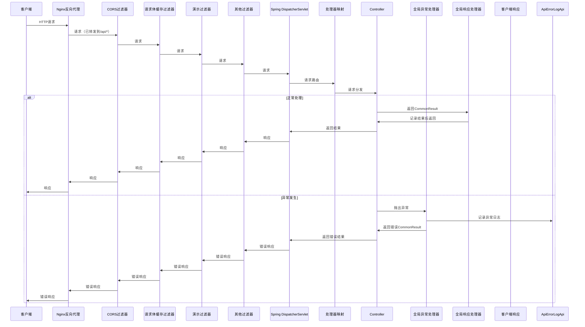

# YudaoWebAutoConfiguration 模块文档

## 模块概述

YudaoWebAutoConfiguration 是 Yudao 框架中负责 Web 配置的自动配置类，位于 `yudao-framework/yudao-spring-boot-starter-web` 模块中。该类提供了 Web 应用的核心功能，包括路径前缀配置、全局异常处理、响应结果处理、过滤器注册以及 REST 模板创建等。

该模块是 Yudao 框架 Web 层的基础设施，为整个系统的 Web 请求处理提供统一的配置和处理机制。

## 核心功能

1. **路径前缀配置**：通过 `WebMvcRegistrations` 为不同类型的 Controller 设置路径前缀，实现 Admin API 和 App API 的路径隔离
2. **全局异常处理**：统一处理各种异常并转换为标准的 `CommonResult` 返回格式
3. **响应结果处理**：记录 Controller 的返回结果，用于访问日志记录
4. **过滤器注册**：注册 CORS、请求体缓存、演示模式等过滤器
5. **REST 模板创建**：提供 `RestTemplate` Bean 用于 HTTP 客户端调用
6. **Web 框架工具**：提供 Web 相关的工具方法，如获取租户 ID、用户信息等

## 架构设计

### 模块定位

YudaoWebAutoConfiguration 属于 Yudao 框架的 Web 层基础设施模块，为上层业务模块提供统一的 Web 处理能力。它依赖于以下核心组件：

- `WebProperties`：Web 配置属性类
- 各种过滤器（CORS、请求体缓存、演示过滤器等）
- 全局异常处理器和响应处理器
- Web 框架工具类

### 与其他模块的关系

YudaoWebAutoConfiguration 为整个 Yudao 框架的 Web 层提供基础支持，被以下模块间接或直接使用：

- 所有需要 Web 功能的业务模块（如系统管理、会员、商城等）
- 框架的其他 Web 相关 starter（如安全、日志、监控等）
- 前端 Vue 3 管理后台（通过 API 交互）

### 依赖关系

```mermaid
graph TD
    YudaoWebAutoConfiguration --> WebProperties
    YudaoWebAutoConfiguration --> GlobalExceptionHandler
    YudaoWebAutoConfiguration --> GlobalResponseBodyHandler
    YudaoWebAutoConfiguration --> WebFrameworkUtils
    YudaoWebAutoConfiguration --> CacheRequestBodyFilter
    YudaoWebAutoConfiguration --> DemoFilter
    YudaoWebAutoConfiguration --> CorsFilter
    YudaoWebAutoConfiguration --> RestTemplate
    
    GlobalExceptionHandler --> ApiErrorLogCommonApi
    GlobalExceptionHandler --> WebFrameworkUtils
    GlobalResponseBodyHandler --> WebFrameworkUtils
    WebFrameworkUtils --> WebProperties
    
    %% 关联到其他模块
    YudaoWebAutoConfiguration -->|提供基础 Web 能力| SystemWebConfiguration
    YudaoWebAutoConfiguration -->|提供基础 Web 能力| MemberWebConfiguration
    YudaoWebAutoConfiguration -->|提供基础 Web 能力| MallWebConfiguration
    YudaoWebAutoConfiguration -->|提供基础 Web 能力| ErpWebConfiguration
    YudaoWebAutoConfiguration -->|提供基础 Web 能力| MesWebConfiguration
    YudaoWebAutoConfiguration -->|提供基础 Web 能力| WmsWebConfiguration
    YudaoWebAutoConfiguration -->|提供基础 Web 能力| MpWebConfiguration
    YudaoWebAutoConfiguration -->|提供基础 Web 能力| PayWebConfiguration
    YudaoWebAutoConfiguration -->|提供基础 Web 能力| ReportWebConfiguration
    YudaoWebAutoConfiguration -->|提供基础 Web 能力| ImWebConfiguration
    YudaoWebAutoConfiguration -->|提供基础 Web 能力| IotWebConfiguration
    YudaoWebAutoConfiguration -->|提供基础 Web 能力| BpmWebConfiguration
    YudaoWebAutoConfiguration -->|提供基础 Web 能力| TradeWebConfiguration
    YudaoWebAutoConfiguration -->|提供基础 Web 能力| PromotionWebConfiguration
    YudaoWebAutoConfiguration -->|提供基础 Web 能力| StatisticsWebConfiguration
    YudaoWebAutoConfiguration -->|提供基础 Web 能力| InfraWebConfiguration
```



## 详细组件说明

### 1. YudaoWebAutoConfiguration 类

这是整个模块的核心配置类，负责注册所有 Web 相关的 Bean。

#### 主要功能：

- 配置路径前缀映射：为 Admin API 和 App API 设置不同的路径前缀
- 注册全局异常处理器：统一处理应用异常
- 注册全局响应处理器：记录 Controller 返回结果
- 注册 Web 框架工具：提供 Web 相关工具方法
- 注册过滤器：CORS、请求体缓存、演示过滤器
- 注册 RestTemplate：用于 HTTP 客户端调用

#### 关注点：

1. **路径前缀配置**：通过 `WebMvcRegistrations` 实现路径前缀的动态配置，根据不同的 API 类型（admin-api、app-api）设置不同的 Controller 包匹配规则
2. **条件注册**：演示过滤器仅在 `yudao.demo=true` 时注册
3. **过滤器顺序**：通过 `@Order` 注解和 `WebFilterOrderEnum` 确保过滤器执行顺序正确
4. **缺失 Bean 注册**：RestTemplate 仅在没有其他 Bean 时注册，避免冲突

### 2. WebProperties 类

Web 配置属性类，用于绑定 `yudao.web` 前缀的配置属性。

#### 配置项：

- `appApi`：App API 配置，包含前缀和 Controller 包路径
- `adminApi`：Admin API 配置，包含前缀和 Controller 包路径
- `adminUi`：Admin UI 访问地址

#### 设计目的：

- 实现所有 Controller 提供的 RESTFul API 的统一前缀
- 避免 Swagger、Actuator 意外通过 Nginx 暴露出来给外部，带来安全性问题
- 让 Nginx 只需要配置转发到 `/api/*` 的所有接口即可

### 3. 全局异常处理器 (GlobalExceptionHandler)

统一处理应用中的各种异常，将其转换为标准的 `CommonResult` 返回格式。

#### 处理的异常类型：

- 请求参数缺失 (`MissingServletRequestParameterException`)
- 请求参数类型错误 (`MethodArgumentTypeMismatchException`)
- 参数校验错误 (`MethodArgumentNotValidException`, `BindException`, `ConstraintViolationException`, `ValidationException`)
- 文件上传过大 (`MaxUploadSizeExceededException`)
- 请求地址不存在 (`NoHandlerFoundException`, `NoResourceFoundException`)
- 请求方法不正确 (`HttpRequestMethodNotSupportedException`)
- 请求 Content-Type 不正确 (`HttpMediaTypeNotSupportedException`)
- 权限不足 (`AccessDeniedException`)
- 业务异常 (`ServiceException`)
- 系统异常 (`Exception` 作为兜底处理)

#### 特殊功能：

- 异常日志记录：通过 `ApiErrorLogCommonApi` 异步记录异常日志
- 忽略特定错误消息：避免重复打印某些 ServiceException（如“无效的刷新令牌”）
- 表不存在异常特殊处理：针对数据库表不存在的情况提供友好提示

### 4. 全局响应处理器 (GlobalResponseBodyHandler)

实现 `ResponseBodyAdvice` 接口，用于记录 Controller 的返回结果。

#### 工作原理：

- 只拦截返回结果为 `CommonResult` 类型的方法
- 在响应体写入前，将结果存储到请求属性中
- 供 `ApiAccessLogFilter` 等组件读取用于访问日志记录

#### 设计理念：

- 不自动将 Controller 返回结果包装成 `CommonResult`（这由 Controller 主动完成）
- 仅记录已经是 `CommonResult` 格式的返回结果
- 避免改变 Controller 返回的数据结构

### 5. Web 框架工具 (WebFrameworkUtils)

提供 Web 层相关的工具方法。

#### 主要功能：

- 租户 ID 获取：从请求 header 中获取 `tenant-id` 和 `visit-tenant-id`
- 用户信息获取：获取当前登录用户 ID 和类型
- 终端类型获取：从请求 header 中获取终端类型
- 请求获取：通过 `RequestContextHolder` 获取当前请求
- CommonResult 存储和获取：在请求属性中存储和获取响应结果

#### 设计特点：

- 使用静态方法和静态属性保存 WebProperties 实例
- 通过请求属性在过滤器和 Controller 之间传递数据
- 支持从静态上下文获取当前请求信息

### 6. 过滤器

#### CORS 过滤器

- 解决跨域问题
- 设置允许所有来源、所有头部、所有方法
- 顺序为 `WebFilterOrderEnum.CORS_FILTER`（最小值），确保最先执行

#### 请求体缓存过滤器 (CacheRequestBodyFilter)

- 实现请求体的可重复读取
- 使用 `CacheRequestBodyWrapper` 包装原始请求
- 排除特定 URI（如 `/admin/`、`/actuator/`）以避免已知问题
- 仅处理非 JSON 请求内容
- 顺序为 `WebFilterOrderEnum.REQUEST_BODY_CACHE_FILTER`

#### 演示过滤器 (DemoFilter)

- 演示模式下禁止写操作（POST、PUT、DELETE）
- 仅对已登录用户生效
- 直接返回演示模式拒绝结果，不继续请求处理
- 仅在 `yudao.demo=true` 时注册
- 顺序为 `WebFilterOrderEnum.DEMO_FILTER`（最大值），确保最后执行

#### API 请求过滤器基类 (ApiRequestFilter)

- 抽象基类，用于过滤特定 API 前缀的请求
- 只处理以 `adminApi` 或 `appApi` 前缀开头的请求
- 由其他具体过滤器继承使用

### 7. RestTemplate

- 创建 RestTemplate 实例用于 HTTP 客户端调用
- 仅在没有其他 RestTemplate Bean 时注册（`@ConditionalOnMissingBean`）
- 使用 `RestTemplateBuilder` 构建

## 数据流和处理流程

### 请求处理流程



### 路径前缀匹配流程

```mermaid
flowchart TD
    A[请求到达DispatcherServlet] --> B{请求路径是否匹配<br>admin-api或app-api前缀}
    B -->|匹配| C[根据路径确定Controller包规则]
    B -->|不匹配| D[使用默认路径匹配]
    C --> E{Controller类是否@RestController注解<br>且包名匹配配置规则}
    E -->|匹配| F[应用对应的路径前缀]
    E -->|不匹配| G[不应用路径前缀]
    F --> H[继续正常的请求映射处理]
    G --> H
```

## 配置说明

### 主要配置项

配置通过 `application.yml` 或 `application.properties` 进行，使用 `yudao.web` 前缀：

```yaml
yudao:
  web:
    app-api:
      prefix: /app-api          # App API 前缀
      controller: **.controller.app.**  # App Controller 包路径
    admin-api:
      prefix: /admin-api        # Admin API 前缀
      controller: **.controller.admin.**  # Admin Controller 包路径
    admin-ui:
      url: http://localhost:5173  # Admin UI 访问地址
```

### 过滤器顺序说明

过滤器执行顺序由数值决定，数值越小越先执行：

1. `CORS_FILTER` (Integer.MIN_VALUE) - 最先执行，处理跨域
2. `TRACE_FILTER` - 链路追踪
3. `REQUEST_BODY_CACHE_FILTER` (Integer.MIN_VALUE + 500) - 请求体缓存
4. `API_ENCRYPT_FILTER` - API 加密解密
5. `TENANT_CONTEXT_FILTER` (-104) - 租户上下文
6. `API_ACCESS_LOG_FILTER` (-103) - API 访问日志
7. `XSS_FILTER` (-102) - XSS 防护
8. Spring Security Filter (默认 -100) - 安全认证
9. `TENANT_SECURITY_FILTER` (-99) - 租户安全
10. `FLOWABLE_FILTER` (-98) - 工作流
11. ... 其他过滤器 ...
12. `DEMO_FILTER` (Integer.MAX_VALUE) - 最后执行，演示模式

## 与其他模块的集成

### 与系统管理模块的集成

系统管理模块（`yudao-module-system`）依赖 YudaoWebAutoConfiguration 提供的 Web 基础能力：

- 使用统一的路径前缀（/admin-api）访问系统管理接口
- 受益于全局异常处理，确保错误返回格式一致
- 利用请求体缓存实现可重复读取请求数据
- 通过 WebFrameworkUtils 获取当前用户和租户信息

### 与业务模块的集成

以商城模块为例（`yudao-module-mall`）：

- 商城后台管理接口使用 /admin-api 前缀
- 商城前端小程序/App 接口使用 /app-api 前缀
- 所有业务异常通过 ServiceException 抛出，被 GlobalExceptionHandler 统一处理
- 响应结果通过 GlobalResponseBodyHandler 记录用于访问日志
- 业务代码通过 WebFrameworkUtils 获取租户 ID、用户信息等

### 与前端的交互

前端 Vue 3 管理后台（`yudao-ui/yudao-ui-admin-vue3`）通过以下方式与 YudaoWebAutoConfiguration 交互：

1. 通过 Nginx 配置将 /api/* 请求转发到后端
2. 后端根据 yudao.web 配置将请求路由到对应的 Controller
3. 前端请求需要包含适当的 header（如 tenant-id、authorization 等）
4. 前端接收到统一格式的 CommonResult 响应
5. 异常情况下，前端可以根据返回的错误码和消息进行统一处理

## 最佳实践

### 使用建议

1. **统一异常处理**：业务代码应抛出 `ServiceException` 而非直接返回错误结果，以利用全局异常处理器的统一处理和日志记录
2. **主动包装结果**：Controller 方法应主动返回 `CommonResult.success(data)` 或 `CommonResult.error(code, msg)`，以确保响应格式一致
3. **正确配置路径前缀**：在 application.yml 中正确配置 app-api 和 admin-api 的前缀和 Controller 包路径
4. **合理使用过滤器**：了解各过滤器的作用和顺序，避免自定义过滤器与框架过滤器冲突
5. **利用工具类**：在需要获取租户 ID、用户信息等 Web 上下文信息时，使用 WebFrameworkUtils 提供的静态方法

### 扩展指南

1. **添加新过滤器**：继承 `OncePerRequestFilter` 或 `ApiRequestFilter`，并通过 `@Bean` 注册
2. **自定义异常处理**：在 GlobalExceptionHandler 中添加新的异常处理方法
3. **扩展响应处理**：如需修改响应处理逻辑，可修改 GlobalResponseBodyHandler
4. **添加Web工具方法**：在 WebFrameworkUtils 中添加新的静态方法
5. **修改路径规则**：修改 WebProperties 和 YudaoWebAutoConfiguration 中的路径匹配逻辑

## 注意事项

1. **过滤器顺序重要性**：自定义过滤器注册时必须考虑其在过滤器链中的位置，错误的顺序可能导致功能异常
2. **演示模式限制**：演示过滤器仅在开发测试环境启用，生产环境应确保 `yudao.demo=false`
3. **路径前缀安全性**：正确配置路径前缀是防止内部接口意外暴露的重要安全措施
4. **异常日志性能**：全局异常处理器会异步记录日志，但在高并发场景下仍需关注其性能影响
5. **请求体缓存限制**：请求体缓存过滤器仅对非 JSON 请求生效，JSON 请求由 Spring MVC 自行处理其可重复读取能力

## 与相关模块的关联

为了避免信息重复，以下是与本模块紧密相关的其他模块文档的引用：

- [WebProperties 配置说明](config_23.md#webproperties-类)：详细说明 Web 配置属性
- [全局异常处理机制](config_23.md#全局异常处理器-globalexceptionhandler)：解释异常处理的设计思想和处理流程
- [响应结果处理机制](config_23.md#全局响应处理器-globalresponsebodyhandler)：描述如何记录和访问 Controller 返回结果
- [过滤器链设计](config_23.md#过滤器)：详细说明各过滤器的作用、顺序和使用场景
- [Web 框架工具使用](config_23.md#web-框架工具-webframeworkutils)：说明如何获取租户、用户等 Web 上下文信息
- [与系统管理模块的集成](config_23.md#与系统管理模块的集成)：展示如何在业务模块中使用 Web 基础能力
- [与前端的交互](config_23.md#与前端的交互)：说明前端如何与后端 Web 层进行交互

## 总结

YudaoWebAutoConfiguration 是 Yudao 框架 Web 层的核心基础设施模块，提供了路径配置、异常处理、响应处理、过滤器管理和 Web 工具等基本能力。通过统一的配置和处理机制，它确保了整个框架中 Web 请求处理的一致性、安全性和可维护性。

该模块的设计遵循了 Spring Boot 的自动配置原则，通过条件注册和属性绑定提供了高度的可配置性，同时通过精心设计的过滤器顺序和异常处理机制，确保了 Web 请求的正确处理和安全防护。

对于框架使用者来说，理解和正确使用 YudaoWebAutoConfiguration 提供的能力是构建稳健、安全且易于维护的 Web 应用的基础。