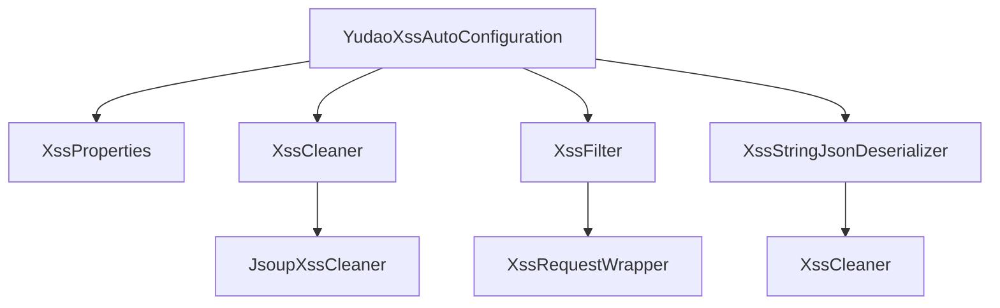
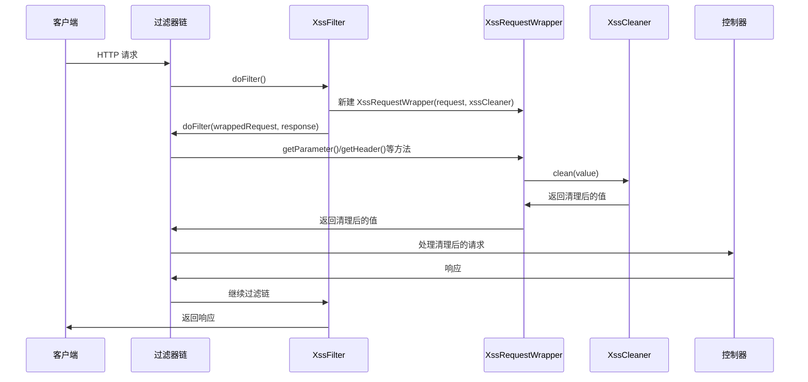
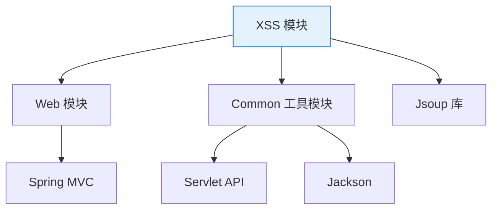

# Yudao XSS 自动配置模块

## 概述

Yudao XSS 自动配置模块是 Yudao 框架中的一个安全组件，用于防止跨站脚本攻击（XSS）。该模块通过 Spring Boot 自动配置机制，在应用启动时自动注入 XSS 过滤器和清理器，为 Web 应用提供全方位的 XSS 防护。

该模块的核心功能包括：
1. 自动配置 XSS 清理器（基于 Jsoup 库）
2. 注册 XSS 过滤器到 Spring MVC 过滤器链
3. 配置 Jackson 反序列化器，对 JSON 请求参数进行 XSS 过滤
4. 支持通过配置排除特定 URL 的 XSS 过滤
5. 与 Yudao 框架的过滤器顺序机制集成

## 核心组件

### YudaoXssAutoConfiguration

XSS 自动配置类，负责初始化和配置 XSS 防护相关的 Bean。

**位置**：`yudao-framework/yudao-spring-boot-starter-web/src/main/java/cn/iocoder/yudao/framework/xss/config/YudaoXssAutoConfiguration.java`

**主要功能**：
- 通过 `@AutoConfiguration` 声明为 Spring Boot 自动配置类
- 通过 `@EnableConfigurationProperties(XssProperties.class)` 启用属性绑定
- 通过 `@ConditionalOnProperty(prefix = "yudao.xss", name = "enable", havingValue = "true", matchIfMissing = true)` 控制自动配置的激活条件
- 实现 `WebMvcConfigurer` 接口以集成到 Spring MVC

**关键 Bean 定义**：
1. `xssCleaner()` - 创建 XSS 清理器实现（默认使用 JsoupXssCleaner）
2. `xssJacksonCustomizer()` - 配置 Jackson 反序列化器，对 JSON 请求参数进行 XSS 过滤
3. `xssFilter()` - 创建并注册 XSS 过滤器到过滤器链

### XssProperties

XSS 配置属性类，用于绑定和管理 XSS 相关的配置参数。

**位置**：`yudao-framework/yudao-spring-boot-starter-web/src/main/java/cn/iocoder/yudao/framework/xss/config/XssProperties.java`

**配置属性**：
- `enable`：是否开启 XSS 过滤，默认为 true
- `excludeUrls`：需要排除的 URL 列表，默认为空列表

### XssCleaner 接口

定义 XSS 清理的契约接口。

**位置**：`yudao-framework/yudao-spring-boot-starter-web/src/main/java/cn/iocoder/yudao/framework/xss/core/clean/XssCleaner.java`

**方法**：
- `String clean(String html)`：清理有 XSS 风险的文本

### JsoupXssCleaner

基于 Jsoup 库的 XSS 清理器实现。

**位置**：`yudao-framework/yudao-spring-boot-starter-web/src/main/java/cn/iocoder/yudao/framework/xss/core/clean/JsoupXssCleaner.java`

**特点**：
- 基于 Jsoup 的 Safelist.relaxed() 进行扩展
- 支持 style 和 class 属性（用于富文本编辑）
- 保留 a 标签的 target 属性
- 支持 img 标签的 data 协议（便于 base64 图片）
- 通过 `clean()` 方法执行实际的 XSS 清理操作

### XssFilter

XSS 过滤器，继承自 Spring 的 OncePerRequestFilter。

**位置**：`yudao-framework/yudao-spring-boot-starter-web/src/main/java/cn/iocoder/yudao/framework/xss/core/filter/XssFilter.java`

**工作原理**：
- 在每次请求处理时，将原始 HttpServletRequest 包装为 XssRequestWrapper
- 对请求参数、头部、属性和查询字符串进行 XSS 清理
- 支持通过配置排除特定 URL 的过滤
- 过滤器顺序由 WebFilterOrderEnum.XSS_FILTER 决定（-102）

### XssRequestWrapper

HttpServletRequest 的包装类，用于对请求内容进行 XSS 清理。

**位置**：`yudao-framework/yudao-spring-boot-starter-web/src/main/java/cn/iocoder/yudao/framework/xss/core/filter/XssRequestWrapper.java`

**清理范围**：
- 请求参数（getParameter, getParameterValues, getParameterMap）
- 请求属性（getAttribute）
- 请求头部（getHeader）
- 查询字符串（getQueryString）

### XssStringJsonDeserializer

Jackson 反序列化器，用于对 JSON 请求参数中的字符串进行 XSS 清理。

**位置**：`yudao-framework/yudao-spring-boot-starter-web/src/main/java/cn/iocoder/yudao/framework/xss/core/json/XssStringJsonDeserializer.java`

**工作原理**：
- 在 JSON 反序列化过程中拦截字符串值
- 对字符串值使用 XssCleaner 进行清理
- 支持排除特定 URL 的过滤（与 XssFilter 保持一致）

## 架构设计

### 模块结构



### 过滤器链集成

```mermaid
graph LR
    A[HTTP 请求] --> B{CORS 过滤器<br/>(Order: Integer.MIN_VALUE)}
    B --> C{请求体缓存过滤器<br/>(Order: Integer.MIN_VALUE + 500)}
    C --> D{XSS 过滤器<br/>(Order: -102)}
    D --> E[Spring Security 过滤器<br/>(Order: -100)]
    E --> F[应用程序处理]
    
    style D fill:#e1f5fe,stroke:#01579b
```

### 数据流



## 与其他模块的关系

### 依赖关系



### 与 Yudao 框架的集成

XSS 模块深度集成到 Yudao 框架的 Web 配置体系中：

1. **过滤器顺序**：通过 `WebFilterOrderEnum.XSS_FILTER = -102` 定义其在过滤器链中的位置，确保在请求体缓存过滤器之后、Spring Security 过滤器之前执行
2. **自动配置**：遵循 Spring Boot 的自动配置约束，通过条件注解实现按需加载
3. **属性配置**：使用 `@ConfigurationProperties` 实现类型安全的配置绑定
4. **扩展点**：通过 `@ConditionalOnMissingBean` 允许用户自定义 XssCleaner 实现

## 配置说明

### 默认配置

XSS 过滤器默认开启，可以通过以下方式关闭：

```yaml
yudao:
  xss:
    enable: false
```

### 排除特定 URL

可以配置不需要 XSS 过滤的 URL 列表（通常用于需要接受 HTML 内容的接口）：

```yaml
yudao:
  xss:
    enable: true
    excludeUrls:
      - /api/content/**  # 内容管理接口可能需要接受 HTML
      - /api/editor/**   # 编辑器接口
```

### 高级配置

由于 XssCleaner 是一个 Bean，可以通过自定义实现来替换默认的 JsoupXssCleaner：

```java
@Bean
public XssCleaner customXssCleaner() {
    return new CustomXssCleaner(); // 实现 XssCleaner 接口
}
```

## 工作原理详解

### 1. 自动配置触发

当 Spring Boot 应用启动时，如果满足以下条件，YudaoXssAutoConfiguration 将被激活：
- 类路径中存在 XssProperties 类
- 配置文件中 `yudao.xss.enable` 为 true（或未配置，默认为 true）

### 2. Bean 初始化过程

1. **XssCleaner Bean**：创建 JsoupXssCleaner 实例（如果用户未提供自定义实现）
2. **XssJacksonCustomizer Bean**：配置 Jackson 的 ObjectMapper，添加 XssStringJsonDeserializer 来处理 JSON 反序列化时的 XSS 清理
3. **XssFilter Bean**：创建 XssFilter 实例并注册到过滤器链，顺序为 -102

### 3. 请求处理流程

当 HTTP 请求到达时：
1. 请求首先经过 CORS 过滤器（Order: Integer.MIN_VALUE）
2. 然后经过请求体缓存过滤器（Order: Integer.MIN_VALUE + 500）
3. 到达 XSS 过滤器（Order: -102）：
   - 检查是否启用 XSS 过滤
   - 检查当前 URL 是否在排除列表中
   - 如果不过滤，直接放行
   - 如果需要过滤，创建 XssRequestWrapper 包装原始请求
   - 将包装后的请求传递给过滤器链的链继续处理
4. XssRequestWrapper 拦截所有请求数据获取方法（参数、头部、属性等），在返回前使用 XssCleaner 进行清理
5. 对于 JSON 请求体，Jackson 的 XssStringJsonDeserializer 在反序列化过程中对字符串值进行清理
6. 清理后的请求到达控制器处理方法

### 4. XSS 清理策略

JsoupXssCleaner 使用 Jsoup 库的 Safelist 机制：
- 基础策略：Safelist.relaxed()（允许常见的 HTML 标签和属性）
- 扩展策略：
  - 为所有标签添加 style 和 class 属性支持（富文本编辑需求）
  - 为 a 标签额外添加 target 属性支持
  - 为 img 标签额添加 data 协议支持（base64 图片）
- 通过 `Jsoup.clean(html, baseUri, safelist, outputSettings)` 执行实际清理

## 使用示例

### 基础使用

无需任何额外配置，XSS 过滤器会自动生效：

```java
@RestController
public class UserController {
    
    @PostMapping("/users")
    public ResponseEntity<User> createUser(@RequestBody User user) {
        // user 对象中的字符串字段已经经过 XSS 清理
        // 例如：如果传入 <script>alert('xss')</script>，将被清理为空字符串
        return ResponseEntity.ok(userService.create(user));
    }
    
    @GetMapping("/users/{id}")
    public ResponseEntity<User> getUser(@PathVariable String id, 
                                       @RequestParam String name) {
        // id 和 name 参数已经经过 XSS 清理
        return ResponseEntity.ok(userService.getById(id));
    }
}
```

### 自定义 XSS 清理器

如果需要自定义 XSS 清理策略，可以实现 XssCleaner 接口：

```java
@Component
public class CustomXssCleaner implements XssCleaner {
    
    @Override
    public String clean(String html) {
        // 自定义清理逻辑
        if (html == null) {
            return null;
        }
        // 例如：仅允许特定标签
        Safelist safelist = Safelist.none()
                .addTags("b", "i", "em", "strong")
                .addAttributes(":all", "class");
        return Jsoup.clean(html, safelist);
    }
}
```

### 排除特定接口

对于需要接受富文本内容的接口，可以配置排除：

```java
@RestController
@RequestMapping("/api/content")
public class ContentController {
    
    @PostMapping("/articles")
    public ResponseEntity<Article> createArticle(@RequestBody Article article) {
        // 此接口的内容不会经过 XSS 过滤（如果已在 excludeUrls 中配置）
        // 适用于需要存储和展示用户生成 HTML 内容的场景
        return ResponseEntity.ok(contentService.create(article));
    }
}
```

对应的配置：
```yaml
yudao:
  xss:
    enable: true
    excludeUrls:
      - /api/content/**
```

## 性能考虑

### 清理性能

JsoupXssCleaner 的性能取决于：
1. 输入 HTML 的大小和复杂度
2. Safelist 规则的复杂度
3. Jsoup 库的解析效率

### 优化建议

1. **选择性过滤**：通过 excludeUrls 配置避免不需要过滤的接口
2. **复用实例**：XssCleaner 和 XssFilter 都是单例 Bean，不会为每个请求创建新实例
3. **异步处理**：对于对实时性要求不高的场景，可以考虑异步进行 XSS 检查和报警
4. **缓存策略**：对相同内容进行多次清理时，可以考虑实现简单的缓存机制

## 安全性分析

### 防御能力

当前实现可以有效防御以下 XSS 攻击向量：
1. **反射型 XSS**：通过 URL 参数、请求头等注入的脚本
2. **存储型 XSS**：通过表单提交、JSON 参数等存储的脚本
3. **DOM 型 XSS**：通过修改 DOM 属性注入的脚本（间接防御，因为会清理属性值）

### 已知限制

1. **富文本场景**：虽然支持 style 和 class 属性，但仍需谨慎使用，因为这些属性可能被用于 CSS-based XSS 攻击
2. **JSON 劫持**：当前实现主要防御反射型和存储型 XSS，对 JSON 劫持的防御依赖于正确的 Content-Type 设置
3. **基于状态的攻击**：如利用浏览器缓存或 Service Worker 的攻击，需要其他安全措施配合

### 最佳实践

1. **分层防御**：XSS 过滤器作为第一道防线，应结合输出编码、CSP（内容安全策略）等其他措施
2. **上下文 awareness**：不同的上下文（HTML 属性、JavaScript、CSS、URL）需要不同的转义策略，当前实现主要关注 HTML 上下文
3. **定期更新**：保持 Jsoup 库的更新以获得最新的安全修复
4. **日志和监控**：建议记录被过滤的恶意内容以进行安全分析

## 测试建议

### 单元测试

1. **XssCleaner 测试**：
   - 测试各种 XSS payload 的清理效果
   - 测试合法 HTML 内容的保留
   - 测试边界情况（null、空字符串、特殊字符）

2. **XssFilter 测试**：
   - 测试过滤器的启用/禁用逻辑
   - 测试 URL 排除功能
   - 测试请求包装和参数清理

3. **XssStringJsonDeserializer 测试**：
   - 测试 JSON 反序列化过程中的字符串清理
   - 测试非字符串字段的正常处理
   - 测试异常 JSON 输入的处理

### 集成测试

1. **过滤器链测试**：验证 XSS 过滤器在 Spring MVC 过滤器链中的正确位置和执行顺序
2. **端到端测试**：发送包含 XSS payload 的请求，验证控制器接收到的参数已经被清理
3. **排除 URL 测试**：验证配置的排除 URL 确实不会经过 XSS 过滤

## 与相关模块的对比

### 与其他 XSS 防护方案的比较

| 方案 | 优点 | 缺点 | 适用场景 |
|------|------|------|----------|
| Yudao XSS 模块 | 自动配置、零代码侵入、支持 JSON 过滤、可配置排除 | 依赖 Jsoup，可能有性能开销 | 大多数 Web 应用，特别是需要统一防护的场景 |
| Spring Security XSS 防护 | 与安全框架深度集成 | 配置复杂，主要焦点在认证授权 | 已大量使用 Spring Security 的项目 |
| 手动过滤 | 完全可控，可针对性优化 | 开发量大，易遗漏 | 有特殊 XSS 防护需求的定制场景 |
| 前端框架过滤（如 React） | 在渲染层面防护 | 无法防护服务端渲染，依赖前端实现 | 前后端分离且前端框架成熟的项目 |

### 在 Yudao 框架中的定位

XSS 模块是 Yudao 框架安全体系的重要组成部分，与其他安全模块协同工作：

```mermaid
graph TD
    A[Yudao 安全体系] --> B[XSS 防护<br/>(本模块)]
    A --> C[SQL 注入防护<br/>(MyBatis 参数绑定)]
    A --> D[CSRF 防护<br/>(Spring Security)]
    A --> E[请求日志<br/>(ApiAccessLog模块)]
    A --> F[认证授权<br/>(Security模块)]
    A --> G[数据加密<br/>(Encrypt模块)]
    
    style B fill:#e8f5e8,stroke:#2e7d32
```

## 常见问题解答

### Q: XSS 过滤器会影响性能吗？
A: 会有一定的性能开销，但通常可以接受。对于高并发场景，建议：
1. 使用 excludeUrls 排除不需要过滤的接口
2. 监控过滤器的执行时间
3. 考虑在网关层面进行统一的 XSS 检测和阻断

### Q: 为什么我的富文本内容被过滤了？
A: 默认的 JsoupXssCleaner 只保留了基本的 HTML 标签和属性。如果需要保留更多内容，可以：
1. 自定义 XssCleaner 实现来扩展允许的标签和属性
2. 为富文本接口配置 excludeUrls 以跳过 XSS 过滤（注意：这会降低安全性实现内容安全措施）

### Q: 如何验证 XSS 过滤器是否生效？
A: 可以通过以下方式验证：
1. 发送包含 `<script>alert('xss')</script>` 等典型 XSS payload 的请求
2. 检查控制器接收到的参数中是否已经被清理或转义
3. 查看应用日志是否有过滤相关的记录（如果启用了调试日志）

### Q: XSS 过滤器和参数验证（如 @Valid）的关系是什么？
A: 两者是互补的：
1. XSS 过滤器在请求进入应用时进行第一道防护，清理潜在的恶意内容
2. 参数验证在业务处理前进行第二道检查，确保数据符合业务规范
3. 建议两者一起使用，形成深度防御

## 未来改进方向

1. **可插拔的清理策略**：支持基于 URL 或请求类型动态选择不同的 XSS 清理策略
2. **增强的日志和监控**：提供更详细的过滤统计和告警功能
3. **与 CSP 集成**：自动生成或建议内容安全策略头部
4. **性能优化**：引入缓存机制或异步处理选项
5. **扩展支持**：支持更多的数据来源（如 Cookie、路径变量等）的清理

## 结论

Yudao XSS 自动配置模块为 Yudao 框架提供了一个强大、易用且可配置的 XSS 防护解决方案。通过 Spring Boot 的自动配置机制，它能够在零代码侵入的情况下为应用提供全方位的 XSS 防护。该模块设计简洁但功能完整，既能满足大多数应用的安全需求，又提供了足够的扩展性来应对特殊场景。

在使用过程中，建议：
1. 保持默认开启状态以获得基本防护
2. 根据业务需求合理配置 excludeUrls
3. 对于有特殊安全要求的场景，考虑自定义 XssCleaner 实现
4. 将 XSS 防护作为整体安全策略的一部分，结合其他安全措施使用