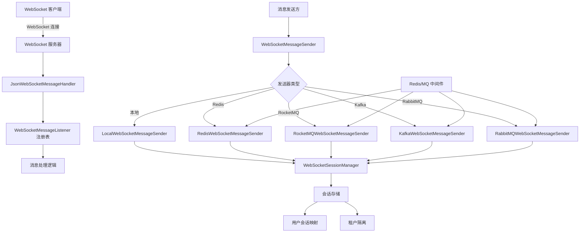
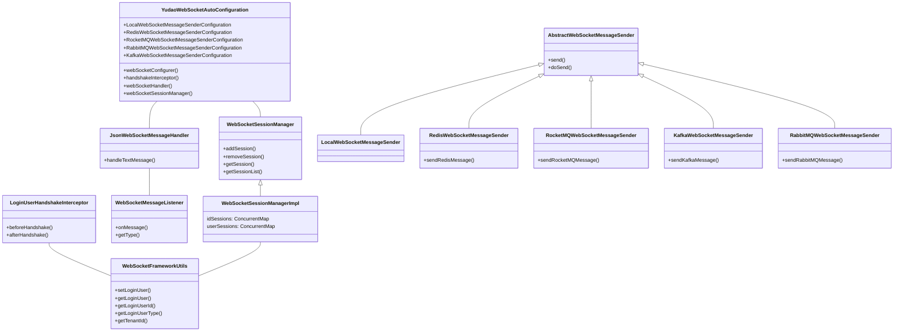
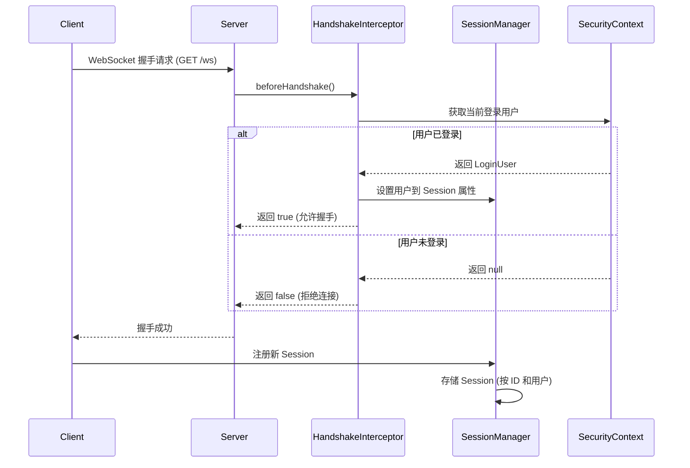
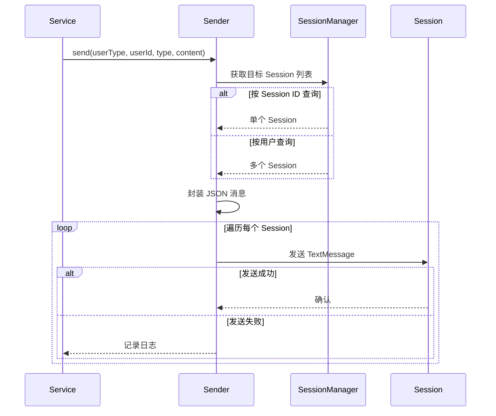
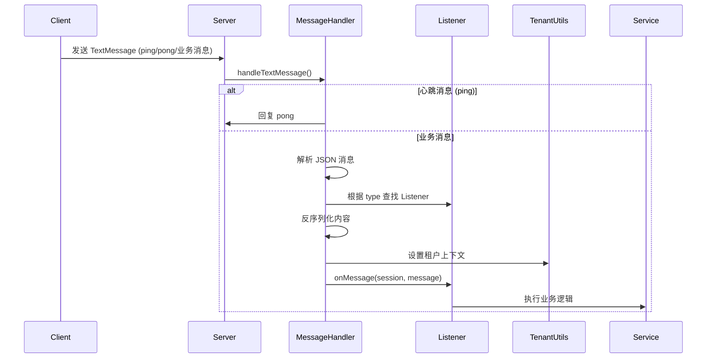
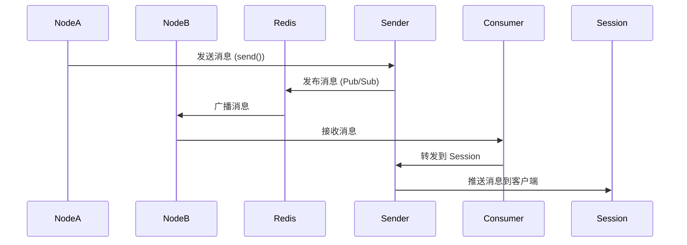

# WebSocket 模块文档 (config_25)

## 1. 模块概述

WebSocket 模块是 Yudao 框架中的核心通信模块，提供基于 WebSocket 的实时双向通信能力。该模块支持多种消息发送器（本地、Redis、RocketMQ、Kafka、RabbitMQ），实现单节点和多节点集群下的消息广播与点对点消息推送。

**核心功能：**
- WebSocket 连接管理（会话管理、用户认证）
- 消息处理框架（消息类型分发、JSON 序列化/反序列化）
- 多模式消息发送（本地广播、Redis 发布/订阅、RocketMQ、Kafka、RabbitMQ）
- 租户隔离支持（多租户环境下消息隔离）
- 心跳机制（自动 ping/pong 保持连接活跃）

**模块定位：**
- 作为 Yudao 框架的 Spring Boot Starter，提供 WebSocket 自动配置
- 与系统安全模块集成，实现 WebSocket 连接的用户认证
- 与消息中间件模块（Redis、RocketMQ、Kafka、RabbitMQ）集成，实现分布式消息广播
- 为 IM、即时通知、实时协作等场景提供底层通信支持

## 2. 架构设计

### 2.1 整体架构



### 2.2 组件关系图



## 3. 核心组件说明

### 3.1 YudaoWebSocketAutoConfiguration

**功能：** WebSocket 模块的自动配置类，负责初始化 WebSocket 相关的 Bean。

**配置要点：**
- `@EnableWebSocket`：启用 Spring WebSocket 支持
- `@ConditionalOnProperty(prefix = "yudao.websocket", value = "enable", matchIfMissing = true)`：允许通过配置禁用 WebSocket
- `@EnableConfigurationProperties(WebSocketProperties.class)`：绑定 WebSocket 配置属性

**主要 Bean：**
| Bean 名称 | 说明 |
|-----------|------|
| webSocketConfigurer | WebSocket 配置器，注册 WebSocketHandler 和拦截器 |
| handshakeInterceptor | 握手拦截器，用于认证用户 |
| webSocketHandler | WebSocket 处理器，封装消息处理和会话管理 |
| webSocketSessionManager | WebSocket 会话管理器 |
| WebSocketAuthorizeRequestsCustomizer | WebSocket 授权配置 |

### 3.2 JsonWebSocketMessageHandler

**功能：** 处理 WebSocket 文本消息的核心处理器，负责消息的解析、分发和响应。

**处理流程：**
1. 接收文本消息
2. 检查是否为空消息（跳过）
3. 检查是否为心跳消息（ping/pong）
4. 解析 JSON 消息格式（type + content）
5. 根据 message type 查找对应的 WebSocketMessageListener
6. 反序列化消息内容
7. 执行租户上下文切换
8. 调用 listener 的 onMessage 方法

**消息格式：**
```json
{
  "type": "message_type",
  "content": "message_content_json"
}
```

### 3.3 WebSocketSessionManager

**功能：** 管理 WebSocket 会话，提供会话的增删查操作，支持按用户类型和用户 ID 查询会话。

**实现类：** WebSocketSessionManagerImpl

**存储结构：**
- `idSessions`：ConcurrentMap<sessionId, WebSocketSession> - 按 Session ID 存储
- `userSessions`：ConcurrentMap<userType, ConcurrentMap<userId, List<WebSocketSession>>> - 按用户类型和用户 ID 存储

**特性：**
- 使用 ConcurrentHashMap 保证线程安全
- 使用 CopyOnWriteArrayList 存储会话列表，支持并发读写
- 支持租户隔离（多租户环境下按租户过滤会话）

### 3.4 WebSocketMessageListener

**功能：** 消息监听器接口，所有 WebSocket 消息处理逻辑都需要实现该接口。

**方法：**
- `onMessage(WebSocketSession session, T message)`：处理消息
- `getType()`：获取消息类型标识

**使用示例：**
```java
@Component
public class ChatMessageListener implements WebSocketMessageListener<ChatMessage> {
    
    @Override
    public String getType() {
        return "chat.message";
    }
    
    @Override
    public void onMessage(WebSocketSession session, ChatMessage message) {
        // 处理聊天消息
    }
}
```

### 3.5 LoginUserHandshakeInterceptor

**功能：** WebSocket 握手拦截器，在连接建立时从 SecurityContext 获取当前登录用户，并存储到 Session 属性中。

**工作流程：**
1. 握手前调用 beforeHandshake()
2. 通过 SecurityFrameworkUtils.getLoginUser() 获取当前用户
3. 如果用户为空，拒绝连接（返回 false）
4. 将用户信息存入 Session attributes
5. 握手后调用 afterHandshake()（空实现）

### 3.6 WebSocketFrameworkUtils

**功能：** WebSocket 工具类，提供 Session 中用户信息的便捷操作。

**常量：**
- `ATTRIBUTE_LOGIN_USER`：Session 中存储用户信息的键名

**方法：**
- `setLoginUser()`：设置登录用户到 Session
- `getLoginUser()`：从 Session 获取登录用户
- `getLoginUserId()`：获取用户 ID
- `getLoginUserType()`：获取用户类型
- `getTenantId()`：获取租户 ID

### 3.7 WebSocketMessageSender

**功能：** 消息发送器接口，定义发送消息的多种策略。

**实现类：**
- AbstractWebSocketMessageSender：抽象基类，实现通用发送逻辑
- LocalWebSocketMessageSender：本地发送器（单节点）
- RedisWebSocketMessageSender：Redis 发送器（多节点广播）
- RocketMQWebSocketMessageSender：RocketMQ 发送器
- KafkaWebSocketMessageSender：Kafka 发送器
- RabbitMQWebSocketMessageSender：RabbitMQ 发送器

**发送方法：**
| 方法 | 说明 |
|------|------|
| send(userType, userId, messageType, content) | 向指定用户发送消息 |
| send(userType, messageType, content) | 向指定用户类型的用户发送消息 |
| send(sessionId, messageType, content) | 向指定 Session 发送消息 |

### 3.8 消息发送器对比

| 发送器类型 | 适用场景 | 特点 | 配置属性 |
|-----------|---------|------|---------|
| local | 单节点部署 | 直接操作 Session 内存，性能最高 | yudao.websocket.sender-type=local |
| redis | 多节点部署，Redis 可用 | 基于 Redis Pub/Sub 实现广播 | yudao.websocket.sender-type=redis |
| rocketmq | 多节点部署，RocketMQ 可用 | 基于 RocketMQ 广播模式 | yudao.websocket.sender-type=rocketmq |
| kafka | 多节点部署，Kafka 可用 | 基于 Kafka Topic 广播 | yudao.websocket.sender-type=kafka |
| rabbitmq | 多节点部署，RabbitMQ 可用 | 基于 RabbitMQ Topic Exchange | yudao.websocket.sender-type=rabbitmq |

## 4. 配置属性

### 4.1 WebSocketProperties

```java
@ConfigurationProperties("yudao.websocket")
@Data
@Validated
public class WebSocketProperties {
    
    /**
     * WebSocket 的连接路径
     * 默认值: "/ws"
     */
    @NotEmpty(message = "WebSocket 的连接路径不能为空")
    private String path = "/ws";
    
    /**
     * 消息发送器的类型
     * 可选值: local、redis、rocketmq、kafka、rabbitmq
     * 默认值: "local"
     */
    @NotNull(message = "WebSocket 的消息发送者不能为空")
    private String senderType = "local";
}
```

### 4.2 application.yml 配置示例

```yaml
yudao:
  websocket:
    enable: true          # 是否启用 WebSocket（默认 true）
    path: "/ws"           # WebSocket 连接路径
    sender-type: "local"  # 消息发送器类型
    
    # Redis 发送器配置（当 sender-type=redis 时）
    # sender-redis:
    #   channel: "websocket"
    
    # RocketMQ 发送器配置（当 sender-type=rocketmq 时）
    # sender-rocketmq:
    #   topic: "websocket-topic"
    #   consumer-group: "websocket-consumer-group"
    
    # Kafka 发送器配置（当 sender-type=kafka 时）
    # sender-kafka:
    #   topic: "websocket-topic"
    #   consumer-group: "websocket-consumer-group"
    
    # RabbitMQ 发送器配置（当 sender-type=rabbitmq 时）
    # sender-rabbitmq:
    #   exchange: "websocket-exchange"
    #   queue: "websocket-queue"
```

## 5. 数据流与流程

### 5.1 WebSocket 连接建立流程



### 5.2 消息发送流程



### 5.3 消息接收与处理流程



### 5.4 多节点消息广播流程（Redis 模式）



## 6. 模块依赖关系

### 6.1 依赖模块

| 模块 | 依赖说明 |
|------|---------|
| yudao-spring-boot-starter-security | 获取当前登录用户（SecurityFrameworkUtils） |
| yudao-spring-boot-starter-tenant | 租户上下文支持（TenantUtils、TenantContextHolder） |
| yudao-spring-boot-starter-mq (redis) | Redis 消息发送器依赖 RedisMQTemplate |
| yudao-spring-boot-starter-mq (rocketmq) | RocketMQ 消息发送器依赖 RocketMQTemplate |
| yudao-spring-boot-starter-mq (kafka) | Kafka 消息发送器依赖 KafkaTemplate |
| yudao-spring-boot-starter-mq (rabbitmq) | RabbitMQ 消息发送器依赖 RabbitTemplate 和 TopicExchange |
| yudao-spring-boot-starter-web | WebSocket 框架依赖 Spring WebSocket |

### 6.2 被依赖模块

WebSocket 模块为以下模块提供实时通信能力：
- **IM 模块**：即时通讯、群聊、私聊
- **AI 模块**：AI 聊天实时消息推送
- **系统模块**：实时通知、消息提醒
- **其他需要实时通信的模块**

## 7. 使用指南

### 7.1 引入依赖

```xml
<dependency>
    <groupId>cn.iocoder.yudao</groupId>
    <artifactId>yudao-spring-boot-starter-websocket</artifactId>
</dependency>
```

### 7.2 配置 WebSocket

application.yml:
```yaml
yudao:
  websocket:
    enable: true
    path: "/ws"
    sender-type: "local"  # 或 redis、rocketmq、kafka、rabbitmq
```

### 7.3 创建消息监听器

```java
@Component
public class ChatMessageListener implements WebSocketMessageListener<ChatMessage> {
    
    @Override
    public String getType() {
        return "chat.message";
    }
    
    @Override
    public void onMessage(WebSocketSession session, ChatMessage message) {
        // 处理聊天消息逻辑
        log.info("收到消息: {}", message);
    }
}
```

### 7.4 发送消息

```java
@Autowired
private WebSocketMessageSender webSocketMessageSender;

// 向指定用户发送消息
webSocketMessageSender.send(userType, userId, "chat.message", JSON.toJSONString(message));

// 向所有用户发送消息
webSocketMessageSender.send(userType, "chat.message", JSON.toJSONString(message));

// 向指定 Session 发送消息
webSocketMessageSender.send(sessionId, "chat.message", JSON.toJSONString(message));
```

### 7.5 前端连接示例

```javascript
// 创建 WebSocket 连接
const ws = new WebSocket(`ws://${window.location.hostname}:${window.location.port}/ws`);

// 连接打开
ws.onopen = function() {
    console.log('WebSocket 连接已建立');
};

// 接收消息
ws.onmessage = function(event) {
    const message = JSON.parse(event.data);
    console.log('收到消息:', message);
    // 根据 message.type 处理不同类型的消息
};

// 发送消息
function sendMessage(type, content) {
    const websocketMessage = {
        type: type,
        content: content
    };
    ws.send(JSON.stringify(websocketMessage));
}

// 心跳处理（自动处理 ping/pong）
ws.onping = function(event) {
    // 自动回复 pong
};
```

## 8. 常见问题与解决方案

### 8.1 多节点部署时消息不广播

**原因：** 使用 local 发送器时，消息只能发送到本节点的 Session。

**解决方案：** 将 sender-type 改为 redis、rocketmq、kafka 或 rabbitmq，确保多节点间消息广播。

### 8.2 WebSocket 连接频繁断开

**原因：** 网络不稳定或心跳检测配置不当。

**解决方案：**
1. 确保前端实现心跳机制（ping/pong）
2. 检查网络配置，确保 WebSocket 端口开放
3. 考虑使用 Redis/RocketMQ 等消息中间件提高稳定性

### 8.3 多租户环境下消息隔离

**说明：** WebSocketSessionManagerImpl 自动支持租户隔离，发送消息时会过滤不同租户的 Session。

**配置：** 无需额外配置，租户上下文会自动从 Session 中获取。

### 8.4 认证失败导致连接被拒绝

**原因：** 握手时 SecurityContext 中没有登录用户。

**解决方案：** 确保前端在 WebSocket 连接时携带认证信息（如 Token），后端通过拦截器验证用户身份。

## 9. 参考文档

- [Spring WebSocket 官方文档](https://docs.spring.io/spring-framework/docs/current/reference/html/web.html#websocket)
- [Redis 发布/订阅模式](https://redis.io/topics/pubsub)
- [RocketMQ 广播模式](https://rocketmq.apache.org/docs/quick-start/)
- [Kafka 消费者组](https://kafka.apache.org/documentation/#basic_ops_consumer_group)
- [RabbitMQ Topic Exchange](https://www.rabbitmq.com/tutorials/tutorial-five-java.html)
- [Yudao 系统安全模块](system.md)
- [Yudao 租户模块](tenant.md)
- [Yudao 消息中间件模块](mq.md)

## 10. 版本历史

| 版本 | 日期 | 说明 | 作者 |
|------|------|------|------|
| 1.0.0 | 2024-01 | 初始版本，支持本地和 Redis 发送器 | xingyu4j |
| 1.1.0 | 2024-03 | 增加 RocketMQ、Kafka、RabbitMQ 发送器支持 | xingyu4j |
| 1.2.0 | 2024-05 | 优化会话管理，支持租户隔离 | xingyu4j |
