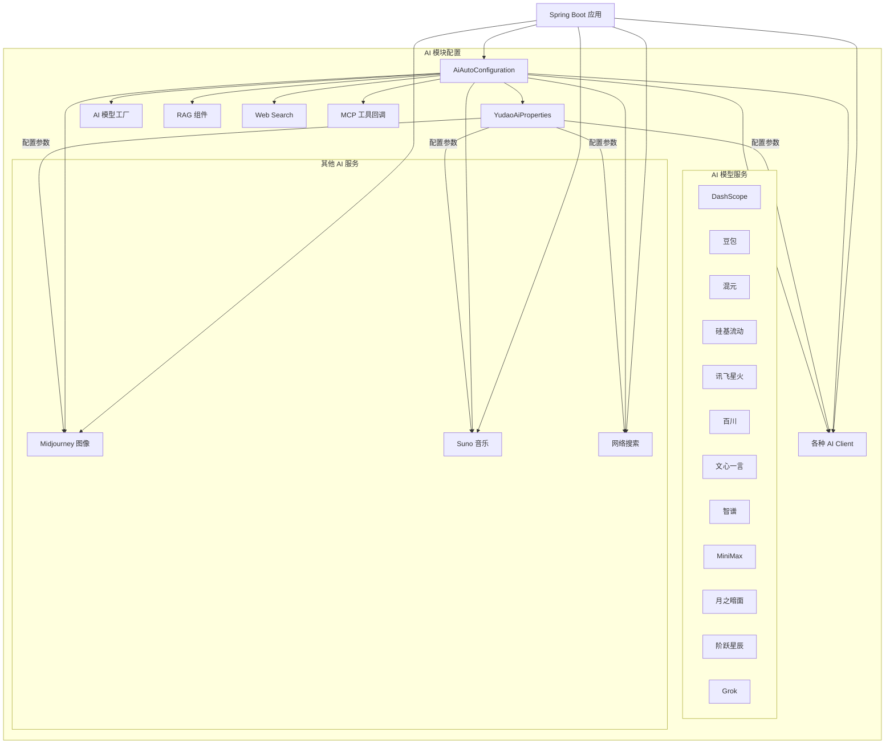

# AI 模块配置 (config_26)

## 概述

AI 模块配置是芋道框架中负责 AI 服务集成的核心模块，提供了对多种大语言模型（LLM）、图像生成、音乐生成、网络搜索等 AI 能力的统一配置和管理。该模块通过 Spring Boot 的自动配置机制，简化了 AI 服务的接入流程，支持多种 AI 服务商的无缝集成。

## 核心功能

- **多模型支持**：支持 DashScope（通义千问）、豆包、混元、硅基流动、讯飞星火、百川、文心一言、智谱、MiniMax、月之暗面、阶跃星辰、Grok 等多种 AI 模型
- **图像生成**：集成 Midjourney 图像生成服务
- **音乐生成**：集成 Suno 音乐生成服务
- **网络搜索**：集成 AI 网络搜索功能
- **RAG 支持**：提供检索增强生成相关的 Token 估算和批处理策略
- **工具调用**：支持 AI 工具调用能力
- **MCP 支持**：支持 MCP（Model Context Protocol）客户端功能

## 架构图



## 组件关系

### 1. AiAutoConfiguration

**文件路径**: `yudao-module-ai/src/main/java/cn/iocoder/yudao/module/ai/framework/ai/config/AiAutoConfiguration.java`

这是 AI 模块的核心自动配置类，负责：

- 初始化 AI 模型工厂 (`AiModelFactory`)
- 创建各种 AI 模型的 Bean（根据配置条件）
- 配置 RAG 相关的 Token 估算器和批处理策略
- 设置 Web Search 客户端
- 注册 MCP 工具回调

**关键配置方法**:

| 方法 | 说明 | 配置属性 |
|------|------|----------|
| `dashScopeChatModel` | 创建 DashScope 聊天模型 | `spring.ai.dashscope.api-key` |
| `dashScopeImageModel` | 创建 DashScope 图像模型 | `spring.ai.dashscope.api-key` |
| `dashScopeEmbeddingModel` | 创建 DashScope 嵌入模型 | `spring.ai.dashscope.api-key` |
| `douBaoChatClient` | 创建豆包聊天模型 | `yudao.ai.doubao.enable=true` |
| `siliconFlowChatClient` | 创建硅基流动聊天模型 | `yudao.ai.siliconflow.enable=true` |
| `hunYuanChatClient` | 创建混元聊天模型 | `yudao.ai.hunyuan.enable=true` |
| `xingHuoChatClient` | 创建讯飞星火聊天模型 | `yudao.ai.xinghuo.enable=true` |
| `baiChuanChatClient` | 创建百川聊天模型 | `yudao.ai.baichuan.enable=true` |
| `yiYanChatClient` | 创建文心一言聊天模型 | `yudao.ai.yiyan.enable=true` |
| `zhiPuChatClient` | 创建智谱聊天模型 | `yudao.ai.zhipu.enable=true` |
| `miniMaxChatClient` | 创建 MiniMax 聊天模型 | `yudao.ai.minimax.enable=true` |
| `moonshotChatClient` | 创建月之暗面聊天模型 | `yudao.ai.moonshot.enable=true` |
| `stepFunChatClient` | 创建阶跃星辰聊天模型 | `yudao.ai.stepfun.enable=true` |
| `grokChatClient` | 创建 Grok 聊天模型 | `yudao.ai.grok.enable=true` |
| `midjourneyApi` | 创建 Midjourney API 实例 | `yudao.ai.midjourney.enable=true` |
| `sunoApi` | 创建 Suno API 实例 | `yudao.ai.suno.enable=true` |
| `webSearchClient` | 创建 Web Search 客户端 | `yudao.ai.web-search.enable=true` |
| `tokenCountEstimator` | 创建 Token 估算器 | - |
| `batchingStrategy` | 创建批处理策略 | - |
| `toolCallbacks` | 创建工具回调列表 | - |

### 2. YudaoAiProperties

**文件路径**: `yudao-module-ai/src/main/java/cn/iocoder/yudao/module/ai/framework/ai/config/YudaoAiProperties.java`

这是 AI 模块的配置属性类，使用 `@ConfigurationProperties(prefix = "yudao.ai")` 绑定配置。所有配置都以 `yudao.ai.` 为前缀。

**配置结构**:

```yaml
yudao:
  ai:
    # 豆包配置
    doubao:
      enable: true
      apiKey: "your-api-key"
      model: "default-model"
      temperature: 0.7
      maxTokens: 2048
      topP: 0.95
    
    # 腾讯混元配置
    hunyuan:
      enable: true
      baseUrl: "https://api.example.com"
      apiKey: "your-api-key"
      model: "default-model"
      temperature: 0.7
      maxTokens: 2048
      topP: 0.95
    
    # 硅基流动配置
    siliconflow:
      enable: true
      apiKey: "your-api-key"
      model: "default-model"
      temperature: 0.7
      maxTokens: 2048
      topP: 0.95
    
    # 讯飞星火配置
    xinghuo:
      enable: true
      apiKey: "your-api-key"
      model: "default-model"
      temperature: 0.7
      maxTokens: 2048
      topP: 0.95
    
    # 百川配置
    baichuan:
      enable: true
      apiKey: "your-api-key"
      model: "default-model"
      temperature: 0.7
      maxTokens: 2048
      topP: 0.95
    
    # 文心一言配置
    yiyan:
      enable: true
      baseUrl: "https://api.example.com"
      apiKey: "your-api-key"
      model: "default-model"
      temperature: 0.7
      maxTokens: 2048
      topP: 0.95
    
    # 智谱配置
    zhipu:
      enable: true
      baseUrl: "https://api.example.com"
      apiKey: "your-api-key"
      model: "default-model"
      temperature: 0.7
      maxTokens: 2048
      topP: 0.95
    
    # MiniMax 配置
    minimax:
      enable: true
      baseUrl: "https://api.example.com"
      apiKey: "your-api-key"
      model: "default-model"
      temperature: 0.7
      maxTokens: 2048
      topP: 0.95
    
    # 月之暗面配置
    moonshot:
      enable: true
      baseUrl: "https://api.example.com"
      apiKey: "your-api-key"
      model: "default-model"
      temperature: 0.7
      maxTokens: 2048
      topP: 0.95
    
    # 阶跃星辰配置
    stepfun:
      enable: true
      apiKey: "your-api-key"
      baseUrl: "https://api.example.com"
      model: "default-model"
      temperature: 0.7
      maxTokens: 2048
      topP: 0.95
    
    # Grok 配置
    grok:
      enable: true
      apiKey: "your-api-key"
      baseUrl: "https://api.example.com"
      model: "default-model"
      temperature: 0.7
      maxTokens: 2048
      topP: 0.95
    
    # Midjourney 配置
    midjourney:
      enable: true
      baseUrl: "https://api.midjourney.com"
      apiKey: "your-api-key"
      notifyUrl: "https://your-domain.com/callback"
    
    # Suno 配置
    suno:
      enable: true
      baseUrl: "https://api.suno.com"
    
    # 网络搜索配置
    web-search:
      enable: true
      apiKey: "your-api-key"
```

## 数据流

```mermaid
sequenceDiagram
    participant SpringBoot as Spring Boot 应用
    participant AutoConfig as AiAutoConfiguration
    participant Properties as YudaoAiProperties
    participant ModelFactory as AiModelFactory
    participant AIClient as AI 客户端
    
    SpringBoot->>SpringBoot: 启动 Spring Boot 应用
    SpringBoot->>AutoConfig: 加载 @Configuration 类
    AutoConfig->>Properties: 读取 yudao.ai.* 配置
    AutoConfig->>ModelFactory: 创建 AiModelFactory 实例
    alt 启用特定 AI 服务
        AutoConfig->>AIClient: 根据配置创建对应 AI 客户端
        Properties-->>AutoConfig: 提供配置参数
    end
    AutoConfig->>AutoConfig: 创建 TokenCountEstimator 和 BatchingStrategy
    AutoConfig->>AutoConfig: 创建 WebSearchClient（如启用）
    AutoConfig->>AutoConfig: 注册 ToolCallbacks
    SpringBoot->>SpringBoot: AI 服务准备就绪
```

## 依赖关系

AI 模块配置依赖于以下模块：

| 模块 | 依赖说明 |
|------|----------|
| **yudao-module-ai** | AI 业务模块，提供 AI 相关的业务逻辑 |
| **spring-boot-starter** | Spring Boot 基础支持 |
| **spring-ai** | Spring AI 框架，提供 AI 模型交互能力 |
| **hutool** | 工具类库，用于字符串处理等 |
| **lombok** | 注解，简化代码编写 |
| **milvus/qdrant/redis** | 向量数据库支持（通过 Spring AI 自动配置） |

## 使用指南

### 1. 启用 AI 服务

在 `application.yml` 中启用所需的 AI 服务：

```yaml
yudao:
  ai:
    doubao:
      enable: true
      apiKey: "your-doubao-api-key"
      model: "deepseek-chat"
      temperature: 0.7
    
    midjourney:
      enable: true
      baseUrl: "https://api.midjourney.com"
      apiKey: "your-midjourney-api-key"
      notifyUrl: "https://your-domain.com/midjourney/callback"
    
    web-search:
      enable: true
      apiKey: "your-web-search-api-key"
```

### 2. 使用 AI 模型

通过注入 `ChatModel` 或其他 AI 模型 Bean 来使用：

```java
@Autowired
private ChatModel chatModel;

public String generate(String prompt) {
    List<Message> messages = List.of(new UserMessage(prompt));
    return chatModel.call(messages).getOutput().getContent();
}
```

### 3. 配置 RAG 相关

AI 模块自动配置了 Token 估算器和批处理策略，可用于 RAG 场景：

```java
@Autowired
private TokenCountEstimator tokenCountEstimator;

@Autowired
private BatchingStrategy batchingStrategy;
```

### 4. 工具调用

通过注册 `ToolCallback` 来启用 AI 工具调用功能：

```java
@Bean
public List<ToolCallback> toolCallbacks(PersonService personService) {
    return List.of(ToolCallbacks.from(personService));
}
```

## 注意事项

1. **条件注解**: 所有 AI 客户端的创建都使用了 `@ConditionalOnProperty` 注解，只有当对应配置启用时才会创建 Bean。

2. **默认值**: 如果未指定 model、temperature、maxTokens、topP 等参数，会使用默认值。

3. **工具调用**: 需要确保 `ToolCallingManager` Bean 存在，否则可能会影响某些 AI 模型的功能。

4. **观察**: 配置了 `ObservationRegistry` 作为兜底，避免相关的 ChatModel 创建报错。

5. **向量数据库**: 支持 Milvus、Qdrant、Redis 等向量数据库，需要通过对应的 Spring AI 自动配置进行配置。

## 参考文档

- [Spring AI 官方文档](https://docs.spring.io/spring-ai/reference/)
- [各 AI 服务商 API 文档](https://help.aliyun.com/)
- [芋道框架 AI 模块](./ai.md)
