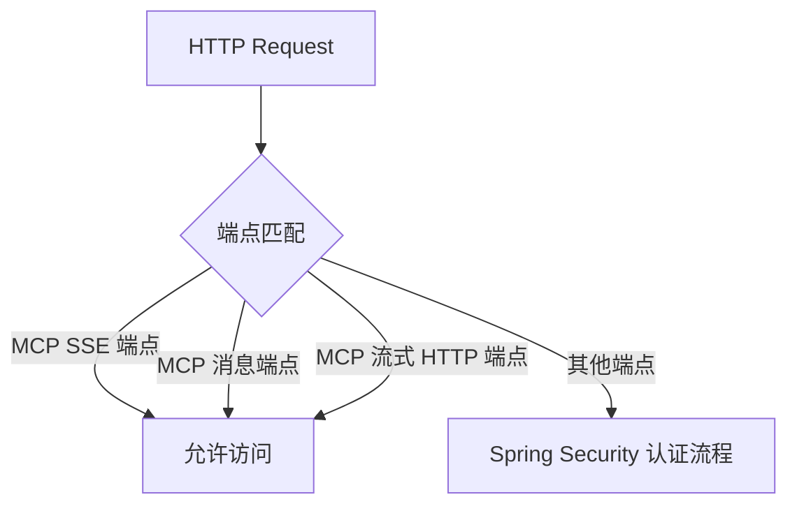

# config_27 模块文档

## 模块概述

`config_27` 模块是 Yudao AI 模块的安全配置模块，主要负责 AI 模块的安全访问控制。该模块通过扩展 Spring Security 的配置，实现了对 AI 服务特定端点的访问控制。

## 功能特性

1. **MCP 服务端点访问控制**：
   - 配置 MCP (Model Context Protocol) 服务的 SSE (Server-Sent Events) 端点
   - 配置 MCP 消息端点
   - 配置 MCP 流式 HTTP 端点

2. **安全访问策略**：
   - 允许特定端点无需认证即可访问
   - 通过配置文件动态设置端点路径

## 架构设计

### 核心组件

#### SecurityConfiguration

位于：`yudao-module-ai/src/main/java/cn/iocoder/yudao/module/ai/framework/security/config/SecurityConfiguration.java`

这是 AI 模块的安全配置类，主要功能包括：

1. **端点配置注入**：
   ```java
   @Value("${spring.ai.mcp.server.sse-endpoint:/sse}")
   private String mcpSseEndpoint;
   
   @Value("${spring.ai.mcp.server.sse-message-endpoint:/mcp/message}")
   private String mcpSseMessageEndpoint;
   
   @Value("${spring.ai.mcp.server.streamable-http-endpoint:/mcp}")
   private String mcpStreamableHttpEndpoint;
   ```

2. **权限配置定制**：
   ```java
   @Bean("aiAuthorizeRequestsCustomizer")
   public AuthorizeRequestsCustomizer authorizeRequestsCustomizer() {
       return new AuthorizeRequestsCustomizer() {
           @Override
           public void customize(AuthorizeHttpRequestsConfigurer<HttpSecurity>.AuthorizationManagerRequestMatcherRegistry registry) {
               if (StrUtil.isNotBlank(mcpSseEndpoint)) {
                   registry.requestMatchers(mcpSseEndpoint).permitAll();
               }
               if (StrUtil.isNotBlank(mcpSseMessageEndpoint)) {
                   registry.requestMatchers(mcpSseMessageEndpoint).permitAll();
               }
               if (StrUtil.isNotBlank(mcpStreamableHttpEndpoint)) {
                   registry.requestMatchers(mcpStreamableHttpEndpoint).permitAll();
               }
           }
       };
   }
   ```

### 与其他模块的关系

1. **Spring Security 集成**：
   - 该模块通过 `AuthorizeRequestsCustomizer` 接口扩展了 Spring Security 的权限配置
   - 与 `yudao-framework/yudao-spring-boot-starter-security` 模块紧密集成

2. **AI 模块依赖**：
   - 作为 AI 模块的一部分，提供安全访问控制功能
   - 依赖于 AI 模块的其他组件来提供完整的 AI 服务

## 数据流



## API 说明

### 端点配置

该模块通过 Spring Boot 的配置文件支持以下端点配置：

| 配置项 | 默认值 | 说明 |
|--------|--------|------|
| `spring.ai.mcp.server.sse-endpoint` | `/sse` | SSE 端点路径 |
| `spring.ai.mcp.server.sse-message-endpoint` | `/mcp/message` | SSE 消息端点路径 |
| `spring.ai.mcp.server.streamable-http-endpoint` | `/mcp` | 流式 HTTP 端点路径 |

### 访问控制

- **允许无认证访问的端点**：
  - MCP SSE 端点
  - MCP 消息端点
  - MCP 流式 HTTP 端点

## 配置示例

```yaml
# application.yaml
spring:
  ai:
    mcp:
      server:
        sse-endpoint: /sse
        sse-message-endpoint: /mcp/message
        streamable-http-endpoint: /mcp
```

## 安全考虑

1. **端点隔离**：
   - AI 服务的特定端点被单独配置为允许无认证访问
   - 其他端点仍然需要通过标准的认证流程

2. **配置灵活性**：
   - 端点路径可以通过配置文件动态调整
   - 支持在不同环境中使用不同的端点配置

## 扩展性

该模块设计为可扩展的，可以通过以下方式进行扩展：

1. **自定义端点**：
   - 通过配置文件添加新的端点
   - 通过扩展 `SecurityConfiguration` 类添加自定义的权限配置

2. **权限策略**：
   - 可以扩展 `AuthorizeRequestsCustomizer` 接口实现自定义的权限策略

## 部署注意事项

1. **端点安全**：
   - 确保 MCP 端点在公网环境中受到适当的保护
   - 考虑使用防火墙或网络安全组限制对这些端点的访问

2. **配置管理**：
   - 在生产环境中，仔细配置端点路径以避免安全漏洞
   - 定期审查和更新端点配置

## 故障排除

1. **端点访问失败**：
   - 检查配置文件中的端点路径是否正确
   - 确认端点路径没有被其他安全配置拦截

2. **权限问题**：
   - 确认请求是否匹配了正确的端点
   - 检查是否有其他安全配置覆盖了该模块的配置

## 相关模块

- [yudao-framework/yudao-spring-boot-starter-security](yudao-spring-boot-starter-security.md) - Spring Security 集成模块
- [yudao-module-ai](yudao-module-ai.md) - AI 模块主模块

## 总结

`config_27` 模块为 Yudao AI 模块提供了安全访问控制功能，通过配置特定的 MCP 端点允许无认证访问，同时保持其他端点的安全性。该模块设计灵活，支持通过配置文件动态调整端点配置，具有良好的可扩展性。