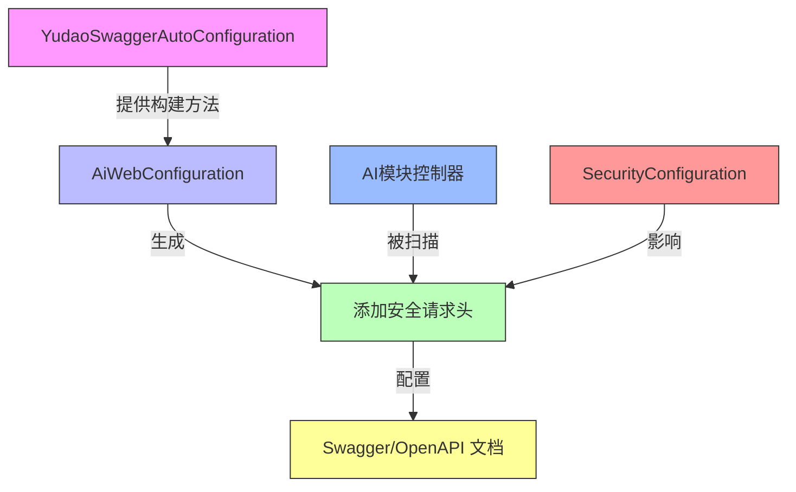

# AiWebConfiguration 模块文档

## 概述

AiWebConfiguration 是 AI 模块的 Web 配置类，主要用于配置 Swagger/OpenAPI 文档的分组。通过定义 `GroupedOpenApi` bean，将 AI 模块的 API 接口在文档中独立分组展示，便于开发者查阅和测试 AI 相关功能。

## 核心功能

AiWebConfiguration 的主要职责是：
1. 为 AI 模块创建一个独立的 OpenAPI 分组，命名为 "ai"
2. 将该分组的 API 路径匹配规则设置为 `/admin-api/ai/**` 和 `/app-api/ai/**`
3. 为分组中的每个操作添加租户编号和认证 Token 请求头参数
4. 自定义操作ID生成规则，使用「类名前缀 + 方法名」的格式（如 `AiChatController_list`）

## 架构设计

### 模块定位

AiWebConfiguration 属于 AI 模块的框架层，具体位于 `yudao-module-ai/framework/web/config` 包下。它是 AI 模块对外暴露 RESTful API 的配置入口，与 SpringDoc OpenAPI 和 Knife4j 集成，用于生成交互式 API 文档。

### 与其他模块的关系

AiWebConfiguration 依赖于 yudao-framework 中的 Swagger 自动配置类 `YudaoSwaggerAutoConfiguration`，通过复用其 `buildGroupedOpenApi` 方法来创建分组。同时，它也受到 AI 模块安全配置（`SecurityConfiguration`）的影响，因为分组中的操作会自动添加安全相关的请求头参数。

以下是 AiWebConfiguration 在系统中的位置和关系：



### 工作流程

当应用启动时，Spring 会检测到 `@Configuration` 注解的 `AiWebConfiguration` 类，并实例化其中的 `aiGroupedOpenApi` 方法。该方法调用 `YudaoSwaggerAutoConfiguration.buildGroupedOpenApi("ai")` 创建一个 `GroupedOpenApi` 对象，该对象定义了：
- 分组名称：`ai`
- 匹配路径：`/admin-api/ai/**` 和 `/app-api/ai/**`
- 操作自定义器：添加租户头参数、认证头参数以及自定义操作ID

随后，SpringDoc 会使用这个分组配置来过滤和处理符合路径规则的 API 接口，最终在生成的 OpenAPI 文档中形成独立的 "ai" 分组。

## 详细实现

### 类定义

```java
@Configuration(proxyBeanMethods = false)
public class AiWebConfiguration {
    // ...
}
```

- `@Configuration`：标记这是一个 Spring 配置类
- `proxyBeanMethods = false`：优化 CGLIB 子类创建，提升启动性能

### 核心方法

```java
@Bean
public GroupedOpenApi aiGroupedOpenApi() {
    return YudaoSwaggerAutoConfiguration.buildGroupedOpenApi("ai");
}
```

- `@Bean`：将方法返回值注册为 Spring Bean
- 返回值：`GroupedOpenApi` 对象，用于定义 OpenAPI 分组
- 实现：直接复用框架提供的 `buildGroupedOpenApi` 静态方法，传入分组名称 "ai"

### 分组配置细节（继承自 YudaoSwaggerAutoConfiguration）

通过 `buildGroupedOpenApi` 方法，AiWebConfiguration 间接获得以下配置：

1. **路径匹配**：
   - `/admin-api/ai/**`：后台管理 API
   - `/app-api/ai/**`：前端应用 API

2. **操作自定义器**：
   - 添加租户编号请求头参数（名称：`X-Tenant-Id`，默认值：`1`）
   - 添加认证 Token 请求头参数（名称：`Authorization`，默认值：`Bearer test1`）
   - 自定义操作ID生成规则：`类名(去除Controller后缀)_方法名`（例如 `AiChatController` 的 `list` 方法生成操作ID 为 `AiChat_list`）

## 在系统中的作用

AiWebConfiguration 是 AI 模块实现 API 文档化的关键组件，它使得：
1. AI 模块的所有 API 接口在 Swagger UI 中具有清晰的分组展示
2. 前后端开发者可以快速定位和测试 AI 相关功能（如对话、图像生成、语音合成等）
3. 文档自动包含必要的安全头信息，减少调试时的认证配置工作
4. 操作ID采用可读的命名规则，便于前端代码生成和客户端调用

与其他业务模块（如 BPM、CRM、ERP 等）相比，AI 模块的 Web 配置遵循统一的框架标准，但保持了模块间的隔离性，确保每个模块的 API 文档互不干扰。

## 依赖说明

AiWebConfiguration 依赖于以下核心组件：
- `YudaoSwaggerAutoConfiguration`：提供分组构建基础设施
- SpringDoc 和 Knife4j：实际的 API 文档生成和 UI 渲染工具

它不直接依赖其他 AI 模块的业务组件，因为它的作用是框架层的配置，与具体业务实现解耦。

## 最佳实践

1. **保持简洁**：AiWebConfiguration 仅负责 Web 层配置，不应包含业务逻辑
2. **统一命名**：分组名称应与模块名保持一致，使用小写单词
3. **路径规范**：遵循 `/admin-api/{module}/**` 和 `/app-api/{module}/**` 的标准路径模式
4. **安全透明**：通过框架方法自动注入安全参数，确保文档中的 Try it out 功能可用

## 结论

AiWebConfiguration 是一个轻量但重要的配置类，它通过标准化的方式将 AI 模块的 API 接口纳入系统的统一文档体系。虽然实现简单，但它在提升开发效率、促进前后端协作以及保持 API 文档质量方面发挥着不可替代的作用。对于 AI 模块这样的功能丰富且经常更新的业务域，拥有清晰、可交互的 API 文档是保证集成质量和降低维护成本的关键。