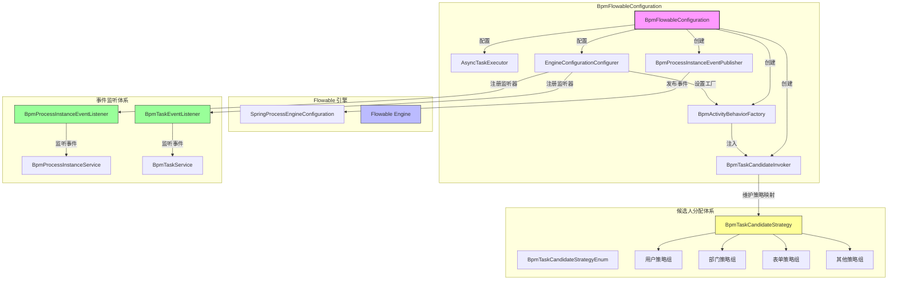

# BPM 模块 Flowable 配置文档 (config_29)

## 1. 概述

`BpmFlowableConfiguration` 是 BPM（业务流程管理）模块的核心配置类，负责集成和扩展 **Flowable** 工作流引擎。该配置类实现了 Flowable 引擎与 Yudao 业务框架的深度整合，提供了自定义的审批人分配策略、事件监听器、活动行为工厂等扩展能力，支持企业级复杂流程场景。

## 2. 核心功能

### 2.1 异步任务线程池配置
- 创建名为 `applicationTaskExecutor` 的 `AsyncTaskExecutor` Bean，解决 Flowable 启动时的线程池依赖问题
- 核心参数：核心/最大线程数 = 8，队列容量 = 100，等待终止时间 = 30 秒

### 2.2 ProcessEngine 自定义配置
通过 `EngineConfigurationConfigurer<SpringProcessEngineConfiguration>` 注册：
- **事件监听器**：注册各类 Flowable 事件监听器（如流程实例、任务级别的事件）
- **ActivityBehaviorFactory**：设置自定义的活动行为工厂，实现审批人动态分配逻辑
- **自定义函数**：注册 Flowable EL 表达式中的自定义函数

### 2.3 审批人候选者动态分配体系
这是 BPM 模块最核心的扩展能力，通过以下组件构成：

```
┌─────────────────────────────────────────────────────────────┐
│              BpmTaskCandidateInvoker                        │
│  ┌───────────────────────────────────────────────────────┐  │
│  │ 职责：根据 BPMN 节点配置的候选人策略，计算任务       │  │
│  │       的候选用户集合（Set<Long> userIds）            │  │
│  │                                                       │  │
│  │ 主要方法：                                            │  │
│  │  • calculateUsersByTask(DelegateExecution)           │  │
│  │  • calculateUsersByActivity(BpmnModel, ...)          │  │
│  │  • validateBpmn(byte[]) - 部署前校验所有任务节点     │  │
│  │  • removeDisableUsers() - 过滤禁用用户               │  │
│  │  • removeStartUserIfSkip() - 处理发起人跳过逻辑      │  │
│  └───────────────────────────────────────────────────────┘  │
└─────────────────────────────────────────────────────────────┘
                    ▲
                    │ 注入
                    ▼
┌─────────────────────────────────────────────────────────────┐
│              BpmActivityBehaviorFactory                     │
│  继承自 DefaultActivityBehaviorFactory                      │
│  ┌───────────────────────────────────────────────────────┐  │
│  │ 覆盖方法：                                            │  │
│  │  • createUserTaskActivityBehavior() → BpmUserTaskActivityBehavior │
│  │  • createParallelMultiInstanceBehavior()             │  │
│  │  • createSequentialMultiInstanceBehavior()           │  │
│  │  所有返回的行为对象都设置了 taskCandidateInvoker      │  │
│  └───────────────────────────────────────────────────────┘  │
└─────────────────────────────────────────────────────────────┘
                    ▲
                    │ 策略注册
                    ▼
┌─────────────────────────────────────────────────────────────┐
│         BpmTaskCandidateStrategy (接口)                     │
│  ┌───────────────────────────────────────────────────────┐  │
│  │ 策略枚举：BpmTaskCandidateStrategyEnum                │  │
│  │   ROLE(角色), DEPT_MEMBER(部门成员), USER(用户)       │  │
│  │   APPROVE_USER_SELECT(审批人自选), START_USER_SELECT(│  │
│  │    发起人自选), FORM_USER(表单字段), EXPRESSION(表达式)│  │
│  │   ASSIGN_EMPTY(审批人为空) 等共 17 种策略             │  │
│  │                                                       │  │
│  │ 核心方法：                                            │  │
│  │  • getStrategy() → 返回策略编号                       │  │
│  │  • validateParam(String) - 参数校验                   │  │
│  │  • calculateUsersByTask()/ByActivity() - 计算候选人   │  │
│  └───────────────────────────────────────────────────────┘  │
│                                                       │
│ 具体策略实现类：                                        │
│  ├─ user/ 目录下：BpmTaskCandidateRoleStrategy,        │
│  │                 BpmTaskCandidateUserStrategy,       │
│  │                 BpmTaskCandidatePostStrategy,       │
│  │                 BpmTaskCandidateGroupStrategy,      │
│  │                 BpmTaskCandidateStartUserStrategy   │
│  ├─ dept/ 目录下：BpmTaskCandidateDeptLeaderStrategy, │
│  │                 BpmTaskCandidateDeptMemberStrategy, │
│  │                 BpmTaskCandidateStartUserDeptLeader│
│  │                 等多级部门策略                      │
│  ├─ form/ 目录下：BpmTaskCandidateFormUserStrategy,   │
│  │                 BpmTaskCandidateFormDeptLeaderStrategy│
│  └─ other/ 目录下：BpmTaskCandidateExpressionStrategy,│
│                    BpmTaskCandidateAssignEmptyStrategy  │
└─────────────────────────────────────────────────────────────┘
```

### 2.4 事件监听体系

#### 流程实例监听器 (`BpmProcessInstanceEventListener`)
监听流程生命周期事件：
| 事件类型 | 触发时机 | 处理方法 |
|---------|---------|---------|
| PROCESS_CREATED | 流程实例创建 | `processInstanceService.processProcessInstanceCreated()` |
| PROCESS_COMPLETED | 流程实例完成 | `processInstanceService.processProcessInstanceCompleted()` |
| PROCESS_CANCELLED | 流程实例取消 | 特殊处理：若跳转到 EndEvent 则视为完成 |

#### 任务监听器 (`BpmTaskEventListener`)
监听任务相关事件：
| 事件类型 | 触发时机 | 处理方法 |
|---------|---------|---------|
| TASK_CREATED | 任务创建 | `taskService.processTaskCreated()` |
| TASK_ASSIGNED | 任务分配 | `taskService.processTaskAssigned()` |
| TASK_COMPLETED | 任务完成 | `taskService.processTaskCompleted()` |
| ACTIVITY_CANCELLED | 活动取消 | `taskService.processTaskCanceled()` |
| TIMER_FIRED | 定时器触发 | 处理超时边界事件（用户任务超时、延迟定时器、子流程超时） |

### 2.5 流程事件发布器 (`BpmProcessInstanceEventPublisher`)
封装 Spring ApplicationEventPublisher，用于发布流程状态变更事件（如 `BpmProcessInstanceStatusEvent`），支持事件驱动的业务扩展。

## 3. 常量定义

### 3.1 BPMN 模型常量 (`BpmnModelConstants`)
定义了 BPMN XML 中使用的扩展属性名称，包括：
- 候选人策略/参数：`candidateStrategy`, `candidateParam`
- 边界事件类型：`boundaryEventType`
- 超时处理类型：`timeoutHandlerType`
- 发起人处理类型：`assignStartUserHandlerType`
- 空处理类型：`assignEmptyHandlerType`
- 拒绝处理类型：`rejectHandlerType`
- 审批类型/方式：`approveType`, `approveMethod`
- 表单字段权限：`fieldsPermission`
- 操作按钮设置：`buttonsSetting`
- 触发器：`triggerType`, `triggerParam`

### 3.2 变量常量 (`BpmnVariableConstants`)
分为流程实例变量和任务变量两类：

**流程实例变量：**
- `PROCESS_STATUS` / `PROCESS_REASON`：状态和理由
- `PROCESS_START_USER_ID`：发起人 ID
- `PROCESS_START_USER_SELECT_ASSIGNEES` / `PROCESS_APPROVE_USER_SELECT_ASSIGNEES`：自选审批人映射
- `RETURN_FLAG_{nodeId}`：回退标志
- `NEED_SIMULATE_TASK_IDS`：需要预测的任务节点集
- `_FLOWABLE_SKIP_EXPRESSION_ENABLED`：跳过表达式标记

**任务变量：**
- `TASK_STATUS` / `TASK_REASON`：任务状态和理由
- `TASK_SIGN_PIC_URL`：签名图片 URL

## 4. 架构关系图



## 5. 与其他模块的集成

### 5.1 系统模块 (system)
- 依赖 `AdminUserApi` 获取用户信息，验证候选人有效性
- 数据权限注解 `@DataPermission(enable = false)` 确保候选人查询不受当前租户数据权限过滤影响

### 5.2 BPM 业务模块
- `BpmProcessInstanceService`：处理流程实例创建/完成事件
- `BpmTaskService`：处理任务创建/分配/完成/取消事件
- `BpmModelService`：在定时器事件中获取 BPMN 模型

### 5.3 租户上下文
通过 `FlowableUtils.execute(tenantId, ...)` 保证在正确的租户上下文中执行代码，解决异步调用中租户 ID 丢失的问题。

## 6. 关键扩展点

| 扩展点 | 说明 | 实现类 |
|-------|------|--------|
| 候选人策略 | 自定义审批人分配逻辑 | 实现 `BpmTaskCandidateStrategy` 接口 |
| 活动行为 | 自定义任务执行行为 | 继承 `BpmActivityBehaviorFactory` |
| 事件监听 | 监听流程/任务事件 | 继承 `AbstractFlowableEngineEventListener` |
| EL 函数 | 自定义 Flowable 表达式函数 | 实现 `FlowableFunctionDelegate` |
| 边界事件 | 自定义边界事件处理 | 通过扩展元素配置 |

## 7. 部署校验机制

在流程部署时，`BpmTaskCandidateInvoker.validateBpmnConfig()` 会对所有 UserTask 节点进行校验：
1. 自动审批/自动驳回节点跳过校验
2. 检查候选人策略是否配置（非空）
3. 检查是否需要参数的策略是否有对应参数
4. 调用具体策略的 `validateParam()` 方法进行参数格式校验

如果任何节点配置错误，流程部署将失败并抛出异常，避免运行时出现无人可审批的情况。

## 8. 参考文档

- [yudao-system.md](yudao-system.md) - 系统模块用户权限相关
- [yudao-tenant.md](yudao-tenant.md) - 租户上下文管理
- [yudao-common.md](yudao-common.md) - 通用工具类使用
- [Flowable 官方文档](https://www.flowable.org/docs/userguide/index.html) - Flowable 引擎原生特性
