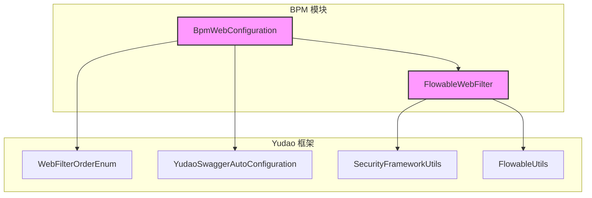
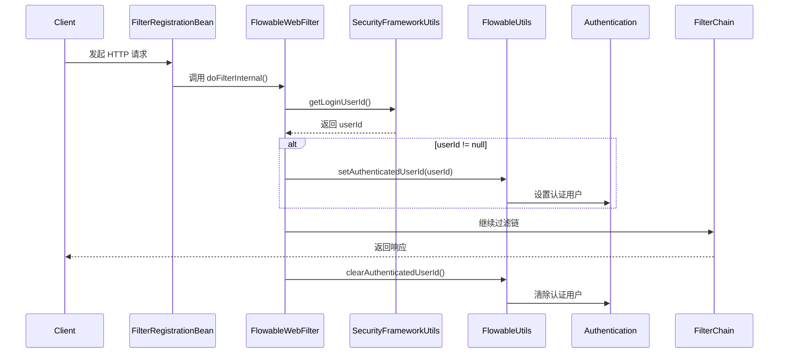

# BpmWebConfiguration 模块文档

## 1. 模块概述

`BpmWebConfiguration` 是 **BPM（业务流程管理）模块**的 Web 层配置类，负责 BPM 模块的 Web 层相关配置，主要包括：

- **Swagger API 分组配置**：为 BPM 模块的 API 文档提供独立的分组
- **Flowable Web 过滤器注册**：配置 Flowable 工作流引擎的 Web 过滤器，实现用户身份与工作流上下文的绑定

该模块是 BPM 模块与 Spring Boot Web 集成的核心配置入口，确保 BPM 模块的 API 能够正确暴露到 Swagger 文档，并在 Web 请求中正确处理工作流的用户身份上下文。

---

## 2. 架构关系

### 2.1 模块依赖关系



### 2.2 组件交互关系



---

## 3. 核心组件说明

### 3.1 BpmWebConfiguration

**文件路径**: `yudao-module-bpm/src/main/java/cn/iocoder/yudao/module/bpm/framework/web/config/BpmWebConfiguration.java`

**功能描述**: BPM 模块的 Web 层配置类，使用 Spring 的 `@Configuration` 注解声明，负责注册 BPM 模块的 Swagger API 分组和 Flowable Web 过滤器。

```java
@Configuration(proxyBeanMethods = false)
public class BpmWebConfiguration {
    
    // API 分组配置
    @Bean
    public GroupedOpenApi bpmGroupedOpenApi() {
        return YudaoSwaggerAutoConfiguration.buildGroupedOpenApi("bpm");
    }
    
    // Flowable Web 过滤器配置
    @Bean
    public FilterRegistrationBean<FlowableWebFilter> flowableWebFilter() {
        FilterRegistrationBean<FlowableWebFilter> registrationBean = new FilterRegistrationBean<>();
        registrationBean.setFilter(new FlowableWebFilter());
        registrationBean.setOrder(WebFilterOrderEnum.FLOWABLE_FILTER);
        return registrationBean;
    }
}
```

#### 主要方法

| 方法名 | 返回类型 | 说明 |
|--------|----------|------|
| `bpmGroupedOpenApi()` | `GroupedOpenApi` | 创建 BPM 模块的 Swagger API 分组，路径匹配 `/admin-api/bpm/**` 和 `/app-api/bpm/**` |
| `flowableWebFilter()` | `FilterRegistrationBean<FlowableWebFilter>` | 注册 Flowable Web 过滤器，并设置过滤器顺序为 `WebFilterOrderEnum.FLOWABLE_FILTER` (-98) |

### 3.2 FlowableWebFilter

**文件路径**: `yudao-module-bpm/src/main/java/cn/iocoder/yudao/module/bpm/framework/web/core/FlowableWebFilter.java`

**功能描述**: 继承自 `OncePerRequestFilter` 的 Spring Filter，在每次 HTTP 请求中执行，负责将当前登录用户的 ID 设置到 Flowable 工作流引擎的认证上下文中，确保工作流操作能够正确关联到当前用户。

```java
public class FlowableWebFilter extends OncePerRequestFilter {
    
    @Override
    protected void doFilterInternal(HttpServletRequest request, HttpServletResponse response, FilterChain chain)
            throws ServletException, IOException {
        try {
            // 获取当前登录用户 ID
            Long userId = SecurityFrameworkUtils.getLoginUserId();
            if (userId != null) {
                // 设置到 Flowable 认证上下文
                FlowableUtils.setAuthenticatedUserId(userId);
            }
            // 继续执行过滤器链
            chain.doFilter(request, response);
        } finally {
            // 清理认证上下文（确保无论是否异常都清理）
            FlowableUtils.clearAuthenticatedUserId();
        }
    }
}
```

#### 执行流程

1. **获取用户 ID**: 通过 `SecurityFrameworkUtils.getLoginUserId()` 从 Spring Security 上下文中获取当前登录用户的 ID
2. **设置认证**: 如果用户 ID 不为空，通过 `FlowableUtils.setAuthenticatedUserId()` 将用户 ID 设置到 Flowable 的 `Authentication` 静态上下文中
3. **执行过滤链**: 调用 `chain.doFilter()` 继续处理请求
4. **清理上下文**: 在 `finally` 块中调用 `FlowableUtils.clearAuthenticatedUserId()` 清除用户 ID，防止线程池复用导致的数据污染

### 3.3 WebFilterOrderEnum

**文件路径**: `yudao-framework/yudao-common/src/main/java/cn/iocoder/yudao/framework/common/enums/WebFilterOrderEnum.java`

**功能描述**: 定义了系统中所有 Web 过滤器的执行顺序常量，确保过滤器按照正确的顺序执行。Flowable 过滤器的顺序被设置为 `-98`，位于 Spring Security 过滤器（-100）之后，确保在用户认证完成后再设置 Flowable 的用户上下文。

```java
public interface WebFilterOrderEnum {
    // ... 其他过滤器顺序
    int FLOWABLE_FILTER = -98; // 需要保证在 Spring Security 过滤后面
}
```

### 3.4 SecurityFrameworkUtils

**文件路径**: `yudao-framework/yudao-spring-boot-starter-security/src/main/java/cn/iocoder/yudao/framework/security/core/util/SecurityFrameworkUtils.java`

**功能描述**: 安全框架工具类，提供从 Spring Security 上下文中获取当前认证用户信息的方法。`getLoginUserId()` 方法从 `SecurityContextHolder` 中提取当前登录用户的 ID。

```java
public static Long getLoginUserId() {
    LoginUser loginUser = getLoginUser();
    return loginUser != null ? loginUser.getId() : null;
}
```

### 3.5 FlowableUtils

**文件路径**: `yudao-module-bpm/src/main/java/cn/iocoder/yudao/module/bpm/framework/flowable/core/util/FlowableUtils.java`

**功能描述**: Flowable 引擎的工具类，提供与 Flowable 认证上下文相关的方法。`setAuthenticatedUserId()` 和 `clearAuthenticatedUserId()` 方法直接操作 Flowable 的 `Authentication` 静态类，设置和清除当前认证用户。

```java
public static void setAuthenticatedUserId(Long userId) {
    Authentication.setAuthenticatedUserId(String.valueOf(userId));
}

public static void clearAuthenticatedUserId() {
    Authentication.setAuthenticatedUserId(null);
}
```

---

## 4. 配置说明

### 4.1 Swagger API 分组配置

`BpmWebConfiguration` 通过调用 `YudaoSwaggerAutoConfiguration.buildGroupedOpenApi("bpm")` 为 BPM 模块创建独立的 Swagger API 分组，生成的 API 路径包括：

- `/admin-api/bpm/**` - 管理后台 API
- `/app-api/bpm/**` - 移动端/API 客户端 API

该分组会自动添加租户 ID 和 Authorization 认证头参数，并在 Knife4j 文档中显示为独立的 "bpm" 分组。

### 4.2 过滤器顺序配置

Flowable Web 过滤器的顺序被设置为 `WebFilterOrderEnum.FLOWABLE_FILTER`（值为 -98），这个顺序的选择有以下考虑：

| 过滤器 | 顺序 | 说明 |
|--------|------|------|
| CORS_FILTER | Integer.MIN_VALUE | 跨域处理，最先执行 |
| ... | ... | 其他系统过滤器 |
| Spring Security | -100 | 身份认证和权限校验 |
| **FLOWABLE_FILTER** | **-98** | **在 Spring Security 之后，确保用户已认证** |
| DEMO_FILTER | Integer.MAX_VALUE | 测试过滤器，最后执行 |

将 Flowable 过滤器放在 Spring Security 之后，确保在过滤器执行时，Spring Security 已经完成了身份认证，`SecurityContextHolder` 中已经包含了当前登录用户的信息。

---

## 5. 数据流

### 5.1 请求处理数据流

```mermaid
flowchart TD
    A[HTTP 请求] --> B{FilterRegistrationBean}
    B --> C[FlowableWebFilter]
    C --> D[SecurityFrameworkUtils.getLoginUserId()]
    D --> E{用户存在?}
    E -- 是 --> F[FlowableUtils.setAuthenticatedUserId()]
    E -- 否 --> G[跳过设置]
    F --> H[chain.doFilter()]
    G --> H
    H --> I[业务控制器处理]
    I --> J[Flowable 工作流操作]
    J --> K[FlowableUtils.clearAuthenticatedUserId()]
    K --> L[响应返回]
    
    style C fill:#f9f,stroke:#333,stroke-width:2px
    style J fill:#bbf,stroke:#333,stroke-width:1px
```

### 5.2 Flowable 工作流操作上下文

当 Flowable 工作流引擎执行操作（如查询任务、启动流程实例等）时，会通过 `Authentication` 类获取当前认证用户：

```java
// Flowable 引擎内部示例
String userId = Authentication.getAuthenticatedUserId();
// 用于流程变量的发起人设置、任务分配等
```

`FlowableWebFilter` 确保在请求处理的全流程中，Flowable 的认证上下文中都持有正确的用户 ID，请求结束后立即清理。

---

## 6. 与其他模块的交互

### 6.1 与 Security 模块的交互

- **依赖**: `SecurityFrameworkUtils` 从 `yudao-spring-boot-starter-security` 模块获取当前认证用户
- **交互方式**: 通过 `SecurityContextHolder` 读取 Spring Security 的认证上下文
- **作用**: 确保工作流操作与当前登录用户关联

### 6.2 与 Tenant（多租户）模块的交互

- **间接依赖**: `FlowableUtils` 中包含了租户上下文处理方法
- **交互方式**: 通过 `TenantContextHolder` 获取当前租户 ID
- **作用**: 在 Flowable 操作中保持租户隔离

### 6.3 与 Swagger 模块的交互

- **依赖**: `YudaoSwaggerAutoConfiguration` 提供 API 分组构建工具
- **交互方式**: 静态调用 `buildGroupedOpenApi("bpm")`
- **作用**: 为 BPM 模块的 API 自动生成 Swagger 文档

---

## 7. 配置示例

### 7.1 application.yml 配置示例

```yaml
spring:
  doc:
    api:
      docs:
        enabled: true  # 启用 Swagger 文档

bpm:
  web:
    filter:
      order: -98  # Flowable 过滤器顺序（由 WebFilterOrderEnum 定义）
```

### 7.2 自定义 Flowable 过滤器扩展

如果需要扩展 Flowable 过滤器的功能，可以创建新的 Filter 并调整顺序：

```java
@Configuration
public class CustomBpmWebConfiguration {

    @Bean
    public FilterRegistrationBean<CustomFlowableFilter> customFlowableFilter() {
        FilterRegistrationBean<CustomFlowableFilter> registration = new FilterRegistrationBean<>();
        registration.setFilter(new CustomFlowableFilter());
        // 设置在 Flowable 过滤器之前（-99）或之后（-97）
        registration.setOrder(-99); 
        return registration;
    }
}
```

---

## 8. 常见问题

### 8.1 为什么 Flowable 过滤器需要放在 Spring Security 之后？

因为 Flowable 过滤器需要从 Spring Security 的上下文中获取当前登录用户 ID。如果 Flowable 过滤器在 Spring Security 之前执行，`SecurityContextHolder` 中还没有认证信息，导致 `getLoginUserId()` 返回 null，Flowable 操作将无法关联到正确用户。

### 8.2 为什么要在 finally 块中清理认证上下文？

使用 `try-finally` 结构确保无论请求处理过程中是否发生异常，Flowable 的认证上下文都会被清理。这非常重要，因为：

1. **防止线程污染**: 在线程池场景下，如果不清理认证上下文，下一个使用该线程的请求可能会继承前一个请求的用户信息
2. **资源清理**: 避免内存泄漏和上下文数据残留

### 8.3 Flowable 认证上下文是线程安全的吗？

`Authentication.setAuthenticatedUserId()` 使用的是静态变量，本质上是**线程绑定**的。在 Web 请求场景中，每个请求由独立的线程处理，因此是安全的。但需要注意：

- 不要在异步任务中直接使用，需要手动传递用户 ID
- 在多线程环境下（如 Executor），需要显式设置和清理认证上下文

---

## 9. 参考文档

- [Yudao 框架通用模块文档](yudao-framework.md)
- [Security 模块安全认证机制](config_17.md)
- [Tenant 模块多租户配置](config_2.md)
- [Swagger 模块 API 文档配置](config_22.md)
- [Flowable 工作流引擎集成](config_29.md)
