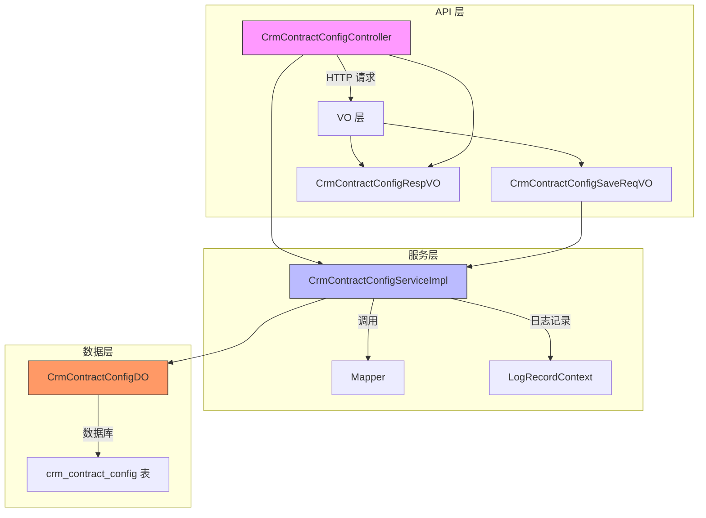
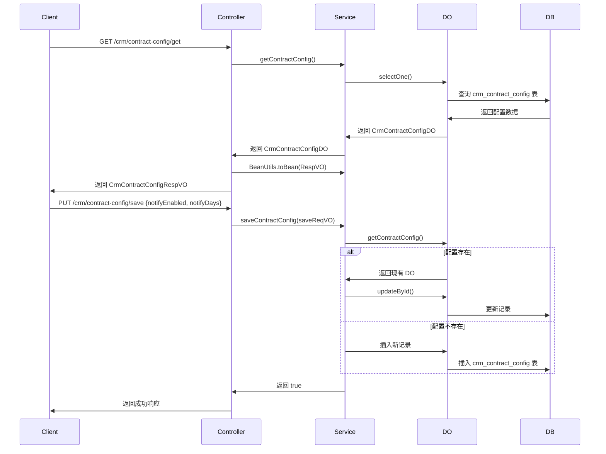
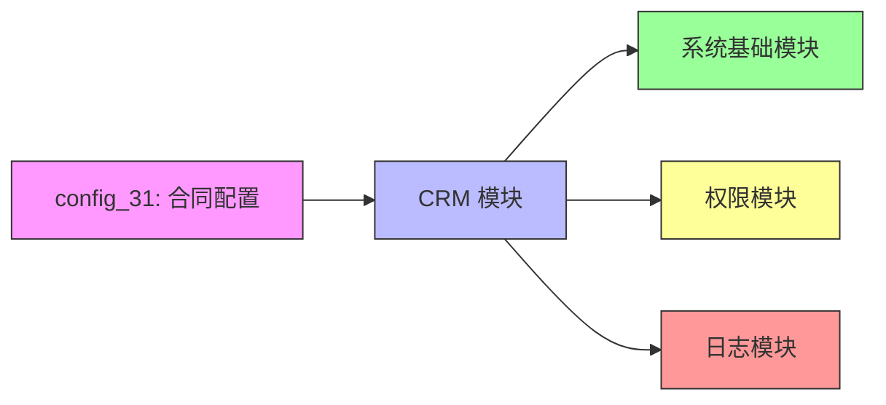
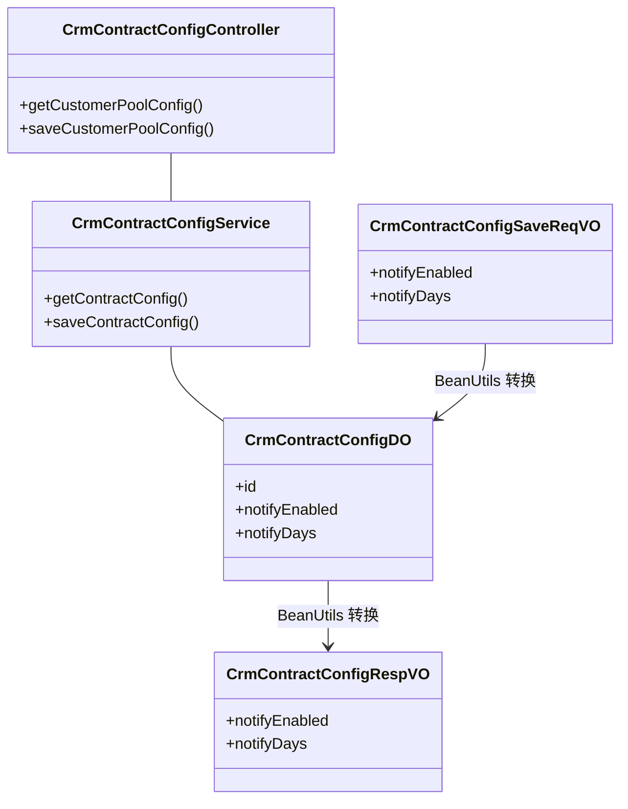

# CRM 合同配置模块 (config_31)

## 1. 模块概述

CRM 合同配置模块负责管理合同相关的系统配置，特别是合同提前提醒功能。该模块允许管理员配置合同到期前的提醒机制，包括是否启用提醒以及提前多少天进行通知。

**核心功能：**
- 配置合同提前提醒开关
- 设置提前提醒的天数
- 保存和获取合同配置信息

**模块定位：**
该模块属于 CRM（客户关系管理）系统的一部分，与合同管理模块紧密相关，为合同流程提供配置支持。

---

## 2. 架构概览



---

## 3. 组件说明

### 3.1 控制器层 (Controller)

**CrmContractConfigController** - 合同配置 REST 控制器

- **路径**: `/crm/contract-config`
- **职责**: 处理 HTTP 请求，调用服务层方法，返回响应结果
- **接口**:
  - `GET /get` - 获取合同配置
  - `PUT /save` - 保存/更新合同配置



### 3.2 值对象层 (VO)

#### CrmContractConfigSaveReqVO - 保存请求 VO

- **文件**: `yudao-module-crm/src/main/java/cn/iocoder/yudao/module/crm/controller/admin/contract/vo/config/CrmContractConfigSaveReqVO.java`
- **职责**: 封装前端提交的合同配置保存请求参数
- **字段**:
  | 字段名 | 类型 | 描述 | 示例 |
  |--------|------|------|------|
  | `notifyEnabled` | Boolean | 是否开启提前提醒 | `true` |
  | `notifyDays` | Integer | 提前提醒天数 | `2` |

- **验证规则**:
  - 当 `notifyEnabled` 为 `true` 时，`notifyDays` 不能为空（通过 `@AssertTrue` 方法验证）
  - 使用 `@DiffLogField` 注解记录字段变更日志

#### CrmContractConfigRespVO - 响应 VO

- **文件**: `yudao-module-crm/src/main/java/cn/iocoder/yudao/module/crm/controller/admin/contract/vo/config/CrmContractConfigRespVO.java`
- **职责**: 封装返回给前端的合同配置数据
- **字段**:
  | 字段名 | 类型 | 描述 |
  |--------|------|------|
  | `notifyEnabled` | Boolean | 是否开启提前提醒 |
  | `notifyDays` | Integer | 提前提醒天数 |

### 3.3 服务层 (Service)

**CrmContractConfigServiceImpl** - 合同配置服务实现

- **文件**: `yudao-module-crm/src/main/java/cn/iocoder/yudao/module/crm/service/contract/CrmContractConfigServiceImpl.java`
- **职责**: 处理合同配置的保存逻辑，包含创建和更新两种场景
- **核心方法**:
  - `getContractConfig()`: 获取当前合同配置（单条记录，因为配置是全局唯一的）
  - `saveContractConfig(CrmContractConfigSaveReqVO)`: 保存合同配置，存在则更新，不存在则插入

- **日志记录**: 使用 `@LogRecord` 注解记录操作日志，日志类型参考 `LogRecordConstants.CRM_CONTRACT_CONFIG_TYPE`

### 3.4 数据对象层 (DO)

**CrmContractConfigDO** - 合同配置数据对象

- **文件**: `yudao-module-crm/src/main/java/cn/iocoder/yudao/module/crm/dal/dataobject/contract/CrmContractConfigDO.java`
- **职责**: 映射数据库表 `crm_contract_config` 的结构
- **字段**:
  | 字段名 | 类型 | 描述 |
  |--------|------|------|
  | `id` | Long | 主键 |
  | `notifyEnabled` | Boolean | 是否开启提前提醒 |
  | `notifyDays` | Integer | 提前提醒天数 |

- **数据库表**: `crm_contract_config`
- **表结构特点**: 使用单表存储全局配置（只有一条记录），通过 `selectOne()` 获取

---

## 4. 配置项说明

合同配置包含两个核心参数：

| 配置项 | 类型 | 默认值 | 描述 |
|--------|------|--------|------|
| `notifyEnabled` | Boolean | `false` | 是否启用合同到期提前提醒功能 |
| `notifyDays` | Integer | `30` | 提前多少天发送提醒通知（仅当 `notifyEnabled` 为 `true` 时有效） |

**使用场景**: 当合同即将到期时，系统会根据此配置提前发送提醒通知给相关人员，避免合同过期遗漏。

---

## 5. 依赖关系

### 5.1 模块依赖



### 5.2 类依赖关系



---

## 6. API 文档

### 6.1 获取合同配置

- **请求方法**: GET
- **请求路径**: `/crm/contract-config/get`
- **权限要求**: `crm:contract-config:query`
- **响应示例**:
```json
{
  "code": 200,
  "message": "成功",
  "data": {
    "notifyEnabled": true,
    "notifyDays": 2
  }
}
```

### 6.2 保存合同配置

- **请求方法**: PUT
- **请求路径**: `/crm/contract-config/save`
- **请求体**:
```json
{
  "notifyEnabled": true,
  "notifyDays": 2
}
```
- **权限要求**: `crm:contract-config:update`
- **验证规则**: 当 `notifyEnabled` 为 `true` 时，`notifyDays` 不能为空
- **响应示例**:
```json
{
  "code": 200,
  "message": "成功",
  "data": true
}
```

---

## 7. 相关模块

| 模块名 | 描述 | 关联文件 |
|--------|------|----------|
| CRM 合同模块 | 合同主体管理 | `CrmContractController`, `CrmContractServiceImpl` |
| CRM 日志模块 | 操作日志记录 | `LogRecordConstants.CRM_CONTRACT_CONFIG_TYPE` |
| 权限模块 | 权限校验 | `@PreAuthorize("@ss.hasPermission('...')")` |

---

## 8. 扩展点

1. **提醒逻辑扩展**: 当前配置仅存储参数，实际提醒逻辑应在其他模块（如定时任务）中读取此配置并执行提醒通知
2. **多租户支持**: 当前配置为全局单条记录，如需支持多租户扩展，可增加 `tenantId` 字段
3. **配置变更监听**: 可通过监听配置变更事件，触发相关缓存刷新或通知逻辑
