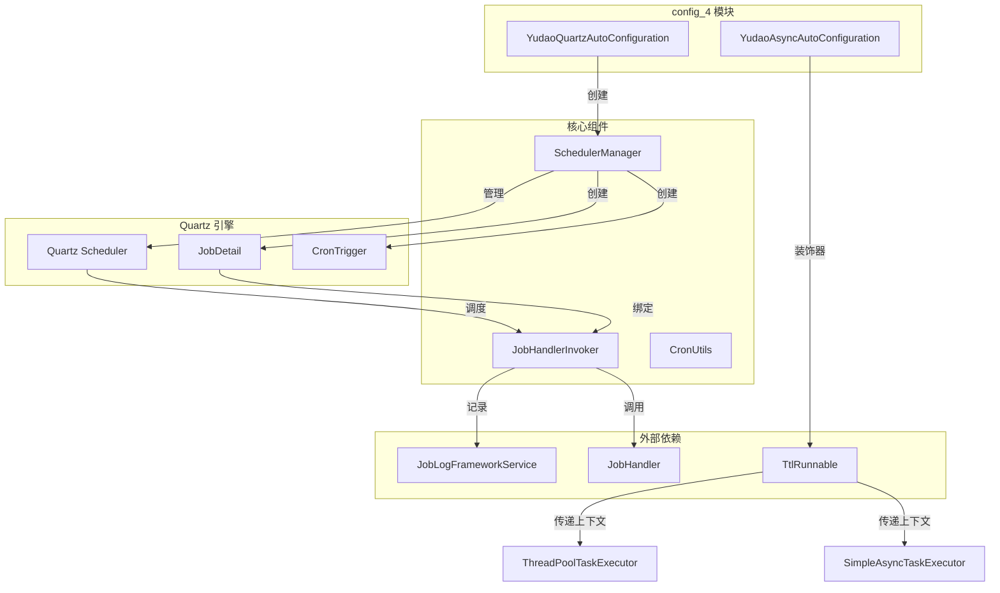
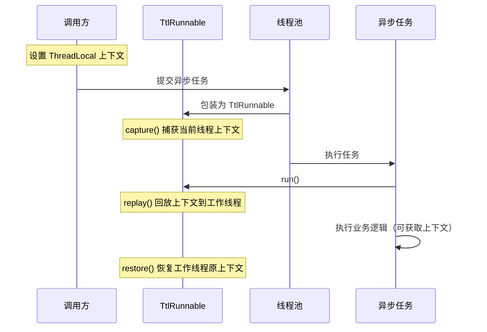
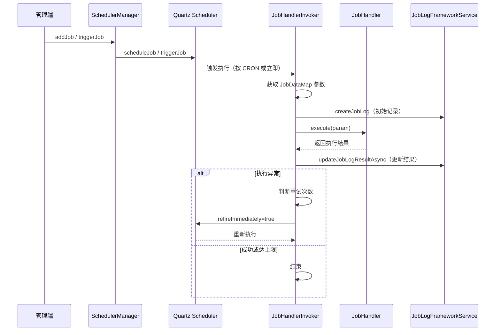
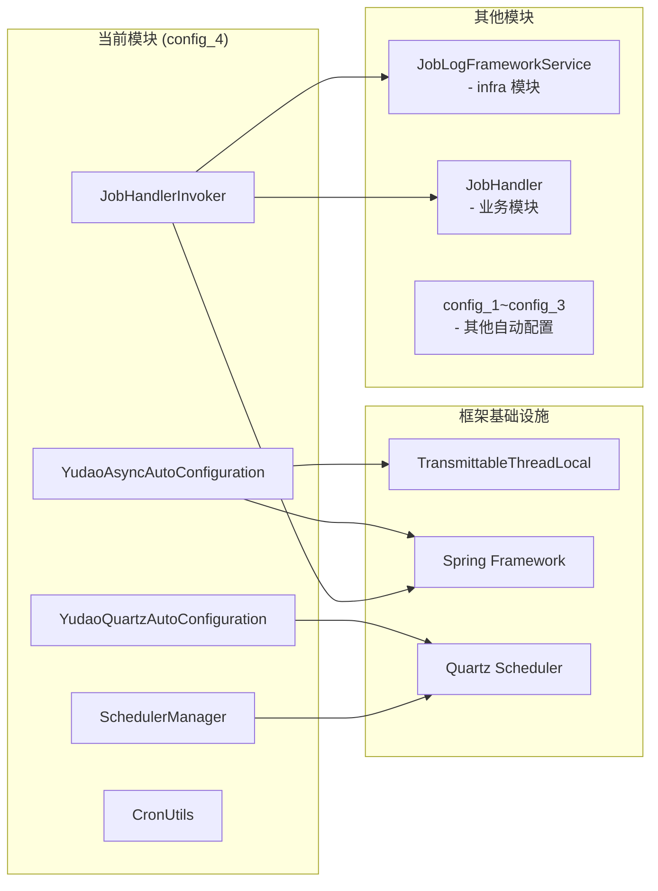

# 定时任务与异步执行模块（config_4）

## 概述

`config_4` 模块是 Yudao 框架中负责**定时任务调度**和**异步任务执行**的核心自动配置模块。该模块基于 **Quartz 调度引擎**实现任务的创建、更新、删除、暂停、恢复和触发执行，同时集成了 Spring 的 `@Async` 异步执行能力，并提供了 **TransmittableThreadLocal (TTL)** 支持以确保线程池上下文传递的正确性。

主要功能包括：

- **Quartz 定时任务自动配置**：集成 Quartz Scheduler，提供 `SchedulerManager` Bean 用于编程式管理 Job 生命周期。
- **异步任务自动配置**：启用 Spring `@EnableAsync`，自动增强 `ThreadPoolTaskExecutor` 和 `SimpleAsyncTaskExecutor` 以支持 TTL 装饰器，解决异步执行时的上下文丢失问题。
- **Job 执行器**：`JobHandlerInvoker` 作为 Quartz Job 的实际执行入口，负责调用业务 `JobHandler`，记录执行日志，并支持失败重试。
- **CRON 工具类**：提供 CRON 表达式校验和未来执行时间计算能力。

## 核心组件

### 1. YudaoAsyncAutoConfiguration

**文件**: `YudaoAsyncAutoConfiguration.java`

该配置类通过 `@EnableAsync` 开启 Spring 的异步任务支持，核心逻辑是通过 `BeanPostProcessor` 在 Bean 初始化前拦截 `ThreadPoolTaskExecutor` 和 `SimpleAsyncTaskExecutor` 实例，为其设置 `TaskDecorator` 为 `TtlRunnable::get`，从而保证异步执行时 `TransmittableThreadLocal` 中的上下文（如租户 ID、用户信息等）能够正确传递。

**关键点**:
- 使用 `TtlRunnable` 装饰器解决异步调用链路中的上下文传递问题
- 同时覆盖 `ThreadPoolTaskExecutor`（Spring 默认线程池）和 `SimpleAsyncTaskExecutor`（简单异步执行器）

### 2. YudaoQuartzAutoConfiguration

**文件**: `YudaoQuartzAutoConfiguration.java`

该配置类通过 `@EnableScheduling` 开启 Spring 自带的定时任务调度。核心逻辑是注入 `SchedulerManager` Bean：

- 如果容器中存在 `Scheduler` Bean（即已启用 Quartz），则创建正常的 `SchedulerManager` 实例。
- 如果 `Scheduler` 不存在（Quartz 被禁用），则创建 `SchedulerManager(null)`，该实例在调用任何方法时会抛出异常提示用户启用 Quartz。

### 3. SchedulerManager

**文件**: `core/scheduler/SchedulerManager.java`

`SchedulerManager` 是 Quartz 调度器的封装管理器，提供了以下操作：

| 方法 | 功能 |
|------|------|
| `addJob()` | 向 Quartz 添加新的 Job 调度 |
| `updateJob()` | 更新已有 Job 的调度配置 |
| `deleteJob()` | 删除 Job 调度 |
| `pauseJob()` | 暂停 Job |
| `resumeJob()` | 恢复 Job |
| `triggerJob()` | 立即触发一次 Job 执行 |

所有方法均会校验 `scheduler` 是否为 null，若为 null 则抛出异常（提示 Quartz 未启用）。

### 4. JobHandlerInvoker

**文件**: `core/handler/JobHandlerInvoker.java`

`JobHandlerInvoker` 继承 `QuartzJobBean`，作为 Quartz 任务的实际执行单元。执行流程如下：

1. **获取 Job 数据**：从 `JobDataMap` 中提取 `jobId`、`jobHandlerName`、`jobHandlerParam`、`retryCount`、`retryInterval` 等参数。
2. **执行任务**：创建 Job 日志记录，通过 Spring 容器获取对应名称的 `JobHandler` Bean 并执行。
3. **记录日志**：异步更新 Job 执行结果（成功/失败、耗时、返回数据）。
4. **异常处理**：根据重试策略决定是否立即重试或抛出异常。

**重试机制**：
- 如果 `refireCount < retryCount`，则根据 `retryInterval` 休眠后立即重试。
- 如果达到重试上限，则直接抛出 `JobExecutionException`。

### 5. CronUtils

**文件**: `core/util/CronUtils.java`

CRON 表达式工具类，提供：

- `isValid(String cronExpression)`：校验 CRON 表达式是否合法。
- `getNextTimes(String cronExpression, int n)`：基于当前时间，计算接下来 n 个满足 CRON 表达式的执行时间点。

## 架构图

### 模块整体架构



### 异步任务上下文传递机制



### 定时任务执行流程



## 模块依赖关系



## 核心 API 说明

### SchedulerManager API

```java
// 添加定时任务
void addJob(Long jobId, String jobHandlerName, String jobHandlerParam,
            String cronExpression, Integer retryCount, Integer retryInterval)

// 更新定时任务
void updateJob(String jobHandlerName, String jobHandlerParam,
               String cronExpression, Integer retryCount, Integer retryInterval)

// 删除定时任务
void deleteJob(String jobHandlerName)

// 暂停定时任务
void pauseJob(String jobHandlerName)

// 恢复定时任务
void resumeJob(String jobHandlerName)

// 立即触发一次
void triggerJob(Long jobId, String jobHandlerName, String jobHandlerParam)
```

### JobHandler 接口

所有业务定时任务需实现该接口（定义在业务模块中）：

```java
public interface JobHandler {
    String execute(String param) throws Exception;
}
```

### CronUtils API

```java
// 校验 CRON 表达式
boolean isValid(String cronExpression)

// 获取下 n 次执行时间
List<LocalDateTime> getNextTimes(String cronExpression, int n)
```

## 配置说明

### 启用 Quartz 定时任务

在 `application.yml` 中配置 Quartz 数据源和调度器即可启用。若未配置，`SchedulerManager` 会以 null 模式运行，调用时提示"定时任务已禁用"。

### 启用异步任务

`@EnableAsync` 由 `YudaoAsyncAutoConfiguration` 自动开启，无需额外配置。TTL 装饰器会自动应用于 Spring 的线程池 Bean。

## 相关模块参考

| 模块 | 说明 | 参考文档 |
|------|------|----------|
| infra | Job 日志记录 (`JobLogFrameworkService`) 和 Job 管理控制器 | [config_42.md](config_42.md) |
| config_26 | AI 模块的自动配置，引用定时任务执行 AI 相关 Job | [config_26.md](config_26.md) |
| config_29 | BPM 模块的 Flowable 配置，与定时任务配合实现流程超时等 | [config_29.md](config_29.md) |

## 最佳实践

1. **任务幂等性**：`JobHandlerInvoker` 使用 `@DisallowConcurrentExecution` 防止同一 Job 并发执行，但业务 Handler 仍需保证幂等性。
2. **重试策略**：设置合理的 `retryCount` 和 `retryInterval`，避免频繁重试导致系统压力。
3. **上下文传递**：利用 TTL 装饰器，确保在异步任务中也能访问到租户、用户等上下文信息。
4. **CRON 表达式**：使用 `CronUtils.isValid()` 在管理端提前校验用户输入的 CRON 表达式。
