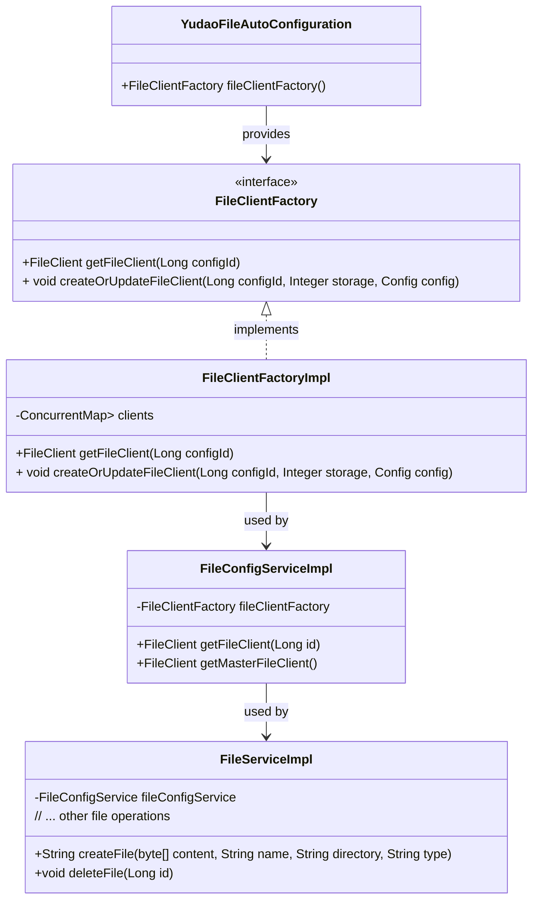

# YudaoFileAutoConfiguration

## Overview

The `YudaoFileAutoConfiguration` class is a Spring configuration class in the Yudao Infra module responsible for auto-configuring the file client factory. This factory is essential for managing different file storage clients (such as local disk, Amazon S3, FTP, SFTP, etc.) used throughout the Yudao platform for file upload, download, and management operations.

## Core Functionality

This configuration class defines a single Spring bean:
- `FileClientFactory`: An interface that provides methods to create, update, and retrieve file clients based on configuration.

The actual implementation, `FileClientFactoryImpl`, maintains a cache of file clients keyed by configuration ID, allowing efficient reuse of client instances.

## Architecture and Component Relationships

The following diagram illustrates the relationship between the file auto-configuration and related components in the file management subsystem:



### Component Responsibilities

1. **YudaoFileAutoConfiguration**
   - Bootstraps the `FileClientFactory` bean during application startup
   - Uses Java-based configuration (`@Configuration`) with `@Bean` method

2. **FileClientFactory (Interface)**
   - Defines contract for file client management:
     - `getFileClient(Long configId)`: Retrieves a file client by its configuration ID
     - `createOrUpdateFileClient(Long configId, Integer storage, Config config)`: Creates or updates a file client configuration

3. **FileClientFactoryImpl**
   - Implements the factory interface with caching capabilities
   - Uses a concurrent map to store client instances for performance
   - Delegates client creation to storage-specific implementations (e.g., `LocalFileClient`, `S3FileClient`)
   - Handles client initialization and refresh operations

4. **FileConfigServiceImpl**
   - Uses the factory to obtain file clients for file operations
   - Implements caching layer (`LoadingCache`) for client instances
   - Provides methods to get client by ID or master client

5. **FileServiceImpl**
   - Highest-level file service used by controllers and other modules
   - Delegates actual file operations to the appropriate file client obtained via `FileConfigService`

## Integration with Yudao Platform

The file auto-configuration enables the following capabilities across the Yudao ecosystem:

1. **Unified File Access**: Other modules (CRM, ERP, IM, etc.) interact with files through the `FileService` interface without needing to know the underlying storage implementation.

2. **Dynamic Configuration**: File storage configurations (stored in database) can be created, updated, and activated at runtime without application restart.

3. **Storage Abstraction**: Supports multiple storage types through the `FileStorageEnum`:
   - Local file system
   - Amazon S3
   - FTP/SFTP
   - Database storage
   - And more extensible storage types

4. **Performance Optimization**: Client instances are cached and reused, reducing overhead of creating connections for each file operation.

## Usage Example

The factory is typically used indirectly through the file services:

```java
@Service
public class SomeBusinessService {
    
    @Resource
    private FileService fileService;
    
    public void processUpload(MultipartFile file) {
        // The fileService internally uses FileConfigService -> FileClientFactory
        String url = fileService.createFile(
            file.getBytes(), 
            file.getOriginalFilename(), 
            "uploads", 
            file.getContentType()
        );
        // Process the file URL...
    }
}
```

## Configuration Properties

This auto-configuration class does not define any external configuration properties. File storage configurations are managed through:
- Database table `file_config` (managed via `FileConfigService`)
- Admin UI for file configuration management (infra module)

## Related Documentation

For detailed information about related components, see:
- [File Service Documentation](file_service.md) - Details on file operations and service interfaces
- [File Configuration Documentation](file_config.md) - Details on file storage configuration management
- [File Client Implementations](file_clients.md) - Details on specific storage implementations (Local, S3, FTP, etc.)

## Dependencies

This configuration depends on:
- `cn.iocoder.yudao.module.infra.framework.file.core.client.FileClientFactory`
- `cn.iocoder.yudao.module.infra.framework.file.core.client.FileClientFactoryImpl`
- Spring Framework's `@Configuration` and `@Bean` annotations

## Implementation Notes

1. The factory uses reflection to instantiate storage-specific clients based on configuration
2. Client initialization and refresh operations are handled through the `AbstractFileClient` template
3. Error handling follows the framework's standard exception patterns
4. The configuration is designed to be extensible for new storage types by adding new entries to `FileStorageEnum`