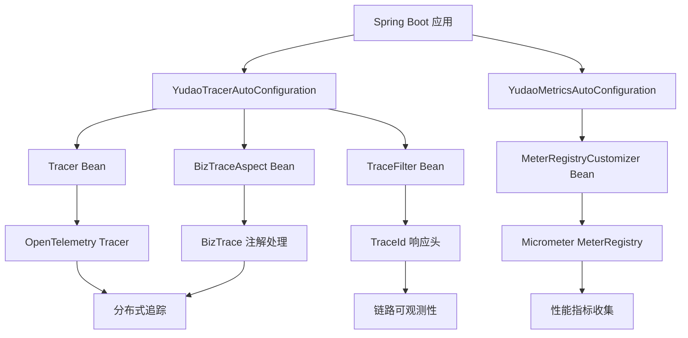
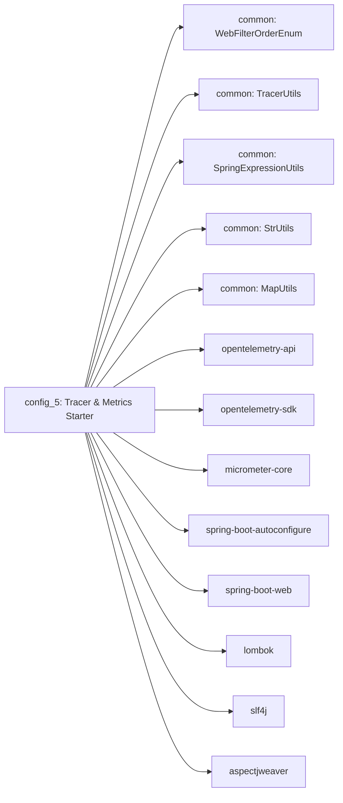
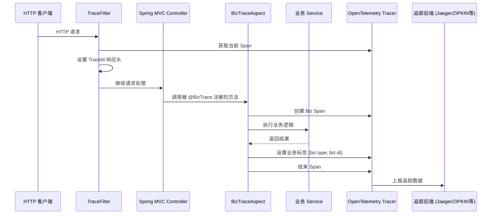
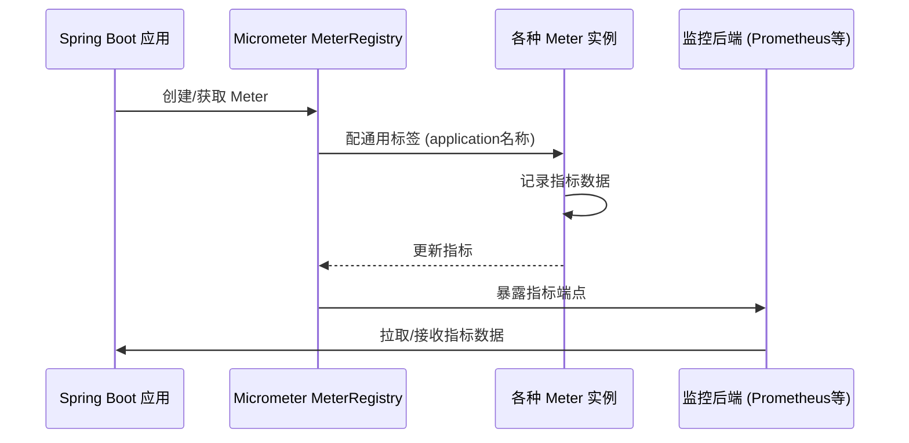

# Yudao Tracer & Metrics Starter (config_5)

## 概述

Yudao Tracer & Metrics Starter 是 Yudao 框架的监控组件，提供分布式链路追踪和应用性能指标收集功能。该模块基于 OpenTelemetry 实现链路追踪，基于 Micrometer 实现指标收集，通过 Spring Boot Starter 的方式无缝集成到 Yudao 框架中。

该模块主要包含以下功能：
- 基于 OpenTelemetry 的分布式链路追踪
- 基于 Micrometer 的应用性能指标收集
- 自动注入 TraceId 到响应头
- 业务方法切面追踪（通过 @BizTrace 注解）
- 与 Spring Boot 自动配置机制完美集成

## 核心组件

### 1. YudaoTracerAutoConfiguration
Tracer 自动配置类，负责初始化 OpenTelemetry Tracer 并配置相关组件。

### 2. YudaoMetricsAutoConfiguration  
Metrics 自动配置类，负责配置 Micrometer MeterRegistry 并添加应用名称标签。

### 3. TracerProperties
Tracer 配置属性类，用于绑定 `yudao.tracer` 前缀的配置属性。

### 4. BizTraceAspect
业务方法切面类，通过 @BizTrace 注解拦截方法调用并创建 Span 进行追踪。

### 5. TraceFilter
过滤器类，负责将当前 TraceId 写入 HTTP 响应头。

### 6. BizTrace 注解
用于标记需要进行业务追踪的方法，支持自定义操作名、业务类型和业务编号。

### 7. TracerUtils
工具类，提供获取当前 TraceId 的静态方法。

## 架构设计



## 依赖关系



## 数据流与处理过程

### 链路追踪数据流



### 指标收集数据流



## 组件交互详解

### Tracer 初始化过程

1. Spring Boot 启动时，`@AutoConfiguration` 注解的 `YudaoTracerAutoConfiguration` 类被加载
2. 通过 `@ConditionalOnClass` 检查确保 OpenTelemetry 和 Servlet API 存在
3. 通过 `@ConditionalOnProperty` 检查 `yudao.tracer.enable` 配置（默认为 true）
4. 创建 Tracer Bean，使用应用名称作为 instrumentation name
5. 创建 BizTraceAspect Bean，注入 Tracer 依赖
6. 创建 TraceFilter Bean，注册为 Servlet Filter 并设置顺序为 `WebFilterOrderEnum.TRACE_FILTER`

### Metrics 初始化过程

1. Spring Boot 启动时，`@AutoConfiguration` 注解的 `YudaoMetricsAutoConfiguration` 类被加载
2. 通过 `@ConditionalOnClass` 检查确保 MeterRegistryCustomizer 存在
3. 通过 `@ConditionalOnProperty` 检查 `yudao.metrics.enable` 配置（默认为 true）
4. 创建 MeterRegistryCustomizer Bean，为所有 Meter 添加应用名称标签

### 业务方法追踪过程

1. 当被 `@BizTrace` 注解的方法被调用时
2. `BizTraceAspect` 的 `@Around` 通知被触发
3. 创建以 "Biz/" 为前缀的 Span 名称
4. 设置 component 属性为 "biz"
5. 启动 Span 并设置为当前上下文
6. 执行目标方法
7. 如果方法执行成功：
   - 解析 @BizTrace 注解的 type() 和 id() 属性
   - 将解析结果设置为 Span 的 biz.type 和 biz.id 标签
   - 结束 Span
8. 如果方法执行异常：
   - 调用 TracerFrameworkUtils.onError() 记录异常信息到 Span
   - 重新抛出异常
   - 仍然设置业务标签并结束 Span

### TraceId 传播过程

1. HTTP 请求进入应用时，TraceFilter 被执行
2. 从 OpenTelemetry 获取当前有效的 SpanContext
3. 提取 TraceId 并写入 HTTP 响应头 "trace-id"
4. 请求继续正常处理流程
5. 下游服务可以通过读取此 header 将 TraceId 传播下去（需要下游服务同样实现相同逻辑）

## 配置说明

### Tracer 配置 (application.yml)
```yaml
yudao:
  tracer:
    enable: true  # 是否启用链路追踪，默认为 true
  metrics:
    enable: true  # 是否启用指标收集，默认为 true
```

### BizTrace 注解使用示例
```java
@Service
public class UserService {
    
    @BizTrace(type = "userId", id = "#userId")
    public User getUser(Long userId) {
        // 此方法调用会被追踪
        // Span 名称: Biz/UserService/getUser
        // biz.type 标签: userId 参数值
        // biz.id 标签: userId 参数值
        return userRepository.findById(userId).orElseThrow();
    }
    
    @BizTrace(operationName = "创建用户", type = "username", id = "#user.username")
    public User createUser(User user) {
        // 自定义操作名: Biz/创建用户
        // biz.type 标签: user.username 参数值
        // biz.id 标签: user.username 参数值
        return userRepository.save(user);
    }
}
```

## 与其他模块的关系

此模块为框架基础设施层组件，为上层业务模块提供非侵入式的监控能力：

- 与 [config_15](config_15.md) (Redis Starter) 协同工作，可以追踪 Redis 操作
- 与 [config_8](config_8.md) (MyBatis Starter) 协同工作，可以追踪数据库操作
- 与 [config_17](config_17.md) (Security Starter) 协同工作，可以追踪安全相关操作
- 与 [config_18](config_18.md) (ApiLog Starter) 互补，提供更完整的可观测性方案
- 为所有业务模块（如 CRM、ERP、MES 等）提供统一的追踪和指标能力

## 最佳实践

1. 在需要进行业务追踪的服务方法上添加 `@BizTrace` 注解
2. 合理设置 `type` 和 `id` 参数，以便在追踪系统中进行业务维度的过滤和分析
3. 对于频繁调用的方法，考虑是否需要追踪以避免产生过多的 Span 数据
4. 在微服务架构中，确保所有服务都集成了此监控 starter 以实现端到端链路追踪
5. 结合使用 Yudao 的 Actuator 监控端点（参考相关文档）查看收集到的指标数据
6. 在生产环境中，根据业务峰值流量调整采样率以控制追踪数据量

## 实现原理

### OpenTelemetry 集成
- 使用 GlobalOpenTelemetry.getTracer() 获取或创建 Tracer 实例
- 通过 SpanBuilder 创建 Span，设置属性和事件
- 使用 Scope 管理 Span 的生命周期和上下文传播
- 通过 SpanRecorder 和 SpanExporter 将数据发送到后端系统

### Micrometer 集成
- 通过 MeterRegistryCustomizer 为全局 MeterRegistry 添加通用标签
- 通用标签包含应用名称，便于在监控系统中区分不同服务
- Spring Boot Actuator 自动暴露 /actuator/prometheus 端点供监控系统拉取指标

### AOP 切面实现
- 使用 @Aspect 和 @Around 注解实现方法拦截
- 通过 ProceedingJoinPoint 执行原始方法并捕获异常
- 结合 Spring Expression Utils 解析 @BizTrace 注解中的 SpEL 表达式

### Servlet Filter 实现
- 继承 OncePerRequestFilter 确保每个请求只执行一次
- 在 doFilterInternal 方法中获取当前 TraceId 并写入响应头
- 保持过滤器链的正常传播

## 性能影响

- 链路追踪：每个被 @BizTrace 注解的方法会产生额外的 Span 创建和结束操作，通常在微秒级别
- 指标收集：几乎无性能影响，主要是内存中的计数器更新
- TraceId 响应头：微小的网络传输开销
- 建议在生产环境中根据业务需求选择性地应用 @BizTrace 注解，避免过度追踪

## 错误处理

- Tracer 和 Span 操作中的异常会被捕获并记录，不会影响主业务流程
- BizTraceAspect 中的异常会被记录到 Span 后重新抛出，保持原有异常行为
- TraceFilter 中的异常会被记录但不会中断过滤器链
- 所有组件设计为故障安全，即使监控组件失败也不影响核心业务功能