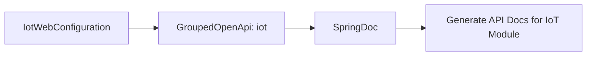

# IotWebConfiguration 模块文档

## 概述

IotWebConfiguration 是 IoT 模块的 Web 配置类，主要用于配置 Swagger/OpenAPI 文档的分组。通过定义一个名为 "iot" 的 API 分组，使得 SpringDoc 能够为 IoT 模块的 API 生成独立的文档。

## 核心功能

- 配置 IoT 模块的 API 分组在 Swagger 中，便于在文档中隔离和展示 IoT 相关的 API 接口。

## 架构说明

IotWebConfiguration 类位于 IoT 模块的框架层（framework.web.config）下，是 Spring 的配置类。它通过 `@Configuration` 注解被 Spring 容器加载，并提供一个 `GroupedOpenApi` Bean。

该 Bean 由 `YudaoSwaggerAutoConfiguration.buildGroupedOpenApi("iot")` 方法创建，该方法是框架提供的工具方法，用于统一创建 Swagger 分组。

## 依赖关系

- 依赖于 `cn.iocoder.yudao.framework.swagger.config.YudaoSwaggerAutoConfiguration`：用于构建 Swagger 分组。
- 依赖于 `org.springdoc.core.models.GroupedOpenApi`：SpringDoc 提供的用于定义 API 分组的类。

## 在系统中的作用

在整个 Yudao 框架中，各个业务模块（如 IoT、CRM、ERP 等）都有自己的 Web 配置类来配置各自的 Swagger 分组。这样，在启动应用时，SpringDoc 会根据这些分组生成模块化的 API 文档，使得文档更加清晰和易于管理。

## Mermaid 图示

以下是 IotWebConfiguration 与相关组件的简单关系图：

注意：由于本模块职责单一，未展示更复杂的交互。如需了解 YudaoSwaggerAutoConfiguration 的详细实现，请参考 [framework-swagger 模块文档](framework-swagger.md)（假设存在）。

## 使用说明

无需额外配置。只要该类被 Spring 扫描到（通常通过 `@SpringBootApplication` 或 `@ComponentScan` 自动扫描），它就会自动注册 IoT 模块的 API 分组。

## 注意事项

- 确保 SpringDoc 依赖已在项目中正确引入。
- 该配置类仅影响 Swagger 文档的生成，不影响实际 API 的行为。

## 与其他模块的关联

类似的 Web 配置类存在于其他业务模块中，例如：
   - [CRM 模块的 Web 配置](config_23.md)：对应 CrmWebConfiguration
   - [ERP 模块的 Web 配置](config_34.md)：对应 ErpWebConfiguration
它们共同遵循了在 Yudao 框架中为每个模块独立配置 Swagger 分组的约定。

## 结论

IotWebConfiguration 是一个轻量级的配置类，其唯一职责是为 IoT 模块在 Swagger 中定义一个 API 分组，从而实现模块化的 API 文档管理。