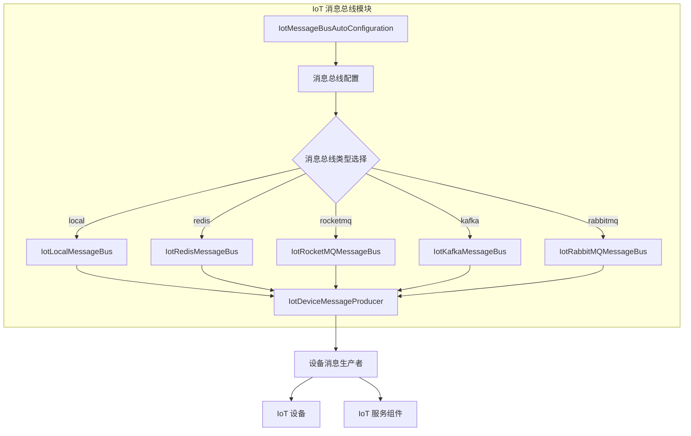

# IoT 消息总线模块 (config_52) 文档

## 1. 概述

IoT 消息总线模块是 IoT 子系统的核心组件，负责设备消息的统一路由和分发。该模块提供了多种消息总线实现方案，支持本地内存、Redis Stream、RocketMQ、Kafka 和 RabbitMQ 等多种消息中间件，以满足不同场景下的消息传递需求。

## 2. 架构设计

### 2.1 整体架构



### 2.2 组件关系

- **IotMessageBusAutoConfiguration**: 主配置类，负责根据配置属性自动选择并初始化不同的消息总线实现
- **IotMessageBusProperties**: 配置属性类，定义消息总线类型等配置项
- **IotMessageBus**: 消息总线接口，定义消息发送和订阅的核心能力
- **IotDeviceMessageProducer**: 设备消息生产者，统一使用消息总线发送设备消息
- 各具体实现类（IotLocalMessageBus、IotRedisMessageBus、IotRocketMQMessageBus、IotKafkaMessageBus、IotRabbitMQMessageBus）

## 3. 核心功能

### 3.1 多消息总线支持

模块支持五种消息总线实现，通过配置 `yudao.iot.message-bus.type` 属性进行选择：

| 类型 | 描述 | 适用场景 |
|------|------|----------|
| local | 本地内存实现，基于 Spring ApplicationEvent | 单机部署、测试环境 |
| redis | Redis Stream 实现，支持消息持久化和消费组 | 高并发、需要消息持久化 |
| rocketmq | RocketMQ 实现，支持高吞吐、分布式消息 | 大规模分布式系统 |
| kafka | Kafka 实现，支持高吞吐、日志式消息 | 大数据流处理 |
| rabbitmq | RabbitMQ 实现，支持灵活的路由和消息确认 | 企业级消息服务 |

### 3.2 消息路由

消息总线负责将设备消息根据主题（Topic）路由到对应的消息消费者，实现设备消息的统一管理和分发。

### 3.3 消息重试与清理（Redis 实现）

Redis 消息总线实现包含两个重要的后台任务：
- **RedisPendingMessageResendJob**: 负责 Redis Stream 中未消费消息的重试发送
- **RedisStreamMessageCleanupJob**: 负责清理 Redis Stream 中的过期消息

## 4. 配置说明

### 4.1 配置属性

通过 `IotMessageBusProperties` 类定义配置属性，主要配置项如下：

```yaml
yudao:
  iot:
    message-bus:
      type: local  # 可选值：local、redis、rocketmq、kafka、rabbitmq，默认 local
```

### 4.2 自动配置条件

各消息总线实现通过 `@ConditionalOnProperty` 和 `@ConditionalOnClass` 注解控制自动加载条件：

- **local**: 当 `yudao.iot.message-bus.type=local` 时加载（默认）
- **rocketmq**: 当 `yudao.iot.message-bus.type=rocketmq` 且类路径存在 `RocketMQTemplate` 时加载
- **kafka**: 当 `yudao.iot.message-bus.type=kafka` 且类路径存在 `KafkaTemplate` 时加载
- **redis**: 当 `yudao.iot.message-bus.type=redis` 且类路径存在 `RedisTemplate` 时加载
- **rabbitmq**: 当 `yudao.iot.message-bus.type=rabbitmq` 且类路径存在 `RabbitTemplate` 时加载

## 5. 使用方式

### 5.1 依赖配置

在 `application.yml` 中配置消息总线类型：

```yaml
yudao:
  iot:
    message-bus:
      type: redis  # 或 rocketmq、kafka、rabbitmq、local
```

### 5.2 使用设备消息生产者

通过注入 `IotDeviceMessageProducer` 发送设备消息：

```java
@Service
public class DeviceService {
    
    @Autowired
    private IotDeviceMessageProducer deviceMessageProducer;
    
    public void sendDeviceMessage(String topic, Object message) {
        deviceMessageProducer.send(topic, message);
    }
}
```

### 5.3 订阅消息

实现 `IotMessageBus` 的订阅接口，注册消息监听器：

```java
@Component
public class DeviceMessageListener implements IotMessageBusSubscriber {
    
    @Override
    public String getTopic() {
        return "device/message";
    }
    
    @Override
    public void onMessage(Object message) {
        // 处理设备消息
    }
}
```

## 6. 与其他模块的交互

IoT 消息总线模块与以下模块紧密协作：

- **IoT 设备模块**: 通过消息总线发送设备上报消息
- **IoT OTA 模块**: 通过消息总线下发固件升级指令
- **IoT 规则引擎**: 通过消息总线接收设备消息进行规则处理
- **IoT 网关模块**: 通过消息总线与设备通信

## 7. 扩展性设计

模块采用策略模式设计，新增消息总线实现只需：
1. 实现 `IotMessageBus` 接口
2. 创建对应的配置类，添加 `@ConditionalOnProperty` 条件
3. 注册相关 Bean

## 8. 参考文档

- [MQ 模块文档](config_7.md) - Redis MQ 相关配置
- [IoT 核心模块文档](config_52.md) - IoT 核心功能
- [IoT 网关模块文档](config_54.md) - IoT 网关配置
