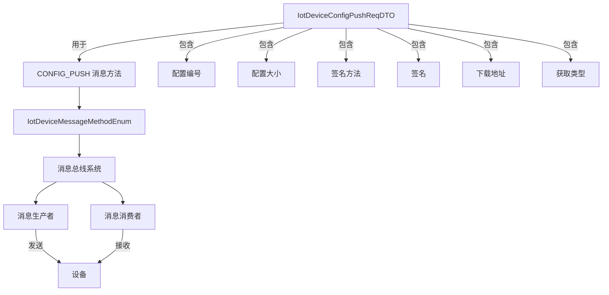
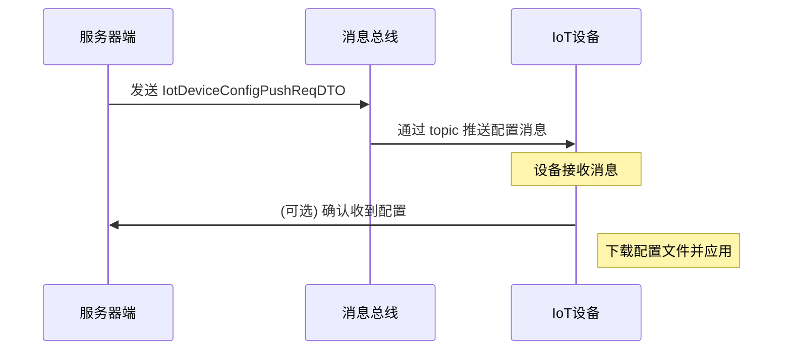
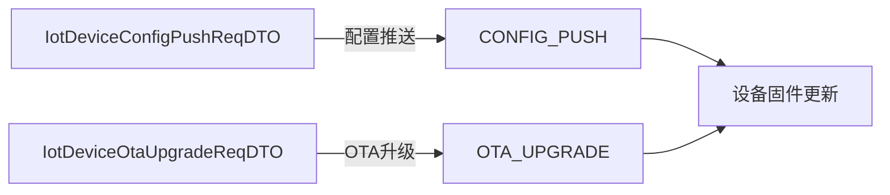

# config_53 模块文档 - IoT 设备配置推送

## 1. 模块概述

config_53 模块是 IoT（物联网）核心模块中的设备配置推送子模块，主要负责处理设备远程配置下发的相关 DTO（数据传输对象）。该模块位于 `yudao-module-iot/yudao-module-iot-core` 中，是 IoT 设备消息体系的重要组成部分。

在 IoT 系统中，设备配置推送（Config Push）是一种重要的下行消息类型，用于向设备下发新的配置参数、固件更新信息或其他系统配置。config_53 模块提供了标准化的 DTO 结构，确保配置信息能够安全、可靠地传输到目标设备。

## 2. 架构设计

### 2.1 模块定位

```
┌─────────────────────────────────────────────────────────────────┐
│                      yudao-module-iot-core                      │
│  ┌─────────────────────────────────────────────────────────┐   │
│  │                    Topic 模块                          │   │
│  │  ┌─────────────────────────────────────────────────┐   │   │
│  │  │  Topic 配置子模块 (config_53)                 │   │   │
│  │  │  ┌─────────────────────────────────────────┐   │   │   │
│  │  │  │ IotDeviceConfigPushReqDTO              │   │   │   │
│  │  │  │ (设备配置推送请求 DTO)                │   │   │   │
│  │  │  └─────────────────────────────────────────┘   │   │   │
│  │  └─────────────────────────────────────────────────┘   │   │
│  │                                                       │   │
│  │  ┌─────────────────────────────────────────────────┐   │   │
│  │  │  OTA 子模块                                   │   │   │
│  │  │  ┌─────────────────────────────────────────┐   │   │   │
│  │  │  │ IotDeviceOtaUpgradeReqDTO              │   │   │   │
│  │  │  └─────────────────────────────────────────┘   │   │   │
│  │  └─────────────────────────────────────────────────┘   │   │
│  │                                                       │   │
│  │  ┌─────────────────────────────────────────────────┐   │   │
│  │  │  Property 子模块                               │   │   │
│  │  │  ┌─────────────────────────────────────────┐   │   │   │
│  │  │  │ IotDevicePropertyPackPostReqDTO        │   │   │   │
│  │  │  └─────────────────────────────────────────┘   │   │   │
│  │  └─────────────────────────────────────────────────┘   │   │
│  │                                                       │   │
│  │  ┌─────────────────────────────────────────────────┐   │   │
│  │  │  Service 子模块                                │   │   │
│  │  │  ┌─────────────────────────────────────────┐   │   │   │
│  │  │  │ IotDeviceServiceInvokeReqDTO           │   │   │   │
│  │  │  └─────────────────────────────────────────┘   │   │   │
│  │  └─────────────────────────────────────────────────┘   │   │
│  └─────────────────────────────────────────────────────────┘   │
└─────────────────────────────────────────────────────────────────┘
```

### 2.2 组件关系图



## 3. 核心组件

### 3.1 IotDeviceConfigPushReqDTO

**文件路径**: `yudao-module-iot/yudao-module-iot-core/src/main/java/cn/iocoder/yudao/module/iot/core/topic/config/IotDeviceConfigPushReqDTO.java`

**描述**: IoT 设备配置推送请求 DTO，用于 `CONFIG_PUSH` 下行消息的参数传递。

#### 3.1.1 字段说明

| 字段名 | 类型 | 说明 | 示例值 |
|--------|------|------|--------|
| configId | String | 配置编号 | "config_001" |
| configSize | Long | 配置文件大小（字节） | 1024 |
| signMethod | String | 签名方法 | "HMAC-SHA256" |
| sign | String | 签名值 | "abc123..." |
| url | String | 配置文件下载地址 | "https://example.com/config.zip" |
| getType | String | 获取类型（file/content） | "file" |

#### 3.1.2 获取类型说明

- **file**: 表示配置文件是一个文件，设备需要从 URL 下载
- **content**: 表示配置内容直接包含在消息中（虽然 DTO 中未直接包含 content 字段，但此类型可用于轻量级配置）

#### 3.1.3 使用示例

```java
// 创建配置推送请求
IotDeviceConfigPushReqDTO configPushReq = new IotDeviceConfigPushReqDTO(
    "config_001",                    // configId
    1024L,                           // configSize
    "HMAC-SHA256",                   // signMethod
    "abc123def456...",               // sign
    "https://example.com/config.zip",// url
    "file"                           // getType
);

// 通过消息总线发送配置推送
IotDeviceMessage message = new IotDeviceMessage();
message.getMethod(IotDeviceMessageMethodEnum.CONFIG_PUSH.getMethod());
message.setParams(configPushReq);
iotDeviceMessageProducer.send(message);
```

### 3.2 IotDeviceMessageMethodEnum

**文件路径**: `yudao-module-iot/yudao-module-iot-core/src/main/java/cn/iocoder/yudao/module/iot/core/enums/IotDeviceMessageMethodEnum.java`

**描述**: 定义了 IoT 设备消息的所有方法类型，包括配置推送（CONFIG_PUSH）在内的各种设备交互操作。

#### 3.2.1 配置推送相关枚举

```java
// ========== 设备配置 ==========
// 可参考：https://help.aliyun.com/zh/iot/user-guide/remote-configuration-1
CONFIG_PUSH("thing.config.push", "配置推送", false),
```

- **method**: `thing.config.push` - 消息方法标识符
- **name**: "配置推送" - 人类可读的名称
- **upstream**: `false` - 表示这是下行消息（从服务器到设备）

#### 3.2.2 其他相关消息方法

| 方法 | 说明 | 方向 |
|------|------|------|
| OTA_UPGRADE | OTA 固件信息推送 | 下行 |
| OTA_PROGRESS | OTA 升级进度上报 | 上行 |
| PROPERTY_SET | 属性设置 | 下行 |
| SERVICE_INVOKE | 服务调用 | 下行 |

### 3.3 消息总线系统

config_53 模块与消息总线系统紧密集成，通过消息总线实现配置推送的分发。

#### 3.3.1 消息总线配置

**文件路径**: `yudao-module-iot/yudao-module-iot-core/src/main/java/cn/iocoder/yudao/module/iot/core/messagebus/config/IotMessageBusAutoConfiguration.java`

**描述**: 消息总线的自动配置类，支持多种消息总线实现：

- **local**: 本地内存消息总线（默认）
- **redis**: Redis 消息总线
- **rocketmq**: RocketMQ 消息总线
- **kafka**: Kafka 消息总线
- **rabbitmq**: RabbitMQ 消息总线

#### 3.3.2 配置属性

**文件路径**: `yudao-module-iot/yudao-module-iot-core/src/main/java/cn/iocoder/yudao/module/iot/core/messagebus/config/IotMessageBusProperties.java`

```yaml
# application.yml 示例
yudao:
  iot:
    message-bus:
      type: local  # 可选: local, redis, rocketmq, kafka, rabbitmq
```

## 4. 数据流

### 4.1 配置推送流程



### 4.2 配置推送详细步骤

1. **创建配置请求**: 服务器端创建 `IotDeviceConfigPushReqDTO` 对象，包含配置信息
2. **生成消息**: 将 DTO 封装到 `IotDeviceMessage` 中，设置方法为 `CONFIG_PUSH`
3. **发送消息**: 通过消息总线将消息发送到设备的 topic
4. **设备接收**: 设备订阅对应的 topic，接收配置推送消息
5. **验证签名**: 设备验证消息的签名（signMethod + sign）确保消息完整性
6. **下载配置**: 根据 url 下载配置文件（getType = "file"）或直接获取配置内容
7. **应用配置**: 设备应用新的配置参数

## 5. 安全机制

config_53 模块通过以下机制确保配置推送的安全性：

1. **签名验证**: 使用 `signMethod` 和 `sign` 字段对配置消息进行签名，防止消息被篡改
2. **传输安全**: 建议使用 HTTPS 协议传输配置文件下载地址
3. **身份认证**: 设备在连接消息总线时需要进行身份认证

## 6. 与其他模块的集成

### 6.1 OTA 升级模块

config_53 模块与 OTA 升级模块紧密相关，两者都使用类似的 DTO 结构：



### 6.2 设备拓扑管理

配置推送通常与设备拓扑管理配合使用，通过拓扑关系确定配置推送的目标设备：


### 6.3 属性设置模块

配置推送与属性设置（PROPERTY_SET）都是下行消息，但用途不同：

| 特性 | CONFIG_PUSH | PROPERTY_SET |
|------|-------------|--------------|
| 用途 | 下发完整配置文件 | 设置单个属性值 |
| 数据量 | 通常较大（文件） | 通常较小（单值） |
| 频率 | 低频（配置变更时） | 高频（实时控制） |

## 7. 配置示例

### 7.1 本地消息总线配置

```yaml
yudao:
  iot:
    message-bus:
      type: local
```

### 7.2 Redis 消息总线配置

```yaml
yudao:
  iot:
    message-bus:
      type: redis
```

### 7.3 RocketMQ 消息总线配置

```yaml
yudao:
  iot:
    message-bus:
      type: rocketmq
```

## 8. 参考文档

- [阿里云 - 远程配置](https://help.aliyun.com/zh/iot/user-guide/remote-configuration-1)
- [IoT 设备消息方法枚举](IotDeviceMessageMethodEnum.md)
- [OTA 升级模块](ota.md)
- [消息总线系统](message-bus.md)

## 9. 常见问题

### 9.1 配置推送失败怎么办？

1. 检查签名是否正确
2. 确认设备是否在线并订阅了正确的 topic
3. 验证配置文件下载地址是否可达
4. 检查消息总线配置是否正确

### 9.2 如何获取配置推送的响应？

CONFIG_PUSH 方法的上游标志为 `false`，表示不需要设备回复。如果需要确认配置是否成功应用，可以通过其他机制（如状态上报）进行确认。

### 9.3 配置推送支持哪些文件格式？

config_53 模块本身不限制文件格式，具体支持的文件格式由设备端决定。常见的配置文件格式包括：JSON、XML、YAML、二进制等。
