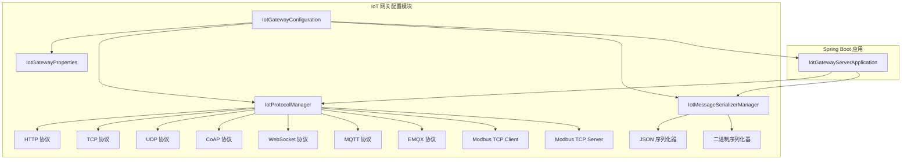
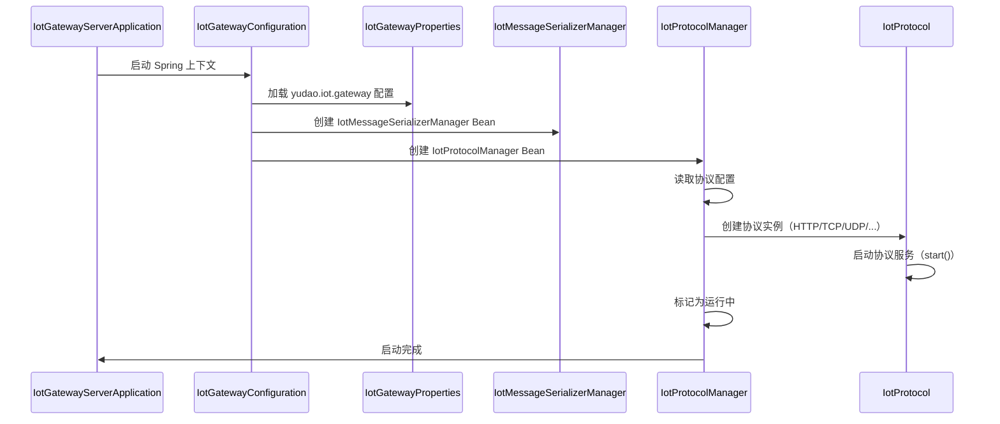

# IoT 网关配置模块 (config_54)

## 1. 模块概述

IoT 网关配置模块是 IoT 模块的核心配置组件，负责 IoT 网关的启动、协议管理、消息序列化等核心功能的配置与初始化。该模块通过 Spring Boot 的 `@Configuration` 注解，集中管理 IoT 网关的各种协议实例、消息序列化器以及网关属性配置。

## 2. 核心组件

### 2.1 IotGatewayConfiguration

**文件路径**: `yudao-module-iot/yudao-module-iot-gateway/src/main/java/cn/iocoder/yudao/module/iot/gateway/config/IotGatewayConfiguration.java`

**功能描述**: IoT 网关的主配置类，负责初始化网关的核心组件。

```java
@Configuration
@EnableConfigurationProperties(IotGatewayProperties.class)
public class IotGatewayConfiguration {

    @Bean
    public IotMessageSerializerManager iotMessageSerializerManager() {
        return new IotMessageSerializerManager();
    }

    @Bean
    public IotProtocolManager iotProtocolManager(IotGatewayProperties gatewayProperties) {
        return new IotProtocolManager(gatewayProperties);
    }

}
```

**主要职责**:
- 启用配置属性绑定 (`@EnableConfigurationProperties`)
- 创建 `IotMessageSerializerManager` Bean，用于管理消息序列化器
- 创建 `IotProtocolManager` Bean，用于管理协议实例

### 2.2 IotGatewayProperties

**文件路径**: `yudao-module-iot/yudao-module-iot-gateway/src/main/java/cn/iocoder/yudao/module/iot/gateway/config/IotGatewayProperties.java`

**功能描述**: IoT 网关的配置属性类，通过 `@ConfigurationProperties(prefix = "yudao.iot.gateway")` 绑定 YAML/Properties 配置文件。

```java
@ConfigurationProperties(prefix = "yudao.iot.gateway")
@Validated
@Data
public class IotGatewayProperties {
    private RpcProperties rpc;
    private TokenProperties token;
    private List<ProtocolProperties> protocols;
    
    // 内部类：RPC 配置
    @Data
    public static class RpcProperties {
        private String url;
        private Duration connectTimeout;
        private Duration readTimeout;
    }
    
    // 内部类：Token 配置
    @Data
    public static class TokenProperties {
        private String secret;
        private Duration expiration;
    }
    
    // 内部类：协议实例配置
    @Data
    public static class ProtocolProperties {
        private String id;
        private Boolean enabled = true;
        private String protocol;
        private Integer port;
        private String serialize;
        private SslConfig ssl;
        private IotHttpConfig http;
        private IotWebSocketConfig websocket;
        private IotTcpConfig tcp;
        private IotUdpConfig udp;
        private IotCoapConfig coap;
        private IotMqttConfig mqtt;
        private IotEmqxConfig emqx;
        private IotModbusTcpClientConfig modbusTcpClient;
        private IotModbusTcpServerConfig modbusTcpServer;
    }
    
    // 内部类：SSL 配置
    @Data
    public static class SslConfig {
        private Boolean ssl = false;
        private String sslCertPath;
        private String sslKeyPath;
        private String keyStorePath;
        private String keyStorePassword;
        private String trustStorePath;
        private String trustStorePassword;
    }
}
```

**配置项说明**:

| 配置项 | 描述 |
|--------|------|
| `rpc.url` | 主程序 API 地址 |
| `rpc.connectTimeout` | 连接超时时间 |
| `rpc.readTimeout` | 读取超时时间 |
| `token.secret` | Token 密钥 |
| `token.expiration` | Token 有效期 |
| `protocols` | 协议实例列表，每个协议实例包含 ID、启用状态、协议类型、端口、序列化类型、SSL 配置及各协议专属配置 |

### 2.3 IotProtocolManager

**文件路径**: `yudao-module-iot/yudao-module-iot-gateway/src/main/java/cn/iocoder/yudao/module/iot/gateway/protocol/IotProtocolManager.java`

**功能描述**: 协议管理器，负责管理多个协议实例的启动和停止，实现 `SmartLifecycle` 接口，支持 Spring 容器的生命周期管理。

```java
@Slf4j
public class IotProtocolManager implements SmartLifecycle {
    private final IotGatewayProperties gatewayProperties;
    private final List<IotProtocol> protocols = new ArrayList<>();
    private volatile boolean running = false;

    public IotProtocolManager(IotGatewayProperties gatewayProperties) {
        this.gatewayProperties = gatewayProperties;
    }

    @Override
    public void start() {
        // 遍历配置，创建并启动每个协议实例
        for (IotGatewayProperties.ProtocolProperties config : gatewayProperties.getProtocols()) {
            if (BooleanUtil.isFalse(config.getEnabled())) {
                continue;
            }
            IotProtocol protocol = createProtocol(config);
            if (protocol != null) {
                protocol.start();
                protocols.add(protocol);
            }
        }
        running = true;
    }

    @Override
    public void stop() {
        // 停止所有协议实例
        for (IotProtocol protocol : protocols) {
            protocol.stop();
        }
        protocols.clear();
        running = false;
    }

    private IotProtocol createProtocol(IotGatewayProperties.ProtocolProperties config) {
        IotProtocolTypeEnum protocolType = IotProtocolTypeEnum.of(config.getProtocol());
        // 根据协议类型创建对应的协议实例
        switch (protocolType) {
            case HTTP: return new IotHttpProtocol(config);
            case TCP: return new IotTcpProtocol(config);
            case UDP: return new IotUdpProtocol(config);
            case COAP: return new IotCoapProtocol(config);
            case WEBSOCKET: return new IotWebSocketProtocol(config);
            case MQTT: return new IotMqttProtocol(config);
            case EMQX: return new IotEmqxProtocol(config);
            case MODBUS_TCP_CLIENT: return new IotModbusTcpClientProtocol(config);
            case MODBUS_TCP_SERVER: return new IotModbusTcpServerProtocol(config);
            default: throw new IllegalArgumentException("不支持的协议类型");
        }
    }
}
```

**支持的协议类型**:

| 协议类型 | 描述 |
|----------|------|
| HTTP | HTTP 协议，使用 Vert.x 构建 HTTP 服务器 |
| TCP | TCP 协议，支持帧编解码和序列化 |
| UDP | UDP 协议，支持无连接通信 |
| COAP | CoAP 协议，基于 UDP 的轻量级协议 |
| WEBSOCKET | WebSocket 协议，全双工通信 |
| MQTT | MQTT 协议，发布/订阅模式 |
| EMQX | EMQX 集成协议，通过 HTTP Hook 与 EMQX 交互 |
| MODBUS_TCP_CLIENT | Modbus TCP 客户端协议，用于轮询设备 |
| MODBUS_TCP_SERVER | Modbus TCP 服务器协议，接收设备连接 |

### 2.4 IotMessageSerializerManager

**文件路径**: `yudao-module-iot/yudao-module-iot-gateway/src/main/java/cn/iocoder/yudao/module/iot/gateway/serialize/IotMessageSerializerManager.java`

**功能描述**: 消息序列化器管理器，负责创建和管理不同序列化的消息序列化器。

```java
@Slf4j
public class IotMessageSerializerManager {
    private final Map<IotSerializeTypeEnum, IotMessageSerializer> serializerMap = new EnumMap<>(IotSerializeTypeEnum.class);

    public IotMessageSerializerManager() {
        for (IotSerializeTypeEnum type : IotSerializeTypeEnum.values()) {
            IotMessageSerializer serializer = createSerializer(type);
            serializerMap.put(type, serializer);
            log.info("[IotSerializerManager][序列化器 {} 创建成功]", type);
        }
    }

    private IotMessageSerializer createSerializer(IotSerializeTypeEnum type) {
        switch (type) {
            case JSON: return new IotJsonSerializer();
            case BINARY: return new IotBinarySerializer();
            default: throw new IllegalArgumentException("未知的序列化类型：" + type);
        }
    }

    public IotMessageSerializer get(IotSerializeTypeEnum type) {
        return serializerMap.get(type);
    }
}
```

**支持的序列化类型**:

| 序列化类型 | 描述 |
|------------|------|
| JSON | JSON 序列化，使用 `IotJsonSerializer` |
| BINARY | 二进制序列化，使用 `IotBinarySerializer` |

### 2.5 IotProtocol 接口

**文件路径**: `yudao-module-iot/yudao-module-iot-gateway/src/main/java/cn/iocoder/yudao/module/iot/gateway/protocol/IotProtocol.java`

**功能描述**: 所有协议实现的基接口，定义了协议的生命周期方法。

```java
public interface IotProtocol {
    String getId();                    // 协议实例 ID
    String getServerId();              // 服务器 ID（用于消息追踪）
    IotProtocolTypeEnum getType();     // 协议类型
    void start();                      // 启动协议服务
    void stop();                       // 停止协议服务
    boolean isRunning();               // 检查是否运行中
}
```

## 3. 架构设计

### 3.1 整体架构图



### 3.2 启动流程



## 4. 配置示例

```yaml
yudao:
  iot:
    gateway:
      rpc:
        url: http://localhost:8080
        connectTimeout: 5s
        readTimeout: 10s
      token:
        secret: your-secret-key
        expiration: 3600s
      protocols:
        - id: http-alink
          enabled: true
          protocol: http
          port: 8081
          serialize: json
          http:
            path: /api
          ssl:
            ssl: true
            sslCertPath: /path/to/cert.pem
            sslKeyPath: /path/to/key.pem
        - id: tcp-binary
          enabled: true
          protocol: tcp
          port: 8082
          serialize: binary
          tcp:
            codec: length
            maxConnections: 1000
            keepAliveTimeoutMs: 30000
        - id: mqtt-broker
          enabled: true
          protocol: mqtt
          port: 1883
          mqtt:
            maxMessageSize: 65535
            connectTimeoutSeconds: 10
```

## 5. 依赖关系

### 5.1 模块依赖

```mermaid
graph LR
    subgraph "config_54 (IoT 网关配置)"
        A[IotGatewayConfiguration]
        B[IotGatewayProperties]
        C[IotProtocolManager]
        D[IotMessageSerializerManager]
    end
    
    E[yudao-module-iot-core] -->|IotProtocolTypeEnum| C
    F[yudao-module-iot-core] -->|IotSerializeTypeEnum| D
    G[yudao-module-iot-gateway] -->|IotProtocol| C
    H[Vert.x] -->|HTTP/TCP/UDP/MQTT| C
    I[Spring Boot] -->|@ConfigurationProperties| B
```

### 5.2 核心依赖组件

| 依赖模块 | 组件 | 用途 |
|----------|------|------|
| yudao-module-iot-core | IotProtocolTypeEnum | 协议类型枚举 |
| yudao-module-iot-core | IotSerializeTypeEnum | 序列化类型枚举 |
| yudao-module-iot-core | IotDeviceMessageUtils | 设备消息工具类 |
| Vert.x | Vertx, NetServer, HttpServer, MqttServer | 网络通信框架 |
| Spring Boot | @ConfigurationProperties | 配置绑定 |
| Spring Boot | @EnableConfigurationProperties | 配置属性启用 |

## 6. 关键设计模式

### 6.1 工厂模式

`IotProtocolManager` 使用工厂模式创建不同协议的实例：

```java
private IotProtocol createProtocol(IotGatewayProperties.ProtocolProperties config) {
    IotProtocolTypeEnum protocolType = IotProtocolTypeEnum.of(config.getProtocol());
    switch (protocolType) {
        case HTTP: return new IotHttpProtocol(config);
        case TCP: return new IotTcpProtocol(config);
        // ... 其他协议
    }
}
```

### 6.2 策略模式

消息序列化器使用策略模式，通过 `IotMessageSerializerManager` 获取不同的序列化策略：

```java
IotMessageSerializer serializer = serializerManager.get(serializeType);
byte[] serialized = serializer.serialize(message);
```

### 6.3 生命周期管理

`IotProtocolManager` 实现 `SmartLifecycle` 接口，利用 Spring 的生命周期管理协议实例的启动和停止：

```java
public class IotProtocolManager implements SmartLifecycle {
    @Override
    public void start() { /* 启动协议 */ }
    @Override
    public void stop() { /* 停止协议 */ }
}
```

### 6.4 单例模式

`IotMessageSerializerManager` 在 Spring 容器中作为单例 Bean 管理，确保序列化器实例的唯一性。

## 7. 扩展性设计

### 7.1 协议扩展

新增协议类型只需：
1. 在 `IotProtocolTypeEnum` 中添加新的枚举值
2. 实现 `IotProtocol` 接口创建新的协议类
3. 在 `IotProtocolManager.createProtocol()` 中添加分支逻辑

### 7.2 序列化扩展

新增序列化类型只需：
1. 在 `IotSerializeTypeEnum` 中添加新的枚举值
2. 实现 `IotMessageSerializer` 接口创建新的序列化器
3. 在 `IotMessageSerializerManager.createSerializer()` 中添加分支逻辑

### 7.3 配置扩展

通过 `ProtocolProperties` 的内部类（如 `IotHttpConfig`, `IotTcpConfig` 等）支持各协议的专属配置扩展，保持配置结构的清晰和可扩展性。

## 8. 参考文档

- [IoT 核心模块文档](config_52.md) - 包含消息总线、设备认证等核心功能
- [IoT 设备管理文档](device_5.md) - 包含设备管理、设备消息等模块
- [IoT 规则引擎文档](rule_4.md) - 包含数据规则、场景规则等模块
- [IoT OTA 升级文档](ota_3.md) - 包含固件管理、升级任务等模块
