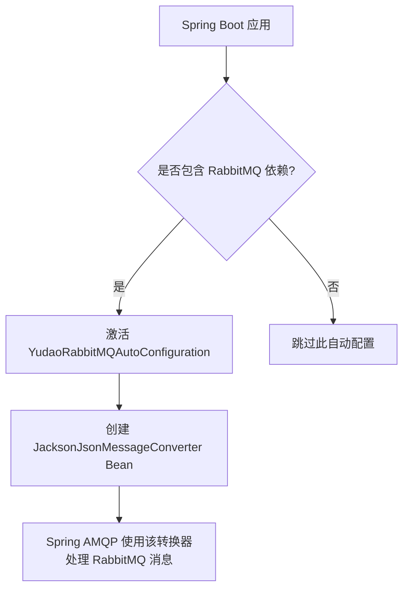
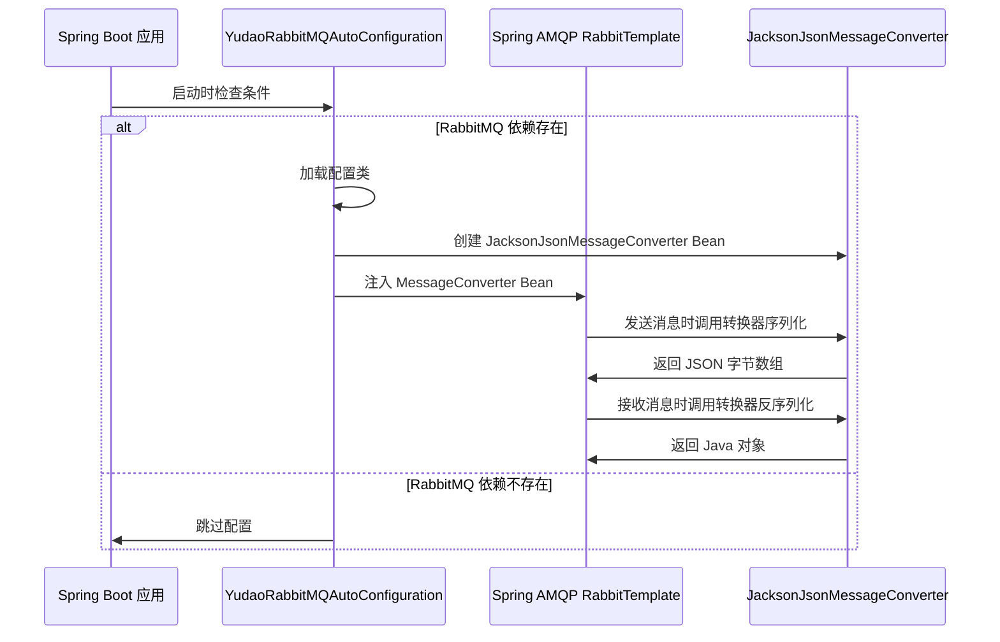

# YudaoRabbitMQAutoConfiguration 模块文档

## 概述

YudaoRabbitMQAutoConfiguration 是 Yudao 框架中用于 RabbitMQ 消息队列的自动配置类。该类位于 `yudao-spring-boot-starter-mq` 启动器中，负责在 Spring Boot 应用中检测到 RabbitMQ 依赖时，自动配置 Jackson JSON 消息转换器，以实现消息的序列化和反序列化。

## 核心功能

该自动配置类的主要职责是：
- 当 Spring Boot 应用的 classpath 中存在 `org.springframework.amqp.rabbit.core.RabbitTemplate` 类时（即 RabbitMQ 依赖已加载），激活此配置。
- 提供一个 `MessageConverter` 类型的 Bean，具体实现为 `JacksonJsonMessageConverter`，用于在 RabbitMQ 消息传输过程中将 Java 对象转换为 JSON 格式，以及将接收到的 JSON 消息转换回 Java 对象。

## 架构说明

YudaoRabbitMQAutoConfiguration 作为 Spring Boot 的自动配置类，遵循 Spring Boot 的条件注册机制。其在整个 Yudao 框架中的定位和作用如下：



### 与其他模块的关系

- 本模块属于 `yudao-spring-boot-starter-mq` 启动器，该启动器还包含其他消息队列实现的自动配置（如 Redis MQ），但各实现之间相互独立。
- 与 `YudaoRedisMQProducerAutoConfiguration` 和 `YudaoRedisMQConsumerAutoConfiguration`（对应 config_7 模块）相比，本模块专注于 RabbitMQ 实现。
- 本模块不直接依赖其他业务模块，但为使用 RabbitMQ 的业务模块提供基础设施支持。

## 依赖说明

为了使此自动配置生效，项目中需要包含以下依赖：

```xml
<!-- RabbitMQ 依赖 -->
<dependency>
    <groupId>org.springframework.boot</groupId>
    <artifactId>spring-boot-starter-amqp</artifactId>
</dependency>

<!-- Yudao RabbitMQ 启动器 -->
<dependency>
    <groupId>cn.iocoder.yudao</groupId>
    <artifactId>yudao-spring-boot-starter-mq</artifactId>
    <version>${yudao.version}</version>
</dependency>
```

> **注意**：`yudao-spring-boot-starter-mq` 启动器通常已经包含了对 `spring-boot-starter-amqp` 的传递依赖，因此在大多数情况下只需引入启动器即可。

## 使用方式

1. 在项目的 `pom.xml` 中添加 Yudao RabbitMQ 启动器依赖（如上所示）。
2. Spring Boot 应用启动时，如果检测到 RabbitMQ 依赖，则自动实例化 `JacksonJsonMessageConverter` Bean。
3. 在使用 `RabbitTemplate` 发送或接收消息时，该转换器将自动处理 JSON 序列化和反序列化。
4. 无需额外配置；如需自定义转换器行为，可在应用中覆盖该 Bean（但通常不推荐，除非有特殊需求）。

## 配置属性

本自动配置类不引入新的配置属性。所有 RabbitMQ 相关的配置（如连接地址、端口、用户名等）均通过 Spring Boot 的标准属性进行配置，例如：

```properties
spring.rabbitmq.host=localhost
spring.rabbitmq.port=5672
spring.rabbitmq.username=guest
spring.rabbitmq.password=guest
```

## 实现细节

### 关键代码解析

```java
@AutoConfiguration
@Slf4j
@ConditionalOnClass(name = "org.springframework.amqp.rabbit.core.RabbitTemplate")
public class YudaoRabbitMQAutoConfiguration {

    @Bean
    public MessageConverter createMessageConverter() {
        return new JacksonJsonMessageConverter();
    }

}
```

- `@AutoConfiguration`：标记这是一个 Spring Boot 自动配置类。
- `@ConditionalOnClass`：仅当 classpath 中存在 `RabbitTemplate` 时才加载此配置，避免在未使用 RabbitMQ 时产生不必要的 Bean。
- `@Slf4j`：使用 Lombok 提供的日志记录器（虽然当前类中未直接使用日志，但保留以便潜在的调试需求）。
- `createMessageConverter()` 方法：返回一个 `JacksonJsonMessageConverter` 实例，该转换器使用 Jackson 库将 Java 对象序列化为 JSON 并将 JSON 反序列化为 Java 对象。

### 工作流程



## 最佳实践

1. **依赖管理**：确保项目中仅包含一个 MQ 实现的启动器（如 RabbitMQ 或 Redis），以避免冲突。如果需要多种 MQ 实现，可分别引入对应的启动器，但注意它们使用不同的自动配置类。
2. **消息格式统一**：在团队内部统一使用 JSON 作为 RabbitMQ 消息的序列化格式，以确保跨语言服务的互操作性。
3. **异常处理**：虽然本自动配置不直接处理异常，但建议在使用 `RabbitTemplate` 时捕获并处理 `AmqpException` 等异常。
4. **性能考量**：`JacksonJsonMessageConverter` 在高并发场景下表现良好，但若有特殊序列化需求（如使用 Protobuf），可考虑自定义 `MessageConverter` Bean 来覆盖默认实现。

## 与其他模块的关联

- 此模块为 `yudao-spring-boot-starter-mq` 启动器的核心组件之一，为框架中需要使用 RabbitMQ 的业务模块（如任务调度、事件驱动等）提供底层支持。
- 如需了解 Redis MQ 的实现，请参考 [config_7.md](config_7.md) 文档。
- 如需了解消息队列在业务中的使用方式（如任务调度），请参考 [config_4.md](config_4.md) 和 [config_5.md](config_5.md) 文档（分别对应作业和监控模块的 MQ 配置）。

## 常见问题

**Q：为什么我的应用没有注入 JacksonJsonMessageConverter Bean？**  
A：请检查项目的 classpath 中是否包含 `spring-boot-starter-amqp` 依赖（或直接包含 `RabbitTemplate` 类）。若未包含，则该自动配置不会被激活。

**Q：如何自定义消息转换器（例如使用 FastJSON 而不是 Jackson）？**  
A：在您的应用中定义一个名为 `createMessageConverter` 的 `@Bean` 方法，返回您想要的 `MessageConverter` 实现。由于 Spring Boot 的条件注册机制，您的 Bean 将会覆盖自动配置中的 Bean。

**Q：此配置是否适用于所有 Spring AMQP 操作？**  
A：是的，只要使用 Spring AMQP 提供的 `RabbitTemplate` 进行消息发送和接收，该转换器将会被自动使用。