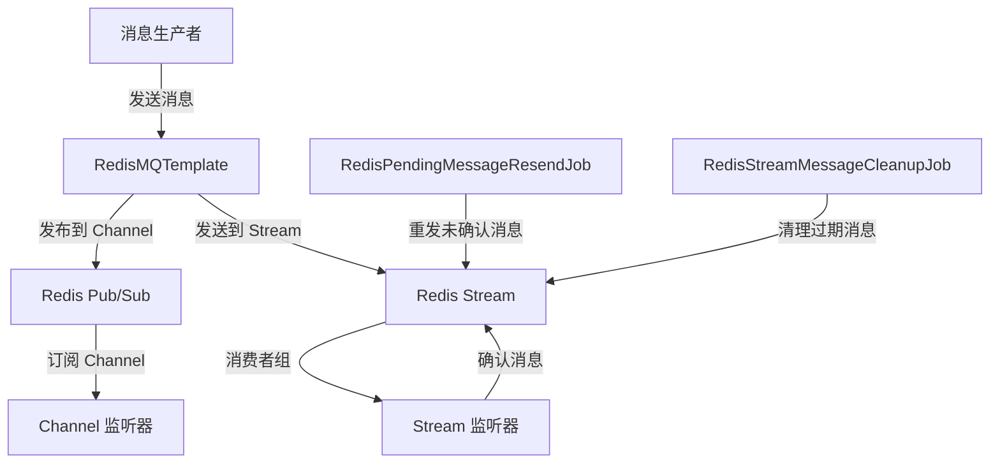

# config_7 模块文档

## 概述

`config_7` 模块是 Yudao Framework 中用于提供 Redis 消息队列（MQ）功能的核心模块之一。该模块基于 Redis 的发布/订阅（Pub/Sub）和 Redis Stream 两种机制，实现了轻量级的消息队列功能。

### 功能特性

- **发布/订阅模式**：支持基于 Redis Channel 的消息发布和订阅，适合简单的消息通知场景。
- **Stream 模式**：支持基于 Redis Stream 的消息队列，适合更复杂的消息处理场景，如消息持久化、消费者组、消息重试等。
- **消息拦截器**：支持在消息发送和消费前后添加拦截器，实现消息的预处理和后处理。
- **自动重发机制**：支持对未确认的消息进行自动重发，确保消息不丢失。
- **消息清理机制**：支持定期清理过期的消息，避免 Redis 存储空间无限增长。

### 模块结构

```
config_7
├── YudaoRedisMQProducerAutoConfiguration.java  # 生产者自动配置
├── YudaoRedisMQConsumerAutoConfiguration.java  # 消费者自动配置
├── RedisMQTemplate.java                       # Redis 消息队列模板
├── pubsub
│   ├── AbstractRedisChannelMessage.java       # Redis Channel 消息抽象类
│   ├── AbstractRedisChannelMessageListener.java # Redis Channel 消息监听器抽象类
│   └── ...
├── stream
│   ├── AbstractRedisStreamMessage.java        # Redis Stream 消息抽象类
│   ├── AbstractRedisStreamMessageListener.java # Redis Stream 消息监听器抽象类
│   └── ...
├── interceptor
│   └── RedisMessageInterceptor.java           # 消息拦截器接口
└── job
    ├── RedisPendingMessageResendJob.java      # 待处理消息重发任务
    └── RedisStreamMessageCleanupJob.java      # Stream 消息清理任务
```

## 架构设计

### 核心组件

#### 1. RedisMQTemplate

`RedisMQTemplate` 是消息队列的核心模板类，提供了消息的发送和接收功能。它封装了 Redis 的操作，并支持消息拦截器机制。

**主要功能：**
- 发送 Redis Channel 消息
- 发送 Redis Stream 消息
- 添加消息拦截器

**代码示例：**
```java
@AllArgsConstructor
public class RedisMQTemplate {

    @Getter
    private final RedisTemplate<String, ?> redisTemplate;
    @Getter
    private final List<RedisMessageInterceptor> interceptors = new ArrayList<>();

    public <T extends AbstractRedisChannelMessage> void send(T message) { ... }
    public <T extends AbstractRedisStreamMessage> RecordId send(T message) { ... }
    public void addInterceptor(RedisMessageInterceptor interceptor) { ... }
}
```

#### 2. AbstractRedisChannelMessageListener

`AbstractRedisChannelMessageListener` 是 Redis Channel 消息的监听器抽象类，用于处理基于 Channel 的消息。

**主要功能：**
- 订阅 Redis Channel
- 处理接收到的消息
- 支持消息拦截器

**代码示例：**
```java
public abstract class AbstractRedisChannelMessageListener<T extends AbstractRedisChannelMessage> implements MessageListener {
    private final Class<T> messageType;
    private final String channel;
    @Setter
    private RedisMQTemplate redisMQTemplate;

    public abstract void onMessage(T message);
}
```

#### 3. AbstractRedisStreamMessageListener

`AbstractRedisStreamMessageListener` 是 Redis Stream 消息的监听器抽象类，用于处理基于 Stream 的消息。

**主要功能：**
- 订阅 Redis Stream
- 处理接收到的消息
- 支持消费者组和消息确认机制

**代码示例：**
```java
public abstract class AbstractRedisStreamMessageListener<T extends AbstractRedisStreamMessage> {
    private final String streamKey;
    private final String group;
    @Setter
    private RedisMQTemplate redisMQTemplate;

    public abstract void onMessage(T message);
}
```

#### 4. RedisMessageInterceptor

`RedisMessageInterceptor` 是消息拦截器接口，用于在消息发送和消费前后添加处理逻辑。

**主要功能：**
- 在消息发送前处理
- 在消息发送后处理
- 在消息消费前处理
- 在消息消费后处理

**代码示例：**
```java
public interface RedisMessageInterceptor {
    default void sendMessageBefore(AbstractRedisMessage message) {}
    default void sendMessageAfter(AbstractRedisMessage message) {}
    default void consumeMessageBefore(AbstractRedisMessage message) {}
    default void consumeMessageAfter(AbstractRedisMessage message) {}
}
```

#### 5. RedisPendingMessageResendJob

`RedisPendingMessageResendJob` 是用于重发未确认消息的定时任务。

**主要功能：**
- 定期检查待处理的消息
- 重发超时未确认的消息
- 避免消息丢失

**代码示例：**
```java
@Slf4j
@AllArgsConstructor
public class RedisPendingMessageResendJob {
    private final List<AbstractRedisStreamMessageListener<?>> listeners;
    private final RedisMQTemplate redisTemplate;
    private final RedissonClient redissonClient;
    private final String resendLockKey;

    @Scheduled(cron = "35 * * * * ?")
    public void messageResend() { ... }
}
```

#### 6. RedisStreamMessageCleanupJob

`RedisStreamMessageCleanupJob` 是用于清理过期消息的定时任务。

**主要功能：**
- 定期清理 Stream 中的过期消息
- 避免 Redis 存储空间无限增长
- 保留最近的消息数量

**代码示例：**
```java
@Slf4j
@AllArgsConstructor
public class RedisStreamMessageCleanupJob {
    private final List<AbstractRedisStreamMessageListener<?>> listeners;
    private final RedisMQTemplate redisTemplate;
    private final RedissonClient redissonClient;
    private final String cleanupLockKey;

    @Scheduled(cron = "0 0 * * * ?")
    public void cleanup() { ... }
}
```

### 消息流转图



## 使用示例

### 1. 发送和接收 Channel 消息

**定义消息类：**
```java
public class MyChannelMessage extends AbstractRedisChannelMessage {
    private String content;

    // Getter 和 Setter
}
```

**发送消息：**
```java
@Autowired
private RedisMQTemplate redisMQTemplate;

public void sendMessage() {
    MyChannelMessage message = new MyChannelMessage();
    message.setContent("Hello, Redis Channel!");
    redisMQTemplate.send(message);
}
```

**接收消息：**
```java
@Component
public class MyChannelMessageListener extends AbstractRedisChannelMessageListener<MyChannelMessage> {
    @Override
    public void onMessage(MyChannelMessage message) {
        System.out.println("Received message: " + message.getContent());
    }
}
```

### 2. 发送和接收 Stream 消息

**定义消息类：**
```java
public class MyStreamMessage extends AbstractRedisStreamMessage {
    private String content;

    // Getter 和 Setter
}
```

**发送消息：**
```java
@Autowired
private RedisMQTemplate redisMQTemplate;

public void sendMessage() {
    MyStreamMessage message = new MyStreamMessage();
    message.setContent("Hello, Redis Stream!");
    redisMQTemplate.send(message);
}
```

**接收消息：**
```java
@Component
public class MyStreamMessageListener extends AbstractRedisStreamMessageListener<MyStreamMessage> {
    @Override
    public void onMessage(MyStreamMessage message) {
        System.out.println("Received message: " + message.getContent());
    }
}
```

### 3. 添加消息拦截器

**定义拦截器：**
```java
@Component
public class MyMessageInterceptor implements RedisMessageInterceptor {
    @Override
    public void sendMessageBefore(AbstractRedisMessage message) {
        System.out.println("Before sending message: " + message);
    }

    @Override
    public void consumeMessageAfter(AbstractRedisMessage message) {
        System.out.println("After consuming message: " + message);
    }
}
```

**注册拦截器：**
```java
@Bean
public RedisMQTemplate redisMQTemplate(StringRedisTemplate redisTemplate, List<RedisMessageInterceptor> interceptors) {
    RedisMQTemplate redisMQTemplate = new RedisMQTemplate(redisTemplate);
    interceptors.forEach(redisMQTemplate::addInterceptor);
    return redisMQTemplate;
}
```

## 配置说明

### 自动配置

`config_7` 模块提供了两个自动配置类：

1. **YudaoRedisMQProducerAutoConfiguration**：用于配置消息生产者。
2. **YudaoRedisMQConsumerAutoConfiguration**：用于配置消息消费者。

**示例配置：**
```java
@Slf4j
@AutoConfiguration(after = YudaoRedisAutoConfiguration.class)
public class YudaoRedisMQProducerAutoConfiguration {
    @Bean
    public RedisMQTemplate redisMQTemplate(StringRedisTemplate redisTemplate,
                                           List<RedisMessageInterceptor> interceptors) {
        RedisMQTemplate redisMQTemplate = new RedisMQTemplate(redisTemplate);
        interceptors.forEach(redisMQTemplate::addInterceptor);
        return redisMQTemplate;
    }
}
```

### 定时任务配置

- **RedisPendingMessageResendJob**：每分钟执行一次，用于重发未确认的消息。
- **RedisStreamMessageCleanupJob**：每小时执行一次，用于清理过期的消息。

**配置示例：**
```java
@Scheduled(cron = "35 * * * * ?")
public void messageResend() { ... }

@Scheduled(cron = "0 0 * * * ?")
public void cleanup() { ... }
```

## 依赖关系

### 核心依赖

- **Spring Data Redis**：用于与 Redis 进行交互。
- **Redisson**：用于分布式锁和定时任务。

### 与其他模块的关系

- **yudao-framework/yudao-spring-boot-starter-redis**：提供 Redis 的自动配置和操作模板。
- **yudao-framework/yudao-common**：提供通用的工具类和枚举。

## 最佳实践

### 1. 消息幂等性

为了确保消息的幂等性，建议在消费者端实现消息去重机制。例如，可以使用 Redis 的 Set 数据结构来存储已处理的消息 ID。

### 2. 消息序列化

建议使用 JSON 作为消息的序列化格式，以便于跨语言和跨平台的消息传递。

### 3. 消息监控

建议对消息的发送和消费进行监控，以便及时发现和处理异常情况。可以使用 Spring Boot Actuator 或其他监控工具。

### 4. 消息拦截器

可以通过消息拦截器实现消息的预处理和后处理，例如消息加密、解密、日志记录等。

## 常见问题

### 1. Redis 版本要求

`config_7` 模块要求 Redis 版本 >= 5.0.0，因为它使用了 Redis Stream 的功能。

### 2. 消息丢失

为了避免消息丢失，建议启用 Redis Stream 的消息重发机制和消费者组的消息确认机制。

### 3. 消息积压

如果消息积压严重，建议调整消费者的并发数量或增加消费者实例。同时，可以通过调整 `RedisStreamMessageCleanupJob` 的清理策略来控制消息的保留时间。

## 总结

`config_7` 模块提供了一个轻量级、高效的 Redis 消息队列解决方案，适用于各种消息通知和异步处理场景。通过灵活的配置和扩展机制，可以满足不同的业务需求。

---

**参考文档：**
- [Redis Pub/Sub 官方文档](https://redis.io/topics/pubsub)
- [Redis Stream 官方文档](https://redis.io/topics/streams-intro)
- [Redisson 官方文档](https://github.com/redisson/redisson/wiki)