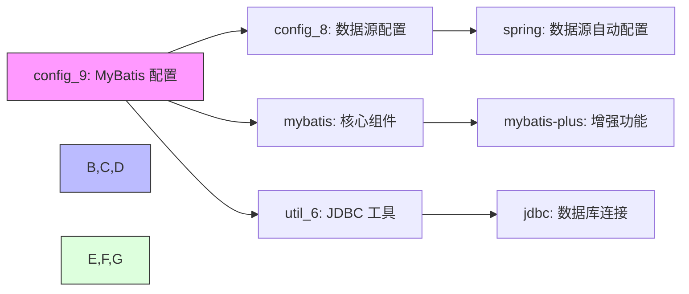
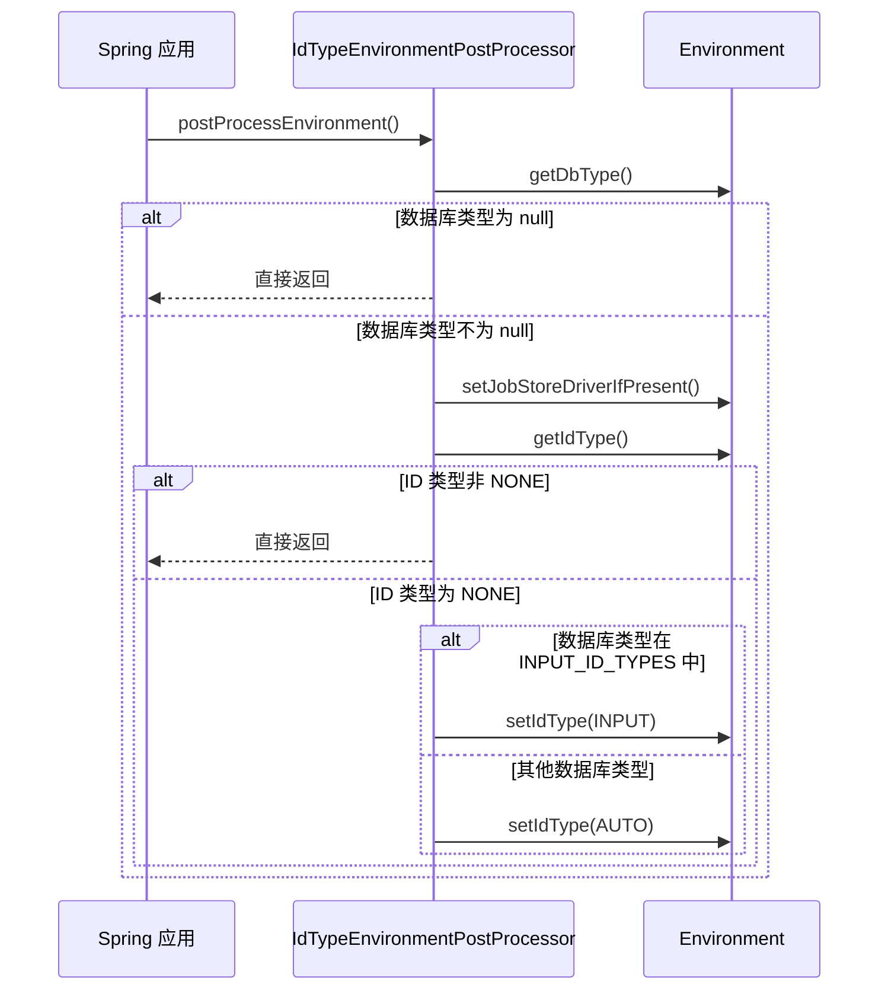
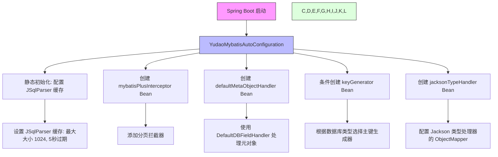

# config_9 模块文档

## 模块概述

config_9 模块是 Yudao 框架中 MyBatis 配置的核心模块，位于 `yudao-framework/yudao-spring-boot-starter-mybatis` 中。该模块主要提供 MyBatis-Plus 的自动配置和环境后处理器，用于根据不同的数据库类型自动配置主键生成策略和 Quartz 作业存储驱动。

该模块包含两个核心组件：
1. `IdTypeEnvironmentPostProcessor` - 环境后处理器，用于根据数据库类型动态调整 MyBatis-Plus 的主键生成策略
2. `YudaoMybatisAutoConfiguration` - MyBatis 自动配置类，负责配置 MyBatis-Plus 的各种组件

## 核心功能

### 1. 动态主键生成策略配置

`IdTypeEnvironmentPostProcessor` 根据应用使用的数据库类型自动调整 MyBatis-Plus 的主键生成策略（`id-type`）：

- 对于支持用户输入 ID 的数据库（Oracle, PostgreSQL, Kingbase ES, DB2, H2）：设置为 `INPUT`
- 对于其他数据库（MySQL, DM 达梦等）：设置为 `AUTO`（自增）

### 2. Quartz 作业存储驱动配置

自动根据数据库类型配置 Quartz 作业存储使用的合适驱动类：
- PostgreSQL: `org.quartz.impl.jdbcjobstore.PostgreSQLDelegate`
- Oracle/Oracle 12c: `org.quartz.impl.jdbcjobstore.oracle.OracleDelegate`
- SQL Server/SQL Server 2005: `org.quartz.impl.jdbcjobstore.MSSQLDelegate`
- DM/Kingbase ES: `org.quartz.impl.jdbcjobstore.StdJDBCDelegate`

### 3. MyBatis-Plus 组件配置

`YudaoMybatisAutoConfiguration` 配置了 MyBatis-Plus 的核心组件：
- 分页拦截器 (`PaginationInnerInterceptor`)
- 元对象处理器 (`MetaObjectHandler`) 用于自动填充字段
- 主键生成器 (`IKeyGenerator`) 根据数据库类型选择合适的实现
- Jackson 类型处理器配置

## 架构设计

以下是 config_9 模块的架构设计图：

```mermaid
graph TD
    A[config_9 模块] --> B[IdTypeEnvironmentPostProcessor]
    A --> C[YudaoMybatisAutoConfiguration]
    
    B --> D[动态主键策略配置]
    B --> E[Quartz 作业存储驱动配置]
    
    C --> F[MyBatis-Plus 拦截器配置]
    C --> G[元对象处理器配置]
    C --> H[主键生成器配置]
    C --> I[Jackson 类型处理器配置]
    
    D --> J[根据数据库类型选择 INPUT 或 AUTO]
    E --> K[根据数据库类型选择 Quartz 驱动]
    
    style A fill:#f9f,stroke:#333
    style B fill:#bbf,stroke:#333
    style C fill:#bbf,stroke:#333
    style D,E
    style F,G,H,I fill:#dfd,stroke:#333
    style J,K fill:#dfd,stroke:#333
```

## 依赖关系

config_9 模块与其他模块的依赖关系如下：



### 依赖说明

1. **config_8 (YudaoDataSourceAutoConfiguration)**: 提供数据源配置，config_9 通过读取数据源 URL 来确定数据库类型
2. **mybatis 核心组件**: 包含 BaseMapperX 等基础映射器
3. **util_6 (JdbcUtils)**: 用于从数据库 URL 中识别数据库类型
4. **mybatis-plus**: 提供增强的 MyBatis 功能，被 config_9 进行自定义配置
5. **spring**: 提供环境后处理器和自动配置机制

## 详细组件说明

### IdTypeEnvironmentPostProcessor

环境后处理器，在 Spring 应用环境准备阶段运行，用于动态调整 MyBatis-Plus 配置。

#### 主要方法

- `postProcessEnvironment`: 主入口方法，根据数据库类型调整 ID 类型和 Quartz 驱动
- `getIdType`: 从环境变量中读取当前的 ID 类型配置
- `setIdType`: 修改环境变量中的 ID 类型配置
- `setJobStoreDriverIfPresent`: 根据数据库类型设置 Quartz 作业存储驱动
- `getDbType`: 从动态数据源配置中获取主数据源的数据库类型

#### 工作流程



### YudaoMybatisAutoConfiguration

MyBatis 自动配置类，在 MyBatis-Plus 自动配置之前运行，以确保正确的组件扫描和配置。

#### 主要 Bean 定义

1. **mybatisPlusInterceptor**: 配置 MyBatis-Plus 拦截器，目前仅启用分页拦截器
2. **defaultMetaObjectHandler**: 自定义元对象处理器，用于字段自动填充（如创建时间、更新时间等）
3. **keyGenerator**: 根据数据库类型条件化地创建主键生成器（仅当 id-type=INPUT 时激活）
4. **jacksonTypeHandler**: 配置 Jackson 类型处理器的 ObjectMapper

#### 工作流程



## 与其他模块的关系

### 与 config_8 (数据源配置) 的关系

config_9 依赖 config_8 提供的数据源配置来确定数据库类型。具体来说，它读取 `spring.datasource.dynamic.primary.url` 属性来确定主数据源的类型。

有关数据源配置的详细信息，请参考 [config_8 文档](config_8.md)。

### 与 mybatis 核心组件的关系

config_9 配置的组件与 mybatis 模块中的核心组件协同工作：

- 配置的 `BaseMapperX` 映射器将使用自定义的主键生成策略
- 配置的元对象处理器将用于实体类的字段自动填充
- 配置的类型处理器将用于 JSON 字段的处理

有关 mybatis 核心组件的详细信息，请参考 [mybatis 文档](mybatis.md)。

## 配置属性

config_9 模块通过以下属性进行配置：

| 属性名 | 说明 | 默认值 |
|-------|------|--------|
| `yudao.info.base-package` | Mapper 扫描的基础包路径 | 必须配置 |
| `mybatis.lazy-initialization` | 是否启用 Mapper 懒加载（仅用于单元测试） | `false` |
| `mybatis-plus.global-config.db-config.id-type` | 主键生成策略（由 IdTypeEnvironmentPostProcessor 动态设置） | `NONE`（初始值） |
| `spring.datasource.dynamic.primary.url` | 主数据源 URL（用于判断数据库类型） | 必须配置 |
| `spring.quartz.properties.org.quartz.jobStore.driverDelegateClass` | Quartz 作业存储驱动类（由 IdTypeEnvironmentPostProcessor 可能设置） | 无初始值 |

## 使用指南

### 典型使用场景

1. **多数据源环境**: 当使用动态数据源时，config_9 会自动根据主数据源的类型调整主键生成策略
2. **跨数据库部署**: 应用可以在不同的数据库（MySQL、Oracle、PostgreSQL等）之间无缝切换，而无需手动修改 mybatis-plus 配置
3. **Quartz 集成**: 自动配置合适的 Quartz 作业存储驱动，避免因数据库类型不匹配导致的调度问题

### 配置示例

```yaml
# application.yml
yudao:
  info:
    base-package: com.example.myapp.mapper  # 设置 Mapper 扫描包

mybatis:
  lazy-initialization: false  # 生产环境保持 false

spring:
  datasource:
    dynamic:
      primary: master  # 主数据源标识
      datasource:
        master:
          url: jdbc:mysql://localhost:3306/myapp  # MySQL 示例
          # 或者
          # url: jdbc:oracle:thin:@localhost:1521:orcl  # Oracle 示例
          # 或者
          # url: jdbc:postgresql://localhost:5432/myapp  # PostgreSQL 示例
```

在上面的 MySQL 示例中，config_9 会自动将：
- `mybatis-plus.global-config.db-config.id-type` 设置为 `AUTO`
- `spring.quartz.properties.org.quartz.jobStore.driverDelegateClass` 设置为默认值（MySQL 使用 StdJDBCDelegate）

在 Oracle 示例中，config_9 会自动将：
- `mybatis-plus.global-config.db-config.id-type` 设置为 `INPUT`
- `spring.quartz.properties.org.quartz.jobStore.driverDelegateClass` 设置为 `org.quartz.impl.jdbcjobstore.jdbc.jobstore.oracle.OracleDelegate`

## 性能考虑

1. **启动时开销**: IdTypeEnvironmentPostProcessor 在应用启动时运行一次，开销可以忽略不计
2. **运行时开销**: 没有额外的运行时开销，所有决策都在启动时完成
3. **缓存使用**: YudaoMybatisAutoConfiguration 中的 JSqlParser 缓存设置为最大 1024 条目，5 秒过期，平衡了性能和内存使用

## 最佳实践

1. **确保数据源配置正确**: 为了让 IdTypeEnvironmentPostProcessor 正常工作，请确保 `spring.datasource.dynamic.primary.url` 被正确配置
2. **避免手动覆盖 ID 类型**: 除非有特殊需求，否则不要手动设置 `mybatis-plus.global-config.db-config.id-type`，让 config_9 自动处理
3. **单元测试注意事项**: 在单元测试中，如果需要使用懒加载的 Mapper，可以将 `mybatis.lazy-initialization` 设置为 `true`
4. **监控日志**: 启用 DEBUG 级别日志可以看到 config_9 的决策过程：
   ```
   [setIdType][修改 MyBatis Plus 的 idType 为(AUTO)]
   [setIdType][修改 MyBatis Plus 的 idType 为(INPUT)]
   ```

## 与相关模块的集成

### 与 config_10 (翻译配置) 的关系

虽然 config_9 和 config_10 都是 mybatis-starter 的一部分，但它们负责不同的方面：
- config_9: 负责核心 MyBatis 配置（主键策略、拦截器等）
- config_10: 负责翻译功能的自动配置

两者可以独立工作，但通常会一起使用以提供完整的 MyBatis 增强功能。

### 与缓存模块的关系

config_9 配置的 Jackson 类型处理器可以与缓存模块（如 config_15: YudaoCacheAutoConfiguration）协同工作，以实现高效的 JSON 数据缓存。

## 常见问题排查

### 问题: 主键生成策略没有被正确设置
**检查点**:
1. 确认 `spring.datasource.dynamic.primary.url` 已正确配置
2. 检查应用启动日志是否有 `[setIdType][修改 MyBatis Plus 的 idType 为(...)]` 信息
3. 确认没有其他地方手动覆盖了 `mybatis-plus.global-config.db-config.id-type` 属性

### 问题: Quartz 作业存储异常
**检查点**:
1. 确认应用启动日志是否有 Quartz 驱动设置的信息
2. 检查数据库类型是否被正确识别
3. 确认对应的数据库驱动是否已在 classpath 中

### 问题: Mapper 扫描不到
**检查点**:
1. 确认 `yudao.info.base-package` 配置正确指向包含 Mapper 接口的包
2. 确认 Mapper 接口正确使用了 `@Mapper` 注解
3. 检查是否有其他 MyBatis 配置冲突

## 未来改进方向

1. **支持更多数据库类型**: 目前支持的数据库类型有限，可以扩展到更多数据库如 SQLite、Sybase 等
2. **更细粒度的配置选项**: 允许用户在自动检测的基础上进行细粒度的自定义
3. **增强的日志记录**: 提供更详细的决策过程日志，便于故障排查
4. **配置验证**: 添加配置验证机制，在应用启动时检查关键配置的正确性

## 结论

config_9 模块为 Yudao 框架提供了智能的 MyBatis 配置能力，通过根据运行时数据库类型自动调整关键参数，显著减少了手动配置的需求，提高了应用在不同数据库环境之间的可移植性。其核心价值在于实现了“零配置”在多数据源环境下的 MyBatis-Plus 使用体验，同时保持了高度的灵活性和可扩展性。