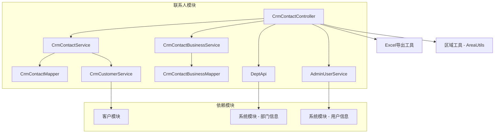
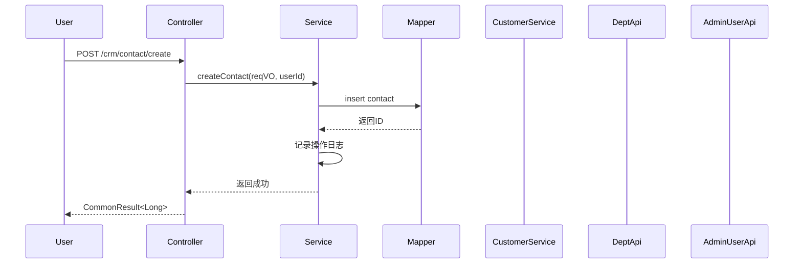
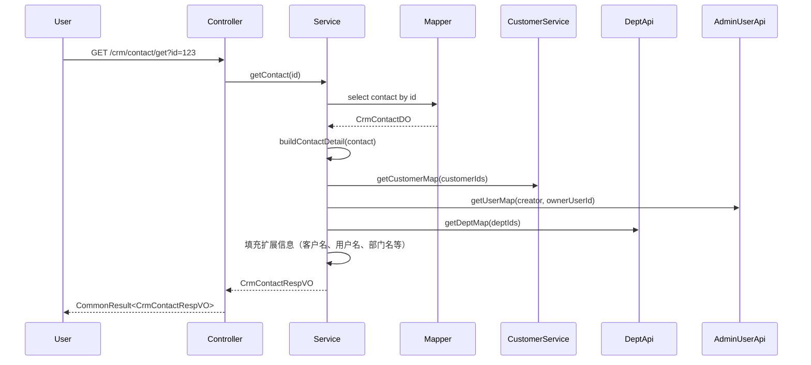
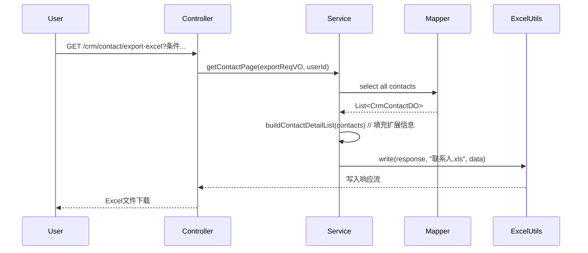
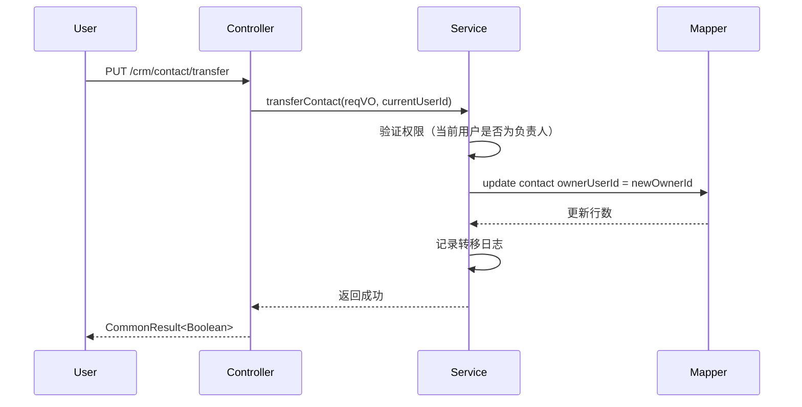

# 联系人模块 (Contact Module) 文档

## 1. 模块概述

联系人模块是 CRM（客户关系管理）系统中的核心模块之一，用于管理企业与客户相关的联系人信息。该模块提供了联系人的创建、查询、更新、删除、转移以及与商机关联等完整功能，支持按客户、商机等多种维度进行筛选和分页查询，并支持 Excel 数据导出。

## 2. 模块架构

### 2.1 整体架构

```
┌─────────────────────────────────────────────────────────────┐
│                    联系人模块 (Contact Module)              │
├─────────────────────────────────────────────────────────────┤
│  ┌─────────────┐    ┌─────────────┐    ┌─────────────┐     │
│  │  Controller │    │   Service   │    │   Mapper    │     │
│  │ CrmContact  │───▶│ CrmContact  │───▶│ CrmContact  │     │
│  │ Controller  │    │  Service    │    │  Mapper     │     │
│  └──────┬──────┘    └──────┬──────┘    └──────┬──────┘     │
│         │                 │                 │              │
│         ▼                 ▼                 ▼              │
│  ┌─────────────┐    ┌─────────────┐    ┌─────────────┐     │
│  │    VO       │    │    DO       │    │   Entity    │     │
│  │ (Request/  │    │ (DataObject)│    │ (Database)  │     │
│  │  Response)  │    └─────────────┘    └─────────────┘     │
│  └─────────────┘                                         │
│                                                           │
│  ┌──────────────────────────────────────────────────────┐  │
│  │  关联服务：CrmContactBusinessService                │  │
│  │  (联系人-商机关联管理)                              │  │
│  └──────────────────────────────────────────────────────┘  │
│                                                           │
│  ┌──────────────────────────────────────────────────────┐  │
│  │  依赖服务：CrmCustomerService, DeptApi, AdminUserApi  │  │
│  └──────────────────────────────────────────────────────┘  │
└─────────────────────────────────────────────────────────────┘
```

### 2.2 组件关系图



## 3. 核心组件说明

### 3.1 CrmContactController (控制器)

**文件路径**: `yudao-module-crm/src/main/java/cn/iocoder/yudao/module/crm/controller/admin/contact/CrmContactController.java`

**功能描述**: 联系人模块的 RESTful API 控制器，提供所有联系人相关的 HTTP 接口。

**接口列表**:

| 请求方法 | 接口路径 | 功能描述 | 权限标识 |
|---------|---------|---------|---------|
| POST | `/crm/contact/create` | 创建联系人 | `crm:contact:create` |
| PUT | `/crm/contact/update` | 更新联系人 | `crm:contact:update` |
| DELETE | `/crm/contact/delete` | 删除联系人 | `crm:contact:delete` |
| GET | `/crm/contact/get` | 获取联系人详情 | `crm:contact:query` |
| GET | `/crm/contact/simple-all-list` | 获取联系人精简列表 | `crm:contact:query` |
| GET | `/crm/contact/list-by-customer` | 按客户获取联系人列表 | `crm:contact:query` |
| GET | `/crm/contact/page` | 获取联系人分页列表 | `crm:contact:query` |
| GET | `/crm/contact/page-by-customer` | 按客户获取联系人分页 | `crm:contact:query` |
| GET | `/crm/contact/page-by-business` | 按商机获取联系人分页 | `crm:contact:query` |
| GET | `/crm/contact/export-excel` | 导出联系人 Excel | `crm:contact:export` |
| PUT | `/crm/contact/transfer` | 联系人转移 | `crm:contact:update` |
| POST | `/crm/contact/create-business-list` | 创建联系人-商机关联 | `crm:contact:create-business` |
| POST | `/crm/contact/create-business-list2` | 创建联系人-商机关联(批量) | `crm:contact:create-business` |
| DELETE | `/crm/contact/delete-business-list` | 删除联系人-商机关联 | `crm:contact:delete-business` |
| DELETE | `/crm/contact/delete-business-list2` | 删除联系人-商机关联(批量) | `crm:contact:delete-business` |

### 3.2 CrmContactService (服务层)

**文件路径**: `yudao-module-crm/src/main/java/cn/iocoder/yudao/module/crm/service/contact/CrmContactService.java` (接口)

**功能描述**: 联系人业务逻辑接口，定义了联系人操作的核心方法。

**核心方法**:

```java
public interface CrmContactService {
    
    /**
     * 创建联系人
     */
    Long createContact(CrmContactSaveReqVO reqVO, Long userId);
    
    /**
     * 更新联系人
     */
    void updateContact(CrmContactSaveReqVO reqVO);
    
    /**
     * 删除联系人
     */
    void deleteContact(Long id);
    
    /**
     * 获取联系人详情
     */
    CrmContactDO getContact(Long id);
    
    /**
     * 获取当前用户联系人列表
     */
    List<CrmContactDO> getContactList(Long userId);
    
    /**
     * 按客户ID获取联系人列表
     */
    List<CrmContactDO> getContactListByCustomerId(Long customerId);
    
    /**
     * 获取联系人分页
     */
    PageResult<CrmContactDO> getContactPage(CrmContactPageReqVO reqVO, Long userId);
    
    /**
     * 按客户ID获取联系人分页
     */
    PageResult<CrmContactDO> getContactPageByCustomerId(CrmContactPageReqVO reqVO);
    
    /**
     * 按商机ID获取联系人分页
     */
    PageResult<CrmContactDO> getContactPageByBusinessId(CrmContactPageReqVO reqVO);
    
    /**
     * 获取联系人Map
     */
    Map<Long, CrmContactDO> getContactMap(Set<Long> ids);
}
```

**实现类**: `CrmContactServiceImpl`

### 3.3 CrmContactBusinessService (业务关联服务)

**文件路径**: `yudao-module-crm/src/main/java/cn/iocoder/yudao/module/crm/service/contact/CrmContactBusinessService.java` (接口)

**功能描述**: 联系人与其他业务实体（主要是商机）的关联管理服务。

**核心方法**:

```java
public interface CrmContactBusinessService {
    
    /**
     * 创建联系人-商机关联
     */
    void createContactBusinessList(CrmContactBusinessReqVO reqVO);
    
    /**
     * 创建联系人-商机关联(批量)
     */
    void createContactBusinessList2(CrmContactBusiness2ReqVO reqVO);
    
    /**
     * 删除联系人-商机关联
     */
    void deleteContactBusinessList(CrmContactBusinessReqVO reqVO);
    
    /**
     * 删除联系人-商机关联(批量)
     */
    void deleteContactBusinessList2(CrmContactBusiness2ReqVO reqVO);
    
    /**
     * 联系人转移（更新负责人）
     */
    void transferContact(CrmContactTransferReqVO reqVO, Long currentUserId);
}
```

**实现类**: `CrmContactBusinessServiceImpl`

### 3.4 CrmContactDO (数据对象)

**文件路径**: `yudao-module-crm/src/main/java/cn/iocoder/yudao/module/crm/dal/dataobject/contact/CrmContactDO.java`

**功能描述**: 联系人数据库实体类，对应数据库表 `crm_contact`。

**字段说明**:

| 字段名 | 类型 | 描述 |
|-------|------|------|
| id | Long | 主键ID |
| name | String | 联系人姓名 |
| customerId | Long | 客户ID（外键） |
| areaId | Long | 地区ID |
| mobile | String | 手机号 |
| phone | String | 座机号 |
| email | String | 邮箱 |
| position | String | 职位 |
| creator | String | 创建人ID |
| ownerUserId | Long | 负责人ID |
| parentId | Long | 直属上级联系人ID |
| remark | String | 备注 |
| deleted | Boolean | 是否删除（软删除） |
| createTime | LocalDateTime | 创建时间 |
| updateTime | LocalDateTime | 更新时间 |

### 3.5 VO (视图对象)

#### 3.5.1 请求 VO

**CrmContactSaveReqVO**
- 用于创建和更新联系人的请求对象
- 包含所有联系人字段（除ID外）

**CrmContactPageReqVO**
- 用于分页查询的请求对象
- 包含查询条件：客户ID、商机ID、姓名、手机号等

**CrmContactBusinessReqVO / CrmContactBusiness2ReqVO**
- 用于联系人-商机关联的批量操作请求对象
- 包含联系人ID列表和商机ID列表

**CrmContactTransferReqVO**
- 用于联系人转移的请求对象
- 包含联系人ID和新的负责人ID

#### 3.5.2 响应 VO

**CrmContactRespVO**
- 联系人详情响应对象
- 包含扩展字段：客户名称、创建人名称、负责人名称、部门负责人名称、直属上级名称、地区名称等

## 4. 数据流分析

### 4.1 创建联系人流程



### 4.2 获取联系人详情流程



### 4.3 导出联系人 Excel 流程



### 4.4 联系人转移流程



## 5. 权限控制

联系人模块采用基于 Spring Security + 自定义权限注解的权限控制机制：

| 接口 | 权限注解 | 权限标识 |
|------|---------|---------|
| 创建 | `@PreAuthorize("@ss.hasPermission('crm:contact:create')")` | `crm:contact:create` |
| 更新 | `@PreAuthorize("@ss.hasPermission('crm:contact:update')")` | `crm:contact:update` |
| 删除 | `@PreAuthorize("@ss.hasPermission('crm:contact:delete')")` | `crm:contact:delete` |
| 查询 | `@PreAuthorize("@ss.hasPermission('crm:contact:query')")` | `crm:contact:query` |
| 导出 | `@PreAuthorize("@ss.hasPermission('crm:contact:export')")` | `crm:contact:export` |
| 关联商机 | `@PreAuthorize("@ss.hasPermission('crm:contact:create-business')")` | `crm:contact:create-business` |
| 删除关联 | `@PreAuthorize("@ss.hasPermission('crm:contact:delete-business')")` | `crm:contact:delete-business` |

权限检查通过 `@ss.hasPermission('xxx')` 注解实现，由系统模块的权限服务提供。

## 6. 模块依赖关系

### 6.1 依赖模块

| 模块 | 依赖组件 | 用途 |
|------|---------|------|
| **系统模块** | `DeptApi` | 获取部门信息，用于显示部门负责人所属部门 |
| **系统模块** | `AdminUserApi` | 获取用户信息，用于显示创建人、负责人昵称 |
| **客户模块** | `CrmCustomerService` | 获取客户信息，用于显示客户名称 |
| **IP模块** | `AreaUtils` | 地区ID转换为地区名称 |
| **Excel模块** | `ExcelUtils` | Excel文件导出 |
| **APILog模块** | `@ApiAccessLog` | 记录操作日志 |

### 6.2 被依赖模块

| 模块 | 依赖方 | 用途 |
|------|--------|------|
| **前端UI** | 多个VO对象 | Vue.js前端调用API |
| **统计模块** | 联系人数据 | 客户统计、业绩统计等 |

## 7. 前端对接

联系人模块为前端提供以下 API 接口（Vue.js 前端调用）：

| API 路径 | 前端调用文件 | 说明 |
|---------|-------------|------|
| `/crm/contact/create` | `src/api/crm/contact/index.ts` | 创建联系人 |
| `/crm/contact/update` | `src/api/crm/contact/index.ts` | 更新联系人 |
| `/crm/contact/delete` | `src/api/crm/contact/index.ts` | 删除联系人 |
| `/crm/contact/get` | `src/api/crm/contact/index.ts` | 获取联系人详情 |
| `/crm/contact/page` | `src/api/crm/contact/index.ts` | 分页查询联系人 |
| `/crm/contact/export-excel` | `src/api/crm/contact/index.ts` | 导出联系人Excel |
| `/crm/contact/transfer` | `src/api/crm/contact/index.ts` | 联系人转移 |
| `/crm/contact/create-business-list` | `src/api/crm/contact/index.ts` | 关联商机 |

## 8. 异常处理

联系人模块的异常处理遵循框架统一异常处理机制：

1. **参数校验异常**: 使用 `@Valid` 注解，校验失败返回 `400 Bad Request`
2. **权限不足**: 使用 `@PreAuthorize`，权限不足返回 `403 Forbidden`
3. **数据不存在**: 查询时数据不存在，返回 `404 Not Found`
4. **业务异常**: 如转移联系人时当前用户不是负责人，抛出自定义异常返回 `500`

## 9. 扩展功能

### 9.1 联系人关联商机

联系人可以与多个商机建立关联关系，通过 `CrmContactBusinessService` 管理：

- **创建关联**: `createContactBusinessList` / `createContactBusinessList2`
- **删除关联**: `deleteContactBusinessList` / `deleteContactBusinessList2`

关联关系存储在中间表 `crm_contact_business` 中，实现联系人和商机的多对多关系。

### 9.2 联系人转移

支持联系人负责人的转移，通过 `transferContact` 方法实现：

- 验证当前用户是否为原负责人
- 更新联系人的 `ownerUserId` 字段
- 记录操作日志

### 9.3 数据导出

支持将联系人数据导出为 Excel 文件，包含：

- 联系人基本信息（姓名、客户、地区、手机、邮箱等）
- 关联信息（客户名称、创建人名称、负责人名称、部门负责人名称、直属上级名称）

## 10. 性能优化

1. **批量查询**: 在构建联系人详情时，使用批量查询客户、用户、部门信息，避免 N+1 查询问题
2. **Map缓存**: 使用 Map 缓存查询结果，减少重复数据库查询
3. **精简查询**: 精简列表接口只返回必要字段（id、name、customerId）
4. **分页查询**: 大数据量时使用分页查询，避免内存溢出

## 11. 参考文档

- [客户模块文档](customer.md) - 联系人所属的客户模块
- [系统模块文档](system.md) - 用户和部门权限系统
- [权限系统设计文档](permission.md) - 权限控制机制说明
- [Excel导出工具文档](excel-utility.md) - Excel导出功能说明
