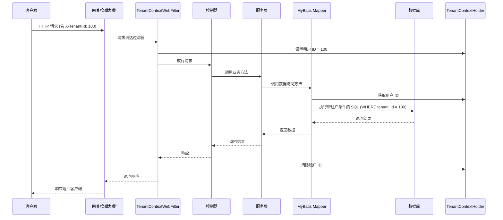
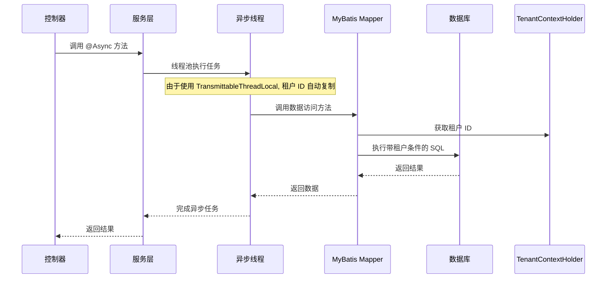

# Tenant Context Module Documentation

## 概述

Tenant Context 模块是 Yudao 框架中多租户功能的核心组件，负责在应用程序运行期间存储和管理当前租户的标识。通过使用 `ThreadLocal` 变量（具体为 `TransmittableThreadLocal` 以支持线程间传播），该模块确保租户信息在同一线程及其子线程中可访问，从而在数据访问、消息传递和任务执行等各个层面实现租户隔离。

## 核心功能

### TenantContextHolder

`TenantContextHolder` 是租户上下文的主要实现类，提供以下静态方法来操作租户标识和忽略标志：

- `getTenantId()`：获取当前线程绑定的租户 ID。如果未设置，则返回 `null`。
- `getRequiredTenantId()`：获取当前租户 ID，如果未设置则抛出 `NullPointerException` 异常，并提示查看租户文档。
- `setTenantId(Long tenantId)`：设置当前线程的租户 ID。
- `setIgnore(Boolean ignore)`：设置当前线程是否忽略租户隔离（用于特殊场景如系统初始化或管理员操作）。
- `isIgnore()`：检查当前线程是否处于忽略租户状态。
- `clear()`：清除当前线程的租户 ID 和忽略标志。

该类使用 `TransmittableThreadLocal` 来确保在使用线程池或异步框架时，租户上下文能够正确传播到子线程。

### TenantUtils

`TenantUtils` 提供了一系列工具方法，以便在特定租户上下文中执行业务逻辑：

- `execute(Long tenantId, Runnable runnable)`：在指定租户 ID 下执行给定的 Runnable 逻辑。执行前会保存当前租户状态，执行后恢复。
- `execute(Long tenantId, Callable<V> callable)`：类似以上，但支持返回值。
- `executeIgnore(Runnable runnable)`：在忽略租户状态下执行给定的 Runnable 逻辑。
- `executeIgnore(Callable<V> callable)`：类似以上，但支持返回值。
- `addTenantHeader(Map<String, String> headers, Long tenantId)`：将租户 ID 添加到 HTTP 请求头中，用于跨服务传播。

这些方法确保了租户上下文的安全切换和自动恢复，防止因上下文泄漏导致的数据错乱。

## 架构与组件关系

租户上下文模块与 Yudao 框架的其他部分紧密集成，以实现全链路的租户隔离。以下是其主要集成点：

### 1. 自动配置 (`YudaoTenantAutoConfiguration`)

租户功能通过 Spring Boot 的自动配置机制启用。主要配置包括：

- **租户框架服务 (`TenantFrameworkService`)**：提供租户相关的业务操作接口。
- **租户忽略切面 (`TenantIgnoreAspect`)**：通过 AOP 实现对标注 `@TenantIgnore` 的方法自动切换到忽略租户状态。
- **MyBatis 拦截器 (`TenantLineInnerInterceptor`)**：在 SQL 执行前自动注入租户 ID 条件，实现数据层的租户隔离。
- **Web 过滤器 (`TenantContextWebFilter`)**：从 HTTP 请求头中读取租户 ID 并设置到 `TenantContextHolder`。
- **安全过滤器 (`TenantSecurityWebFilter`)**：在 Spring Security 过滤链中处理租户相关的安全逻辑。
- **租户访问上下文拦截器 (`TenantVisitContextInterceptor`)**：在 MVC 拦截器中处理租户访问日志或统计。
- **租户感知 Redis 缓存管理器 (`tenantRedisCacheManager`)**：确保缓存键包含租户 ID，防止跨租户缓存污染。
- **租户作业切面 (`TenantJobAspect`)**：在 Quartz 作业执行前后管理租户上下文。
- **消息队列拦截器**：
  - Kafka：`TenantKafkaProducerInterceptor` 在生产者端添加租户 ID 到消息头。
  - Redis/RabbitMQ/RocketMQ：通过相应的配置类提供拦截器，在消息发送/处理时传播租户 ID。

### 2. 消息传播

为了在微服务或分布式系统中保持租户上下文的一致性，租户 ID 会通过以下方式传播：

- **HTTP 请求**：通过 `TenantContextWebFilter` 从请求头（默认 `X-Tenant-Id`）读取租户 ID。
- **消息队列**：
  - Kafka：生产者拦截器将租户 ID 添加到消息头；消费者端通过消费者配置（未在提供的代码中显示，但通常对应存在）读取并设置租户 ID。
  - 其他 MQ（Redis、RabbitMQ、RocketMQ）：类似地，通过拦截器在发送时添加租户 ID，在消费时读取并设置。
- **Spring 消息处理**：`InvocableHandlerMethod` 的自定义实现（在租户模块中扩展或使用）会从消息头解析租户 ID，并使用 `TenantUtils.execute` 在租户上下文中调用目标方法。

### 3. 异步与线程传播

由于使用了 `TransmittableThreadLocal`，租户上下文能够自动传播到：

- 通过 `ThreadPoolExecutor` 创建的子线程。
- Spring 的 `@Async` 方法。
- 消息队列的监听器线程（前提是消费者端也使用了相应的传播机制）。

## 与其他模块的关系

租户上下文模块是 Yudao 框架中租户功能的基础，其他租户相关模块（如租户服务、租户拦截器等）均依赖于它来获取当前租户信息。例如：

- **租户服务 (`TenantServiceImpl`)**：可能会调用 `TenantContextHolder.getTenantId()` 来获取当前租户 ID 进行业务操作。
- **租户忽略切面**：依赖 `TenantContextHolder.setIgnore(true)` 和 `setIgnore(false)` 来临时切换状态。
- **数据访问层**：通过 MyBatis 拦截器自动在 SQL 中添加 `tenant_id = ?` 条件，其中 `?` 的值来自 `TenantContextHolder.getTenantId()`。

在文档中，为了避免重复，我们引用其他模块的详细说明而不展开。例如：

- 有关租户在 MyBatis 中的实现细节，请参考 [租户数据访问模块](tenant-data-access.md)（假设文档名）。
- 有关租户在 Web 层的过滤器实现，请参考 [租户 Web 配置模块](tenant-web-config.md)。
- 有关租户在消息队列中的传播机制，请参考 [租户消息队列集成](tenant-mq-integration.md)。

## 数据流示例

以下是一个典型的 HTTP 请求租户上下文传播流程：



在异步场景中，租户上下文会自动传播：



## 配置说明

租户功能的行为可以通过以下配置项调整（位于 `application.yml` 或 `application.properties`）：

```yaml
yudao:
  tenant:
    enable: true          # 是否启用多租户功能，默认为 true
    ignoreVisitUrls:      # 指定不需要租户上下文的 URL 路径（如登录、公开接口）
      - /api/**/login
      - /api/**/public/**
    ignoreCaches:         # 指定不需要租户隔离的缓存名称（如系统字典缓存）
      - sys_dict
    # 其他租户相关配置...
```

## 最佳实践

1. **始终在边界处设置租户 ID**：在进入系统的边界（如 HTTP 请求、消费消息）设置租户 ID，并在处理完成后清除。
2. **使用工具方法切换上下文**：当需要临时以不同租户 ID 执行操作时，使用 `TenantUtils.execute` 方法，以确保上下文正确恢复。
3. **谨慎使用忽略租户**：仅在系统级操作（如初始化、管理任务）中使用 `TenantUtils.executeIgnore`，避免在业务中误用导致数据安全风险。
4. **确保消息队列传播**：在使用消息队列时，确保生产者和消费者端都配置了租户 ID 的传播机制（如拦截器或头部解析）。
5. **监控租户 ID 泄漏**：在开发和测试阶段，可以添加日志或拦截器来检查租户 ID 是否在不应传播的线程中被错误访问。

## 结论

Tenant Context 模块通过 `TenantContextHolder` 提供了一个简单而强大的机制来管理多租户环境下的租户状态。其与 Spring 框架的深度集成（通过自动配置、AOP、过滤器和拦截器）以及对异步和消息传播的支持，使得租户隔离能够在应用程序的各个层面无缝实现。开发者只需关注业务逻辑，而租户上下文的传播和恢复由框架自动处理，从而显著降低了多租户系统的开发复杂度。