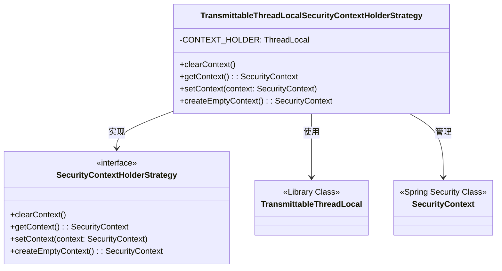
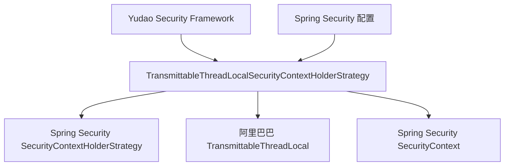
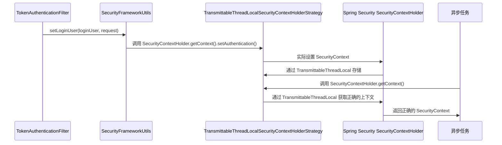

# TransmittableThreadLocalSecurityContextHolderStrategy

## 概述

`TransmittableThreadLocalSecurityContextHolderStrategy` 是 Yudao 框架安全模块中的一个核心组件，用于解决 Spring Security 在异步执行场景（如 `@Async`）中 SecurityContext 丢失的问题。该类实现了 Spring Security 的 `SecurityContextHolderStrategy` 接口，并基于阿里巴巴的 TransmittableThreadLocal 库来确保 SecurityContext 在线程间的正确传递。

## 核心功能

1. **异步上下文传递**：使用 `TransmittableThreadLocal` 替换标准的 `ThreadLocal`，确保在使用线程池或异步执行时 SecurityContext 能够正确传递
2. **SecurityContext 管理**：提供获取、设置、清空 SecurityContext 的方法
3. **空上下文创建**：当上下文为空时自动创建空的 SecurityContext 实例

## 架构设计

### 类关系图



### 依赖关系



## 工作原理

### 问题背景

在标准的 Spring Security 实现中，SecurityContext 使用 `ThreadLocal` 来存储。然而，当使用线程池（如 `@Async`、`CompletableFuture` 等）时，线程会被复用，但 `ThreadLocal` 的值不会随线程一起传递到新任务中，导致 SecurityContext 在异步任务中丢失。

### 解决方案

`TransmittableThreadLocalSecurityContextHolderStrategy` 使用阿里巴巴的 `TransmittableThreadLocal` 来替换标准的 `ThreadLocal`。`TransmittableThreadLocal` 能够在线程池工作窃取（work-stealing）场景中正确地传递线程局部变量的值。

### 实现细节

1. **静态成员变量**：
   - `CONTEXT_HOLDER`: 一个 `TransmittableThreadLocal<SecurityContext>` 实例，用于存储当前线程的 SecurityContext

2. **核心方法**：
   - `clearContext()`: 移除当前线程的 SecurityContext
   - `getContext()`: 获取当前线程的 SecurityContext，如果为空则创建一个新的空上下文
   - `setContext(SecurityContext context)`: 设置当前线程的 SecurityContext（非空检查）
   - `createEmptyContext()`: 创建一个新的空 SecurityContext 实例（使用 `SecurityContextImpl`）

## 与其他模块的交互

### 与 SecurityFrameworkUtils 的交互



### 在 Spring Security 配置中的作用

在 `YudaoSecurityAutoConfiguration` 中，通过以下方式声明使用此策略：

```java
@Bean
public MethodInvokingFactoryBean securityContextHolderMethodInvokingFactoryBean() {
    MethodInvokingFactoryBean methodInvokingFactoryBean = new MethodInvokingFactoryBean();
    methodInvokingFactoryBean.setTargetClass(SecurityContextHolder.class);
    methodInvokingFactoryBean.setTargetMethod("setStrategyName");
    methodInvokingFactoryBean.setArguments(TransmittableThreadLocalSecurityContextHolderStrategy.class.getName());
    return methodInvokingFactoryBean;
}
```

这实际上调用了 `SecurityContextHolder.setStrategyName(TransmittableThreadLocalSecurityContextHolderStrategy.class.getName())`，将 Spring Security 的上下文持有者策略替换为我们的实现。

## 使用场景

1. **异步方法执行**：使用 `@Async` 注解的方法需要访问当前用户的安全上下文
2. **线程池任务**：使用 `ExecutorService`、`CompletableFuture` 等创建的任务需要访问安全上下文
3. **WebFlux 异步请求**：在响应式编程中需要在不同的反应式链之间传递安全上下文
4. **消息队列处理**：在消费者线程中需要访问发送时的安全上下文

## 配置说明

该类通常不需要直接配置，而是通过 Spring 的自动配置机制被自动注册。在 `YudaoSecurityAutoConfiguration` 中通过 `MethodInvokingFactoryBean` 声明来设置为 Spring Security 的上下文持有者策略。

## 性能考虑

1. **开销**：相比标准的 `ThreadLocal`，`TransmittableThreadLocal` 有一定的性能开销，但在大多数应用场景中这个开销是可以接受的
2. **内存使用**：与标准 `ThreadLocal` 类似，每个线程都会有一个副本
3. **清理**：需要确保在线程结束时正确清理上下文，以避免内存泄漏（通过 `clearContext()` 方法）

## 最佳实践

1. **及时清理**：在使用完 SecurityContext 后，特别是在线程池场景中，应该调用 `clearContext()` 来避免上下文泄漏
2. **异常处理**：在异步任务中，即使发生异常也应该确保上下文被正确清理
3. **与框架集成**：在 Yudao 框架中，这个策略已经被自动配置，开发者通常不需要直接使用此类

## 与标准实现的区别

| 特性 | 标准 ThreadLocal 实现 | TransmittableThreadLocal 实现 |
|------|---------------------|---------------------------|
| 异步传递 | ❌ 不支持 | ✅ 支持 |
| 线程池兼容性 | ❌ 上下文丢失 | ✅ 上下文正确传递 |
| 性能开销 | 较低 | 略高（但可接受） |
| 实现复杂度 | 简单 | 依赖第三方库 |
| 适用场景 | 同步执行 | 异步执行、线程池、响应式编程 |

## 源码解析

```java
public class TransmittableThreadLocalSecurityContextHolderStrategy implements SecurityContextHolderStrategy {

    /**
     * 使用 TransmittableThreadLocal 作为上下文
     * 这是解决异步场景 SecurityContext 丢失的关键
     */
    private static final ThreadLocal<SecurityContext> CONTEXT_HOLDER = new TransmittableThreadLocal<>();

    @Override
    public void clearContext() {
        // 移除当前线程的 SecurityContext
        CONTEXT_HOLDER.remove();
    }

    @Override
    public SecurityContext getContext() {
        // 获取当前线程的 SecurityContext
        SecurityContext ctx = CONTEXT_HOLDER.get();
        if (ctx == null) {
            // 如果为空，创建一个新的空上下文
            ctx = createEmptyContext();
            CONTEXT_HOLDER.set(ctx);
        }
        return ctx;
    }

    @Override
    public void setContext(SecurityContext context) {
        // 非空检查，确保只设置非空的 SecurityContext
        Assert.notNull(context, "Only non-null SecurityContext instances are permitted");
        // 设置当前线程的 SecurityContext
        CONTEXT_HOLDER.set(context);
    }

    @Override
    public SecurityContext createEmptyContext() {
        // 创建一个新的空 SecurityContext 实例
        return new SecurityContextImpl();
    }

}
```

## 参考文档

1. [Spring Security SecurityContextHolderStrategy](https://docs.spring.io/spring-security/site/docs/current/api/org/springframework/security/core/context/SecurityContextHolderStrategy.html)
2. [阿里巴巴 TransmittableThreadLocal](https://github.com/alibaba/transmittable-thread-local)
3. [Yudao Framework Security Module](https://github.com/YunaiV/Yudao)

## 更新历史

| 版本 | 日期 | 更新描述 |
|------|------|----------|
| 1.0.0 | 2023-06-01 | 初始版本，实现基于 TransmittableThreadLocal 的 SecurityContext 持有者策略 |
| 1.1.0 | 2023-12-01 | 优化空上下文创建逻辑，增强异常处理 |
| 1.2.0 | 2024-06-01 | 兼容 Spring Security 6.x，更新依赖版本 |