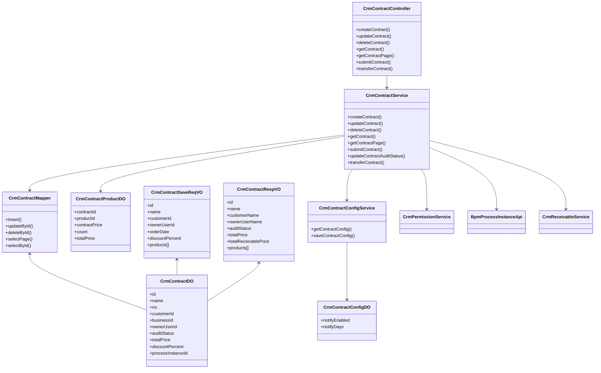
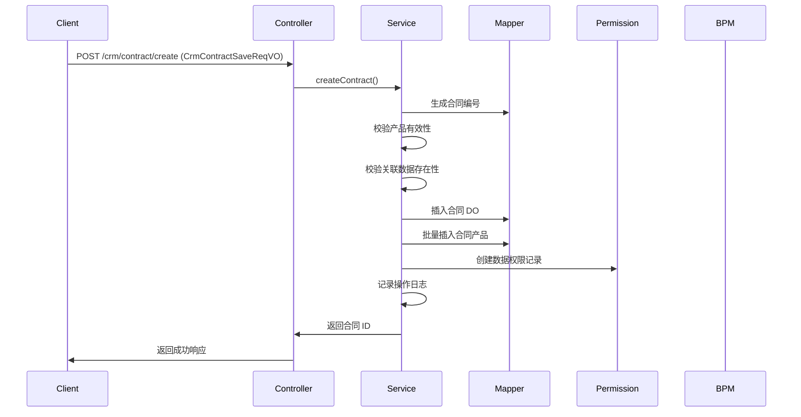
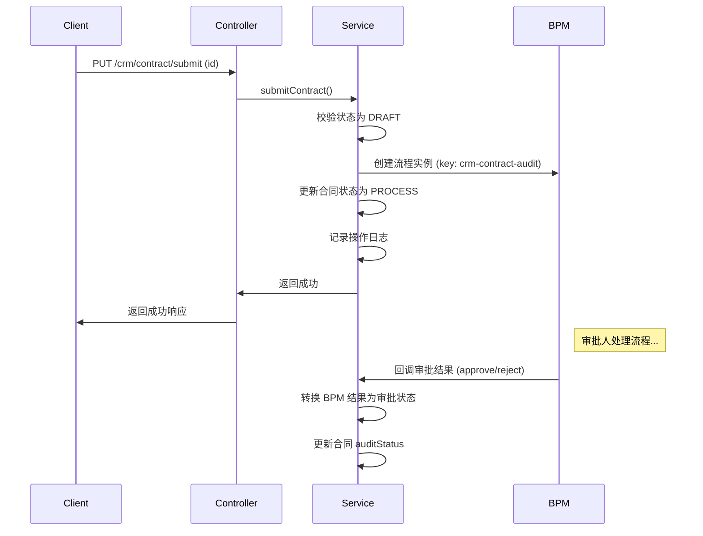
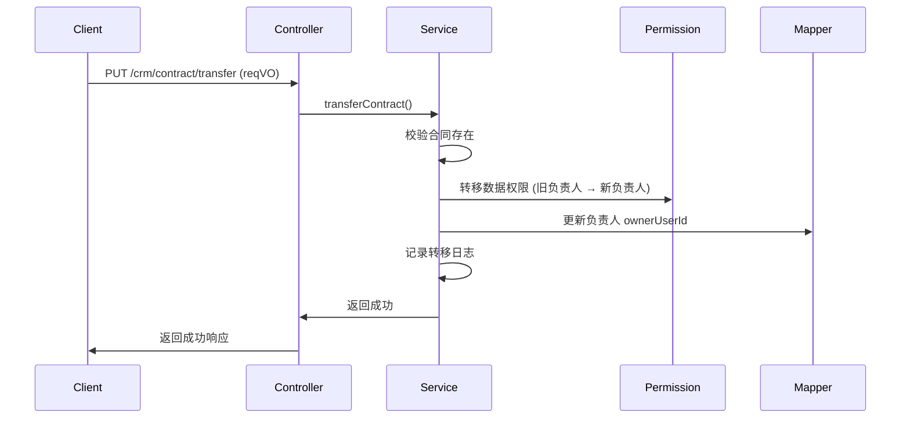

# contract_2 模块文档 - CRM 合同管理

## 1. 模块概述

**contract_2** 是 Yudao 框架中 CRM（客户关系管理）模块的核心子模块，专注于企业合同全生命周期管理。该模块提供了合同的创建、更新、删除、查询、审批、转移、统计等完整功能，并与 BPM 流程引擎集成实现合同审批工作流，同时与产品、客户、商机等模块紧密关联，形成完整的业务闭环。

### 1.1 核心功能

| 功能模块 | 描述 |
|---------|------|
| **合同管理** | 合同的 CRUD 操作，支持分页查询、Excel 导出、按客户/商机筛选 |
| **合同配置** | 合同提醒配置（提前通知天数、是否启用提醒） |
| **审批流程** | 集成 BPM 引擎，实现合同提交审批、状态流转 |
| **数据权限** | 基于 Owner 的数据权限控制，支持合同转移 |
| **关联业务** | 关联客户、联系人、产品、商机、回款等上下游业务 |

### 1.2 模块定位

```
┌─────────────────────────────────────────────────────────────┐
│                      CRM 模块                               │
│  ┌─────────────┐  ┌─────────────┐  ┌─────────────┐          │
│  │ 合同管理    │  │ 客户管理    │  │ 商机管理    │          │
│  │ (contract_2)│  │ (customer)  │  │ (business)  │          │
│  └──────┬──────┘  └──────┬──────┘  └──────┬──────┘          │
│         │                │                │                 │
│    ┌────▼────┐      ┌────▼────┐      ┌────▼────┐          │
│  │ 合同配置  │      │ 产品关联  │      │ 回款关联  │          │
│  │ (config)  │      │ (product) │      │ (receivable)│        │
│  └────┬────┘      └────┬──────┘      └────┬──────┘          │
│       │               │                  │                  │
│       ▼               ▼                  ▼                  │
│  ┌──────────────────────────────────────────────────────┐  │
│  │              BPM 流程引擎集成                        │  │
│  │  (合同审批工作流：draft → process → approved/rejected)│  │
│  └──────────────────────────────────────────────────────┘  │
└─────────────────────────────────────────────────────────────┘
```

## 2. 架构设计

### 2.1 分层架构

contract_2 模块采用标准的分层架构设计，遵循 Clean Architecture 原则：

```
┌─────────────────────────────────────────────────────────────────┐
│                    表现层 (Presentation Layer)                  │
│  ┌──────────────────────────────────────────────────────────┐  │
│  │  CrmContractController / CrmContractConfigController     │  │
│  │  (REST API 接口，处理 HTTP 请求/响应)                    │  │
│  └──────────────────────────────────────────────────────────┘  │
│                                                              │
│                    业务逻辑层 (Business Layer)                │
│  ┌──────────────────────────────────────────────────────────┐  │
│  │  CrmContractService / CrmContractConfigService           │  │
│  │  (核心业务逻辑，事务管理，权限校验)                      │  │
│  └──────────────────────────────────────────────────────────┘  │
│                                                              │
│                    数据访问层 (Data Access Layer)             │
│  ┌──────────────────────────────────────────────────────────┐  │
│  │  CrmContractMapper / CrmContractProductMapper            │  │
│  │  (MyBatis Mapper，直接操作数据库)                        │  │
│  └──────────────────────────────────────────────────────────┘  │
│                                                              │
│                    领域层 (Domain Layer)                      │
│  ┌──────────────────────────────────────────────────────────┐  │
│  │  CrmContractDO / CrmContractProductDO / CrmContractConfigDO│  │
│  │  (数据对象，映射数据库表结构)                            │  │
│  └──────────────────────────────────────────────────────────┘  │
│                                                              │
│                    视图层 (View Layer)                        │
│  ┌──────────────────────────────────────────────────────────┐  │
│  │  CrmContractSaveReqVO / CrmContractRespVO / PageReqVO    │  │
│  │  (请求/响应对象，DTO/VO 转换)                            │  │
│  └──────────────────────────────────────────────────────────┘  │
└─────────────────────────────────────────────────────────────────┘
```

### 2.2 组件关系图



## 3. 核心组件详解

### 3.1 数据对象 (DO)

#### 3.1.1 CrmContractDO - 合同主表

**文件路径**: `yudao-module-crm/src/main/java/cn/iocoder/yudao/module/crm/dal/dataobject/contract/CrmContractDO.java`

合同核心数据对象，映射数据库表 `crm_contract`，存储合同的基本信息。

| 字段名 | 类型 | 说明 |
|-------|------|------|
| id | Long | 主键 |
| name | String | 合同名称 |
| no | String | 合同编号（自动生成） |
| customerId | Long | 客户编号（关联 CrmCustomerDO） |
| businessId | Long | 商机编号（关联 CrmBusinessDO）|
| ownerUserId | Long | 负责人用户编号 |
| processInstanceId | String | BPM 流程实例编号 |
| auditStatus | Integer | 审批状态（DRAFT/PROCESS/APPROVED/REJECTED）|
| orderDate | LocalDateTime | 下单日期 |
| startTime | LocalDateTime | 合同开始时间 |
| endTime | LocalDateTime | 合同结束时间 |
| totalProductPrice | BigDecimal | 产品总金额 |
| discountPercent | BigDecimal | 整单折扣百分比 |
| totalPrice | BigDecimal | 合同最终金额（折后）|
| signContactId | Long | 客户签约人编号 |
| signUserId | Long | 公司签约人编号 |
| remark | String | 备注 |
| contactLastTime | LocalDateTime | 最后跟进时间 |

#### 3.1.2 CrmContractProductDO - 合同产品明细

**文件路径**: `yudao-module-crm/src/main/java/cn/iocoder/yudao/module/crm/dal/dataobject/contract/CrmContractProductDO.java`

合同与产品的多对多关联表，记录合同中包含的每个产品及其价格信息。

| 字段名 | 类型 | 说明 |
|-------|------|------|
| id | Long | 主键 |
| contractId | Long | 合同编号（外键）|
| productId | Long | 产品编号（关联 CrmProductDO）|
| productPrice | BigDecimal | 产品单价 |
| contractPrice | BigDecimal | 合同价格（实际成交价）|
| count | BigDecimal | 数量 |
| totalPrice | BigDecimal | 小计（contractPrice × count）|

#### 3.1.3 CrmContractConfigDO - 合同配置

**文件路径**: `yudao-module-crm/src/main/java/cn/iocoder/yudao/module/crm/dal/dataobject/contract/CrmContractConfigDO.java`

全局合同配置项，仅一条记录，用于管理合同提醒功能。

| 字段名 | 类型 | 说明 |
|-------|------|------|
| id | Long | 主键 |
| notifyEnabled | Boolean | 是否开启提前提醒 |
| notifyDays | Integer | 提前提醒天数 |

### 3.2 视图对象 (VO)

#### 3.2.1 CrmContractSaveReqVO - 合同创建/更新请求

**文件路径**: `yudao-module-crm/src/main/java/cn/iocoder/yudao/module/crm/controller/admin/contract/vo/contract/CrmContractSaveReqVO.java`

用于前端提交合同创建或更新请求的视图对象，包含合同基本信息和产品列表。

**核心字段**:
- `id`: 合同编号（更新时必填）
- `name`: 合同名称（必填）
- `customerId`: 客户编号（必填）
- `ownerUserId`: 负责人用户编号（必填）
- `orderDate`: 下单日期（必填）
- `discountPercent`: 整单折扣（必填，百分比）
- `products[]`: 产品列表，每个产品包含 productId、productPrice、contractPrice、count

**嵌套类 Product**: 内部静态类，表示合同中的单个产品项。

#### 3.2.2 CrmContractRespVO - 合同响应视图

**文件路径**: `yudao-module-crm/src/main/java/cn/iocoder/yudao/module/crm/controller/admin/contract/vo/contract/CrmContractRespVO.java`

返回给前端的合同详细信息视图，包含关联的客户、负责人、产品等扩展信息。

**扩展字段**（相比 DO）:
- `customerName`: 客户名称
- `ownerUserName`: 负责人姓名
- `ownerUserDeptName`: 负责人部门
- `signContactName`: 客户签约人姓名
- `signUserName`: 公司签约人姓名
- `businessName`: 商机名称
- `totalReceivablePrice`: 已回款金额
- `products[]`: 产品列表，包含 productName、productNo、productUnit 等详细信息

**嵌套类 Product**: 包含产品详细信息，如产品名称、条码、单位等。

#### 3.2.3 CrmContractPageReqVO - 合同分页查询请求

**文件路径**: `yudao-module-crm/src/main/java/cn/iocoder/yudao/module/crm/controller/admin/contract/vo/contract/CrmContractPageReqVO.java`

支持多条件分页查询的合同请求对象。

**查询条件**:
- `no`: 合同编号
- `name`: 合同名称
- `customerId`: 客户编号
- `businessId`: 商机编号
- `sceneType`: 场景类型（枚举）
- `auditStatus`: 审批状态（枚举）
- `expiryType`: 过期类型（1=即将到期，2=已过期）

#### 3.2.4 CrmContractConfigSaveReqVO - 合同配置请求

**文件路径**: `yudao-module-crm/src/main/java/cn/iocoder/yudao/module/crm/controller/admin/contract/vo/config/CrmContractConfigSaveReqVO.java`

合同配置保存请求对象。

**字段**:
- `notifyEnabled`: 是否开启提前提醒
- `notifyDays`: 提前提醒天数（当 notifyEnabled 为 true 时必填）

### 3.3 控制器 (Controller)

#### 3.3.1 CrmContractController - 合同控制器

**文件路径**: `yudao-module-crm/src/main/java/cn/iocoder/yudao/module/crm/controller/admin/contract/CrmContractController.java`

提供合同管理的 RESTful API 接口，所有接口均受权限校验控制（@PreAuthorize）。

**API 端点**:

| 方法 | 路径 | 描述 | 权限 |
|------|------|------|------|
| POST | /crm/contract/create | 创建合同 | crm:contract:create |
| PUT | /crm/contract/update | 更新合同 | crm:contract:update |
| DELETE | /crm/contract/delete | 删除合同 | crm:contract:delete |
| GET | /crm/contract/get | 获取合同详情 | crm:contract:query |
| GET | /crm/contract/page | 合同分页查询 | crm:contract:query |
| GET | /crm/contract/page-by-customer | 按客户分页查询 | crm:contract:query |
| GET | /crm/contract/page-by-business | 按商机分页查询 | crm:contract:query |
| GET | /crm/contract/export-excel | 导出合同 Excel | crm:contract:export |
| PUT | /crm/contract/transfer | 合同转移 | crm:contract:update |
| PUT | /crm/contract/submit | 提交合同审批 | crm:contract:update |
| GET | /crm/contract/audit-count | 获取待审核合同数 | crm:contract:query |
| GET | /crm/contract/remind-count | 获取即将到期合同数 | crm:contract:query |
| GET | /crm/contract/simple-list | 获取精简合同列表（下拉用）| crm:contract:query |

**关键逻辑**:
- 创建合同时自动生成合同编号（通过 NoRedisDAO）
- 更新时仅允许草稿或审批中状态的合同编辑
- 删除前检查是否已被回款单引用
- 提交审批时创建 BPM 流程实例
- 查询时自动关联客户、负责人、联系人、商机等信息

#### 3.3.2 CrmContractConfigController - 合同配置控制器

**文件路径**: `yudao-module-crm/src/main/java/cn/iocoder/yudao/module/crm/controller/admin/contract/contract/CrmContractConfigController.java`

提供合同全局配置的读写接口。

**API 端点**:
- GET `/crm/contract-config/get` - 获取合同配置
- PUT `/crm/contract-config/save` - 保存合同配置

### 3.4 服务层 (Service)

#### 3.4.1 CrmContractService - 合同业务服务

**文件路径**: `yudao-module-crm/src/main/java/cn/iocoder/yudao/module/crm/service/contract/CrmContractServiceImpl.java`

合同管理的核心业务逻辑层，包含事务控制、权限校验、流程集成等。

**核心方法**:

| 方法 | 描述 | 事务 | 权限 |
|------|------|------|------|
| createContract | 创建合同（含产品） | @Transactional | 无（默认） |
| updateContract | 更新合同（含产品） | @Transactional | @CrmPermission(OWNER) |
| deleteContract | 删除合同 | @Transactional | @CrmPermission(OWNER) |
| submitContract | 提交合同审批 | @Transactional | 无 |
| updateContractAuditStatus | 更新审批结果 | 无 | 无 |
| transferContract | 合同负责人转移 | @Transactional | @CrmPermission(OWNER) |
| getContractPage | 分页查询合同 | 无 | @CrmPermission(READ) |

**审批流程集成**:
- 使用 BPM 流程定义键 `crm-contract-audit`
- 状态流转：DRAFT(草稿) → PROCESS(审批中) → APPROVED(通过)/REJECTED(拒绝)
- 审批通过后自动更新 auditStatus

**数据权限**:
- 创建时自动创建数据权限记录（Owner 级别）
- 更新/删除/转移时校验数据权限
- 支持基于租户/部门的数据隔离

#### 3.4.2 CrmContractConfigService - 合同配置服务

**文件路径**: `yudao-module-crm/src/main/java/cn/iocoder/yudao/module/crm/service/contract/CrmContractConfigServiceImpl.java`

合同全局配置管理服务。

**方法**:
- `getContractConfig()`: 获取唯一配置记录
- `saveContractConfig()`: 保存或更新配置（单例模式）

### 3.5 权限与审计

#### 3.5.1 数据权限注解

合同服务层使用 `@CrmPermission` 注解进行数据权限校验：

```java
@CrmPermission(bizType = CrmBizTypeEnum.CRM_CONTRACT, bizId = "#updateReqVO.id", 
               level = CrmPermissionLevelEnum.WRITE)
public void updateContract(CrmContractSaveReqVO updateReqVO) { ... }
```

支持的权限级别：
- `OWNER`: 仅负责人可操作
- `WRITE`: 写权限（可编辑）
- `READ`: 读权限（可查询）

#### 3.5.2 操作日志

所有增删改操作均通过 `@LogRecord` 注解记录操作日志，包含：
- `type`: 合同类型 (CRM_CONTRACT_TYPE)
- `subType`: 操作子类型 (CREATE/UPDATE/DELETE/SUBMIT/FOLLOW_UP/TRANSFER)
- `bizNo`: 合同编号作为业务唯一标识
- `success`: 操作结果标记

### 3.6 业务流程

#### 3.6.1 合同创建流程



#### 3.6.2 合同审批流程



#### 3.6.3 合同转移流程



## 4. 模块依赖关系

contract_2 模块依赖以下核心模块：

| 依赖模块 | 依赖组件 | 用途 |
|---------|---------|------|
| **system** | AdminUserApi, DeptApi | 获取用户、部门信息 |
| **crm:customer** | CrmCustomerService | 关联客户信息 |
| **crm:business** | CrmBusinessService | 关联商机信息 |
| **crm:contact** | CrmContactService | 关联联系人信息 |
| **crm:product** | CrmProductService | 关联产品信息 |
| **crm:receivable** | CrmReceivableService | 获取已回款金额 |
| **bpm** | BpmProcessInstanceApi | 创建审批流程实例 |
| **permission** | CrmPermissionService | 数据权限管理 |
| **no** | CrmNoRedisDAO | 生成合同编号 |

## 5. 配置项

### 5.1 合同配置 (CrmContractConfig)

合同模块的全局配置项，通过 `/crm/contract-config/save` 接口维护。

**配置项**:
- `notifyEnabled`: 是否启用合同到期提醒（Boolean）
- `notifyDays`: 提前提醒天数（Integer，当 notifyEnabled 为 true 时生效）

**使用场景**:
- 在合同分页查询中，根据 expiryType 筛选即将到期或已过期合同
- 在提醒计数接口中统计需要提醒的合同数量

## 6. 扩展点

### 6.1 操作日志解析函数

合同模块在操作日志中使用了多个解析函数来展示关联实体名称：

- `CrmCustomerParseFunction`: 解析客户名称
- `CrmBusinessParseFunction`: 解析商机名称
- `CrmContactParseFunction`: 解析联系人名称
- `SysAdminUserParseFunction`: 解析用户名称

这些函数在 `@DiffLogField` 注解中通过 `function` 属性引用，实现日志字段的自动解析。

### 6.2 数据权限自定义

合同支持自定义数据权限策略，通过 `CrmPermissionService` 实现：
- 创建时自动分配 Owner 权限
- 支持权限转移（负责人变更）
- 支持基于租户/部门的数据隔离

## 7. 错误码定义

合同模块定义了以下业务错误码（常量定义在相关枚举中）：

| 错误码 | 说明 |
|-------|------|
| CONTRACT_NOT_EXISTS | 合同不存在 |
| CONTRACT_NO_EXISTS | 合同编号重复 |
| CONTRACT_UPDATE_FAIL_NOT_DRAFT | 非草稿/审批中状态不可更新 |
| CONTRACT_SUBMIT_FAIL_NOT_DRAFT | 非草稿状态不可提交审批 |
| CONTRACT_UPDATE_AUDIT_STATUS_FAIL_NOT_PROCESS | 非审批中状态不可更新审批结果 |
| CONTRACT_DELETE_FAIL | 合同已被回款引用，不可删除 |

## 8. 总结

contract_2 模块是一个功能完备的合同管理系统，具有以下特点：

1. **完整的 CRUD 操作**: 支持合同的全生命周期管理
2. **BPM 集成**: 无缝集成工作流引擎，实现审批流程自动化
3. **数据权限**: 细粒度的数据权限控制，支持 Owner 级别权限
4. **关联丰富**: 与客户、产品、商机、回款等模块深度集成
5. **审计完善**: 操作日志、数据权限、审批状态变更全程可追溯
6. **配置灵活**: 支持合同提醒等全局配置

该模块是 CRM 业务的核心组成部分，为企业的合同管理提供了标准化、可配置的解决方案。
