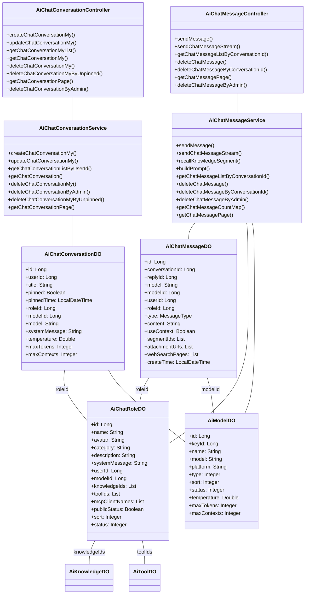
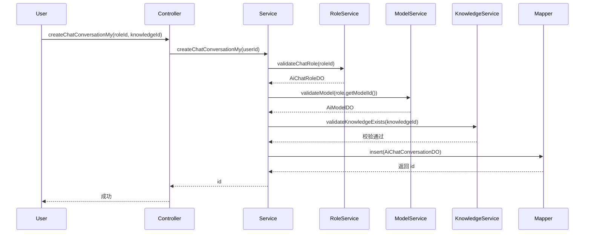
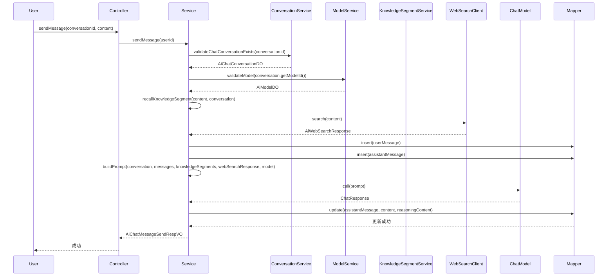
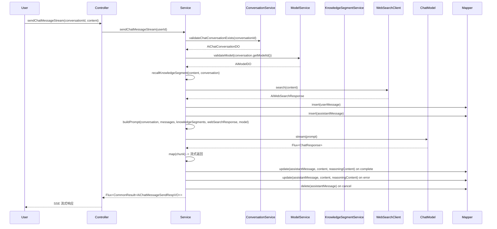
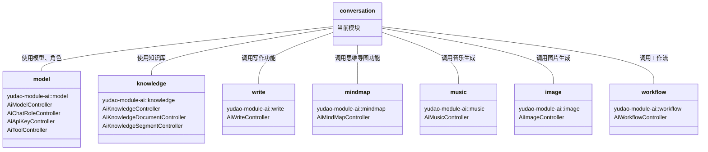

# AI 聊天对话模块 (Conversation Module)

## 1. 概述

AI 聊天对话模块负责管理用户与 AI 模型的对话记录，提供对话的创建、更新、删除、查询等功能。该模块是 AI 功能的核心组成部分，与消息、模型、角色、知识库等模块紧密协作，支持完整的 AI 聊天交互流程。

## 2. 模块架构

## 3. 核心组件

### 3.1 控制器层 (Controller)

#### `AiChatConversationController`
- **路径**: `/ai/chat/conversation`
- **功能**: 提供聊天对话的 RESTful API，支持用户个人对话管理和管理员对话管理
- **主要接口**:
  - `POST /ai/chat/conversation/create-my`: 创建用户自己的对话
  - `PUT /ai/chat/conversation/update-my`: 更新用户自己的对话
  - `GET /ai/chat/conversation/my-list`: 获取用户对话列表
  - `GET /ai/chat/conversation/get-my`: 获取用户指定对话
  - `DELETE /ai/chat/conversation/delete-my`: 删除用户对话
  - `DELETE /ai/chat/conversation/delete-by-unpinned`: 删除未置顶对话
  - `GET /ai/chat/conversation/page`: 分页获取对话（管理员）
  - `DELETE /ai/chat/conversation/delete-by-admin`: 管理员删除对话

#### `AiChatMessageController`
- **路径**: `/ai/chat/message`
- **功能**: 提供聊天消息的 RESTful API，支持消息发送、查询和删除
- **主要接口**:
  - `POST /ai/chat/message/send`: 发送消息（同步）
  - `POST /ai/chat/message/send-stream`: 发送消息（流式）
  - `GET /ai/chat/message/list-by-conversation-id`: 获取指定对话的消息列表
  - `DELETE /ai/chat/message/delete`: 删除消息
  - `DELETE /ai/chat/message/delete-by-conversation-id`: 删除指定对话的消息
  - `GET /ai/chat/message/page`: 分页获取消息（管理员）
  - `DELETE /ai/chat/message/delete-by-admin`: 管理员删除消息

### 3.2 服务层 (Service)

#### `AiChatConversationService`
- **核心功能**:
  - 创建对话：根据角色和模型创建新的对话记录
  - 更新对话：修改对话标题、置顶状态、模型、知识库等配置
  - 删除对话：支持用户删除和管理员删除
  - 查询对话：按用户 ID 获取对话列表，按 ID 获取单个对话
  - 分页查询：支持按用户 ID、标题、创建时间分页查询对话

#### `AiChatMessageService`
- **核心功能**:
  - 发送消息：处理用户消息，调用 AI 模型生成回复
  - 流式发送：支持 SSE 流式返回 AI 模型响应
  - 知识库召回：根据对话角色和查询内容召回相关知识库段落
  - Prompt 构建：构建包含历史消息、知识库、联网搜索的完整 Prompt
  - 消息查询：按对话 ID 获取消息列表，分页查询消息
  - 消息删除：支持用户删除和管理员删除消息

### 3.3 数据对象层 (DO)

#### `AiChatConversationDO`
- **表名**: `ai_chat_conversation`
- **字段说明**:
  - `id`: 主键，自增
  - `userId`: 用户编号，关联系统用户
  - `title`: 对话标题
  - `pinned`: 是否置顶
  - `pinnedTime`: 置顶时间
  - `roleId`: 角色编号，关联 `ai_chat_role`
  - `modelId`: 模型编号，关联 `ai_model`
  - `model`: 模型标志（冗余字段）
  - `systemMessage`: 角色设定
  - `temperature`: 温度参数
  - `maxTokens`: 单条回复最大 Token 数
  - `maxContexts`: 上下文最大消息数

#### `AiChatMessageDO`
- **表名**: `ai_chat_message`
- **字段说明**:
  - `id`: 主键，自增
  - `conversationId`: 对话编号
  - `replyId`: 回复消息 ID（用于构建对话树）
  - `model`: 模型标志
  - `modelId`: 模型编号
  - `userId`: 用户编号
  - `roleId`: 角色编号
  - `type`: 消息类型（USER/ASSISTANT）
  - `content`: 消息内容
  - `useContext`: 是否使用上下文
  - `segmentIds`: 知识库段落 ID 列表
  - `attachmentUrls`: 附件 URL 列表
  - `webSearchPages`: 联网搜索结果页面列表
  - `createTime`: 创建时间

### 3.4 视图对象层 (VO)

#### 对话相关 VO
| VO 名称 | 用途 |
|---------|------|
| `AiChatConversationRespVO` | 对话响应，包含对话详情及关联的角色、模型信息 |
| `AiChatConversationCreateMyReqVO` | 创建对话请求（用户端） |
| `AiChatConversationPageReqVO` | 分页查询请求 |
| `AiChatConversationUpdateMyReqVO` | 更新对话请求（用户端） |

#### 消息相关 VO
| VO 名称 | 用途 |
|---------|------|
| `AiChatMessageRespVO` | 消息响应，包含知识库段落信息 |
| `AiChatMessagePageReqVO` | 分页查询请求 |
| `AiChatMessageSendReqVO` | 发送消息请求 |
| `AiChatMessageSendRespVO` | 发送消息响应（包含发送和接收消息） |

## 4. 核心流程

### 4.1 创建对话流程

### 4.2 发送消息流程

### 4.3 流式发送消息流程

## 5. 依赖关系

### 5.1 模块依赖

### 5.2 系统依赖

- **系统模块 (system)**: 用户认证、权限校验、租户上下文
- **消息模块 (mq)**: 异步处理、消息通知
- **缓存模块 (redis)**: 会话缓存、结果缓存
- **监控模块 (tracer)**: 链路追踪、性能监控

## 6. 权限控制

| 接口 | 权限校验 | 说明 |
|------|---------|------|
| `GET /ai/chat/conversation/page` | `ai:chat-conversation:query` | 管理员对话列表 |
| `DELETE /ai/chat/conversation/delete-by-admin` | `ai:chat-conversation:delete` | 管理员删除对话 |
| `GET /ai/chat/message/page` | `ai:chat-conversation:query` | 管理员消息列表 |
| `DELETE /ai/chat/message/delete-by-admin` | `ai:chat-message:delete` | 管理员删除消息 |
| 用户个人接口 | 隐式校验 userId | 仅能操作自己的对话和消息 |

## 7. 相关模块

- [AI 模型管理](model.md): 管理 AI 模型配置、API 密钥
- [知识库管理](knowledge.md): 管理文档、段落知识库
- [角色管理](chatRole.md): 管理聊天角色、系统提示词
- [消息管理](message.md): 管理聊天消息记录
- [工作流管理](workflow.md): 管理 AI 工作流
- [写作辅助](write.md): AI 写作功能
- [思维导图](mindmap.md): AI 思维导图生成
- [音乐生成](music.md): AI 音乐生成
- [图片生成](image.md): AI 图片生成

## 8. 扩展点

1. **消息类型扩展**: 支持更多类型的消息（图片、文件等）
2. **模型扩展**: 支持更多 AI 模型平台（OpenAI、Anthropic、Claude 等）
3. **知识库扩展**: 支持更多检索算法（向量检索、语义检索等）
4. **工具扩展**: 支持更多工具函数（搜索、计算、API 调用等）
5. **流式传输**: 支持更多流式传输协议（WebSocket、SSE 等）
