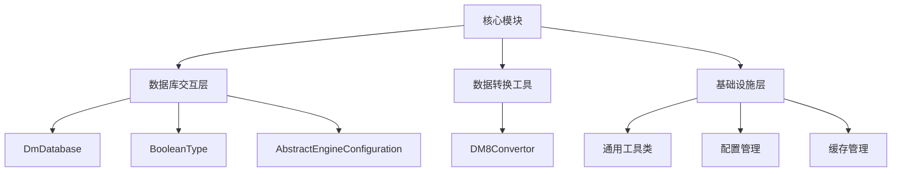

# 核心模块文档

## 概述

本文档描述了系统的核心模块，包括其架构、核心组件、数据流以及与其他模块的交互关系。核心模块主要负责系统的基础设施和数据库交互，为其他业务模块提供支持。

## 模块架构

核心模块主要由以下几个部分组成：

1. **数据库交互层**：
   - 核心数据库适配器（DmDatabase）
   - 数据类型转换器（BooleanType）
   - 数据库连接管理（AbstractEngineConfiguration）

2. **数据转换工具**：
   - 数据库迁移转换器（DM8Convertor）

3. **基础设施层**：
   - 通用工具类
   - 配置管理
   - 缓存管理



## 核心组件详解

### 1. DmDatabase

**文件位置**: `sql/dm/flowable-patch/src/main/java/liquibase/database/core/DmDatabase.java`

**功能**:
- 实现Liquibase的数据库抽象类，为达梦数据库提供特定的数据库操作支持
- 处理达梦数据库的特性，如标识符大小写、数据类型转换、系统对象判断等

**核心方法**:
- `getDefaultDatabaseProductName()`: 返回数据库产品名称
- `isCorrectDatabaseImplementation()`: 判断是否为达梦数据库
- `getDefaultDriver()`: 获取默认驱动类
- `getShortName()`: 获取数据库短名称
- `supportsAutoIncrement()`: 判断是否支持自增

**特性支持**:
- 支持达梦数据库的标识符大小写处理
- 支持自增列（Identity）
- 支持序列
- 支持表空间
- 支持初始延迟约束列

### 2. BooleanType

**文件位置**: `sql/dm/flowable-patch/src/main/java/liquibase/datatype/core/BooleanType.java`

**功能**:
- Liquibase数据类型转换器，用于处理布尔类型的数据库特定表示
- 将Java布尔类型转换为目标数据库的特定类型

**核心方法**:
- `toDatabaseDataType(Database)`: 将布尔类型转换为数据库特定类型
- `objectToSql(Object, Database)`: 将对象转换为SQL布尔值
- `isNumericBoolean(Database)`: 判断是否为数字布尔类型
- `getFalseBooleanValue(Database)`: 获取数据库特定的false值表示
- `getTrueBooleanValue(Database)`: 获取数据库特定的true值表示

**数据库支持**:
- 支持多种数据库的布尔类型转换，包括达梦数据库
- 为达梦数据库提供特定的布尔类型支持（bit类型）

### 3. AbstractEngineConfiguration

**文件位置**: `sql/dm/flowable-patch/src/main/java/org/flowable/common/engine/impl/AbstractEngineConfiguration.java`

**功能**:
- Flowable工作流引擎的抽象配置类
- 提供数据库连接管理、事务管理、MyBatis配置等核心功能
- 支持多种数据库类型，包括达梦数据库

**核心方法**:
- `initDatabaseType()`: 初始化数据库类型
- `initDataSource()`: 初始化数据源
- `initSqlSessionFactory()`: 初始化MyBatis SqlSessionFactory
- `initCommandExecutors()`: 初始化命令执行器
- `initEventDispatcher()`: 初始化事件分发器
- `initIdGenerator()`: 初始化ID生成器

**数据库支持**:
- 支持达梦数据库的特定配置
- 提供默认的数据库类型映射
- 支持数据库连接池管理

### 4. DM8Convertor

**文件位置**: `sql/tools/convertor.py::DM8Convertor`

**功能**:
- 数据库迁移转换工具，用于将MySQL数据库脚本转换为达梦数据库脚本
- 支持表结构、索引、约束、数据插入等SQL语句的转换

**核心方法**:
- `translate_type(type, size)`: 类型转换
- `gen_create(ddl)`: 生成CREATE语句
- `gen_comment(table_ddl)`: 生成注释语句
- `gen_pk(table_name)`: 生成主键定义
- `gen_uk(table_ddl)`: 生成唯一约束
- `gen_index(ddl)`: 生成索引
- `gen_insert(table_name)`: 生成INSERT语句

**转换特性**:
- 支持达梦数据库的特定语法
- 处理数据类型差异
- 管理标识符大小写
- 生成适合达梦数据库的SQL脚本

## 数据流

核心模块的数据流主要涉及数据库操作和数据转换：

1. **数据库操作流程**:
   - 应用程序通过Flowable工作流引擎与数据库交互
   - Flowable使用AbstractEngineConfiguration管理数据库连接
   - DmDatabase提供达梦数据库特定的SQL生成和执行
   - BooleanType处理布尔类型的数据库特定表示

2. **数据转换流程**:
   - DM8Convertor将MySQL脚本转换为达梦数据库脚本
   - 转换过程包括类型转换、语法调整、标识符处理等
   - 生成的脚本可以直接在达梦数据库中执行

## 与其他模块的交互

核心模块为其他业务模块提供基础设施支持：

1. **与业务模块的交互**:
   - 为业务模块提供数据库连接和事务管理
   - 支持业务模块的数据库操作
   - 提供数据库特定的功能支持

2. **与工具模块的交互**:
   - 为数据库迁移工具提供数据库特定的转换功能
   - 支持数据库脚本的生成和执行

3. **与框架模块的交互**:
   - 与Flowable工作流引擎集成
   - 支持Liquibase数据库迁移框架
   - 提供通用的数据库操作功能

## API接口

核心模块提供以下主要API接口：

### 数据库操作API

1. **DmDatabase类**
   - `getDefaultDatabaseProductName()`: 获取数据库产品名称
   - `isCorrectDatabaseImplementation()`: 判断是否为达梦数据库
   - `getDefaultDriver()`: 获取默认驱动类
   - `getShortName()`: 获取数据库短名称
   - `supportsAutoIncrement()`: 判断是否支持自增

2. **BooleanType类**
   - `toDatabaseDataType()`: 转换数据库类型
   - `objectToSql()`: 转换对象为SQL值
   - `getFalseBooleanValue()`: 获取false值表示
   - `getTrueBooleanValue()`: 获取true值表示

### 配置管理API

1. **AbstractEngineConfiguration类**
   - `initDatabaseType()`: 初始化数据库类型
   - `initDataSource()`: 初始化数据源
   - `initSqlSessionFactory()`: 初始化MyBatis会话工厂
   - `getDatabaseType()`: 获取数据库类型
   - `setDatabaseType()`: 设置数据库类型

### 数据转换API

1. **DM8Convertor类**
   - `translate_type()`: 类型转换
   - `gen_create()`: 生成CREATE语句
   - `gen_comment()`: 生成注释
   - `gen_insert()`: 生成INSERT语句

## 配置说明

核心模块的配置主要涉及数据库连接和数据库特定功能：

### 数据库连接配置

```properties
# 数据库连接配置示例
jdbc.driver=dm.jdbc.driver.DmDriver
jdbc.url=jdbc:dm://localhost:5236/SYSDBA
jdbc.username=SYSDBA
jdbc.password=SYSDBA
jdbc.maxActiveConnections=16
jdbc.maxIdleConnections=8
```

### Flowable配置

```properties
# Flowable配置示例
databaseSchemaUpdate=true
databaseTablePrefix=FLOWABLE_
tablePrefixIsSchema=false
```

### 达梦数据库特定配置

```properties
# 达梦数据库特定配置
# 标识符大小写处理
unquotedObjectsAreUppercased=true

# 日期时间函数
currentDateTimeFunction=SYSTIMESTAMP

# 序列定义
sequenceNextValueFunction=%s.nextval
sequenceCurrentValueFunction=%s.currval
```

## 部署和运维

### 部署要求

1. **Java环境**: JDK 8+
2. **数据库**: 达梦数据库 8
3. **依赖库**:
   - Liquibase 4.9+
   - Flowable 6.7+
   - MyBatis 3.5+
   - Spring Framework 5.3+

### 运维注意事项

1. **数据库连接**:
   - 合理配置连接池参数
   - 监控连接池状态
   - 定期检查连接有效性

2. **性能优化**:
   - 根据实际负载调整批量操作大小
   - 优化SQL语句执行计划
   - 合理使用索引

3. **数据库特定功能**:
   - 利用达梦数据库的特性优化性能
   - 合理使用分区表
   - 利用达梦数据库的并行处理能力

## 故障排除

### 常见问题

1. **数据库连接失败**:
   - 检查数据库服务是否运行
   - 验证连接参数是否正确
   - 检查网络连通性

2. **SQL执行错误**:
   - 检查SQL语法是否正确
   - 验证表结构和字段定义
   - 检查权限设置

3. **性能问题**:
   - 检查是否有慢查询
   - 验证索引使用情况
   - 检查连接池配置

### 日志分析

核心模块的日志主要包括：
- 数据库连接日志
- SQL执行日志
- 异常错误日志
- 性能监控日志

## 最佳实践

1. **数据库设计**:
   - 合理设计表结构和索引
   - 使用适当的数据类型
   - 考虑数据库特定的特性

2. **代码开发**:
   - 使用ORM框架简化数据库操作
   - 合理处理异常和事务
   - 避免N+1查询问题

3. **性能优化**:
   - 合理使用批量操作
   - 优化查询语句
   - 利用缓存减少数据库访问

4. **数据库迁移**:
   - 使用DM8Convertor进行脚本转换
   - 充分测试转换后的脚本
   - 考虑数据一致性和完整性

## 未来发展

核心模块的未来发展方向包括：

1. **多数据库支持**:
   - 扩展对更多数据库的支持
   - 提供统一的数据库操作接口

2. **性能优化**:
   - 优化数据库连接管理
   - 提升批量操作性能
   - 增强缓存机制

3. **功能增强**:
   - 支持更多数据库特性
   - 增强数据库迁移功能
   - 提供更多的监控和管理工具

4. **云原生支持**:
   - 支持云数据库
   - 提供容器化部署方案
   - 增强云环境下的适配性

## 参考文档

1. [达梦数据库官方文档](https://www.dameng.com/)
2. [Liquibase官方文档](https://www.liquibase.org/documentation)
3. [Flowable官方文档](https://www.flowable.com/open-source/docs)
4. [MyBatis官方文档](https://mybatis.org/mybatis-3/)

---

**文档版本**: v1.0
**最后更新**: 2024-02-20
**维护者**: 核心开发团队