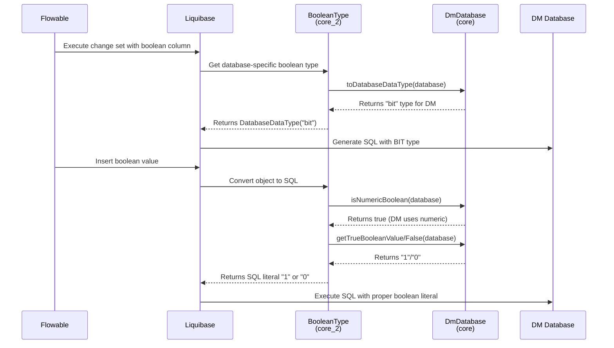

# core_2 Module: Boolean Type Handling for DM Database

## Overview

The `core_2` module provides specialized boolean type handling for the DM (达梦) database within the Liquibase framework. It extends Liquibase's `BooleanType` class to add proper support for the DM database's boolean type representation, ensuring consistent boolean value handling across different database systems in the Flowable process engine ecosystem.

This module is part of the `sql/dm/flowable-patch` project, which contains patches and extensions to make Flowable compatible with the DM database.

## Purpose and Core Functionality

The primary purpose of the `core_2` module is to:

1. Extend Liquibase's boolean type handling to support the DM database
2. Provide proper boolean value conversion for DM database in database schema migrations
3. Ensure consistent boolean representation across different database systems supported by Flowable
4. Handle database-specific boolean literal values (true/false) for DM database

The module achieves this by overriding key methods in Liquibase's `BooleanType` class to add special handling for the `DmDatabase` type.

## Architecture and Component Relationships

The `core_2` module consists of a single core component:
- `BooleanType.java`: Extends Liquibase's `BooleanType` to add DM database support

This component interacts with:
- `DmDatabase.java` (from the `core` module): Represents the DM database implementation in Liquibase
- Liquibase's core `BooleanType` class: The base class being extended
- Various other database implementations in Liquibase for comparison

### Component Dependencies

The `BooleanType` class depends on:
- Liquibase's `LiquibaseDataType` base class
- Various database-specific classes (FirebirdDatabase, Db2zDatabase, MSSQLDatabase, etc.)
- The `DmDatabase` class from the core module for DM-specific handling

## How the Module Fits into the Overall System

In the Flowable ecosystem with DM database support:

1. **Liquibase Integration**: Flowable uses Liquibase for database schema management and migrations
2. **Database Abstraction**: Liquibase provides database-specific type handling through its `LiquibaseDataType` implementations
3. **DM Database Support**: The `core_2` module extends Liquibase's boolean type handling to properly support DM database
4. **Flowable Process Engine**: When Flowable initializes with a DM database, it uses these extended type handlers to ensure proper schema creation and data handling

The module fits into the system as follows:
```
Flowable Process Engine
         ↓
Liquibase (for schema migrations)
         ↓
BooleanType (extended in core_2) → Handles boolean type conversions
         ↓
DmDatabase (from core module) → Represents DM database specifics
         ↓
DM Database (达梦数据库) → Actual database system
```

## Detailed Component Analysis

### BooleanType.java

The `BooleanType` class extends `LiquibaseDataType` and overrides several key methods to provide DM database-specific boolean handling:

#### Key Methods Overridden:

1. **`toDatabaseDataType(Database database)`**
   - Converts the logical boolean type to database-specific boolean type
   - Adds special case for `DmDatabase`: returns `"bit"` type
   - Handles other databases with their specific boolean representations

2. **`objectToSql(Object value, Database database)`**
   - Converts Java boolean/object values to SQL literal representations
   - Includes DM database in the `isNumericBoolean()` check
   - Ensures proper boolean literal generation for DM database

3. **`isNumericBoolean(Database database)`**
   - Determines if the database uses numeric values (0/1) for boolean
   - Adds `DmDatabase` to the list of databases that use numeric boolean representation

4. **`getFalseBooleanValue(Database database)`**
   - Returns the false literal for the specific database
   - Returns `"0"` for DM database (since it uses numeric boolean)

5. **`getTrueBooleanValue(Database database)`**
   - Returns the true literal for the specific database
   - Returns `"1"` for DM database (since it uses numeric boolean)

#### DM Database Specific Handling:

For the DM database, the BooleanType class specifies:
- Boolean type is represented as `"bit"` in the database
- Uses numeric representation (0 for false, 1 for true)
- Follows the same pattern as other databases like MSSQL, Sybase, etc.

## Technical Details

### Boolean Type Mapping

| Database Type | Boolean Representation | True Value | False Value |
|---------------|------------------------|------------|-------------|
| DM Database   | bit                    | 1          | 0           |
| MSSQL         | bit                    | 1          | 0           |
| MySQL         | bit(1)                 | 1          | 0           |
| Oracle        | NUMBER(1)              | 1          | 0           |
| PostgreSQL    | BOOLEAN or BIT         | TRUE/FALSE | TRUE/FALSE  |
| DB2           | BOOLEAN or SMALLINT    | 1/TRUE     | 0/FALSE     |
| Firebird      | BOOLEAN or SMALLINT    | TRUE/1     | FALSE/0     |
| Derby         | BOOLEAN or SMALLINT    | TRUE/1     | FALSE/0     |

### Code Flow

When Flowable executes a Liquibase change set containing a boolean column definition with DM database:

1. Liquibase encounters the boolean type definition
2. It uses the `BooleanType` class (extended in core_2) to handle the type
3. The `toDatabaseDataType()` method is called with `DmDatabase` instance
4. Since the database is `DmDatabase`, it returns `new DatabaseDataType("bit")`
5. For value conversions, `objectToSql()` uses the DM-specific true/false values ("1"/"0")
6. The resulting SQL is properly formatted for DM database consumption

## Mermaid Diagrams

### Architecture Diagram

```mermaid
graph TD
    A[Flowable Process Engine] --> B[Liquibase]
    B --> C[BooleanType<br/>(Extended in core_2)]
    C --> D[DmDatabase<br/>(from core module)]
    D --> E[DM Database<br/>(达梦数据库)]
    
    style A fill:#f9f,stroke:#333
    style B fill:#bbf,stroke:#333
    style C fill:#bfb,stroke:#333
    style D fill:#fb9,stroke:#333
    style E fill:#9f9,stroke:#333
```

### Component Dependencies

```mermaid
graph LR
    A[BooleanType<br/>(core_2)] --> B[LiquibaseDataType]
    A --> C[FirebirdDatabase]
    A --> D[Db2zDatabase]
    A --> E[MSSQLDatabase]
    A --> F[MySQLDatabase]
    A --> G[OracleDatabase]
    A --> H[SybaseDatabase]
    A --> I[DerbyDatabase]
    A --> J[DB2Database]
    A --> K[HsqlDatabase]
    A --> L[PostgresDatabase]
    A --> M[SQLiteDatabase]
    A --> N[InformixDatabase]
    A --> O[DmDatabase<br/>(core module)]
    
    style A fill:#bfb,stroke:#333
    style B fill:#f9f,stroke:#333
    style O fill:#bbf,stroke:#333
```

### Data Flow for Boolean Type Conversion



### Process Flow for Schema Migration

```mermaid
flowchart TD
    A[Start: Liquibase ChangeSet Execution] --> B{Boolean Column Defined?}
    B -->|Yes| C[Invoke BooleanType.toDatabaseDataType()]
    C --> D{Database Type?}
    D -->|DmDatabase| E[Return DatabaseDataType("bit")]
    D -->|Other DB| F[Use Standard Handling]
    E --> G[Generate SQL: column_name BIT]
    F --> G
    G --> H{Inserting Boolean Value?}
    H -->|Yes| I[Invoke BooleanType.objectToSql()]
    I --> J{Value Type?}
    J -->|String/Number/Boolean| K[Convert to "1"/"0" for DM]
    J -->|DatabaseFunction| L[Return Function String]
    K --> M[Generate SQL: column_name = 1/0]
    L --> M
    M --> N[Execute SQL against DM Database]
    N --> O[End: Schema Updated/Data Inserted]
    
    style A fill:#f9f,stroke:#333
    style O fill:#9f9,stroke:#333
    style E fill:#bfb,stroke:#333
    style K fill:#bfb,stroke:#333
```

## Integration Points

### With Core Module

The `core_2` module integrates with the `core` module through the `DmDatabase` class:
- `BooleanType` references `DmDatabase` using `instanceof` checks
- When a `DmDatabase` instance is detected, special handling is applied
- This follows Liquibase's pattern of database-specific type handling

### With Liquibase Framework

The module extends Liquibase's existing functionality:
- Inherits from `LiquibaseDataType`
- Overrides methods to add DM-specific behavior
- Maintains compatibility with all other database types
- Follows Liquibase's extension patterns

## Configuration and Usage

### Automatic Integration

The `BooleanType` class is automatically used by Liquibase when:
1. The Flowable application is configured to use DM database
2. Liquibase scans for `DataTypeInfo` annotations
3. The `@DataTypeInfo` annotation on `BooleanType` registers it for "boolean" type handling

### No Additional Configuration Required

The module works automatically once included in the classpath:
- No Spring configuration needed
- No manual registration required
- Leverages Liquibase's SPI (Service Provider Interface) mechanism

## Benefits

1. **Database Compatibility**: Ensures Flowable works correctly with DM database
2. **Consistent Behavior**: Boolean values behave consistently across all supported databases
3. **Minimal Impact**: Only affects DM database handling; other databases unchanged
4. **Standards Compliant**: Follows Liquibase's established patterns for database type handling
5. **Maintainable**: Clear, focused implementation that's easy to understand and modify

## Related Modules

While this documentation focuses on the `core_2` module, it's important to note related modules that provide additional DM database support:

- **`core` module**: Contains `DmDatabase.java` - the core DM database implementation
- Various other modules in the system that may interact with boolean types:
  - Modules handling process definitions, variables, and service tasks
  - Modules dealing with form properties and data modeling
  - Audit and history modules that store boolean flags

## Conclusion

The `core_2` module provides essential DM database support for boolean type handling in the Flowable ecosystem through Liquibase extensions. By extending Liquibase's `BooleanType` class with specific handling for the `DmDatabase` type, it ensures that boolean values are properly stored, retrieved, and manipulated when using Flowable with DM database.

The implementation is minimal, focused, and follows established patterns, making it a reliable addition to the Flowable-DM database integration.