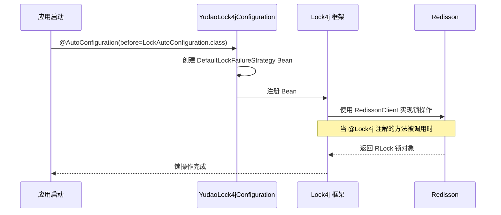
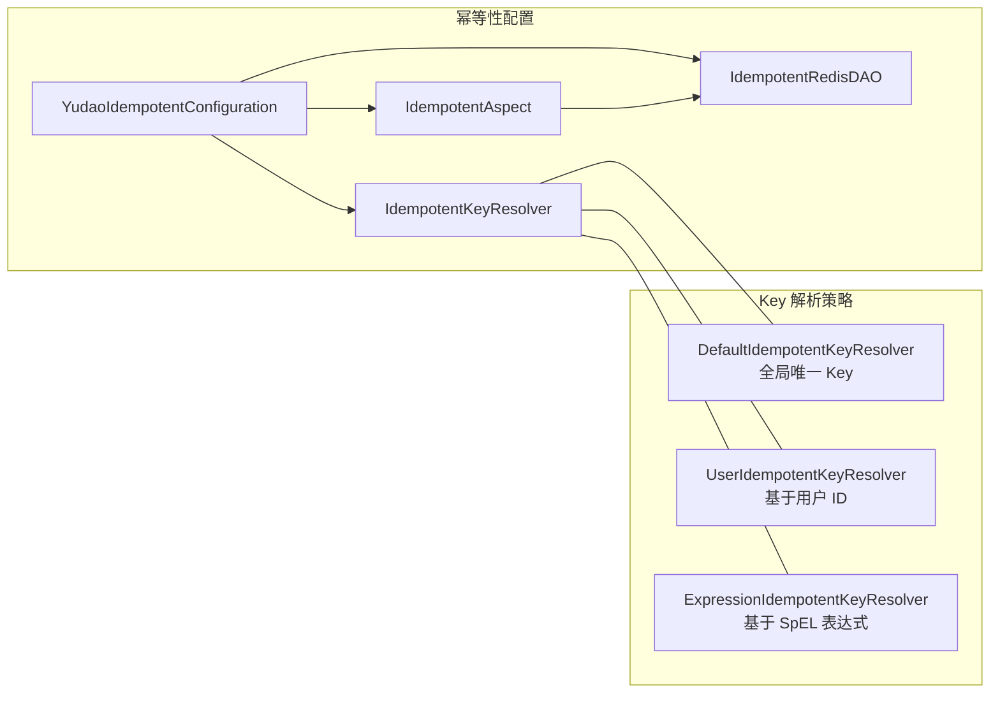
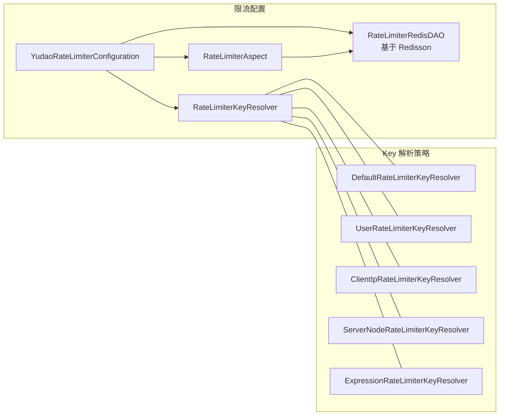
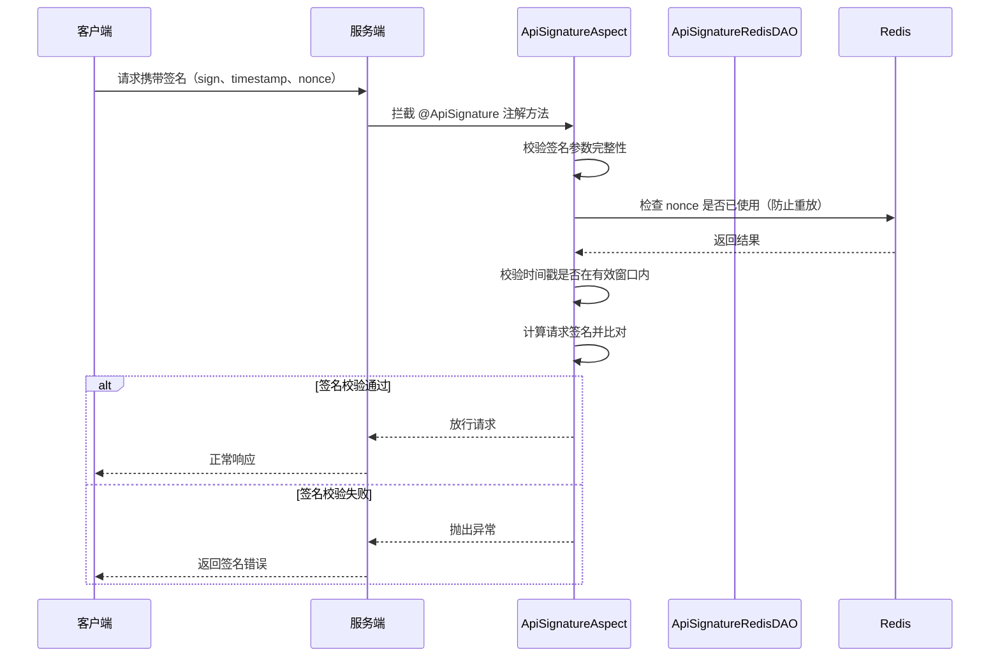
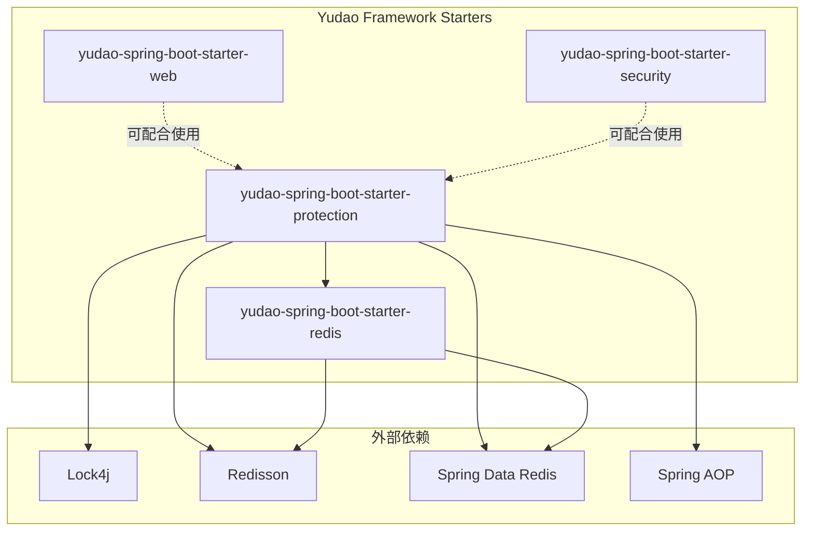

# core_3: yudao-spring-boot-starter-protection — 系统防护与安全模块

## 1. 概述

`yudao-spring-boot-starter-protection`（简称 protection）是 Yudao 框架中用于**系统防护与安全**的自动化配置模块。它提供了四大核心能力：

- **分布式锁（Lock4j）**：基于 Lock4j + Redisson 实现方法级别的分布式锁，确保并发安全
- **幂等性（Idempotent）**：基于 Redis 实现接口幂等性控制，防止重复提交
- **限流（Rate Limiter）**：基于 Redisson 的分布式限流器，支持多种限流维度
- **API 签名（API Signature）**：基于 Redis 实现 API 请求签名校验，防止请求篡改

该模块通过 `@AutoConfiguration` 自动装配，依赖 `yudao-spring-boot-starter-redis`（Redis 支持）以及 `lock4j`、`redisson` 等第三方库。

---

## 2. 架构总览

```mermaid
graph TB
    subgraph "yudao-spring-boot-starter-protection"
        direction TB
        
        subgraph "分布式锁 Lock4j"
            LOCK4J_CONFIG[YudaoLock4jConfiguration]
            LOCK4J_KEY[Lock4jRedisKeyConstants]
            LOCK4J_STRATEGY[DefaultLockFailureStrategy]
        end
        
        subgraph "幂等性 Idempotent"
            IDEM_CONFIG[YudaoIdempotentConfiguration]
            IDEM_ASPECT[IdempotentAspect]
            IDEM_DAO[IdempotentRedisDAO]
            IDEM_KEY_RESOLVER[IdempotentKeyResolver 体系]
        end
        
        subgraph "限流 Rate Limiter"
            RATE_CONFIG[YudaoRateLimiterConfiguration]
            RATE_ASPECT[RateLimiterAspect]
            RATE_DAO[RateLimiterRedisDAO]
            RATE_KEY_RESOLVER[RateLimiterKeyResolver 体系]
        end
        
        subgraph "API 签名 Signature"
            SIG_CONFIG[YudaoApiSignatureAutoConfiguration]
            SIG_ASPECT[ApiSignatureAspect]
            SIG_DAO[ApiSignatureRedisDAO]
        end
        
        LOCK4J_CONFIG --> LOCK4J_KEY
        LOCK4J_CONFIG --> LOCK4J_STRATEGY
        IDEM_CONFIG --> IDEM_ASPECT
        IDEM_CONFIG --> IDEM_DAO
        IDEM_CONFIG --> IDEM_KEY_RESOLVER
        RATE_CONFIG --> RATE_ASPECT
        RATE_CONFIG --> RATE_DAO
        RATE_CONFIG --> RATE_KEY_RESOLVER
        SIG_CONFIG --> SIG_ASPECT
        SIG_CONFIG --> SIG_DAO
    end

    subgraph "外部依赖"
        REDIS[yudao-spring-boot-starter-redis]
        LOCK4J_LIB[Lock4j 框架]
        REDISSON[Redisson]
        SPRING[Spring Framework\nAOP / Data Redis]
    end

    LOCK4J_CONFIG --> LOCK4J_LIB
    LOCK4J_CONFIG --> REDISSON
    LOCK4J_CONFIG --> SPRING
    IDEM_CONFIG --> REDIS
    IDEM_CONFIG --> SPRING
    RATE_CONFIG --> REDISSON
    RATE_CONFIG --> SPRING
    SIG_CONFIG --> REDIS
    SIG_CONFIG --> SPRING
```



---

## 3. 核心组件详解

### 3.1 分布式锁 Lock4j 集成

分布式锁用于解决分布式系统中的资源竞争问题。Yudao 基于 Lock4j 框架（锁定方案）整合 Redisson 实现。

#### 3.1.1 核心常量：`Lock4jRedisKeyConstants`

定义 Redis 中分布式锁的 Key 格式：

```java
String LOCK4J = "lock4j:%s";
```

- **Key 格式**：`lock4j:{锁名称}`，其中 `{锁名称}` 由 `DefaultLockKeyBuilder` 生成
- **数据结构**：使用 Redisson 的 `RLock`（Hash 结构）
- **过期时间**：不固定，根据业务调用方在 `@Lock4j` 注解中指定

#### 3.1.2 自动配置：`YudaoLock4jConfiguration`



- 在 Lock4j 框架自动配置**之前**注入（`before = LockAutoConfiguration.class`）
- 仅当 classpath 中存在 `com.baomidou.lock.annotation.Lock4j` 时生效（`@ConditionalOnClass`）
- 提供 `DefaultLockFailureStrategy` 作为锁获取失败时的默认策略

#### 3.1.3 使用方式

在 Service 方法上添加 `@Lock4j` 注解即可：

```java
@Lock4j(name = "user:update:%s", keys = "#user.id", expire = 30000, acquireTimeout = 10000)
public void updateUser(User user) {
    // 业务逻辑
}
```

| 参数 | 说明 |
|------|------|
| `name` | 锁名称，支持占位符 `%s` 动态替换 |
| `keys` | 锁 Key 的 SpEL 表达式 |
| `expire` | 锁自动过期时间（毫秒） |
| `acquireTimeout` | 获取锁的超时时间（毫秒） |

---

### 3.2 幂等性 Idempotent

防止用户重复提交或接口被多次调用导致数据不一致。

#### 3.2.1 自动配置：`YudaoIdempotentConfiguration`



- **`IdempotentAspect`**：AOP 切面，拦截 `@Idempotent` 注解，执行幂等校验
- **`IdempotentRedisDAO`**：基于 `StringRedisTemplate` 的幂等 Redis 数据访问层
- **Key 解析策略**：
  - `DefaultIdempotentKeyResolver`：全局唯一 Key（适用于全局限流）
  - `UserIdempotentKeyResolver`：基于当前用户 ID 生成 Key（用户级别幂等）
  - `ExpressionIdempotentKeyResolver`：基于 SpEL 表达式动态生成 Key

#### 3.2.2 使用方式

```java
@Idempotent(timeout = 60, keyResolver = UserIdempotentKeyResolver.class)
public void submitOrder(OrderCreateReqVO req) {
    // 业务逻辑，60 秒内同一用户不可重复提交
}
```

---

### 3.3 限流 Rate Limiter

对接口或方法进行分布式限流，防止突发流量冲击。

#### 3.3.1 自动配置：`YudaoRateLimiterConfiguration`



- **`RateLimiterAspect`**：AOP 切面，拦截 `@RateLimiter` 注解
- **`RateLimiterRedisDAO`**：基于 **Redisson**（而非 Jedis/Lettuce）的 `RRateLimiter` 实现分布式限流
- **Key 解析策略**，支持五种维度：
  - `Default`：全局默认 Key
  - `User`：按用户 ID 限流
  - `ClientIp`：按客户端 IP 限流
  - `ServerNode`：按服务节点限流
  - `Expression`：按 SpEL 表达式限流

#### 3.3.2 使用方式

```java
@RateLimiter(count = 10, time = 60, keyResolver = ClientIpRateLimiterKeyResolver.class)
public void sendSms(SmsSendReqVO req) {
    // 业务逻辑，每个客户端 IP 每分钟最多 10 次
}
```

---

### 3.4 API 签名 Signature

对 API 请求进行签名校验，防止请求被篡改或重放攻击。

#### 3.4.1 自动配置：`YudaoApiSignatureAutoConfiguration`



- **`ApiSignatureAspect`**：AOP 切面，拦截 `@ApiSignature` 注解
- **`ApiSignatureRedisDAO`**：基于 `StringRedisTemplate`，存储已使用的 `nonce` 值，防止重放攻击

#### 3.4.2 使用方式

```java
@ApiSignature
@PostMapping("/api/order/create")
public CommonResult<Long> createOrder(@RequestBody OrderCreateReqVO req) {
    // 业务逻辑，请求需携带有效签名
}
```

---

## 4. 模块间依赖关系



### 依赖说明

| 依赖 | 用途 |
|------|------|
| `yudao-spring-boot-starter-redis` | 提供 Redis 自动化配置（`StringRedisTemplate`、`RedissonClient`） |
| `com.baomidou:lock4j-spring-boot-starter` | Lock4j 分布式锁框架 |
| `org.redisson:redisson-spring-boot-starter` | Redisson 客户端（用于限流和锁实现） |
| `org.springframework.boot:spring-boot-starter-data-redis` | Spring Data Redis |
| `org.springframework.boot:spring-boot-starter-aop` | Spring AOP 支持 |

---

## 5. 注解汇总

| 注解 | 所属模块 | 说明 |
|------|----------|------|
| `@Lock4j` | 分布式锁 | 方法级别分布式锁 |
| `@Idempotent` | 幂等性 | 防止重复提交 |
| `@RateLimiter` | 限流 | 分布式限流 |
| `@ApiSignature` | API 签名 | 请求签名校验 |

---

## 6. 配置属性

该模块本身无需额外配置，所有配置通过注解参数直接定义。依赖的 Redis 配置由 `yudao-spring-boot-starter-redis` 提供（参见 [core_2](./core_2.md) 文档）。

---

## 7. 相关文档

| 文档 | 内容 |
|------|------|
| [core_2](./core_2.md) | yudao-spring-boot-starter-redis - Redis 自动化配置与缓存支持 |
| [core](./core.md) | core - Liquibase 数据库方言适配 |
| [impl](./impl.md) | impl - Flowable 引擎核心配置（AbstractEngineConfiguration） |

---

## 8. 常见问题

### Q1: Lock4j 与 @Transactional 一起使用时需要注意什么？

Lock4j 的锁获取在方法调用之前，事务在方法内部开启。如果需要在事务范围内获取锁，建议：

```java
@Lock4j(...)
@Transactional(rollbackFor = Exception.class)
public void businessMethod() {
    // 业务代码在锁和事务双重保护下执行
}
```

### Q2: 幂等性如何保证在分布式环境下生效？

幂等性基于 Redis 存储已处理请求的唯一标识（Key），并设置过期时间。Redis 本身的单线程模型保证了 `SETNX` 等操作的原子性，从而在分布式环境下也能有效防止重复提交。

### Q3: 限流和幂等性有什么区别？

- **限流（Rate Limiter）**：控制单位时间内的请求**频率**，超过阈值直接拒绝
- **幂等性（Idempotent）**：防止同一请求被**重复处理**，即使多次提交也只生效一次
- 二者可以组合使用，在限流的基础上增加幂等保障
