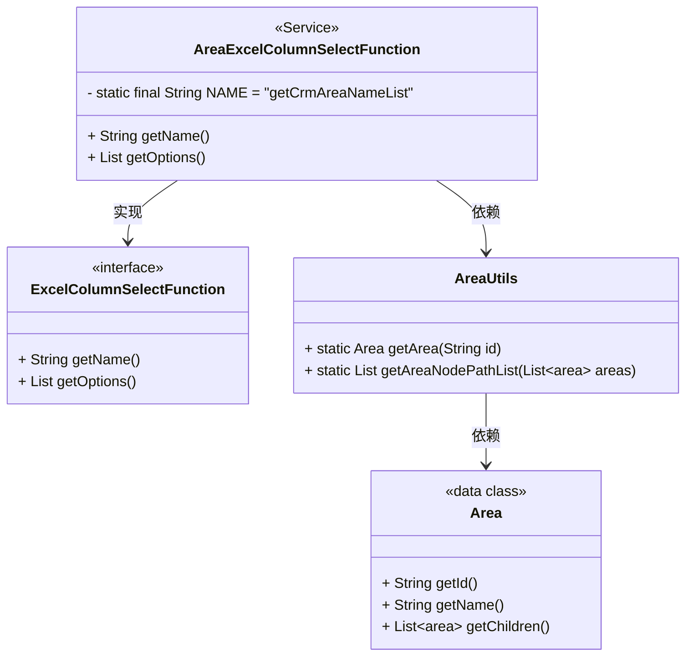
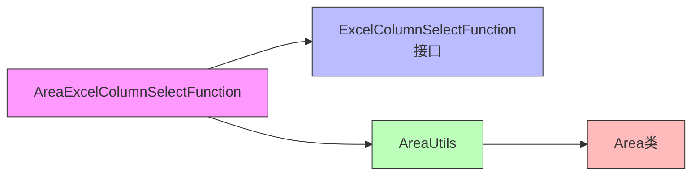
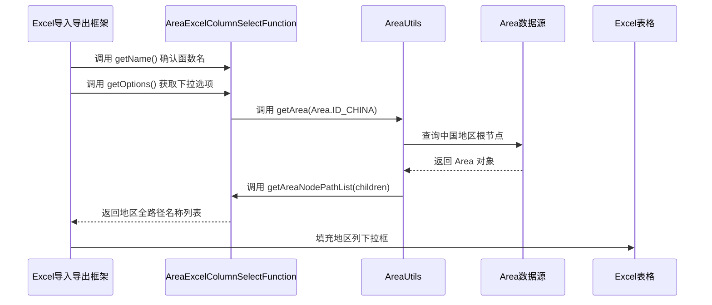

# AreaExcelColumnSelectFunction 组件文档

## 模块概述

`AreaExcelColumnSelectFunction` 是 CRM 模块中用于 Excel 导入导出功能的地区下拉框数据源实现类。它实现了 `ExcelColumnSelectFunction` 接口，为 Excel 表格中的地区列提供下拉选项，确保数据导入时地区字段的合法性和一致性。

该组件位于 `yudao-module-crm` 模块的 `framework/excel/core` 包下，是 CRM 模块与 yudao-framework Excel 导入导出 starter 的集成点。

## 核心功能

1. **提供地区下拉选项**：通过调用 IP 工具类 `AreaUtils` 获取中国的省、市、区三级地区列表，返回地区全路径名称列表（如 “北京市北京市东城区”）。
2. **实现 ExcelColumnSelectFunction 接口**：符合 yudao-framework Excel 导入导出框架的自定义列选择函数规范。
3. **Spring Bean 声明**：使用 `@Service` 注解注入 Spring 容器，由 Excel 导入导出框架自动发现并使用。

## 组件结构

### 类图



### 依赖关系图



### 数据流图（Excel 导入导出过程）



## 与其他模块的关系

- **依赖 yudao-framework Excel 导入导出 starter**：实现 `ExcelColumnSelectFunction` 接口，由框架自动扫描 `@Service` 实现类并注入到 Excel 处理流程中。详见 [Excel 导入导出 starter 文档](core_2.md)（注：实际文档名需根据项目情况调整，此处示例）。
- **依赖 yudao-framework IP 工具包**：使用 `AreaUtils` 和 `Area` 类获取地区树形数据。详见 [IP 工具包文档](utils.md)。
- **服务于 CRM 模块的 Excel 导入导出功能**：主要用于 CRM 中的客户、线索、商机等实体的地区字段导入导出。

## 接口说明

| 方法 | 返回值 | 说明 |
|------|--------|------|
| `getName()` | String | 返回函数唯一标识 `"getCrmAreaNameList"`，用于 Excel 配置中引用此下拉函数。 |
| `getOptions()` | List<String> | 返回所有地区的全路径名称列表（省-市-区），例如 `["北京市北京市东城区", "上海市上海市黄浦区", ...]`。 |

## 配置说明

- 该类使用 `@Service` 注解，无需额外配置即可被 Spring 容器管理。
- 函数名通过常量 `NAME` 定义，防止与其他模块的同名函数冲突。
- 在 Excel 导入导出配置中（通常在 Excel 注解或配置类中），引用函数名 `"getCrmAreaNameList"` 即可启用地区下拉框。

## 使用示例

在需要地区下拉的 Excel 字段上，使用 `@ExcelColumnSelect` 注解（或等价配置）：

```java
@ExcelColumnSelect("getCrmAreaNameList")
private String area;
```

框架在处理该字段时会调用 `AreaExcelColumnSelectFunction.getOptions()` 获取下拉选项。

## 最佳实践

1. **性能考虑**：`getOptions()` 每次调用都会重新遍历地区树。如果地区数据较大且频繁调用，可考虑添加缓存（如 Spring Cache）以提升性能。
2. **国际化**：当前实现仅返回中文地区名称。如需多语言支持，需根据系统国际化策略扩展。
3. **异常处理**：目前未显式捕获异常，若地区数据源异常将导致空列表返回。生产环境建议增加日志和异常处理机制。

## 参考其他模块文档

- [Excel 导入导出 starter 文档](core_2.md)：了解 ExcelColumnSelectFunction 的使用规范和框架集成细节。
- [IP 工具包文档](utils.md)：了解 AreaUtils 和 Area 类的详细用法和地区数据来源。
- [CRM 模块 Excel 导入导出配置指南](crm_excel.md)：具体说明在 CRM 中如何配置和使用自定义 Excel 下拉函数（如存在）。

> 注：上述链接为示例，实际文档名请根据项目中已生成的文档进行替换。

## 结论

`AreaExcelColumnSelectFunction` 是一个轻量但关键的组件，它将 CRM 模块的地区数据与 yudao-framework 的 Excel 导入导出能力桥接起来，确保数据导入导出过程中的地区字段准确性和用户友好性。通过标准化的接口实现和 Spring 自动装配，它易于维护和扩展。