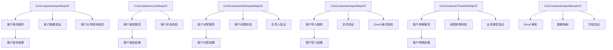
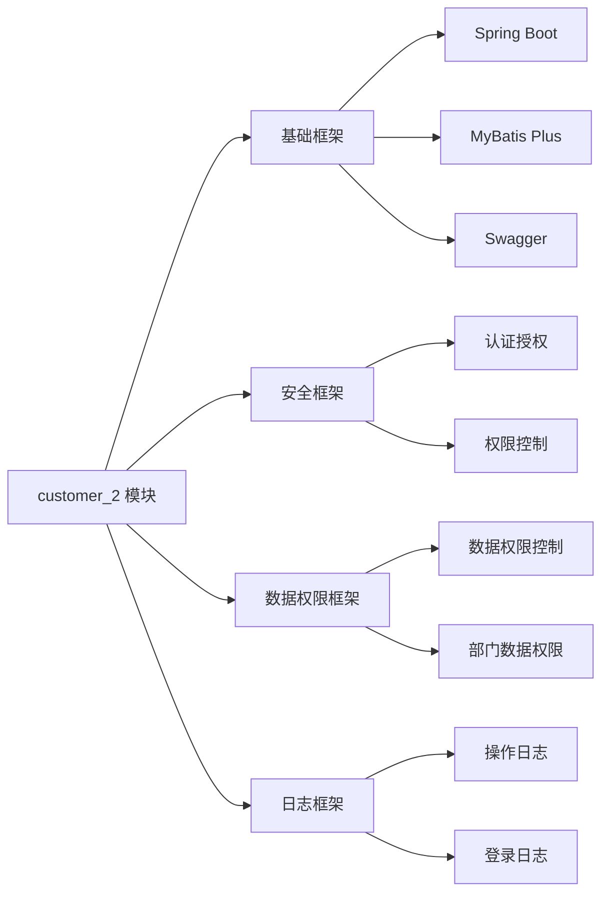

# customer_2 模块文档

## 概述

`customer_2` 模块是 Yudao 框架 CRM 系统中的客户管理核心模块，位于 `yudao-module-crm/src/main/java/cn/iocoder/yudao/module/crm/controller/admin/customer/vo/customer/` 目录下。该模块主要负责客户的增删改查、分配、锁定、导入等业务操作，是 CRM 系统中客户数据管理的重要组成部分。

## 模块功能

### 核心功能
1. **客户管理** - 客户信息的增删改查操作
2. **客户分配** - 将客户分配给指定负责人
3. **客户锁定** - 锁定/解锁客户记录
4. **客户导入** - 支持 Excel 文件批量导入客户数据
5. **客户转移** - 将客户从一个负责人转移到另一个负责人

### 主要业务流程
- 客户信息录入与维护
- 客户分配管理
- 客户数据导入与导出
- 客户权限转移管理

## 架构概览

客户_2 模块采用分层架构设计，包括以下主要层级：

### 1. 表现层
- 客户管理控制器
- 客户数据访问层
- 客户业务逻辑层

### 2. 服务层
- 客户保存服务
- 客户查询服务
- 客户分配服务
- 客户锁定服务
- 客户导入服务
- 客户转移服务

### 3. 数据访问层
- 客户数据访问接口
- 客户数据访问实现

### 4. 业务规则层
- 客户业务规则
- 客户权限校验
- 客户数据验证

### 5. 请求/响应对象
- 客户保存请求VO / 响应VO
- 客户查询请求VO / 响应VO
- 客户分配请求VO / 响应VO
- 客户锁定请求VO / 响应VO
- 客户导入请求VO / 响应VO
- 客户转移请求VO / 响应VO

## 组件关系图

客户_2 模块架构关系如下：

客户_2 模块
├── 客户管理服务
│   ├── 客户保存服务
│   ├── 客户查询服务
│   ├── 客户分配服务
│   ├── 客户锁定服务
│   ├── 客户导入服务
│   └── 客户转移服务
├── 客户数据访问层
│   ├── 客户数据访问接口
│   └── 客户数据访问实现
├── 客户业务逻辑层
│   ├── 客户业务规则
│   ├── 客户权限校验
│   └── 客户数据验证
└── 请求/响应对象
    ├── 客户保存请求VO / 响应VO
    ├── 客户查询请求VO / 响应VO
    ├── 客户分配请求VO / 响应VO
    ├── 客户锁定请求VO / 响应VO
    ├── 客户导入请求VO / 响应VO
    └── 客户转移请求VO / 响应VO

## 主要组件

### 1. CrmCustomerSaveReqVO
**文件路径**: `yudao-module-crm/src/main/java/cn/iocoder/yudao/module/crm/controller/admin/customer/vo/customer/CrmCustomerSaveReqVO.java`

**功能**: 客户新增/修改请求对象，包含客户的基本信息字段。

**主要字段**:
- `id`: 客户编号
- `name`: 客户名称
- `ownerUserId`: 负责人的用户编号
- `mobile`: 手机
- `telephone`: 电话
- `qq`: QQ
- `wechat`: 微信
- `email`: 邮箱
- `areaId`: 地区编号
- `detailAddress`: 详细地址
- `industryId`: 所属行业
- `level`: 客户等级
- `source`: 客户来源
- `remark`: 备注

**关联文档**: [客户管理服务](./customer_2_customer_service.md)

### 2. CrmCustomerLockReqVO
**文件路径**: `yudao-module-crm/src/main/java/cn/iocoder/yudao/module/crm/controller/admin/customer/vo/customer/CrmCustomerLockReqVO.java`

**功能**: 客户锁定/解锁请求对象，用于管理客户的锁定状态。

**主要字段**:
- `id`: 客户编号
- `lockStatus`: 客户锁定状态

**关联文档**: [客户锁定服务](./customer_2_customer_lock_service.md)

### 3. CrmCustomerDistributeReqVO
**文件路径**: `yudao-module-crm/src/main/java/cn/iocoder/yudao/module/crm/controller/admin/customer/vo/customer/CrmCustomerDistributeReqVO.java`

**功能**: 客户分配请求对象，用于将客户分配给指定负责人。

**主要字段**:
- `ids`: 客户编号列表
- `ownerUserId`: 负责人用户编号

**关联文档**: [客户分配服务](./customer_2_customer_distribute_service.md)

### 4. CrmCustomerImportReqVO
**文件路径**: `yudao-module-crm/src/main/java/cn/iocoder/yudao/module/crm/controller/admin/customer/vo/customer/CrmCustomerImportReqVO.java`

**功能**: 客户导入请求对象，支持 Excel 文件批量导入客户数据。

**主要字段**:
- `file`: Excel 文件
- `updateSupport`: 是否支持更新
- `ownerUserId`: 负责人（可选）

**关联文档**: [客户导入服务](./customer_2_customer_import_service.md)

### 5. CrmCustomerImportRespVO
**文件路径**: `yudao-module-crm/src/main/java/cn/iocoder/yudao/module/crm/controller/admin/customer/vo/customer/CrmCustomerImportRespVO.java`

**功能**: 客户导入响应对象，返回导入结果统计。

**主要字段**:
- `createCustomerNames`: 创建成功的客户名数组
- `updateCustomerNames`: 更新成功的客户名数组
- `failureCustomerNames`: 导入失败的客户集合，key 为客户名，value 为失败原因

**关联文档**: [客户导入服务](./customer_2_customer_import_service.md)

### 6. CrmCustomerTransferReqVO
**文件路径**: `yudao-module-crm/src/main/java/cn/iocoder/yudao/module/crm/controller/admin/customer/vo/customer/CrmCustomerTransferReqVO.java`

**功能**: 客户转移请求对象，用于将客户从一个负责人转移到另一个负责人。

**主要字段**:
- `id`: 客户编号
- `newOwnerUserId`: 新负责人的用户编号
- `oldOwnerPermissionLevel`: 老负责人加入团队后的权限级别
- `toBizTypes`: 同时转移的业务类型列表

**关联文档**: [客户转移服务](./customer_2_customer_transfer_service.md)

### 7. CrmCustomerImportExcelVO
**文件路径**: `yudao-module-crm/src/main/java/cn/iocoder/yudao/module/crm/controller/admin/customer/vo/customer/CrmCustomerImportExcelVO.java`

**功能**: 客户 Excel 导入 VO，用于定义 Excel 文件的导入结构。

**主要字段**:
- `name`: 客户名称
- `mobile`: 手机
- `telephone`: 电话
- `qq`: QQ
- `wechat`: 微信
- `email`: 邮箱
- `areaId`: 地区编号
- `detailAddress`: 详细地址
- `industryId`: 所属行业
- `level`: 客户等级
- `source`: 客户来源
- `remark`: 备注

**关联文档**: [客户导入服务](./customer_2_customer_import_service.md)

## 组件关系图

## 数据流向导

### 1. 客户保存流程
1. 接收 `CrmCustomerSaveReqVO` 请求
2. 验证请求参数
3. 执行客户业务规则校验
4. 调用客户保存服务
5. 返回保存结果

### 2. 客户锁定流程
1. 接收 `CrmCustomerLockReqVO` 请求
2. 验证客户是否存在
3. 执行客户状态校验
4. 调用客户锁定服务
5. 返回锁定结果

### 3. 客户分配流程
1. 接收 `CrmCustomerDistributeReqVO` 请求
2. 验证客户列表和负责人
3. 执行客户权限校验
4. 调用客户分配服务
5. 返回分配结果

### 4. 客户导入流程
1. 接收 `CrmCustomerImportReqVO` 请求
2. 验证文件和参数
3. 解析 Excel 文件
4. 调用客户导入服务
5. 返回导入结果

### 5. 客户转移流程
1. 接收 `CrmCustomerTransferReqVO` 请求
2. 验证客户和权限
3. 执行权限转移校验
4. 调用客户转移服务
5. 返回转移结果

## 模块依赖关系

## 开发规范

### 1. 命名规范
- 请求对象使用 `ReqVO` 后缀
- 响应对象使用 `RespVO` 后缀
- 服务实现类使用 `ServiceImpl` 后缀
- Mapper 接口使用 `Mapper` 后缀

### 2. 注解规范
- 使用 `@Schema` 描述字段
- 使用 `@NotNull`/`@NotEmpty` 进行必填验证
- 使用 `@Size` 进行长度验证
- 使用 `@InEnum` 进行枚举验证

### 3. 事务管理
- 客户保存操作使用事务管理
- 客户分配操作使用事务管理
- 客户导入操作使用事务管理
- 客户转移操作使用事务管理

## 扩展点

### 1. 客户保存扩展
- 支持自定义客户保存逻辑
- 支持客户保存事件监听
- 支持客户保存回调

### 2. 客户分配扩展
- 支持自定义客户分配规则
- 支持客户分配事件监听
- 支持客户分配回调

### 3. 客户导入扩展
- 支持自定义 Excel 模板
- 支持客户导入事件监听
- 支持客户导入回调

## 测试策略

### 1. 单元测试
- 客户保存请求验证测试
- 客户锁定请求验证测试
- 客户分配请求验证测试
- 客户导入请求验证测试
- 客户转移请求验证测试

### 2. 集成测试
- 客户保存功能测试
- 客户锁定功能测试
- 客户分配功能测试
- 客户导入功能测试
- 客户转移功能测试

### 3. 性能测试
- 大批量客户导入性能测试
- 客户分配性能测试
- 客户查询性能测试

## 监控与告警

### 1. 日志监控
- 客户操作日志
- 客户导入日志
- 客户分配日志
- 客户转移日志

### 2. 性能监控
- 客户保存性能监控
- 客户查询性能监控
- 客户导入性能监控

## 安全考虑

### 1. 数据安全
- 客户数据加密存储
- 客户访问权限控制
- 客户操作日志记录

### 2. 操作安全
- 客户操作权限控制
- 客户数据防篡改
- 客户操作防注入

## 维护建议

### 1. 代码规范
- 遵循 Java 编码规范
- 遵循 MyBatis Plus 规范
- 遵循 Spring Boot 规范

### 2. 文档规范
- 保持文档的及时性
- 文档内容要完整
- 文档格式要统一

### 3. 测试规范
- 确保测试覆盖率
- 确保测试环境一致
- 确保测试数据安全

## 未来规划

### 1. 功能扩展
- 支持客户标签管理
- 支持客户跟踪管理
- 支持客户分析功能

### 2. 性能优化
- 优化客户查询性能
- 优化客户导入性能
- 优化客户分配性能

### 3. 技术升级
- 升级 Spring Boot 版本
- 升级 MyBatis Plus 版本
- 升级相关依赖版本

## 相关链接

- [客户管理服务](./customer_2_customer_service.md)
- [客户锁定服务](./customer_2_customer_lock_service.md)
- [客户分配服务](./customer_2_customer_distribute_service.md)
- [客户导入服务](./customer_2_customer_import_service.md)
- [客户转移服务](./customer_2_customer_transfer_service.md)

---

*本文档由自动生成工具生成，如有任何问题，请联系技术支持团队。*