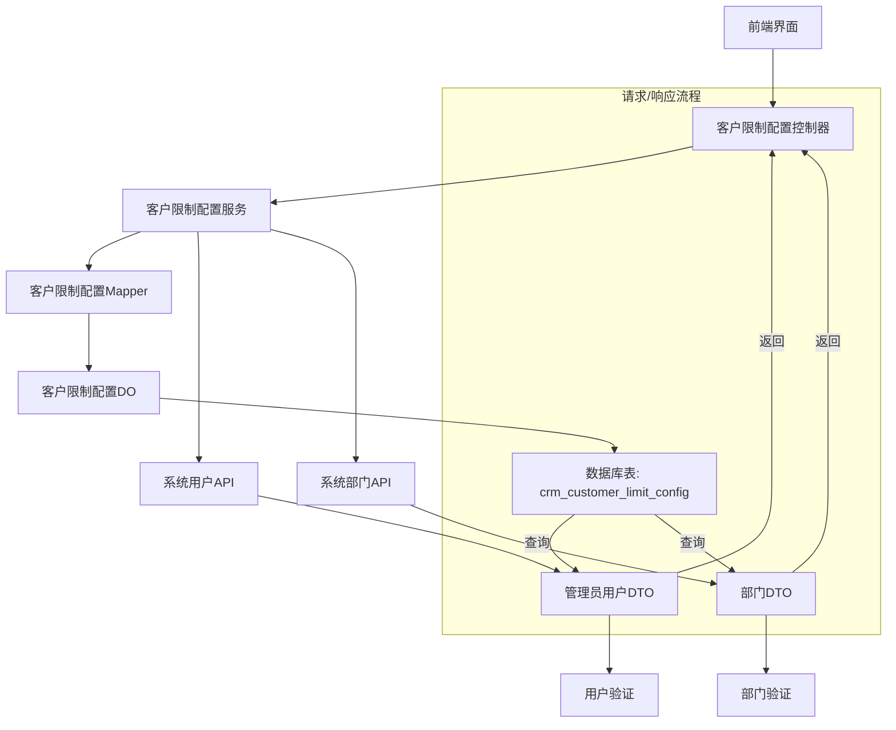

# 客户限制配置模块文档

## 概述

客户限制配置模块是Yudao CRM系统中用于管理客户数量限制规则的核心组件。该模块允许系统管理员为特定用户和部门设置客户数量限制规则，以控制客户分配和所有权范围。通过这些配置，可以确保客户资源得到合理分配，避免客户数量无限制增长，同时支持不同的限制类型和特殊规则（如成交客户是否占用拥有客户数）。

## 模块功能

### 核心功能
1. **创建客户限制配置** - 为特定用户/部门创建新的客户数量限制规则
2. **更新客户限制配置** - 修改现有的限制规则
3. **删除客户限制配置** - 删除不再需要的限制规则
4. **查询客户限制配置** - 获取单个或多个限制配置信息
5. **分页查询客户限制配置** - 按条件分页查询限制配置列表

### 业务规则
- **规则类型**：支持多种客户限制类型（如客户所有权限制、成交客户限制等）
- **适用人群**：可以指定特定用户或用户组作为规则的适用对象
- **适用部门**：可以指定特定部门作为规则的适用对象
- **数量限制**：设置客户数量的最大限制值
- **成交客户计算**：某些规则类型支持成交客户是否占用拥有客户数的配置

## 架构设计

### 组件关系图


### 数据流向
```mermaid
sequenceDiagram
    participant 用户 as 用户
    participant 前端 as 前端界面
    participant 控制器 as 客户限制配置控制器
    participant 服务 as 客户限制配置服务
    participant 数据库 as 数据库
    participant 用户API as 系统用户API
    participant 部门API as 系统部门API

    用户 -> 前端：创建/更新/查询限制配置
    前端 -> 控制器：HTTP请求
    控制器 -> 服务：业务逻辑处理
    服务 -> 数据库：查询/插入/更新/删除
    服务 -> 用户API：验证用户存在
    服务 -> 部门API：验证部门存在
    数据库 -> 服务：返回数据
    用户API -> 服务：返回用户DTO
    部门API -> 服务：返回部门DTO
    服务 -> 控制器：业务结果
    控制器 -> 前端：HTTP响应
    前端 -> 用户：显示结果
```

## API文档

### 1. 创建客户限制配置
**请求URL：** `POST /crm/customer-limit-config/create`

**请求参数：**
```json
{
  "type": 1,
  "userIds": [1, 2, 3],
  "deptIds": [10, 20],
  "maxCount": 100,
  "dealCountEnabled": true
}
```

**响应：**
```json
{
  "code": 0,
  "msg": "success",
  "data": 1024
}
```

**参数说明：**
- `type`：规则类型，必填
- `userIds`：适用用户ID列表，可选
- `deptIds`：适用部门ID列表，可选
- `maxCount`：数量上限，必填
- `dealCountEnabled`：成交客户是否占用拥有客户数，可选

### 2. 更新客户限制配置
**请求URL：** `PUT /crm/customer-limit-config/update`

**请求参数：**
```json
{
  "id": 1024,
  "type": 2,
  "userIds": [1, 2, 3, 4],
  "deptIds": [10, 20, 30],
  "maxCount": 200,
  "dealCountEnabled": false
}
```

**响应：**
```json
{
  "code": 0,
  "msg": "success",
  "data": true
}
```

### 3. 删除客户限制配置
**请求URL：** `DELETE /crm/customer-limit-config/delete?id=1024`

**响应：**
```json
{
  "code": 0,
  "msg": "success",
  "data": true
}
```

### 4. 获取客户限制配置
**请求URL：** `GET /crm/customer-limit-config/get?id=1024`

**响应：**
```json
{
  "code": 0,
  "msg": "success",
  "data": {
    "id": 1024,
    "type": 1,
    "userIds": [1, 2, 3],
    "deptIds": [10, 20],
    "maxCount": 100,
    "dealCountEnabled": true,
    "users": [
      {"id": 1, "name": "张三"},
      {"id": 2, "name": "李四"},
      {"id": 3, "name": "王五"}
    ],
    "depts": [
      {"id": 10, "name": "销售部"},
      {"id": 20, "name": "市场部"}
    ],
    "createTime": "2024-01-01 10:00:00"
  }
}
```

### 5. 分页查询客户限制配置
**请求URL：** `GET /crm/customer-limit-config/page?type=1&pageNo=1&pageSize=10`

**响应：**
```json
{
  "code": 0,
  "msg": "success",
  "data": {
    "list": [
      {
        "id": 1024,
        "type": 1,
        "userIds": [1, 2, 3],
        "deptIds": [10, 20],
        "maxCount": 100,
        "dealCountEnabled": true,
        "users": [
          {"id": 1, "name": "张三"},
          {"id": 2, "name": "李四"},
          {"id": 3, "name": "王五"}
        ],
        "depts": [
          {"id": 10, "name": "销售部"},
          {"id": 20, "name": "市场部"}
        ],
        "createTime": "2024-01-01 10:00:00"
      }
    ],
    "total": 100
  }
}
```

## 数据模型

### 客户限制配置DO

| 字段名 | 类型 | 描述 | 是否必填 | 示例 |
|--------|------|------|----------|------|
| id | Long | 编号 | 是 | 1024 |
| type | Integer | 规则类型 | 是 | 1 |
| userIds | List<Long> | 规则适用人群 | 否 | [1, 2, 3] |
| deptIds | List<Long> | 规则适用部门 | 否 | [10, 20] |
| maxCount | Integer | 数量上限 | 是 | 100 |
| dealCountEnabled | Boolean | 成交客户是否占用拥有客户数 | 否 | true |
| createTime | LocalDateTime | 创建时间 | 是 | 2024-01-01 10:00:00 |

### 枚举类型

**客户限制配置类型枚举 (CrmCustomerLimitConfigTypeEnum)**
- `1`：客户所有权限制
- `2`：成交客户限制
- `3`：其他限制类型

## 权限控制

### 访问控制
- **创建权限**：`crm:customer-limit-config:create`
- **更新权限**：`crm:customer-limit-config:update`
- **删除权限**：`crm:customer-limit-config:delete`
- **查询权限**：`crm:customer-limit-config:query`

### 数据权限
- **用户级别**：用户只能查看和修改自己创建的限制配置
- **部门级别**：部门管理员可以管理本部门的限制配置
- **系统级别**：系统管理员可以管理所有限制配置

## 业务规则

### 1. 规则类型适用
- **客户所有权限制 (type=1)**：限制特定用户/部门可以拥有的客户数量
- **成交客户限制 (type=2)**：限制特定用户/部门可以成交的客户数量
- **其他类型**：根据业务需求扩展

### 2. 用户和部门验证
- 创建或更新限制配置时，必须验证用户和部门的存在性
- 支持批量验证用户和部门列表

### 3. 成交客户计算
- 仅当规则类型为 `1` 时，`dealCountEnabled` 字段才生效
- 当 `dealCountEnabled` 为 `true` 时，成交客户将占用用户/部门的客户数量
- 当 `dealCountEnabled` 为 `false` 时，成交客户不会占用用户/部门的客户数量

## 错误码

| 错误码 | 描述 | 解决方法 |
|--------|------|----------|
| 客户限制配置不存在 | 请求的客户限制配置不存在 | 检查配置ID是否正确，或联系管理员 |
| 用户不存在 | 指定的用户不存在 | 检查用户ID是否正确，或联系用户 |
| 部门不存在 | 指定的部门不存在 | 检查部门ID是否正确，或联系部门 |

## 扩展点

### 1. 规则类型扩展
可以通过在 `CrmCustomerLimitConfigTypeEnum` 中添加新的枚举值来扩展规则类型

### 2. 验证规则扩展
可以通过实现 `DataPermissionRule` 接口来添加新的数据权限验证规则

### 3. 业务逻辑扩展
可以通过在 `CrmCustomerLimitConfigService` 中添加新的方法来扩展业务逻辑

## 监控与日志

### 日志记录
- **创建日志**：记录创建客户限制配置的操作
- **更新日志**：记录更新客户限制配置的操作
- **删除日志**：记录删除客户限制配置的操作

### 监控指标
- **限制配置数量**：实时监控限制配置总数
- **规则类型分布**：按规则类型统计限制配置数量
- **用户/部门适用情况**：统计限制配置中用户和部门的应用情况

## 维护与注意事项

### 1. 数据备份
- 定期备份 `crm_customer_limit_config` 表
- 重要配置变更前应进行备份

### 2. 权限管理
- 定期审核限制配置的访问权限
- 确保权限设置符合业务需求

### 3. 性能优化
- 为 `type`、`userIds`、`deptIds` 字段建立索引
- 定期清理过期的限制配置

### 4. 安全考虑
- 限制配置涉及敏感的客户资源，应加强访问控制
- 定期检查限制配置的变更记录

## 其他模块关联

### 1. 与客户模块的关系
- 客户限制配置直接影响客户分配和所有权
- 客户模块在分配客户时需要检查限制配置

### 2. 与用户模块的关系
- 限制配置可以指定特定用户
- 用户模块需要验证用户是否受限制配置约束

### 3. 与部门模块的关系
- 限制配置可以指定特定部门
- 部门模块需要验证部门是否受限制配置约束

## 开发指南

### 1. 新功能开发
1. 首先了解现有的限制配置类型和业务规则
2. 根据业务需求设计新的规则类型
3. 实现新的规则类型处理逻辑
4. 更新API文档和前端界面
5. 编写单元测试和集成测试

### 2. 缺陷修复
1. 分析缺陷根源
2. 制定修复方案
3. 编写测试用例
4. 实施修复并验证
5. 更新文档

### 3. 性能优化
1. 分析性能瓶颈
2. 优化数据库查询
3. 缓存常用数据
4. 监控性能指标

## 附录

### 1. 代码结构
```
yudao-module-crm/
├── src/main/java/cn/iocoder/yudao/module/crm/controller/admin/customer/
│   └── CrmCustomerLimitConfigController.java
├── src/main/java/cn/iocoder/yudao/module/crm/service/customer/
│   └── CrmCustomerLimitConfigServiceImpl.java
├── src/main/java/cn/iocoder/yudao/module/crm/dal/mapper/
│   └── CrmCustomerLimitConfigMapper.java
├── src/main/java/cn/iocoder/yudao/module/crm/dal/dataobject/customer/
│   └── CrmCustomerLimitConfigDO.java
└── src/main/java/cn/iocoder/yudao/module/crm/controller/admin/customer/vo/limitconfig/
    ├── CrmCustomerLimitConfigRespVO.java
    ├── CrmCustomerLimitConfigSaveReqVO.java
    └── CrmCustomerLimitConfigPageReqVO.java
```

### 2. 依赖关系
- Spring Boot
- MyBatis Plus
- Hutool
- Yudao Framework

### 3. 运行环境
- Java 8 或以上
- MySQL 5.7 或以上
- Maven 3 或以上

### 4. 部署步骤
1. 克隆项目代码
2. 配置数据库连接
3. 运行 Maven 构建
4. 启动 Spring Boot 应用
5. 访问管理界面进行配置

## 结束语

客户限制配置模块是Yudao CRM系统中重要的客户资源管理组件。通过该模块，系统管理员可以有效地控制客户数量分配，确保客户资源得到合理利用，同时支持灵活的规则类型和业务需求。开发人员在扩展和维护该模块时，应充分考虑业务规则、数据安全和性能优化等方面。