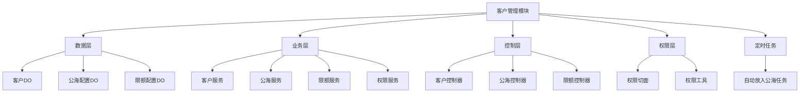
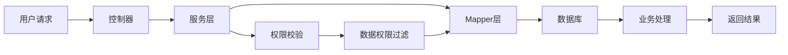

# 客户管理模块文档

## 概述

客户管理模块是yudao框架CRM（客户关系管理）系统中的核心模块，负责处理客户的全生命周期管理。模块提供了客户的创建、查询、更新、删除、转移、锁定、公海管理等完整功能，支持灵活的权限控制和数据权限管理。

## 模块功能

### 核心功能
1. **客户CRUD操作**：创建、更新、查询、删除客户信息
2. **客户转移**：支持客户在不同负责人之间的转移，包括关联数据的转移
3. **客户锁定**：支持锁定/解锁客户，防止被其他用户领取
4. **公海管理**：客户进入/离开公海池的管理，支持自动定时放入公海
5. **跟进管理**：客户跟进状态、最后跟进时间、内容和下次跟进时间管理
6. **成交状态管理**：客户成交状态的标记和查询
7. **客户导入导出**：支持Excel格式的客户数据导入和导出
8. **权限控制**：基于角色和数据的细粒度权限控制

### 业务场景
- **销售跟进**：记录客户跟进情况，管理跟进计划
- **客户分配**：将客户分配给不同的销售代表
- **公海客户管理**：管理未分配的公海客户，实现客户资源的充分利用
- **客户锁定**：防止重要客户被错误转移或跟进
- **客户转移**：在销售代表离职或客户需求变更时转移客户

## 架构设计

### 模块结构


### 数据流向


### 组件关系
1. **客户数据层**：`CrmCustomerDO` - 客户实体数据对象
2. **客户业务层**：`CrmCustomerServiceImpl` - 客户业务逻辑实现
3. **客户控制层**：`CrmCustomerController` - REST API接口
4. **公海管理层**：`CrmCustomerPoolConfigServiceImpl` - 公海配置管理
5. **限额管理层**：`CrmCustomerLimitConfigServiceImpl` - 客户限额管理
6. **权限控制层**：`CrmPermissionAspect` - 客户操作权限控制
7. **定时任务层**：`CrmCustomerAutoPutPoolJob` - 自动放入公海任务

## API文档

### 客户管理API

#### 客户创建
**请求地址**：`POST /crm/customer/create`

**请求参数**：
```json
{
  "name": "张三",
  "mobile": "13800138000",
  "email": "zhangsan@example.com",
  "industryId": 1,
  "level": 1,
  "source": 1,
  "areaId": 110000,
  "detailAddress": "北京市朝阳区",
  "ownerUserId": 1
}
```

**响应**：
```json
{
  "code": 0,
  "msg": "成功",
  "data": 1001
}
```

#### 客户更新
**请求地址**：`PUT /crm/customer/update`

**请求参数**：
```json
{
  "id": 1001,
  "name": "张三",
  "mobile": "13800138000",
  "email": "zhangsan@example.com"
}
```

**响应**：
```json
{
  "code": 0,
  "msg": "成功",
  "data": true
}
```

#### 客户分页查询
**请求地址**：`GET /crm/customer/page`

**查询参数**：
```json
{
  "pageNo": 1,
  "pageSize": 10,
  "name": "张三",
  "mobile": "13800138000",
  "ownerUserId": 1,
  "dealStatus": true,
  "lockStatus": false
}
```

**响应**：
```json
{
  "code": 0,
  "msg": "成功",
  "data": {
    "list": [
      {
        "id": 1001,
        "name": "张三",
        "mobile": "13800138000",
        "email": "zhangsan@example.com",
        "ownerUserId": 1,
        "ownerUserName": "李四",
        "dealStatus": true,
        "lockStatus": false,
        "poolDay": 5
      }
    ],
    "total": 100
  }
}
```

#### 客户删除
**请求地址**：`DELETE /crm/customer/delete?id=1001`

**响应**：
```json
{
  "code": 0,
  "msg": "成功",
  "data": true
}
```

#### 客户转移
**请求地址**：`PUT /crm/customer/transfer`

**请求参数**：
```json
{
  "id": 1001,
  "newOwnerUserId": 2,
  "toBizTypes": ["contact", "business", "contract"]
}
```

**响应**：
```json
{
  "code": 0,
  "msg": "成功",
  "data": true
}
```

#### 客户锁定
**请求地址**：`PUT /crm/customer/lock`

**请求参数**：
```json
{
  "id": 1001,
  "lockStatus": true
}
```

**响应**：
```json
{
  "code": 0,
  "msg": "成功",
  "data": true
}
```

#### 放入公海
**请求地址**：`PUT /crm/customer/put-pool?id=1001`

**响应**：
```json
{
  "code": 0,
  "msg": "成功",
  "data": true
}
```

#### 领取公海客户
**请求地址**：`PUT /crm/customer/receive`

**请求参数**：
```json
{
  "ids": [1001, 1002, 1003],
  "ownerUserId": 1
}
```

**响应**：
```json
{
  "code": 0,
  "msg": "成功",
  "data": true
}
```

#### 分配公海客户
**请求地址**：`PUT /crm/customer/distribute`

**请求参数**：
```json
{
  "ids": [1001, 1002, 1003],
  "ownerUserId": 1
}
```

**响应**：
```json
{
  "code": 0,
  "msg": "成功",
  "data": true
}
```

#### 客户导入
**请求地址**：`POST /crm/customer/import`

**请求参数**：文件上传

**响应**：
```json
{
  "code": 0,
  "msg": "成功",
  "data": {
    "createCustomerNames": ["张三", "李四"],
    "updateCustomerNames": ["王五"],
    "failureCustomerNames": {
      "赵六": "客户名称不能为空"
    }
  }
}
```

#### 客户导出
**请求地址**：`GET /crm/customer/export-excel`

**查询参数**：与分页查询相同

**响应**：Excel文件

## 数据模型

### 客户数据对象 (CrmCustomerDO)

| 字段名 | 数据类型 | 描述 | 是否必填 |
|--------|----------|------|--------|
| id | Long | 客户编号 | 是 |
| name | String | 客户名称 | 是 |
| mobile | String | 手机 | 否 |
| telephone | String | 电话 | 否 |
| qq | String | QQ | 否 |
| wechat | String | 微信 | 否 |
| email | String | 邮箱 | 否 |
| areaId | Integer | 所在地ID | 否 |
| detailAddress | String | 详细地址 | 否 |
| industryId | Integer | 所属行业 | 否 |
| level | Integer | 客户等级 | 否 |
| source | Integer | 客户来源 | 否 |
| remark | String | 备注 | 否 |
| ownerUserId | Long | 负责人ID | 是 |
| ownerTime | LocalDateTime | 负责时间 | 是 |
| lockStatus | Boolean | 锁定状态 | 是 |
| dealStatus | Boolean | 成交状态 | 是 |
| followUpStatus | Boolean | 跟进状态 | 是 |
| contactLastTime | LocalDateTime | 最后跟进时间 | 否 |
| contactLastContent | String | 最后跟进内容 | 否 |
| contactNextTime | LocalDateTime | 下次联系时间 | 否 |

### 公海配置数据对象 (CrmCustomerPoolConfigDO)

| 字段名 | 数据类型 | 描述 | 默认值 |
|--------|----------|------|--------|
| id | Long | 编号 | 自动生成 |
| enabled | Boolean | 是否启用客户公海 | true |
| contactExpireDays | Integer | 未跟进放入公海天数 | 30 |
| dealExpireDays | Integer | 未成交放入公海天数 | 90 |
| notifyEnabled | Boolean | 是否开启提前提醒 | true |
| notifyDays | Integer | 提前提醒天数 | 3 |

### 客户限额配置数据对象 (CrmCustomerLimitConfigDO)

| 字段名 | 数据类型 | 描述 |
|--------|----------|------|
| id | Long | 编号 |
| type | Integer | 规则类型 |
| userIds | List<Long> | 规则适用用户ID列表 |
| deptIds | List<Long> | 规则适用部门ID列表 |
| maxCount | Integer | 数量上限 |
| dealCountEnabled | Boolean | 成交客户是否占有拥有客户数 |

## 权限控制

### 权限级别

| 权限级别 | 数值 | 描述 |
|----------|-------|------|
| 拥有者 | 1 | 拥有客户的所有权限 |
| 写权限 | 2 | 可以修改客户信息 |
| 读权限 | 3 | 只能查看客户信息 |

### 权限控制规则

1. **超级管理员**：拥有所有权限
2. **负责人**：拥有客户的所有权限
3. **写权限用户**：可以修改客户信息，但不能转移客户
4. **读权限用户**：只能查看客户信息
5. **下属用户**：可以查看下属负责人的客户

### 权限控制切面

```java
@CrmPermission(bizType = CrmBizTypeEnum.CRM_CUSTOMER, bizId = "#id", level = CrmPermissionLevelEnum.WRITE)
public void updateCustomer(CrmCustomerSaveReqVO updateReqVO)
```

## 定时任务

### 自动放入公海任务

**任务名称**：`CrmCustomerAutoPutPoolJob`

**执行周期**：每天凌晨2点

**功能**：自动将符合条件的客户放入公海

**执行逻辑**：
1. 查询公海配置
2. 查询需要放入公海的客户列表
3. 逐个放入公海
4. 记录放入日志

## 数据权限控制

### 数据权限控制规则

1. **我负责的数据**：查询自己负责的客户
2. **我参与的数据**：查询自己有读或写权限的客户（不包括自己负责的客户）
3. **下属负责的数据**：查询下属负责人的客户

### 数据权限控制实现

```java
public static <T extends MPJLambdaWrapper<?>, S> void appendPermissionCondition(T query, Integer bizType, SFunction<S, ?> bizId,
                                                                                Long userId, Integer sceneType) {
    // 场景一：我负责的数据
    if (CrmSceneTypeEnum.isOwner(sceneType)) {
        query.eq(ownerUserIdField, userId);
    }
    // 场景二：我参与的数据
    if (CrmSceneTypeEnum.isInvolved(sceneType)) {
        if (CrmPermissionUtils.isCrmAdmin()) {
            return;
        }
        query.innerJoin(CrmPermissionDO.class, on -> on.eq(CrmPermissionDO::getBizType, bizType)
                .eq(CrmPermissionDO::getBizId, bizId)
                .in(CrmPermissionDO::getLevel, CrmPermissionLevelEnum.READ.getLevel(), CrmPermissionLevelEnum.WRITE.getLevel())
                .eq(CrmPermissionDO::getUserId,userId));
        query.ne(ownerUserIdField, userId);
    }
    // 场景三：下属负责的数据
    if (CrmSceneTypeEnum.isSubordinate(sceneType)) {
        AdminUserApi adminUserApi = SpringUtil.getBean(AdminUserApi.class);
        List<AdminUserRespDTO> subordinateUsers = adminUserApi.getUserListBySubordinate(userId);
        if (CollUtil.isEmpty(subordinateUsers)) {
            query.eq(ownerUserIdField, -1);
        } else {
            query.in(ownerUserIdField, convertSet(subordinateUsers, AdminUserRespDTO::getId));
        }
    }
}
```

## 监控与日志

### 操作日志

所有客户操作都会记录操作日志，包括：

- 创建客户
- 更新客户
- 删除客户
- 转移客户
- 锁定/解锁客户
- 放入公海
- 领取客户
- 分配客户
- 导入客户

### 监控指标

1. **客户总数**：系统中客户的总数量
2. **今日需跟进客户数**：今天需要跟进的客户数量
3. **待进入公海客户数**：距离进入公海的天数小于等于提醒天的客户数量
4. **公海客户总数**：当前在公海中的客户数量
5. **分配中客户数**：正在分配中的客户数量

## 扩展性

### 模块扩展

1. **客户扩展字段**：支持扩展客户字段，满足不同业务需求
2. **客户状态扩展**：支持自定义客户状态
3. **客户来源扩展**：支持自定义客户来源
4. **客户等级扩展**：支持自定义客户等级

### 接口扩展

1. **客户API**：提供客户相关的REST API接口
2. **权限API**：提供权限相关的API接口
3. **日志API**：提供操作日志相关的API接口

## 性能优化

### 缓存策略

1. **用户缓存**：缓存用户信息
2. **部门缓存**：缓存部门信息
3. **权限缓存**：缓存权限信息
4. **客户缓存**：缓存常用客户信息

### 索引策略

1. **客户名称索引**：支持客户名称查询
2. **负责人索引**：支持按负责人查询
3. **成交状态索引**：支持按成交状态查询
4. **锁定状态索引**：支持按锁定状态查询

## 安全考虑

### 数据安全

1. **数据隔离**：通过权限控制确保用户只能访问自己的数据
2. **数据加密**：敏感字段加密存储
3. **操作审计**：记录所有客户操作
4. **访问控制**：基于角色的访问控制

### 系统安全

1. **输入验证**：对所有输入进行验证
2. **SQL注入防护**：使用参数化查询
3. **XSS防护**：对输出进行过滤
4. **CSRF防护**：使用Token验证

## 维护与运维

### 日常维护

1. **日志监控**：监控系统日志，发现问题及时处理
2. **性能监控**：监控系统性能，发现瓶颈及时优化
3. **数据备份**：定期备份客户数据
4. **安全扫描**：定期扫描系统安全漏洞

### 故障处理

1. **客户不存在**：返回404错误
2. **权限不足**：返回403错误
3. **数据重复**：返回错误信息
4. **系统异常**：返回500错误

## 版本历史

### v1.0.0
- 初始版本
- 基本客户管理功能

### v1.1.0
- 添加公海管理功能
- 优化权限控制

### v1.2.0
- 添加客户导入导出功能
- 优化性能

### v1.3.0
- 添加客户限额管理功能
- 优化日志记录

## 附录

### 常用枚举

#### CrmBizTypeEnum
客户业务类型枚举

#### CrmPermissionLevelEnum
客户权限级别枚举

#### CrmSceneTypeEnum
客户场景类型枚举

### 常用常量

#### CRM_CUSTOMER_TYPE
客户操作日志类型

#### CRM_CUSTOMER_CREATE_SUB_TYPE
客户创建子类型

#### CRM_CUSTOMER_UPDATE_SUB_TYPE
客户更新子类型

### 错误码

| 错误码 | 错误信息 | 描述 |
|--------|----------|------|
| 1001 | 客户不存在 | 客户不存在 |
| 1002 | 客户已存在 | 客户已存在 |
| 1003 | 客户名称不能为空 | 客户名称不能为空 |
| 1004 | 客户手机号格式不正确 | 客户手机号格式不正确 |
| 1005 | 客户邮箱格式不正确 | 客户邮箱格式不正确 |
| 1006 | 客户所属行业不存在 | 客户所属行业不存在 |
| 1007 | 客户等级不存在 | 客户等级不存在 |
| 1008 | 客户来源不存在 | 客户来源不存在 |
| 1009 | 客户所在地区不存在 | 客户所在地区不存在 |
| 1010 | 客户负责人不存在 | 客户负责人不存在 |
| 1011 | 客户已锁定 | 客户已锁定 |
| 1012 | 客户已成交 | 客户已成交 |
| 1013 | 客户已在公海 | 客户已在公海 |
| 1014 | 客户不在公海 | 客户不在公海 |
| 1015 | 客户已分配 | 客户已分配 |
| 1016 | 客户未分配 | 客户未分配 |
| 1017 | 客户已跟进 | 客户已跟进 |
| 1018 | 客户未跟进 | 客户未跟进 |
| 1019 | 客户已逾期 | 客户已逾期 |
| 1020 | 客户未逾期 | 客户未逾期 |

### 常见问题

#### 问题1：客户转移时关联数据是否也会转移？

**答案**：是的。当客户转移时，如果指定了关联业务类型（如联系人、商机、合同），这些关联数据也会被转移到新负责人。

#### 问题2：如何查看客户的操作日志？

**答案**：可以通过操作日志查询功能查看客户的所有操作记录，包括创建、更新、删除、转移、锁定等操作。

#### 问题3：如何查看客户的权限信息？

**答案**：可以通过权限查询功能查看客户的权限信息，包括拥有者、写权限和读权限的用户列表。

#### 问题4：客户放入公海后如何找回？

**答案**：客户放入公海后，可以通过领取公海客户功能领取，指定负责人即可找回客户。

#### 问题5：如何查看客户的跟进情况？

**答案**：可以通过客户跟进管理功能查看客户的跟进情况，包括最后跟进时间、跟进内容和下次跟进时间。

## 结束语

客户管理模块是yudao框架CRM系统中的核心模块，提供了完整客户生命周期管理功能。模块设计遵循了权限控制、数据安全、性能优化等原则，满足了企业客户关系管理的各种需求。通过持续的维护和优化，客户管理模块将为企业提供更好的客户管理体验。