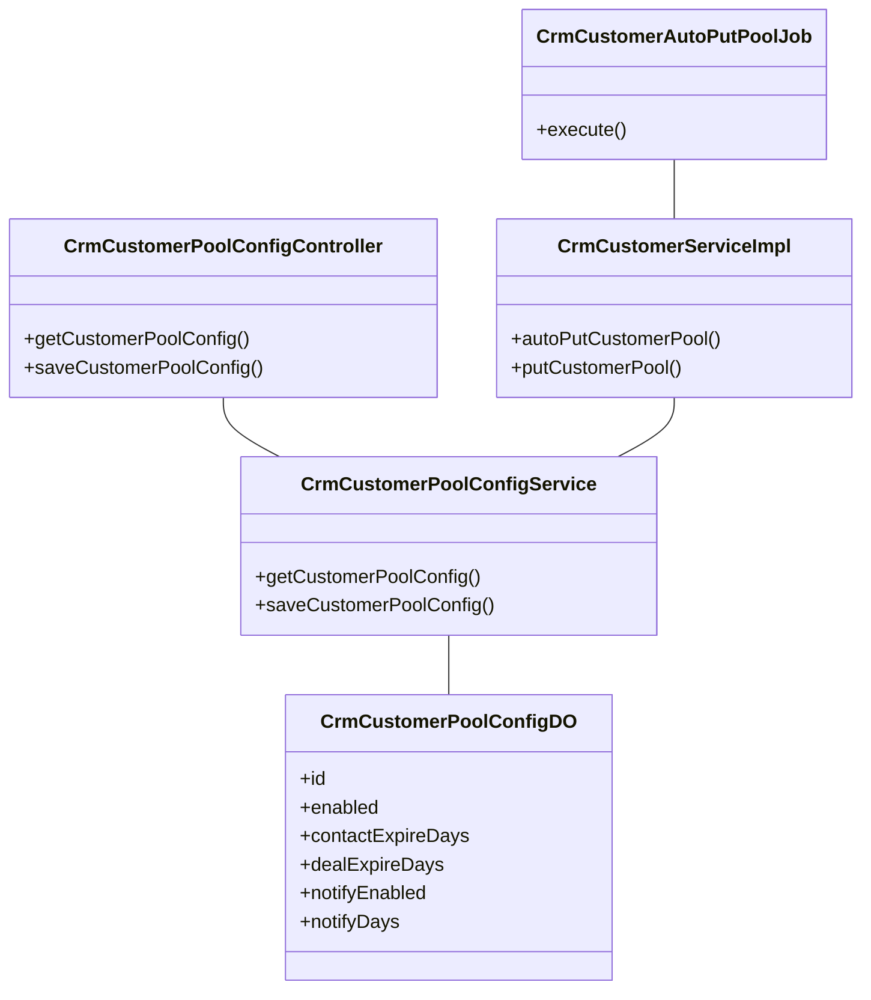
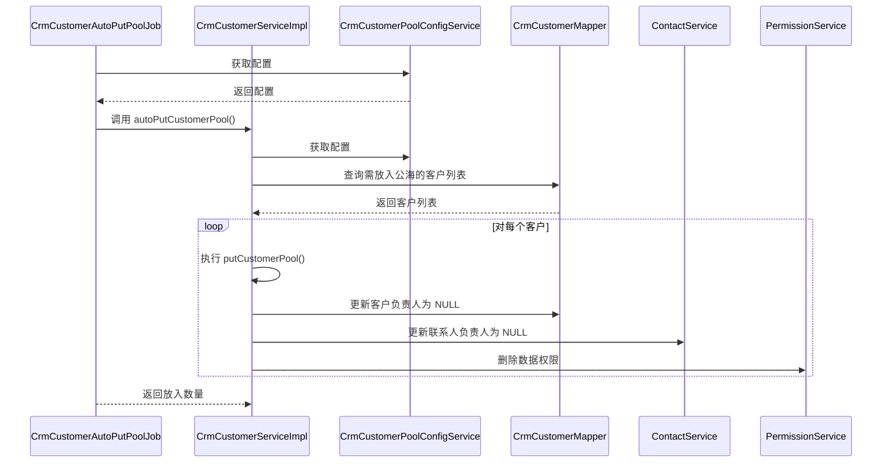

# 客户公海配置模块文档

## 1. 概述

客户公海配置模块是 CRM 系统中的核心功能之一，用于管理客户公海池的规则设置。客户公海机制可以帮助企业有效管理客户资源，避免客户资源流失，提高销售团队的工作效率。

当客户在一定时间内没有跟进或没有成交时，系统会自动将客户放入公海池，其他销售人员可以领取这些客户。该模块主要配置客户放入公海池的规则，包括：
- 是否启用客户公海功能
- 未跟进放入公海的天数
- 未成交放入公海的天数
- 是否开启提前提醒
- 提前提醒的天数

## 2. 架构设计

### 2.1 模块组成

客户公海配置模块由以下核心组件构成：



### 2.2 组件关系

- **CrmCustomerPoolConfigController**: 提供 RESTful API，负责接收前端请求，调用服务层处理业务逻辑。
- **CrmCustomerPoolConfigService**: 服务层接口实现，负责客户公海配置数据的增删改查操作。
- **CrmCustomerPoolConfigDO**: 数据对象，对应数据库表 `crm_customer_pool_config`，存储客户公海配置信息。
- **CrmCustomerAutoPutPoolJob**: 定时任务，负责定期将符合条件的客户自动放入公海池。
- **CrmCustomerServiceImpl**: 客户业务服务，包含 `autoPutCustomerPool()` 方法，用于执行自动放入公海池的逻辑。

## 3. 核心功能

### 3.1 获取客户公海配置

**API**: `GET /crm/customer-pool-config/get`

**权限**: `crm:customer-pool-config:query`

**响应示例**:
```json
{
  "code": 200,
  "message": "成功",
  "data": {
    "enabled": true,
    "contactExpireDays": 2,
    "dealExpireDays": 2,
    "notifyEnabled": true,
    "notifyDays": 2
  }
}
```

### 3.2 保存客户公海配置

**API**: `PUT /crm/customer-pool-config/save`

**权限**: `crm:customer-pool-config:update`

**请求参数**:
| 字段 | 类型 | 必填 | 说明 |
|------|------|------|------|
| enabled | Boolean | 是 | 是否启用客户公海 |
| contactExpireDays | Integer | 否（启用时为必填） | 未跟进放入公海天数 |
| dealExpireDays | Integer | 否（启用时为必填） | 未成交放入公海天数 |
| notifyEnabled | Boolean | 否 | 是否开启提前提醒 |
| notifyDays | Integer | 否（开启提醒时为必填） | 提前提醒天数 |

**请求示例**:
```json
{
  "enabled": true,
  "contactExpireDays": 2,
  "dealExpireDays": 2,
  "notifyEnabled": true,
  "notifyDays": 2
}
```

### 3.3 自动放入公海池定时任务

定时任务 `CrmCustomerAutoPutPoolJob` 会定期执行，检查是否有客户需要放入公海池。执行流程如下：



## 4. 数据模型

### 4.1 客户公海配置表 (crm_customer_pool_config)

| 字段 | 类型 | 说明 | 备注 |
|------|------|------|------|
| id | BIGINT | 主键 | 自增 |
| enabled | BOOLEAN | 是否启用客户公海 | 默认 false |
| contactExpireDays | INTEGER | 未跟进放入公海天数 | |
| dealExpireDays | INTEGER | 未成交放入公海天数 | |
| notifyEnabled | BOOLEAN | 是否开启提前提醒 | 默认 false |
| notifyDays | INTEGER | 提前提醒天数 | |

### 4.2 数据对象 (DO)

```java
@TableInfo(value = "crm_customer_pool_config")
@Data
@Builder
@NoArgsConstructor
@AllArgsConstructor
public class CrmCustomerPoolConfigDO extends BaseDO {
    private Long id;
    private Boolean enabled;
    private Integer contactExpireDays;
    private Integer dealExpireDays;
    private Boolean notifyEnabled;
    private Integer notifyDays;
}
```

## 5. 业务流程

### 5.1 配置保存流程

1. 前端调用 `PUT /crm/customer-pool-config/save` 接口提交配置
2. 控制器进行权限校验和参数验证
3. 服务层检查配置是否存在：
   - 存在：执行更新操作，记录日志上下文
   - 不存在：执行插入操作，记录日志上下文
4. 返回操作结果

### 5.2 自动放入公海流程

1. 定时任务 `CrmCustomerAutoPutPoolJob` 触发
2. 获取客户公海配置，检查是否启用
3. 查询需要放入公海的客户（未跟进超过指定天数或未成交超过指定天数）
4. 对每个客户执行 `putCustomerPool()` 操作：
   - 将客户负责人设置为 NULL
   - 更新联系人负责人为 NULL
   - 删除客户的数据权限
   - 记录负责人变更日志
5. 返回放入公海的客户数量

## 6. 依赖关系

客户公海配置模块依赖以下模块：

| 模块 | 依赖组件 | 说明 |
|------|----------|------|
| CRM 模块 | CrmCustomerService | 执行自动放入公海操作 |
| CRM 模块 | CrmPermissionService | 管理数据权限 |
| CRM 模块 | CrmContactService | 更新联系人负责人 |
| 系统模块 | TenantContext | 租户上下文支持 |
| 系统模块 | LogRecord | 操作日志记录 |

## 7. 相关接口

| 接口路径 | 方法 | 描述 | 权限 |
|----------|------|------|------|
| `/crm/customer-pool-config/get` | GET | 获取客户公海配置 | `crm:customer-pool-config:query` |
| `/crm/customer-pool-config/save` | PUT | 保存客户公海配置 | `crm:customer-pool-config:update` |

## 8. 前端对接

前端页面通过调用上述接口获取和保存客户公海配置。配置项包括：

- 启用开关
- 未跟进放入公海天数
- 未成交放入公海天数
- 提前提醒开关
- 提前提醒天数

前端需对启用状态下的天数字段进行必填校验，对提醒开关下的提醒天数进行必填校验。

## 9. 注意事项

1. **配置唯一性**: 客户公海配置表中只允许存在一条记录，使用 `selectOne()` 查询。
2. **事务管理**: 自动放入公海池的操作需要在事务中执行，确保数据一致性。
3. **权限控制**: 配置修改需要 `crm:customer-pool-config:update` 权限，查询需要 `crm:customer-pool-config:query` 权限。
4. **租户隔离**: 定时任务支持租户隔离，每个租户独立执行自动放入公海操作。
5. **日志记录**: 配置修改操作会记录操作日志，便于审计追踪。
