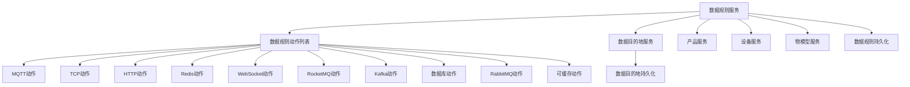
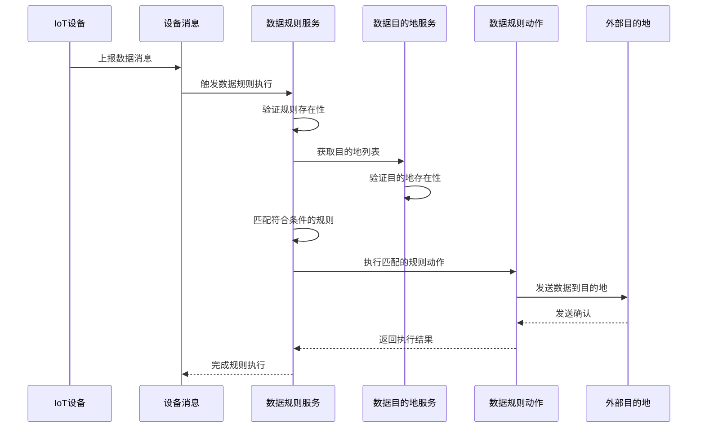

# 数据模块 (Data Module)

## 概述

数据模块是物联网(IoT)系统中的核心组件，负责定义和执行物联网设备数据的转换规则和目的地配置。该模块使得系统能够根据设备上报的数据特征（产品、设备、物模型标识符等）自动将数据路由到各种目的地，如消息队列、数据库、Web服务等。

## 架构概述

数据模块主要由以下几个核心组件组成：

1. **数据规则服务 (IotDataRuleService)** - 管理数据转换规则的创建、更新、删除和执行
2. **数据目的地服务 (IotDataSinkService)** - 管理数据目的地的配置和维护
3. **数据规则动作 (IotDataRuleAction)** - 各种具体的数据转换实现，对应不同的目的地类型

### 组件关系图

## 功能说明

### 数据规则服务 (IotDataRuleService)

数据规则服务负责管理物联网数据转换规则的完整生命周期，包括：

- 规则的创建、更新和删除
- 规则名称唯一性验证
- 数据源配置验证（产品、设备、物模型）
- 规则执行：根据设备上报的数据匹配相应的规则并触发数据转换
- 缓存优化：使用Redis缓存提高规则匹配性能

详细文档请参见：[数据规则服务](data_data_rule_service.md)

### 数据目的地服务 (IotDataSinkService)

数据目的地服务负责管理数据转换的目的地配置，包括：

- 目的地的创建、更新和删除
- 目的地名称唯一性验证
- 目的地使用情况检查（防止删除正在使用的目的地）
- 目的地状态管理（启用/禁用）
- 缓存优化：使用Redis缓存提高目的地查询性能

详细文档请参见：[数据目的地服务](data_sink_service.md)

### 数据规则动作 (IotDataRuleAction)

数据规则动作是具体的数据转换实现，每种动作对应一种特定的目的地类型。系统通过插件化的方式支持多种目的地：

- MQTT动作：将数据发送到MQTT代理
- TCP动作：通过TCP连接发送数据
- HTTP动作：通过HTTP/HTTPS请求发送数据
- Redis动作：将数据存储到Redis
- WebSocket动作：通过WebSocket连接发送数据
- RocketMQ动作：将数据发送到RocketMQ
- Kafka动作：将数据发送到Apache Kafka
- 数据库动作：将数据存储到关系型数据库
- RabbitMQ动作：将数据发送到RabbitMQ
- 可缓存动作：支持结果缓存的动作基类

详细文档请参见：[数据规则动作](data_data_rule_actions.md)

## 与其他模块的关系

数据模块依赖于以下其他模块的服务：

- [产品服务](../iot/iot_product_service.md)：验证产品信息
- [设备服务](../iot/iot_device_service.md)：验证设备信息
- [物模型服务](../iot/iot_thingmodel_service.md)：验证物模型信息
- [数据目的地服务](data_sink_service.md)：获取目的地配置

数据模块为以下模块提供服务：

- 物联网设备消息处理：当设备上报消息时，数据模块负责匹配规则并执行数据转换
- 物联网规则引擎：作为场景规则的数据处理组件

## 数据流程

## 配置说明

数据模块通过以下方式进行配置：

1. 数据规则：通过后台管理界面或API创建和管理
2. 数据目的地：通过后台管理界面或API创建和管理
3. 动作实现：通过Spring Bean注入自动发现和加载

所有配置都存储在数据库中，并通过Redis缓存提高访问性能。

## 扩展点

数据模块设计具有良好的扩展性：

1. 新增数据目的地类型：实现 `IotDataRuleAction` 接口并注册为Spring Bean
2. 自定义规则匹配逻辑：通过扩展 `IotDataRuleService` 实现
3. 缓存策略：可以通过修改Redis key策略来调整缓存行为

## 安全考虑

1. 数据验证：所有输入参数都经过严格验证，防止注入攻击
2. 权限控制：通过后台管理系统的权限机制控制对规则和目的地的访问
3. 隔离性：不同租户的数据规则和目的地相互隔离
4. 异常处理：所有操作都有完善的异常处理机制，防止单点故障影响整个系统