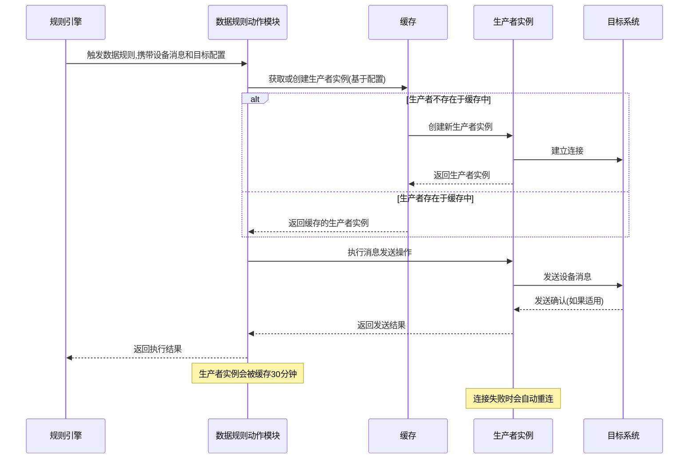
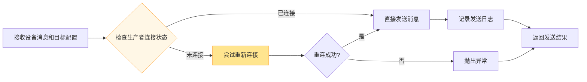
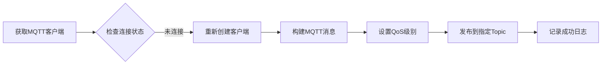
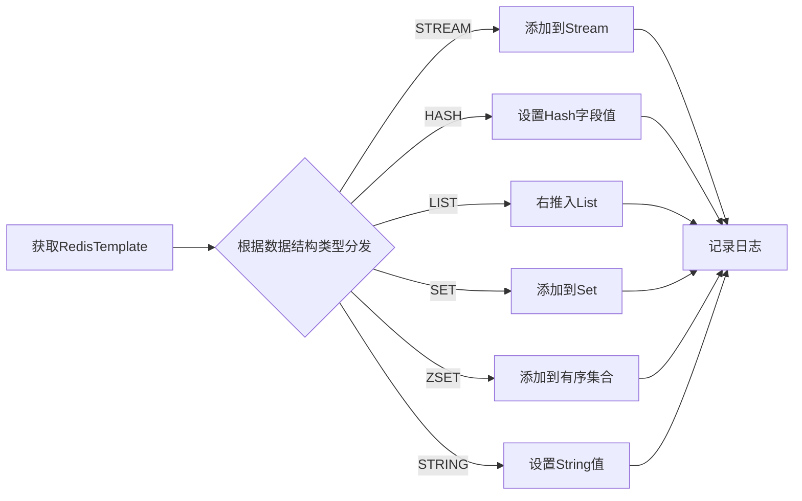
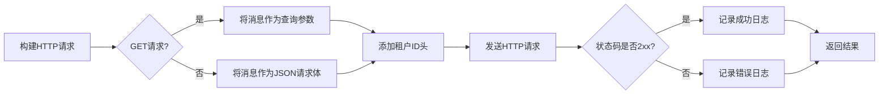

# 数据规则动作模块 (Data Rule Actions Module)

## 概述

数据规则动作模块是物联网(IoT)模块中的核心组件，负责将设备消息根据预定义的规则转发到各种外部系统。该模块提供了一个可扩展的框架，支持将IoT设备数据发送到多种目标系统，包括消息队列(MQTT、Kafka、RocketMQ、RabbitMQ)、数据库、缓存(Redis)、Web服务(HTTP、WebSocket)等。

该模块的设计遵循策略模式，通过抽象基类 `IotDataRuleCacheableAction` 提供统一的接口和缓存机制，各具体实现类负责与不同目标系统的通信细节。

## 核心功能

1. **设备消息路由**：根据数据规则配置，将IoT设备消息路由到指定的目标系统
2. **多目标支持**：支持多种目标系统的数据发送，包括但不限于：
   - 消息队列：MQTT、Kafka、RocketMQ、RabbitMQ
   - 数据库：通过JDBC连接各种关系型数据库
   - 缓存：Redis（支持多种数据结构）
   - Web服务：HTTP和WebSocket
   - 原生TCP：直接TCP socket通信
3. **连接管理**：通过缓存机制高效管理与目标系统的连接，自动处理连接生命周期
4. **异常处理**：统一的异常处理和日志记录机制
5. **可扩展性**：通过实现特定接口，可以轻松添加新的目标系统支持

## 模块结构

数据规则动作模块包含以下核心组件：

| 组件名称 | 负责目标系统 | 主要职责 |
|---------|-------------|----------|
| IotMqttDataRuleAction | MQTT | 将设备消息发送到MQTT代理 |
| IotTcpDataRuleAction | TCP | 通过TCP socket发送设备消息 |
| IotHttpDataSinkAction | HTTP | 通过HTTP/REST API发送设备消息 |
| IotRedisRuleAction | Redis | 将设备消息存储到Redis（支持多种数据结构） |
| IotWebSocketDataRuleAction | WebSocket | 通过WebSocket连接发送设备消息 |
| IotRocketMQDataRuleAction | RocketMQ | 将设备消息发送到RocketMQ |
| IotKafkaDataRuleAction | Kafka | 将设备消息发送到Kafka |
| IotDatabaseDataRuleAction | 数据库 | 通过JDBC将设备消息写入数据库表 |
| IotRabbitMQDataRuleAction | RabbitMQ | 将设备消息发送到RabbitMQ |
| IotDataRuleCacheableAction | 抽象基类 | 提供统一的缓存机制和通用接口 |

## 架构设计

以下是数据规则动作模块的架构图：

```mermaid
classDiagram
    class IotDataRuleAction {
        <<interface>>
        +Integer getType()
        +void execute(IotDeviceMessage message, IotDataSinkDO dataSink)
    }
    
    class IotDataRuleCacheableAction<Config, Producer> {
        <<abstract>>
        -LoadingCache~Config, Producer~ PRODUCER_CACHE
        +void execute(IotDeviceMessage message, IotDataSinkDO dataSink)
        #abstract Producer initProducer(Config config)
        #abstract void closeProducer(Producer producer)
        #abstract void execute(IotDeviceMessage message, Config config)
        #protected Producer getProducer(Config config)
        #protected void invalidateProducer(Config config)
    }
    
    IotDataRuleAction <|.. IotDataRuleCacheableAction
    
    class IotMqttDataRuleAction {
        +Integer getType()
        +void execute(IotDeviceMessage message, IotDataSinkMqttConfig config)
        #MqttClient initProducer(IotDataSinkMqttConfig config)
        #void closeProducer(MqttClient producer)
        #void execute(IotDeviceMessage message, IotDataSinkMqttConfig config)
    }
    
    class IotTcpDataRuleAction {
        +Integer getType()
        #IotTcpClient initProducer(IotDataSinkTcpConfig config)
        #void closeProducer(IotTcpClient producer)
        #void execute(IotDeviceMessage message, IotDataSinkTcpConfig config)
    }
    
    class IotHttpDataSinkAction {
        +Integer getType()
        +void execute(IotDeviceMessage message, IotDataSinkDO dataSink)
    }
    
    class IotRedisRuleAction {
        +Integer getType()
        +void execute(IotDeviceMessage message, IotDataSinkRedisConfig config)
        #RedisTemplate~String, Object~ initProducer(IotDataSinkRedisConfig config)
        #void closeProducer(RedisTemplate~String, Object~ producer)
        #void execute(IotDeviceMessage message, IotDataSinkRedisConfig config)
        #void executeStream(RedisTemplate~String, Object~ redisTemplate, IotDataSinkRedisConfig config, String messageJson)
        #void executeHash(RedisTemplate~String, Object~ redisTemplate, IotDataSinkRedisConfig config, IotDeviceMessage message, String messageJson)
        #void executeList(RedisTemplate~String, Object~ redisTemplate, IotDataSinkRedisConfig config, String messageJson)
        #void executeSet(RedisTemplate~String, Object~ redisTemplate, IotDataSinkRedisConfig config, String messageJson)
        #void executeZSet(RedisTemplate~String, Object~ redisTemplate, IotDataSinkRedisConfig config, IotDeviceMessage message, String messageJson)
        #void executeString(RedisTemplate~String, Object~ redisTemplate, IotDataSinkRedisConfig config, String messageJson)
        #IotRedisDataStructureEnum getDataStructureByType(Integer type)
    }
    
    class IotWebSocketDataRuleAction {
        +Integer getType()
        #IotWebSocketClient initProducer(IotDataSinkWebSocketConfig config)
        #void closeProducer(IotWebSocketClient producer)
        #void execute(IotDeviceMessage message, IotDataSinkWebSocketConfig config)
        #void reconnectWithLock(IotWebSocketClient webSocketClient, IotDataSinkWebSocketConfig config)
    }
    
    class IotRocketMQDataRuleAction {
        +Integer getType()
        +void execute(IotDeviceMessage message, IotDataSinkRocketMQConfig config)
        #DefaultMQProducer initProducer(IotDataSinkRocketMQConfig config)
        #void closeProducer(DefaultMQProducer producer)
    }
    
    class IotKafkaDataRuleAction {
        +Integer getType()
        +void execute(IotDeviceMessage message, IotDataSinkKafkaConfig config)
        #KafkaTemplate~String, String~ initProducer(IotDataSinkKafkaConfig config)
        #void closeProducer(KafkaTemplate~String, String~ producer)
    }
    
    class IotDatabaseDataRuleAction {
        +Integer getType()
        +void execute(IotDeviceMessage message, IotDataSinkDatabaseConfig config)
        #JdbcTemplate initProducer(IotDataSinkDatabaseConfig config)
        #void closeProducer(JdbcTemplate producer)
    }
    
    class IotRabbitMQDataRuleAction {
        +Integer getType()
        +void execute(IotDeviceMessage message, IotDataSinkRabbitMQConfig config)
        #Channel initProducer(IotDataSinkRabbitMQConfig config)
        #void closeProducer(Channel channel)
    }
    
    IotDataRuleCacheableAction <|-- IotMqttDataRuleAction
    IotDataRuleCacheableAction <|-- IotTcpDataRuleAction
    IotDataRuleCacheableAction <|-- IotRedisRuleAction
    IotDataRuleCacheableAction <|-- IotWebSocketDataRuleAction
    IotDataRuleCacheableAction <|-- IotRocketMQDataRuleAction
    IotDataRuleCacheableAction <|-- IotKafkaDataRuleAction
    IotDataRuleCacheableAction <|-- IotDatabaseDataRuleAction
    IotDataRuleCacheableAction <|-- IotRabbitMQDataRuleAction
    
    IotHttpDataSinkAction ..|> IotDataRuleAction
```

## 依赖关系

数据规则动作模块依赖以下内部和外部组件：

```mermaid
graph TD
    A[数据规则动作模块] --> B[IoT核心消息模型]
    A --> C[IoT数据规则配置]
    A --> D[Guava Cache]
    A --> E[SLF4J日志]
    
    B --> F[IotDeviceMessage]
    
    C --> G[IotDataSinkDO]
    C --> H[各种配置类]
    H --> I[IotDataSinkMqttConfig]
    H --> J[IotDataSinkTcpConfig]
    H --> K[IotDataSinkHttpConfig]
    H --> L[IotDataSinkRedisConfig]
    H --> M[IotDataSinkWebSocketConfig]
    H --> N[IotDataSinkRocketMQConfig]
    H --> O[IotDataSinkKafkaConfig]
    H --> P[IotDataSinkDatabaseConfig]
    H --> Q[IotDataSinkRabbitMQConfig]
    
    D --> R[LoadingCache]
    D --> S[CacheBuilder]
    
    style A fill:#f9f,stroke:#333
    style B fill:#bbf,stroke:#333
    style C fill:#bfb,stroke:#333
    style D fill:#fbb,stroke:#333
    style E fill:# 依赖说明
    %% IoT核心消息模型
    %% IoT数据规则配置
    %% 第三方依赖
    %% 内部依赖
```

## 数据流程

数据规则动作模块的典型数据流程如下：



## 组件交互

以下是数据规则动作模块内部组件的交互方式：

```mermaid
graph LR
    subgraph 抽象基类[IotDataRuleCacheableAction]
        direction TB
        CACHE[Guava Cache] --> GET[getProducer()]
        GET --> LOAD[CacheLoader.load()]
        LOAD --> INIT[initProducer()]
        INIT --> RETURN[返回生产者实例]
        EXECUTE[execute()] --> GET
        INVALIDATE[invalidateProducer()] --> CACHE
        CLOSE[closeProducer()] --> REMOVAL[RemovalListener]
    end
    
    subgraph 具体实现[具体动作实现]
        direction TB
        MQTT[IotMqttDataRuleAction] -->|实现| INIT_MQTT[initProducer()]
        MQTT -->|实现| CLOSE_MQTT[closeProducer()]
        MQTT -->|实现| EXECUTE_MQTT[execute()]
        
        TCP[IotTcpDataRuleAction] -->|实现| INIT_TCP[initProducer()]
        TCP -->|实现| CLOSE_TCP[closeProducer()]
        TCP -->|实现| EXECUTE_TCP[execute()]
        
        HTTP[IotHttpDataSinkAction] -->|直接实现| EXECUTE_HTTP[execute()]
        
        REDIS[IotRedisRuleAction] -->|实现| INIT_REDIS[initProducer()]
        REDIS -->|实现| CLOSE_REDIS[closeProducer()]
        REDIS -->|实现| EXECUTE_REDIS[execute()]
        
        WEBSOCKET[IotWebSocketDataRuleAction] -->|实现| INIT_WS[initProducer()]
        WEBSOCKET -->|实现| CLOSE_WS[closeProducer()]
        WEBSOCKET -->|实现| EXECUTE_WS[execute()]
        
        ROCKETMQ[IotRocketMQDataRuleAction] -->|实现| INIT_RM[initProducer()]
        ROCKETMQ -->|实现| CLOSE_RM[closeProducer()]
        ROCKETMQ -->|实现| EXECUTE_RM[execute()]
        
        KAFKA[IotKafkaDataRuleAction] -->|实现| INIT_KF[initProducer()]
        KAFKA -->|实现| CLOSE_KF[closeProducer()]
        KAFKA -->|实现| EXECUTE_KF[execute()]
        
        DATABASE[IotDatabaseDataRuleAction] -->|实现| INIT_DB[initProducer()]
        DATABASE -->|实现| CLOSE_DB[closeProducer()]
        DATABASE -->|实现| EXECUTE_DB[execute()]
        
        RABBITMQ[IotRabbitMQDataRuleAction] -->|实现| INIT_RB[initProducer()]
        RABBITMQ -->|实现| CLOSE_RB[closeProducer()]
        RABBITMQ -->|实现| EXECUTE_RB[execute()]
    end
    
    抽象基类 -->|被继承| 具体实现
    
    style 抽象基类 fill:#e6f7ff,stroke:#1890ff
    style 具体实plement fill:#f6ffed,stroke:#52c41a
```

## 关键流程说明

### 1. 生产者获取与缓存机制

当需要发送消息时，数据规则动作模块遵循以下流程获取生产者实例：

```mermaid
flowchart TD
    A[开始获取生产者] --> B{配置是否在缓存中?}
    B -->|是| C[从缓存获取生产者]
    B -->|否| D[创建新生产者实例]
    D --> E[调用initProducer()初始化连接]
    E --> F[将生产者放入缓存]
    C --> G[返回生产者实例]
    F --> G
    G --> H[结束获取生产者]
    
    style B fill:#fff7e6,stroke:#ffa940
    style D fill:#ffe58f,stroke:#ffa940
    style F fill:#ffe58f,stroke:#ffa940
```

### 2. 消息发送流程

消息发送的标准流程如下：



### 3. 特定目标系统处理

不同目标系统的消息发送细节各有不同：

#### MQTT消息发送


#### Redis消息发送


#### HTTP消息发送


## 与其他模块的关系

数据规则动作模块主要与以下模块交互：

1. **IoT数据规则服务模块** (`IotDataRuleServiceImpl`): 调用数据规则动作来执行实际的数据转发
2. **IoT数据规则配置模块**: 提供各种目标系统的配置信息
3. **IoT核心消息模型**: 提供设备消息的标准格式 (`IotDeviceMessage`)

有关这些相关模块的详细信息，请参考：
- [IoT数据规则服务](iot_data_rule_service.md)
- [IoT数据规则配置](iot_data_rule_config.md)
- [此处链接需根据实际文档名称调整]

## 配置说明

数据规则动作模块通过各目标系统的特定配置类进行配置。以下是常见配置项的说明：

### 通用配置模式
所有配置类都继承自通用的配置基础，包含：
- 目标系统连接信息（地址、端口等）
- 认证信息（用户名、密码等）
- 连接超时和重试策略
- 特定协议参数

### 特定目标系统配置示例

#### MQTT配置
- `url`: MQTT代理地址 (如: tcp://broker.hivemq.com:1883)
- `clientId`: 客户端ID
- `topic`: 目标主题
- `username`/`password`: 认证信息（可选）
- `qos`: 服务质量级别（0、1、2）

#### TCP配置
- `host`: 目标服务器地址
- `port`: 目标服务器端口
- `ssl`: 是否使用SSL/TLS
- `dataFormat`: 数据格式（JSON或BINARY）
- `connectTimeoutMs`: 连接超时时间
- `readTimeoutMs`: 读取超时时间

#### HTTP配置
- `url`: 目标HTTP端点URL
- `method`: HTTP方法（GET、POST等）
- `headers`: 自定义HTTP头
- `query`: 查询参数
- `body`: 请求体模板

#### Redis配置
- `host`: Redis服务器地址
- `port`: Redis服务器端口
- `password`: 认证密码（可选）
- `database`: 数据库索引
- `topic`: 目标键名（对于不同数据结构有不同含义）
- `dataStructure`: 数据结构类型（STREAM、HASH、LIST、SET、ZSET、STRING）
- `hashField`: Hash结构的字段名（可选）
- `scoreField`: ZSET结构的分数字段名（可选）

#### WebSocket配置
- `serverUrl`: WebSocket服务器地址 (ws://或wss://开头)
- `connectTimeoutMs`: 连接超时时间
- `sendTimeoutMs`: 发送超时时间
- `dataFormat`: 数据格式（JSON或TEXT）

#### 消息队列配置（Kafka/RocketMQ/RabbitMQ）
- 服务器地址和端口
- 目标主题/队列/交换机
- 分区和副本数（Kafka/RocketMQ）
- 路由键（RabbitMQ）
- 认证信息（可选）

#### 数据库配置
- `jdbcUrl`: JDBC连接URL
- `username`: 数据库用户名
- `password`: 数据库密码
- `tableName`: 目标表名

## 错误处理与日志

数据规则动作模块提供统一的错误处理和日志机制：

1. **异常捕获**：所有执行方法都捕获并记录异常，然后重新抛出以便上层处理
2. **日志级别**：
   - INFO级别：记录成功操作和重要状态变化
   - WARN级别：记录可恢复的问题（如连接断开后重连）
   - ERROR级别：记录导致操作失败的异常
3. **日志内容**：每条日志包含：
   - 消息ID和设备ID（便于追踪）
   - 目标系统配置信息
   - 操作结果或异常详情
   - 时间戳（通过日志框架自动添加）

## 性能考虑

1. **连接复用**：通过Guava Cache实现生产者实例的复用，减少频繁创建和销毁连接的开销
2. **异步处理建议**：对于高吞吐量场景，建议在调用层使用异步处理机制
3. **批量发送**：某些实现（如Redis Pipeline）支持批量操作，可在业务层考虑使用
4. **资源清理**：通过RemovalListener确保缓存过期时正确关闭连接并释放资源

## 扩展指南

要添加新的目标系统支持，需要按照以下步骤实现：

1. 创建新的配置类（继承自通用配置基础或直接定义）
2. 创建新的动作实现类，继承`IotDataRuleCacheableAction`或直接实现`IotDataRuleAction`
3. 在新的实现类中：
   - 实现`getType()`方法返回唯一的类型标识符
   - 实现`initProducer()`方法创建和初始化连接
   - 实现`closeProducer()`方法正确关闭连接并释放资源
   - 实现`execute()`方法处理消息发送逻辑
4. 确保添加适当的日志记录和异常处理
5. 在Spring配置中确保新实现类被正确扫描和注册为Bean

## 最佳实践

1. **配置验证**：在`initProducer()`方法中进行必要的参数验证，快速失败
2. **连接状态检查**：在发送前检查连接状态，必要时进行重连
3. **资源管理**：确保所有资源（网络连接、文件句柄等）在不使用时被正确释放
4. **日志记录**：记录足够的上下文信息便于问题排查，但避免记录敏感信息
5. **异常传播**：不要吞噬异常，应将异常向上层传播以便业务层处理重试或告警逻辑
6. **超时设置**：为所有网络操作设置合理的超时值，防止无限等待
7. **重连策略**：实现智能重连机制，避免在短时间内频繁重连造成风暴

## 结论

数据规则动作模块为IoT平台提供了灵活、可靠且高效的设备消息转发能力。通过抽象基类和具体实现的分离，该模块既提供了统一的编程模型，又允许针对不同目标系统进行优化实现。其内置的缓存机制显著减少了连接开销，而完善的错误处理和日志机制则确保了系统的可观测性和可维护性。

该模块的设计充分考虑了可扩展性，使得添加新的目标系统变得简单直接，同时保持了现有代码的稳定性和一致性。