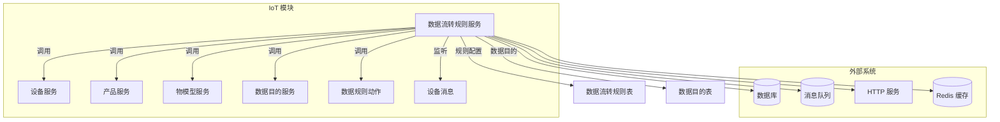
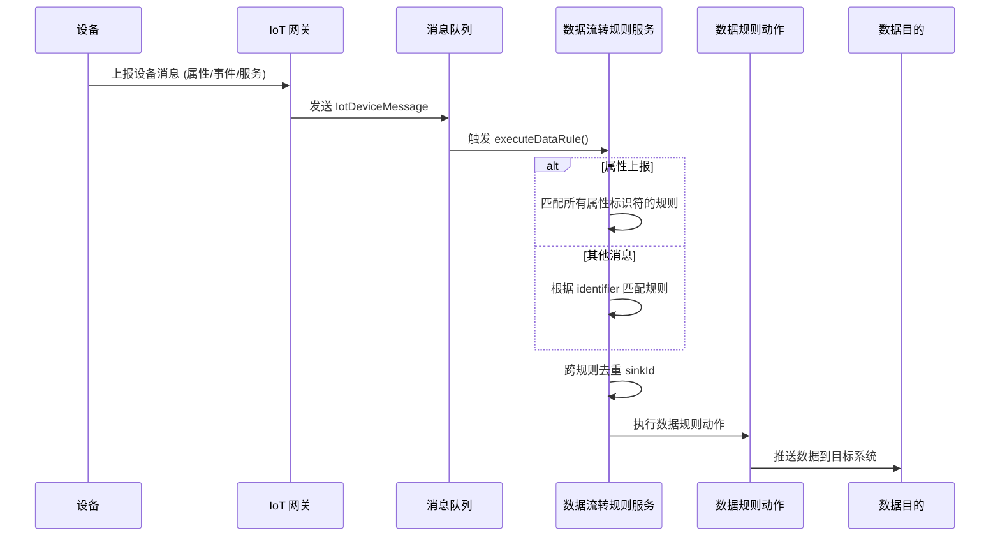
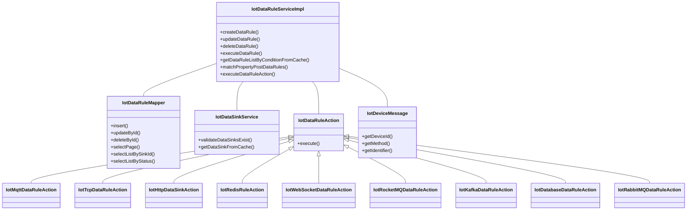
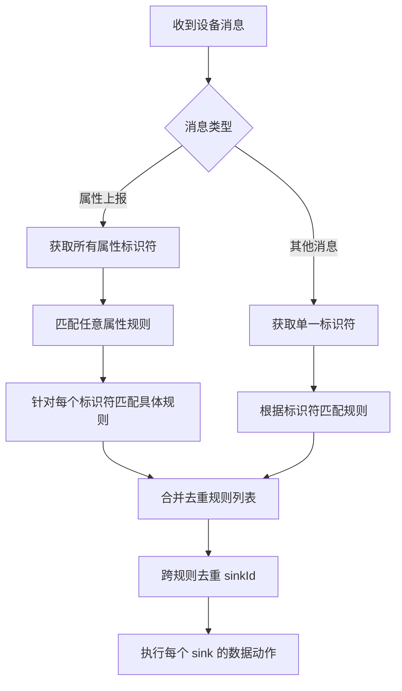
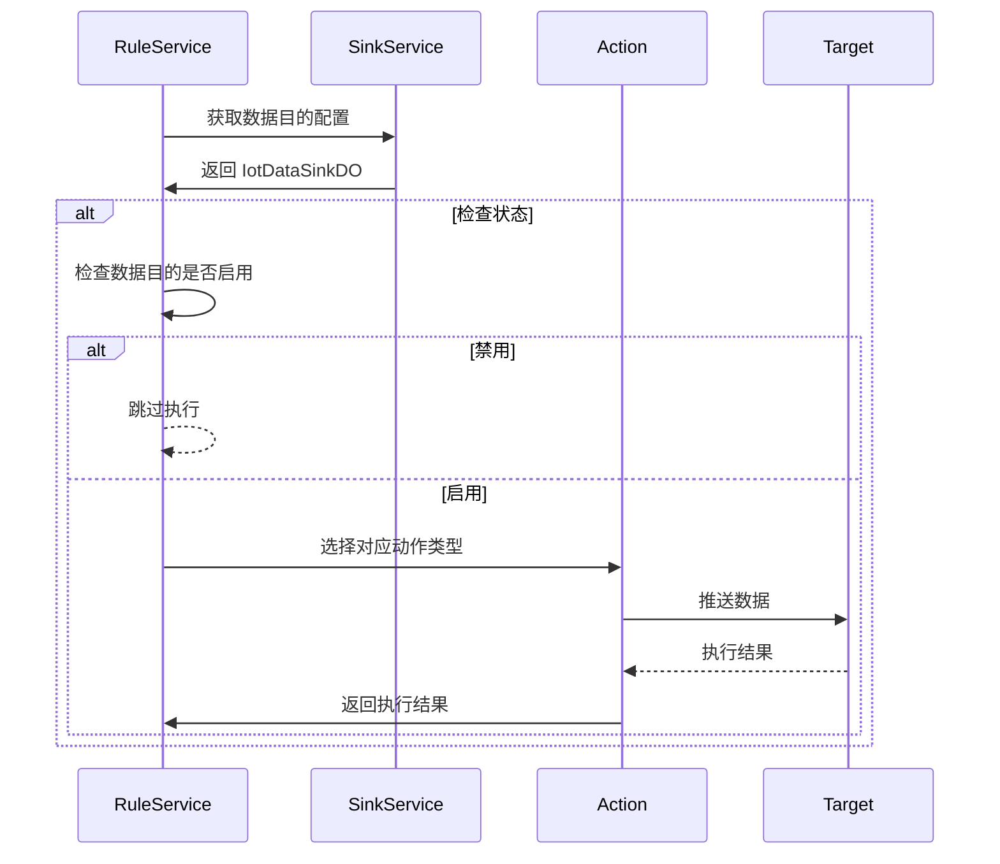

# IoT 数据流转规则服务 (Data Data Rule Service)

## 1. 概述

IoT 数据流转规则服务是 IoT 模块中的核心组件，负责管理设备数据的采集、处理和分发规则。该服务实现了基于设备消息的事件驱动型数据处理机制，支持将设备上报的数据根据不同的规则配置，分发到多种数据目的（如数据库、MQ、HTTP 等）。

### 核心功能

- **规则管理**：创建、更新、删除和查询数据流转规则
- **规则匹配**：根据设备消息（属性上报、事件、服务调用等）匹配命中规则
- **数据执行**：将匹配到的消息按照规则配置的数据目的进行分发
- **缓存管理**：使用 Redis 缓存规则列表，提高查询性能
- **去重机制**：避免同一消息被多个规则重复推送到相同的数据目的

### 模块定位



## 2. 架构设计

### 2.1 整体架构

数据流转规则服务采用事件驱动架构，核心流程如下：



### 2.2 组件关系



## 3. 核心组件说明

### 3.1 IotDataRuleServiceImpl

数据流转规则服务实现类，是规则管理的核心入口。

#### 主要方法

| 方法名 | 描述 | 缓存操作 |
|--------|------|----------|
| `createDataRule` | 创建新规则 | 清除规则列表缓存 |
| `updateDataRule` | 更新规则 | 清除规则列表缓存 |
| `deleteDataRule` | 删除规则 | 清除规则列表缓存 |
| `executeDataRule` | 执行规则匹配和消息分发 | - |
| `getDataRuleListByConditionFromCache` | 从缓存获取匹配规则 | 使用 `@Cacheable` 缓存 |
| `executeDataRuleAction` | 执行具体数据动作 | - |

#### 缓存策略

- **缓存名称**：`RedisKeyConstants.DATA_RULE_LIST`
- **缓存键**：`deviceId_method_identifier`
- **缓存内容**：匹配的规则 ID 和 sink ID 列表
- **失效策略**：规则创建、更新、删除时清除所有缓存

### 3.2 IotDataRuleAction 接口

数据规则动作接口，定义了数据分发的执行策略。

```java
public interface IotDataRuleAction {
    /**
     * 获取动作类型（对应数据目的类型）
     */
    Integer getType();
    
    /**
     * 执行数据流转
     */
    void execute(IotDeviceMessage message, IotDataSinkDO dataSink);
}
```

#### 具体实现

| 实现类 | 数据目的类型 | 说明 |
|--------|-------------|------|
| `IotMqttDataRuleAction` | MQTT | 通过 MQTT 协议推送数据 |
| `IotTcpDataRuleAction` | TCP | 通过 TCP 协议推送数据 |
| `IotHttpDataSinkAction` | HTTP | 通过 HTTP 请求推送数据 |
| `IotRedisRuleAction` | Redis | 写入 Redis |
| `IotWebSocketDataRuleAction` | WebSocket | 通过 WebSocket 推送 |
| `IotRocketMQDataRuleAction` | RocketMQ | 发送到 RocketMQ |
| `IotKafkaDataRuleAction` | Kafka | 发送到 Kafka |
| `IotDatabaseDataRuleAction` | 数据库 | 写入数据库 |
| `IotRabbitMQDataRuleAction` | RabbitMQ | 发送到 RabbitMQ |

### 3.3 IotDataRuleDO 数据对象

数据流转规则实体类，包含以下核心属性：

```java
public class IotDataRuleDO {
    private Long id;                    // 规则 ID
    private String name;                // 规则名称
    private Integer status;             // 状态（启用/禁用）
    private List<SourceConfig> sourceConfigs;  // 数据源配置列表
    private List<Long> sinkIds;         // 数据目的 ID 列表
    
    // 数据源配置
    public static class SourceConfig {
        private Long productId;         // 产品 ID
        private Long deviceId;          // 设备 ID（ALL 表示所有设备）
        private String method;          // 消息方法（PROPERTY_POST 等）
        private String identifier;      // 属性标识符（空表示任意属性）
    }
}
```

### 3.4 IotDataSinkDO 数据对象

数据目的实体类，定义了数据流转的目标：

```java
public class IotDataSinkDO {
    private Long id;                    // 数据目的 ID
    private Integer type;               // 类型（MQTT、HTTP、REDIS 等）
    private Integer status;             // 状态
    private String config;              // 配置信息（JSON 格式）
}
```

## 4. 规则匹配流程

### 4.1 匹配逻辑



### 4.2 属性上报特殊处理

属性上报场景下，一个消息可能包含多个属性，每个属性都可能命中不同的规则。服务会：

1. 先匹配未设置 identifier 的「任意属性」规则
2. 再针对每个上报的属性标识符匹配具体规则
3. 使用 LinkedHashMap 按 ruleId 去重，保持匹配顺序

## 5. 数据执行流程

当规则匹配成功后，数据执行流程如下：



### 5.1 跨规则去重

为了避免多条规则命中同一个数据目的导致重复推送，服务维护了一个 `processedSinkIds` 集合，确保每条消息对每个 sinkId 只执行一次。

## 6. 配置与依赖

### 6.1 依赖模块

| 模块 | 依赖说明 |
|------|----------|
| `iot-device` | 设备服务，用于校验设备存在性 |
| `iot-product` | 产品服务，用于校验产品存在性 |
| `iot-thingmodel` | 物模型服务，用于校验物模型标识符 |
| `iot-data-sink` | 数据目的服务，用于获取和管理数据目的 |
| `infra-redis` | Redis 缓存，用于规则列表缓存 |

### 6.2 配置项

数据流转规则相关的配置主要在 `IotDataSinkDO` 的配置字段中，根据不同类型的数据目的有不同的配置格式：

- **MQTT**: broker 地址、topic、认证信息等
- **HTTP**: 请求地址、请求头、认证信息等
- **Redis**: 连接信息、key 格式等
- **数据库**: 连接信息、表名、字段映射等

## 7. 异常处理

服务中包含完善的异常处理机制：

| 异常场景 | 处理方式 |
|----------|----------|
| 规则不存在 | 抛出 `DATA_RULE_NOT_EXISTS` 异常 |
| 规则名称重复 | 抛出 `DATA_RULE_NAME_EXISTS` 异常 |
| 数据目的不存在 | 记录错误日志，跳过执行 |
| 数据目的禁用 | 记录警告日志，跳过执行 |
| 动作执行失败 | 记录错误日志，继续其他 sink |

## 8. 性能优化

### 8.1 缓存优化

- 使用 Redis 缓存规则列表，避免频繁查询数据库
- 缓存键设计为 `deviceId_method_identifier`，支持精确匹配
- 规则变更时自动清除相关缓存

### 8.2 异步处理

数据执行动作采用同步调用，但可以通过以下方式优化：

1. 将数据推送操作异步化
2. 对耗时的 sink 操作使用线程池
3. 批量处理同一 sink 的多条规则

### 8.3 匹配优化

- 规则查询先过滤启用状态的规则
- 内存中使用集合快速去重
- 属性上报场景下使用 Map 避免重复匹配

## 9. 使用示例

### 9.1 创建数据规则

```java
// 创建规则请求
IotDataRuleSaveReqVO reqVO = new IotDataRuleSaveReqVO();
reqVO.setName("属性上报规则");
reqVO.setStatus(CommonStatusEnum.ENABLE.getStatus());

// 配置数据源
IotDataRuleSaveReqVO.SourceConfig sourceConfig = new IotDataRuleSaveReqVO.SourceConfig();
sourceConfig.setProductId(productId);
sourceConfig.setDeviceId(deviceId); // 或 IotDeviceDO.DEVICE_ID_ALL 表示所有设备
sourceConfig.setPropertyPost(); // 属性上报
sourceConfig.setIdentifier("temperature"); // 可选，空表示任意属性
reqVO.setSourceConfigs(Collections.singletonList(sourceConfig));

// 配置数据目的
reqVO.setSinkIds(Arrays.asList(sinkId1, sinkId2));

// 创建规则
Long ruleId = iotDataRuleService.createDataRule(reqVO);
```

### 9.2 执行规则

当设备上报消息时，服务自动触发规则执行：

```java
IotDeviceMessage message = new IotDeviceMessage();
message.setDeviceId(deviceId);
message.setPropertyPost(); // 属性上报
message.putProperty("temperature", 25.5);
message.putProperty("humidity", 60.0);

// 服务自动匹配并执行规则
iotDataRuleService.executeDataRule(message);
```

## 10. 相关模块

- [IoT 设备服务](iot_device_service.md) - 设备管理
- [IoT 产品服务](iot_product_service.md) - 产品管理  
- [IoT 物模型服务](iot_thingmodel_service.md) - 物模型管理
- [IoT 数据目的服务](iot_data_sink_service.md) - 数据目的管理
- [IoT 消息总线](iot_message_bus.md) - 消息传递
