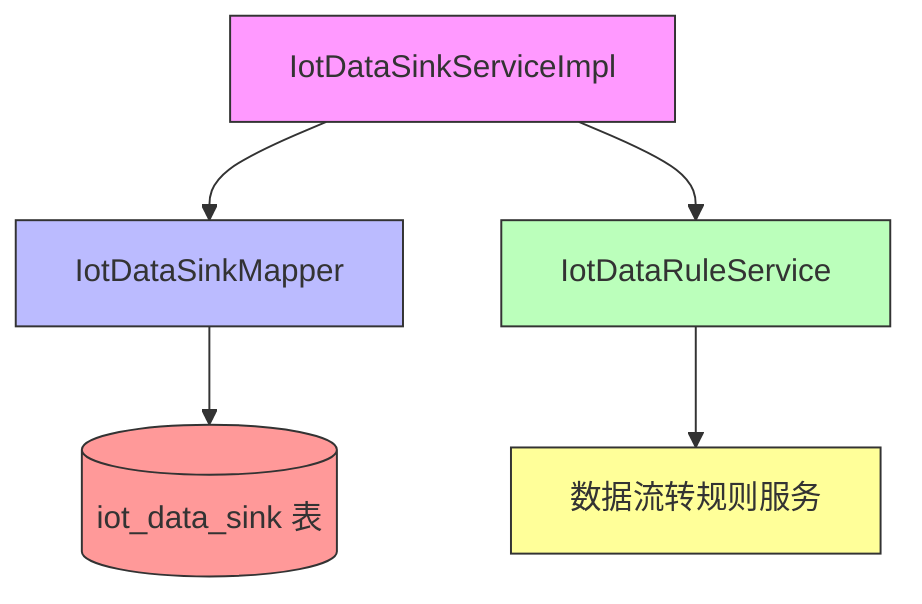
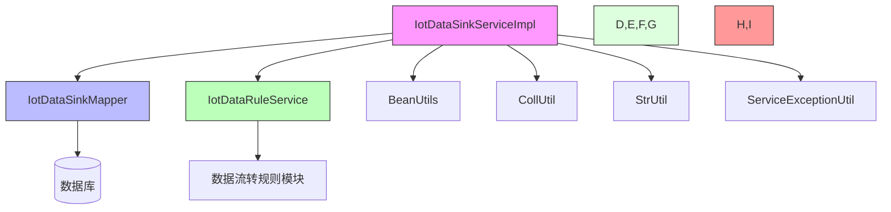
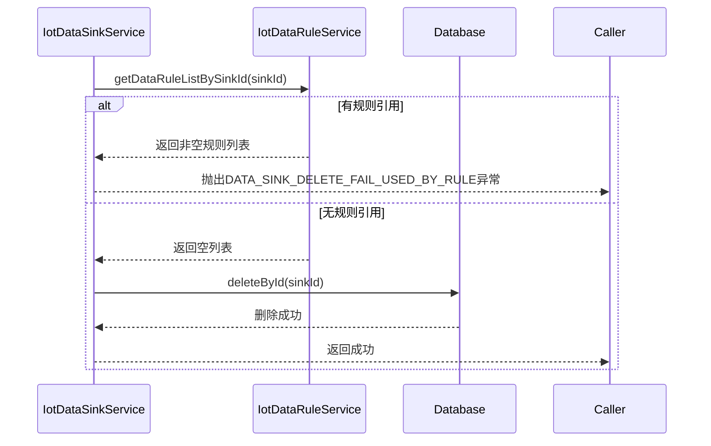
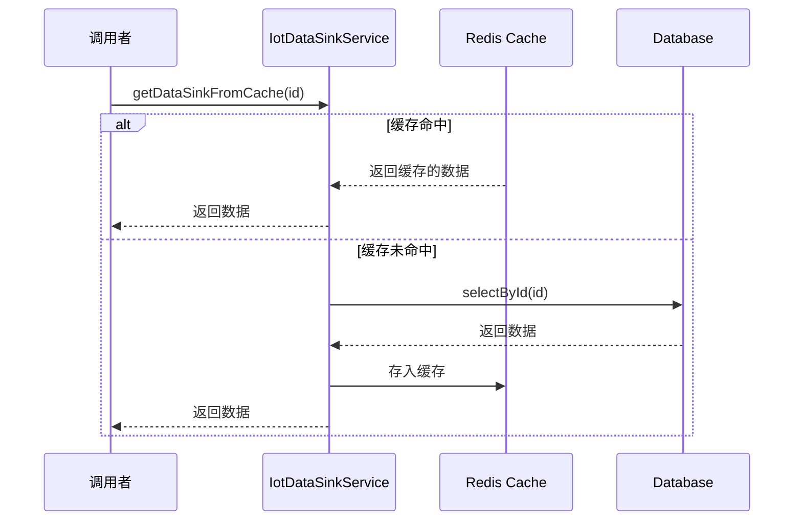

# 数据流转目的服务 (IotDataSinkService)

## 模块概述

数据流转目的服务（IotDataSinkService）是物联网平台中负责管理IoT设备数据流转目的的服务模块。它提供数据流转目的的创建、查询、更新、删除等CRUD操作，并支持多种数据目标类型，包括HTTP、TCP、WebSocket、MQTT、数据库、Redis、RocketMQ、RabbitMQ和Kafka等。

该服务是物联网平台规则引擎的重要组成部分，用于定义设备数据流转的目的地，使得设备数据可以根据业务规则被路由到不同的目标系统进行进一步处理。

## 主要功能

1. **数据流转目的管理**：提供数据流转目的的增删改查操作
2. **多数据目标支持**：支持多种数据目标类型，满足不同场景的数据流转需求
3. **名称唯一性校验**：确保数据流转目的名称在系统中唯一
4. **使用状态检查**：在删除前检查数据流转目的是否被规则引用
5. **缓存支持**：使用Redis缓存提高查询性能
6. **状态管理**：支持启用/禁用状态的数据流转目的

## 架构设计

### 模块结构



### 核心组件

1. **IotDataSinkServiceImpl**：服务实现类，实现IotDataSinkService接口
2. **IotDataSinkMapper**：MyBatis映射器，负责与数据库交互
3. **IotDataRuleService**：数据流转规则服务，用于检查数据流转目的是否被引用
4. **IotDataSinkDO**：数据流转目的数据对象，映射到iot_data_sink表
5. **IotAbstractDataSinkConfig**：数据流转目的配置抽象基类
6. **各具体配置类**：如IotDataSinkHttpConfig、IotDataSinkMqttConfig等

### 数据流转目的类型

系统支持以下数据流转目的类型：

| 类型值 | 类名 | 说明 |
|--------|------|------|
| 1 | IotDataSinkHttpConfig | HTTP/HTTPS端点 |
| 2 | IotDataSinkTcpConfig | TCP服务器 |
| 3 | IotDataSinkWebSocketConfig | WebSocket服务器 |
| 10 | IotDataSinkMqttConfig | MQTT代理 |
| 20 | IotDataSinkDatabaseConfig | 关系型数据库 |
| 21 | IotDataSinkRedisConfig | Redis缓存 |
| 30 | IotDataSinkRocketMQConfig | RocketMQ消息队列 |
| 31 | IotDataSinkRabbitMQConfig | RabbitMQ消息队列 |
| 32 | IotDataSinkKafkaConfig | Apache Kafka |

### 配置类继承结构

```mermaid
classDiagram
    IotAbstractDataSinkConfig <|-- IotDataSinkHttpConfig
    IotAbstractDataSinkConfig <|-- IotDataSinkTcpConfig
    IotAbstractDataSinkConfig <|-- IotDataSinkWebSocketConfig
    IotAbstractDataSinkConfig <|-- IotDataSinkMqttConfig
    IotAbstractDataSinkConfig <|-- IotDataSinkDatabaseConfig
    IotAbstractDataSinkConfig <|-- IotDataSinkRedisConfig
    IotAbstractDataSinkConfig <|-- IotDataSinkRocketMQConfig
    IotAbstractDataSinkConfig <|-- IotDataSinkRabbitMQConfig
    IotAbstractDataSinkConfig <|-- IotDataSinkKafkaConfig
    
    class IotAbstractDataSinkConfig {
        <<abstract>>
        String type
    }
    
    class IotDataSinkHttpConfig {
        String url
        String method
        Map<String,String> headers
        Map<String,String> query
        String body
    }
    
    class IotDataSinkTcpConfig {
        String host
        Integer port
        Boolean ssl
    }
    
    class IotDataSinkWebSocketConfig {
        String serverUrl
        Integer connectTimeoutMs
        Integer sendTimeoutMs
        Long heartbeatIntervalMs
        String heartbeatMessage
        String subprotocols
        String customHeaders
        Boolean verifySslCert
        String dataFormat
        Long reconnectIntervalMs
        Integer maxReconnectAttempts
        Boolean enableCompression
        Integer sendRetryCount
        Long sendRetryIntervalMs
    }
    
    class IotDataSinkMqttConfig {
        String url
        String username
        String password
        String clientId
        String topic
    }
    
    class IotDataSinkDatabaseConfig {
        String jdbcUrl
        String username
        String password
        String tableName
    }
    
    class IotDataSinkRedisConfig {
        String host
        Integer port
        String password
        String database
        String key
    }
    
    class IotDataSinkRocketMQConfig {
        String nameServer
        String accessKey
        String secretKey
        String group
        String topic
        String tags
    }
    
    class IotDataSinkRabbitMQConfig {
        String host
        Integer port
        String virtualHost
        String username
        String password
        String exchange
        String routingKey
        String queue
    }
    
    class IotDataSinkKafkaConfig {
        String bootstrapServers
        String username
        String password
        Boolean ssl
        String topic
    }
```



## 数据模型

### IotDataSinkDO (数据流转目的数据对象)

| 字段名 | 类型 | 说明 |
|--------|------|------|
| id | Long | 数据流转目的编号，主键 |
| name | String | 数据流转目的名称 |
| description | String | 数据流转目的描述 |
| status | Integer | 数据流转目的状态，参考CommonStatusEnum |
| type | Integer | 数据流转目的类型，参考IotDataSinkTypeEnum |
| config | IotAbstractDataSinkConfig | 数据流转目的配置，使用Jackson进行多态序列化/反序列化 |

### 数据库表结构

```sql
CREATE TABLE iot_data_sink (
   id BIGINT NOT NULL AUTO_INCREMENT COMMENT '数据流转目的编号',
   name VARCHAR(100) NOT NULL COMMENT '数据流转目的名称',
   description VARCHAR(255) NULL COMMENT '数据流转目的描述',
   status TINYINT NOT NULL COMMENT '数据流转目的状态',
   type INT NOT NULL COMMENT '数据流转目的类型',
   config JSON NOT NULL COMMENT '数据流转目的配置',
   create_time DATETIME NOT NULL COMMENT '创建时间',
   update_time DATETIME NOT NULL COMMENT '更新时间',
   PRIMARY KEY (id),
   UNIQUE KEY uk_name (name)
) COMMENT = '数据流转目的表';
```

## 接口规范

### IotDataSinkService 接口方法

| 方法名 | 参数 | 返回值 | 说明 |
|--------|------|--------|------|
| createDataSink | IotDataSinkSaveReqVO createReqVO | Long | 创建数据流转目的，返回新创建的ID |
| updateDataSink | IotDataSinkSaveReqVO updateReqVO | void | 更新数据流转目的 |
| deleteDataSink | Long id | void | 删除数据流转目的，如果被规则引用则抛出异常 |
| getDataSink | Long id | IotDataSinkDO | 根据ID获取数据流转目的 |
| getDataSinkFromCache | Long id | IotDataSinkDO | 从缓存获取数据流转目的（带缓存注解） |
| getDataSinkPage | IotDataSinkPageReqVO pageReqVO | PageResult<IotDataSinkDO> | 分页查询数据流转目的 |
| getDataSinkListByStatus | Integer status | List<IotDataSinkDO> | 根据状态获取数据流转目的列表 |
| validateDataSinksExist | Collection<Long> ids | void | 验证多个数据流转目的ID是否存在 |

### IotDataSinkController REST API

| 方法 | 路径 | 说明 | 权限要求 |
|------|------|------|----------|
| POST | /iot/data-sink/create | 创建数据目的 | `iot:data-sink:create` |
| PUT | /iot/data-sink/update | 更新数据目的 | `iot:data-sink:update` |
| DELETE | /iot/data-sink/delete | 删除数据目的 | `iot:data-sink:delete` |
| GET | /iot/data-sink/get | 获取数据目的详情 | `iot:data-sink:query` |
| GET | /iot/data-sink/page | 获取数据目的分页列表 | `iot:data-sink:query` |
| GET | /iot/data-sink/simple-list | 获取数据目的精简列表（用于下拉选项） | 无需权限 |

## 详细实现说明

### 创建数据流转目的

```java
@Override
public Long createDataSink(IotDataSinkSaveReqVO createReqVO) {
    // 校验名称唯一
    validateDataSinkNameUnique(null, createReqVO.getName());
    // 新增
    IotDataSinkDO dataBridge = BeanUtils.toBean(createReqVO, IotDataSinkDO.class);
    dataSinkMapper.insert(dataBridge);
    return dataBridge.getId();
}
```

**实现细节：**
1. 首先调用`validateDataSinkNameUnique`方法检查名称是否已存在（传入null表示新增操作）
2. 使用BeanUtils将请求VO转换为数据对象
3. 调用Mapper持久化到数据库
4. 返回新创建记录的ID

### 更新数据流转目的

```java
@Override
public void updateDataSink(IotDataSinkSaveReqVO updateReqVO) {
    // 校验存在
    validateDataBridgeExists(updateReqVO.getId());
    // 校验名称唯一
    validateDataSinkNameUnique(updateReqVO.getId(), updateReqVO.getName());
    // 更新
    IotDataSinkDO updateObj = BeanUtils.toBean(updateReqVO, IotDataSinkDO.class);
    dataSinkMapper.updateById(updateObj);
}
```

**实现细节：**
1. 调用`validateDataBridgeExists`方法检查记录是否存在
2. 调用`validateDataSinkNameUnique`方法检查名称是否已存在（传入ID表示更新操作，需要排除自身）
3. 使用BeanUtils将请求VO转换为数据对象
4. 调用Mapper更新数据库记录

### 删除数据流转目的

```java
@Override
public void deleteDataSink(Long id) {
    // 校验存在
    validateDataBridgeExists(id);
    // 校验是否被数据流转规则使用
    if (CollUtil.isNotEmpty(dataRuleService.getDataRuleListBySinkId(id))) {
        throw exception(DATA_SINK_DELETE_FAIL_USED_BY_RULE);
    }
    // 删除
    dataSinkMapper.deleteById(id);
}
```

**实现细节：**
1. 调用`validateDataBridgeExists`方法检查记录是否存在
2. 调用数据流转规则服务检查该目的是否被任何规则引用
3. 如果被引用，抛出`DATA_SINK_DELETE_FAIL_USED_BY_RULE`异常
4. 如果未被引用，调用Mapper删除数据库记录

### 名称唯一性校验

```java
private void validateDataSinkNameUnique(Long id, String name) {
    if (StrUtil.isBlank(name)) {
        return;
    }
    IotDataSinkDO dataSink = dataSinkMapper.selectByName(name);
    if (dataSink == null) {
        return;
    }
    // 如果 id 为空，说明不用比较是否为相同 id 的目的
    if (id == null) {
        throw exception(DATA_SINK_NAME_EXISTS);
    }
    if (!dataSink.getId().equals(id)) {
        throw exception(DATA_SINK_NAME_EXISTS);
    }
}
```

**实现细节：**
1. 如果名称为空，直接返回（由其他验证处理空值情况）
2. 根据名称查询数据库中是否存在相同名称的记录
3. 如果不存在，直接返回
4. 如果存在：
   - 如果ID为空（新增操作），抛出名称已存在异常
   - 如果ID不为空（更新操作），检查是否为同一条记录（通过ID比较）
   - 如果不是同一条记录，抛出名称已存在异常

### 缓存机制

```java
@Override
@Cacheable(value = RedisKeyConstants.DATA_SINK, key = "#id")
public IotDataSinkDO getDataSinkFromCache(Long id) {
    return dataSinkMapper.selectById(id);
}
```

**实现细节：**
1. 使用Spring Cache抽象的`@Cacheable`注解
2. 缓存名称由`RedisKeyConstants.DATA_SINK`定义
3. 缓存键使用方法参数`id`
4. 方法实际逻辑是从数据库查询数据，但结果会被缓存
5. 后续相同ID的调用将直接从缓存返回，避免重复数据库查询

## 依赖关系

### 模块依赖



### 外部依赖

1. **MyBatis-Plus**：用于数据库操作的持久化框架
2. **Spring Framework**：提供依赖注入、事务管理等核心功能
3. **Spring Cache**：提供缓存抽象，支持多种缓存实现（如Redis）
4. **Hutool**：提供字符串工具（StrUtil）、集合工具（CollUtil）等实用类
5. **Jackson**：用于JSON处理，特别是多态类的序列化

## 业务规则

1. **名称唯一性**：数据流转目的名称在系统中必须唯一
2. **状态管理**：使用`CommonStatusEnum`枚举表示状态（通常为1-启用，0-禁用）
3. **类型安全**：数据流转目的类型必须是预定义的枚举值之一
4. **配置必填**：创建或更新数据流转目的时，配置信息不能为空
5. **删除限制**：已被数据流转规则引用的目的不能被删除
6. **缓存一致性**：虽然getDataSinkFromCache方法有缓存，但create、update、delete操作没有明确清除缓存的逻辑，这可能导致缓存不一致

## 性能考虑

1. **数据库索引**：
   - 主键索引（id）
   - 名称唯一索引（name）
   - 建议为status和type字段添加索引以提高查询性能

2. **缓存策略**：
   - 使用`@Cacheable`注解对getDataSinkFromCache方法进行缓存
   - 缓存键为ID，适合按ID查询的场景
   - 注意：当前实现中创建、更新、删除操作没有清除相关缓存，可能导致脏读

3. **查询优化**：
   - 分页查询使用MyBatis-Plus的分页插件
   - 按状态查询可以利用索引提高性能

## 安全考虑

1. **权限控制**：所有操作都通过Spring Security的`@PreAuthorize`注进行权限检查
2. **输入验证**：使用Bean Validation（JSR-380）进行参数校验，如@NotEmpty、@NotNull、@InEnum等
3. **防注入**：使用MyBatis-Plus的参数绑定机制防止SQL注入
4. **数据隔离**：通过ID进行资源访问控制，确保用户只能操作自己的数据（虽然当前实现中没有明显的租户隔离）

## 异常处理

服务方法可能抛出的异常包括：

1. **DATA_SINK_NAME_EXISTS**：当尝试创建或更新一个已存在名称的数据流转目的时抛出
2. **DATA_SINK_NOT_EXISTS**：当尝试访问不存在的数据流转目的时抛出
3. **DATA_SINK_DELETE_FAIL_USED_BY_RULE**：当尝试删除一个被规则引用的数据流转目的时抛出

所有异常都通过`ServiceExceptionUtil.exception()`方法统一包装，确保一致的错误响应格式。

## 使用示例

### 创建HTTP类型的数据流转目的

```java
IotDataSinkSaveReqVO reqVO = new IotDataSinkSaveReqVO();
reqVO.setName("HTTP数据接收端");
reqVO.setDescription("用于接收设备数据的HTTP端点");
reqVO.setStatus(CommonStatusEnum.ENABLE.getStatus());
reqVO.setType(IotDataSinkTypeEnum.HTTP.getType());

IotDataSinkHttpConfig config = new IotDataSinkHttpConfig();
config.setUrl("http://example.com/api/example.com/api/device-data");
config.setMethod("POST");
Map<String, String> headers = new HashMap<>();
headers.put("Content-Type", "application/json");
config.setHeaders(headers);
reqVO.setConfig(config.getUrl());
config.setMethod("POST");
Map<String, String> headers = new HashMap<>();
headers.put("Content-Type", "application/json");
config.setHeaders(headers);
reqVO.setConfig(config);

Long sinkId = dataSinkService.createDataSink(reqVO);
```

### 查询所有启用的数据流转目的

```java
List<IotDataSinkDO> enabledSinks = dataSinkService.getDataSinkListByStatus(
    CommonStatusEnum.ENABLE.getStatus()
);
```

### 分页查询数据流转目的

```java
IotDataSinkPageReqVO pageReqVO = new IotDataSinkPageReqVO();
pageReqVO.setName("HTTP"); // 按名称过滤
pageReqVO.setStatus(CommonStatusEnum.ENABLE.getStatus()); // 只查询启用的
pageReqVO.setPageNo(1);
pageReqVO.setPageSize(10);

PageResult<IotDataSinkDO> pageResult = dataSinkService.getDataSinkPage(pageReqVO);
```

## 最佳实践

1. **事务管理**：确保所有修改操作（创建、更新、删除）在事务中执行，以保证数据一致性
2. **缓存一致性**：在创建、更新、删除操作后及时清除相关缓存，避免脏读
3. **输入验证**：虽然使用了Bean Validation，但业务层仍应进行必要的验证，特别是复杂的业务规则验证
4. **错误处理**：统一的异常处理机制有助于提供一致的错误响应格式
5. **日志记录**：建议在关键操作前后添加日志，便于问题排查和审计
6. **单元测试**：为服务方法编写全面的单元测试，覆盖正常流程和异常情况
7. **性能监控**：监控数据库查询性能，特别是复杂查询和分页查询
8. **配置验证**：在保存前对不同类型的配置进行特定验证，例如URL格式、端口范围等

## 与其他模块的交互

### 与数据流转规则的交互

数据流转目的服务与数据流转规则服务(IotDataRuleService)有紧密的耦合关系：

1. 在删除数据流转目的时，需要检查是否被任何规则引用
2. 数据流转规则在执行时会引用特定的数据流转目的



### 与缓存的交互

数据流转目的服务使用Spring Cache与Redis集成：



## 已知问题和改进建议

### 当前实现中的问题

1. **缓存一致性问题**：创建、更新、删除操作没有清除相关缓存，可能导致读取到脏数据
2. **缺少批量操作**：没有提供批量创建、更新、删除的接口
3. **缺少导入导出功能**：没有提供数据流转目的的导入导出能力
4. **配置验证不足**：对不同类型的配置缺少特定的验证逻辑（如URL格式、端口范围等）

### 改进建议

1. **添加缓存清除**：在create、update、delete方法中添加缓存清除逻辑
2. **扩展批量操作**：添加批量创建、更新、删除的方法
3. **实现导入导出**：添加Excel导入导出功能
4. **增强配置验证**：为每种配置类型添加特定的验证逻辑
5. **添加审计字段**：考虑添加创建人、更新人等审计字段
6. **实现软删除**：考虑使用删除标志而非物理删除，以保留历史数据
7. **添加批量状态修改**：提供批量启用/禁用的功能
8. **优化查询性能**：为常用查询字段添加适当的数据库索引

## 结论

数据流转目的服务是物联网平台规则引擎的核心组件之一，提供了灵活、可扩展的数据目标管理能力。通过支持多种数据目标类型和完整的CRUD操作，它使得设备数据可以根据业务需求被灵活路由到各种目标系统。

该服务设计简洁清晰，利用了Spring框架的特性（如依赖注入、事务管理、缓存抽象）和MyBatis-Plus的便利功能。虽然存在一些可以改进的地方（如缓存一致性），但总体上它提供了一个坚实的基础来支持物联网平台的数据流转功能。

在实际使用中，开发者应该注意处理好缓存一致性问题，并根据实际业务需求考虑是否需要实现一些建议的增强功能。