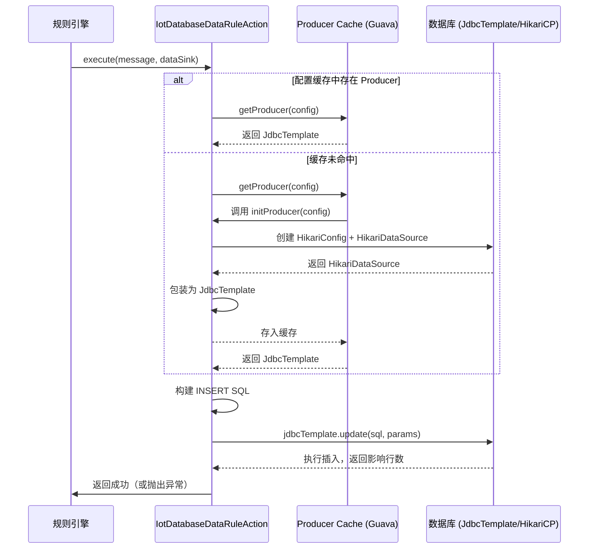

# database_action 模块文档

## 模块概述

`database_action` 模块是物联网平台（IoT）中数据流转（Data Rule）功能的一个具体实现，负责将设备消息写入关系型数据库。它实现了 `IotDataRuleAction` 接口，通过 JDBC 和 HikariCP 连接池将设备上报的消息持久化到配置的数据库表中。

该模块位于：
```
yudao-module-iot/yudao-module-iot-biz/src/main/java/cn/iocoder/yudao/module/iot/service/rule/data/action/IotDatabaseDataRuleAction.java
```

## 核心功能

1. **数据库连接管理**：使用 HikariCP 创建和管理数据库连接池，根据 JDBC URL 自动加载对应的数据库驱动（支持 MySQL、PostgreSQL、Oracle、SQL Server、DM 达梦等）。
2. **消息持久化**：将设备消息（`IotDeviceMessage`）序列化为 JSON 后，插入到指定的数据库表中。
3. **生命周期管理**：通过父类 `IotDataRuleCacheableAction` 实现生产者（`JdbcTemplate`）的缓存、复用和销毁，提高性能并防止资源泄漏。
4. **异常处理与日志**：完整的异常捕获和日志记录，便于问题排查。

## 类关系图

以下是 `IotDatabaseDataRuleAction` 与其父类、接口及关键依赖的类关系图：

```mermaid
classDiagram
    class IotDatabaseDataRuleAction {
        +Integer getType()
        +void execute(IotDeviceMessage message, IotDataSinkDatabaseConfig config) throws Exception
        +JdbcTemplate initProducer(IotDataSinkDatabaseConfig config) throws Exception
        +void closeProducer(JdbcTemplate producer) throws Exception
    }
    class IotDataRuleCacheableAction<Config, Producer> {
        <<abstract>>
        +LoadingCache<Config, Producer> PRODUCER_CACHE
        +protected Producer getProducer(Config config) throws Exception
        +protected abstract Producer initProducer(Config config) throws Exception
        +protected abstract void closeProducer(Producer producer) throws Exception
    }
    class IotDataRuleAction {
        <<interface>>
        +Integer getType()
        +void execute(IotDeviceMessage message, IotDataSinkDO dataSink)
    }
    class IotDataSinkDatabaseConfig {
        +String getJdbcUrl()
        +String getUsername()
        +String getPassword()
        +String getTableName()
    }
    class IotDeviceMessage {
        +String getId()
        +String getDeviceId()
        +Integer getTenantId()
        +String getMethod()
        +Long getReportTime()
    }
    class JdbcTemplate
    class HikariDataSource
    class HikariConfig

    IotDatabaseDataRuleAction --> IotDataRuleCacheableAction : 继承
    IotDataRuleCacheableAction --> IotDataRuleAction : 实现
    IotDatabaseDataRuleAction --> IotDataSinkDatabaseConfig : 依赖
    IotDatabaseDataRuleAction --> IotDeviceMessage : 依赖
    IotDatabaseDataRuleAction --> JdbcTemplate : 依赖
    IotDatabaseDataRuleAction --> HikariDataSource : 依赖
    IotDatabaseDataRuleAction --> HikariConfig : 依赖
    IotDataRuleCacheableAction --> LoadingCache : 依赖
```

## 工作流程（时序图）

下面展示了当设备消息触发数据规则时，`IotDatabaseDataRuleAction` 的执行流程：



## 与其他模块的关系

- **依赖模块**：
  - `iot-core`：提供 `IotDeviceMessage` 消息模型。
  - `iot-biz`：提供数据库配置实体 `IotDataSinkDatabaseConfig` 和枚举 `IotDataSinkTypeEnum`。
  - `framework-common`：提供 Hutool 工具类和 JSON 工具类。
  - `spring-jdbc`：提供 `JdbcTemplate` 用于数据库操作。
  - `com.zaxxer.hikari.HikariCP`：提供高性能数据库连接池。

- **被哪些模块使用**：
  - `IotDataRuleServiceImpl`：在处理数据规则时，根据数据 sink 的类型（如 DATABASE）调用对应的 Action 实现。
  - `IotDataSinkServiceImpl`：管理数据 sink 配置，但在执行时会委托给具体的 Action。

- **与其他 Action 的关系**：
  - 所有数据 sink 的 Action（如 HTTP、TCP、MQTT、Redis、RocketMQ 等）均继承自 `IotDataRuleCacheableAction`，统一管理生产者的生命周期。

## 配置说明

要使用数据库作为数据 sink，需要在 IoT 平台的数据规则配置中创建一个类型为 **Database** 的数据 sink，并填写以下字段：

| 配置项       | 说明                     | 示例                              |
|--------------|--------------------------|-----------------------------------|
| JDBC URL     | 数据库连接地址           | `jdbc:mysql://localhost:3306/iot` |
| 用户名       | 数据库登录用户名         | `root`                            |
| 密码         | 数据库登录密码           | `password`                        |
| 表名         | 目标表名（需预先创建）   | `iot_device_message`              |

> **表结构建议**：
> ```sql
> CREATE TABLE iot_device_message (
>     id VARCHAR(50) PRIMARY KEY,
>     device_id VARCHAR(100) NOT NULL,
>     tenant_id INT NOT NULL,
>     method VARCHAR(50),
>     report_time BIGINT,
>     data TEXT,
>     create_time TIMESTAMP DEFAULT CURRENT_TIMESTAMP
> );
> ```

## 使用示例

以下是一个典型的使用场景（由规则引擎触发）：

```java
// 假设已从消息队列中获取到设备消息
IotDeviceMessage message = new IotDeviceMessage();
message.setId("msg_001");
message.setDeviceId("device_001");
message.setTenantId(1);
message.setMethod("POST");
message.setReportTime(System.currentTimeMillis());

// 数据库 sink 配置（通常从数据库中查询得到）
IotDataSinkDatabaseConfig config = new IotDataSinkDatabaseConfig();
config.setJdbcUrl("jdbc:mysql://localhost:3306/iot");
config.setUsername("root");
config.setPassword("password");
config.setTableName("iot_device_message");

// 执行动作
IotDatabaseDataRuleAction action = new IotDatabaseDataRuleAction();
action.execute(message, config);
// 消息将被写入 iot_device_message 表
```

## 注意事项

1. **线程安全**：`JdbcTemplate` 是线程安全的，可在多线程环境中共享使用。
2. **连接池配置**：默认配置为 `maximumPoolSize=5`, `minimumIdle=1`，适用于多数据流转场景。如需根据实际负载调整，可修改 `initProducer` 方法中的 HikariCP 参数。
3. **异常传播**：`execute` 方法会将数据库异常向上抛出，由调用方（规则引擎）负责处理（如记录错误、重试或告警）。
4. **事务管理**：当前实现不支持跨操作的事务。若需要事务支持，请在业务层自行管理或使用 Spring 的事务管理器。
5. **性能考虑**：插入操作使用了预编译 SQL（通过 `jdbcTemplate.update`），在高并发场景下表现良好。如需批量写入，建议扩展批处理机制。

## 与文档的关联

- 有关数据规则总体架构，请参考 [iot_rule_engine.md](iot_rule_engine.md)（如存在）。
- 有关数据 sink 配置管理，请参考 [iot_data_sink_service.md](iot_data_sink_service.md)。
- 有关其他类型的 action 实现（如 HTTP、MQTT 等），请参考同目录下的其他 `*Action.java` 文件。