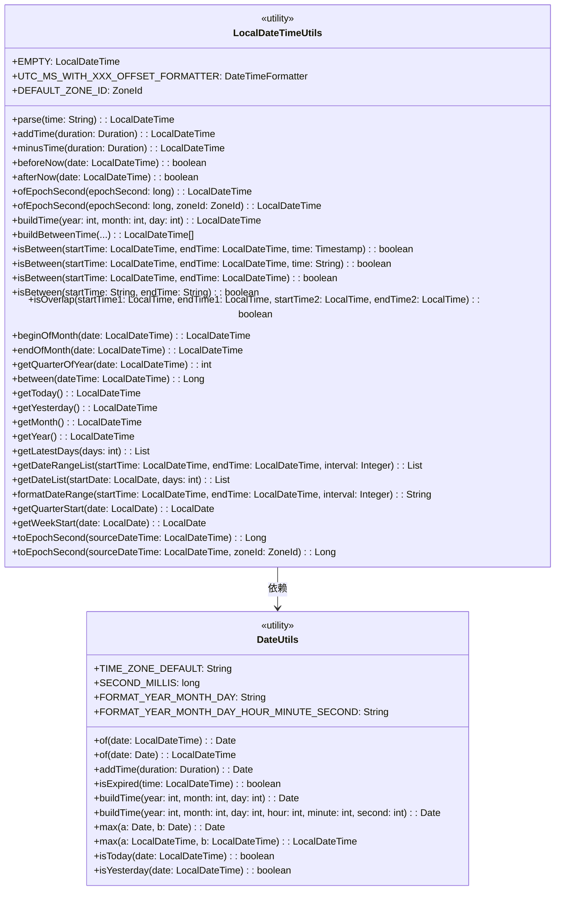

# Date 模块文档

## 概述

Date 模块是 Yudao 框架中的日期时间工具模块，提供了处理 Java 日期时间 API 的各种实用方法。该模块包含两个主要工具类：`LocalDateTimeUtils` 和 `DateUtils`，它们分别专注于 `LocalDateTime` 和 `Date` 类型的操作。

## 架构概述

Date 模块采用简单的工具类设计，所有方法都是静态的，可以直接通过类名调用。模块结构如下：



## 模块功能

### LocalDateTimeUtils

`LocalDateTimeUtils` 类提供了丰富的 `LocalDateTime` 操作方法，主要功能包括：

1. **时间解析**：支持多种格式的时间字符串解析
2. **时间运算**：添加、减去时间间隔
3. **时间比较**：判断时间是否在当前时间之前或之后
4. **时间戳转换**：Unix 时间戳与 `LocalDateTime` 之间的转换
5. **时间构建**：创建特定日期时间的方法
6. **范围判断**：判断时间是否在指定范围内
7. **时间段操作**：获取月份、季度、年的开始/结束时间
8. **日期列表生成**：获取最近 N 天的日期列表
9. **日期范围生成**：根据间隔生成日期范围列表
10. **格式化**：格式化日期范围为特定格式
11. **纪元转换**：将 `LocalDateTime` 转换为纪元秒

### DateUtils

`DateUtils` 类提供了 `Date` 和 `LocalDateTime` 之间的转换以及一些基本的日期操作：

1. **类型转换**：`Date` 和 `LocalDateTime` 之间的相互转换
2. **时间运算**：添加时间间隔
3. **过期检查**：判断时间是否已过期
4. **时间构建**：创建特定日期时间的方法
5. **最大值比较**：获取两个日期中的较大值
6. **特殊日期判断**：判断是否是今天或昨天

## 使用示例

### LocalDateTimeUtils 使用示例

```java
// 解析时间字符串
LocalDateTime time = LocalDateTimeUtils.parse("2023-09-15 10:30:00");

// 添加一天
LocalDateTime tomorrow = LocalDateTimeUtils.addTime(Duration.ofDays(1));

// 检查时间是否在当前之前
boolean isPast = LocalDateTimeUtils.beforeNow(someTime);

// 获取本月开始时间
LocalDateTime monthStart = LocalDateTimeUtils.getMonth();

// 获取最近7天的日期列表
List<LocalDateTime> last7Days = LocalDateTimeUtils.getLatestDays(7);

// 将LocalDateTime转换为纪元秒
long epochSecond = LocalDateTimeUtils.toEpochSecond(someTime);
```

### DateUtils 使用示例

```java
// LocalDateTime转Date
Date date = DateUtils.of(localDateTime);

// Date转LocalDateTime
LocalDateTime localDateTime = DateUtils.of(date);

// 检查是否今天
boolean isToday = DateUtils.isToday(someTime);

// 检查是否昨天
boolean isYesterday = DateUtils.isYesterday(someTime);

// 创建特定时间
Date specificDate = DateUtils.buildTime(2023, 9, 15, 10, 30, 0);
```

## 与其他模块的关系

Date 模块是一个基础工具模块，可以被系统中的其他模块使用。例如：

- 在处理业务逻辑时需要进行日期时间计算
- 在数据持久化层需要转换日期时间格式
- 在API层需要格式化日期时间返回给前端
- 在定时任务中需要进行时间间隔判断

由于 Date 模块是基础工具模块，它通常不依赖于其他业务模块，而是被其他模块依赖。

## 最佳实践

1. **静态方法使用**：所有方法都是静态的，直接通过类名调用即可
2. **空值处理**：大多数方法会检查参数是否为 null 并进行适当处理
3. **时区一致性**：模块内部使用系统默认时区或指定时区进行转换
4. **异常处理**：解析方法会尝试多种格式，增加解析成功的概率
5. **性能考虑**：方法设计为轻量级，适合频繁调用

## 结论

Date 模块提供了全面的日期时间工具方法，极大地简化了在 Java 应用中处理日期时间的复杂性。通过使用这个模块，开发者可以避免重复编写日期时间处理代码，提高开发效率和代码质量。