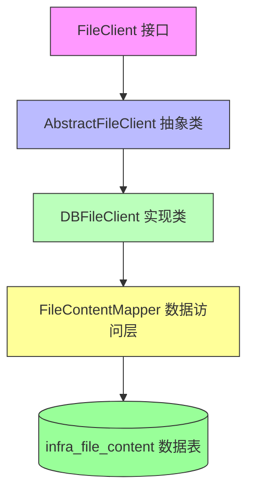
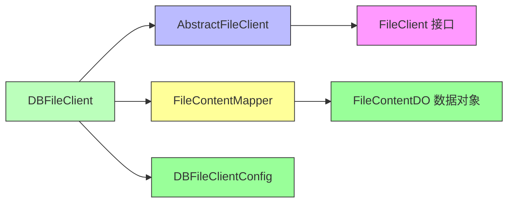
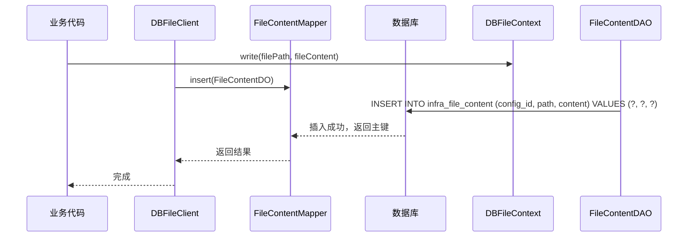
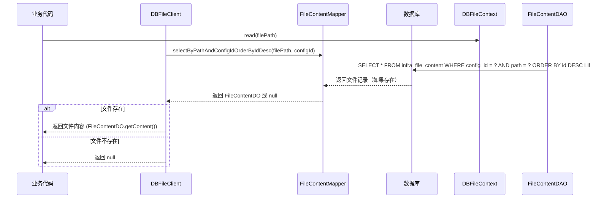

# DBFileClient 模块文档

## 概述

DBFileClient 是 Infra 模块中文件存储客户端的一种实现，用于将文件存储在数据库中。它继承自 `AbstractFileClient`，并通过 `FileContentMapper` 与数据库表 `infra_file_content` 进行交互。该客户端适用于需要将文件存储在关系型数据库中的场景，提供了文件的上传、下载、删除和 URL 生成功能。

## 架构设计

DBFileClient 作为文件存储体系的一部分，与其他文件客户端（如本地文件客户端、S3 文件客户端等）共同实现了 `FileClient` 接口。它依赖于数据库访问层来持久化文件内容。

以下是 DBFileClient 在文件存储体系中的架构图：



## 核心功能

### 文件上传
- 将文件内容（字节数组）和文件路径保存到 `infra_file_content` 表中。
- 关联到特定的文件配置（通过 `configId`）。

### 文件下载
- 根据文件路径和配置 ID 从 `infra_file_content` 表中检索文件内容。
- 如果存在多个版本（同一路径的多次上传），返回最新版本（ID 最大的记录）。

### 文件删除
- 根据文件路径和配置 ID 从 `infra_file_content` 表中删除记录。

### URL 生成
- 生成通过 `FileController` 访问文件的 URL，格式为：`{domain}/admin-api/infra/file/{fileClientId}/get/{encodedPath}`。
- 其中 `domain` 来自配置（`DBFileClientConfig.domain`），`fileClientId` 是文件客户端的 ID，`encodedPath` 是 URL 编码后的文件路径。

## 使用说明

### 配置
DBFileClient 通过 `DBFileClientConfig` 进行配置，主要包含：
- `domain`：自定义域名，用于生成文件访问 URL（必须是有效的 URL）。

### 初始化
在文件存储服务初始化时，会根据数据库中的文件配置记录创建 DBFileClient 实例，并调用其 `init()` 方法进行初始化。

### 示例代码
```java
// 假设我们已经获得了文件配置 ID 和域名
DBFileClientConfig config = new DBFileClientConfig();
config.setId(1L); // 从数据库中的文件配置 ID
config.setDomain("https://example.com"); // 自定义域名

DBFileClient dbFileClient = new DBFileClient(config.getId(), config);
dbFileClient.init(); // 初始化客户端

// 上传文件
byte[] fileContent = ...; // 文件字节数组
String filePath = "test/example.txt";
dbFileClient.write(filePath, fileContent);

// 下载文件
byte[] downloadedContent = dbFileClient.read(filePath);

// 删除文件
dbFileClient.delete(filePath);
```

## 依赖关系

DBFileClient 依赖于以下核心组件：



## 数据流

### 文件上传流程


### 文件下载流程


## 参考其他模块

- [文件存储体系总览](../file_storage_overview.md)：了解文件存储的整体架构和其他客户端实现。
- [FileController 文档](../infra/file_controller.md)：了解如何通过 HTTP 接口访问存储在数据库中的文件。
- [FileConfigService 文档](../infra/file_config_service.md)：了解文件配置的管理。

> **注意**：以上链接为示例，实际文档路径请根据项目结构调整。