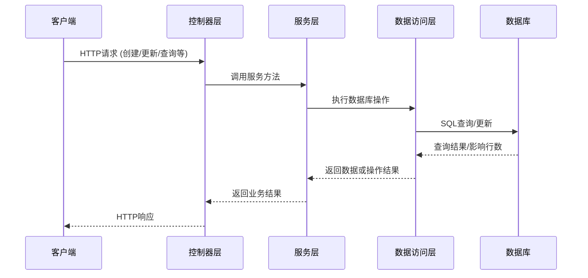

# BPM 定义管理模块

## 概述

BPM 定义管理模块是业务流程管理系统的核心组件，负责管理流程定义相关的各种元数据，包括流程模型、流程定义表达式、用户组等。该模块提供了完整的 CRUD 操作接口，支持流程定义的创建、修改、删除、查询以及部署等功能。

## 架构概述

```mermaid
graph TD
    A[定义管理模块] --> B[用户组管理]
    A --> C[流程监听器管理]
    A --> D[动态表单管理]
    A --> E[流程定义管理]
    A --> F[流程表达式管理]
    A --> G[流程模型管理]
    A --> H[流程分类管理]
    
    B --> B1[用户组控制器]
    B --> B2[用户组服务]
    B --> B3[用户组数据对象]
    
    C --> C1[流程监听器控制器]
    C --> C2[流程监听器服务]
    C --> C3[流程监听器数据对象]
    
    D --> D1[动态表单控制器]
    D --> D2[动态表单服务]
    D --> D3[动态表单数据对象]
    
    E --> E1[流程定义控制器]
    E --> E2[流程定义服务]
    E --> E3[流程定义数据对象]
    
    F --> F1[流程表达式控制器]
    F --> F2[流程表达式服务]
    F --> F3[流程表达式数据对象]
    
    G --> G1[流程模型控制器]
    G --> G2[流程模型服务]
    G --> G3[流程模型数据对象]
    
    H --> H1[流程分类控制器]
    H --> H2[流程分类服务]
    H --> H3[流程分类数据对象]
    
    style A fill:#f9f,stroke:#333,stroke-width:2px
```

## 子模块功能概述

该模块包含以下子模块，每个子模块负责特定的业务功能：

1. [用户组管理](bpm_user_group.md)：负责流程用户组的创建、修改、删除和查询
2. [流程监听器管理](bpm_process_listener.md)：负责流程监听器的配置和管理
3. [动态表单管理](bpm_form.md)：负责流程中使用的动态表单的定义和维护
4. [流程定义管理](bpm_process_definition.md)：负责流程定义的查询、部署和状态管理
5. [流程表达式管理](bpm_process_expression.md)：负责流程表达式的创建和管理
6. [流程模型管理](bpm_model.md)：负责流程模型的创建、修改、部署和版本控制
7. [流程分类管理](bpm_category.md)：负责流程分类的层级管理和排序

## 与其他模块的关系

- 依赖系统模块：获取用户、部门等基础信息
- 为任务模块提供流程定义支持
- 为流程实例模块提供流程定义基础
- 为流程设计器提供模型和表单支持

## 数据流说明

## 核心功能特点

1. **完整的生命周期管理**：从创建到部署，再到运行监控的全流程支持
2. **灵活的表单引擎**：支持自定义表单字段和验证规则
3. **强大的模型设计**：提供可视化流程建模能力
4. **丰富的表达式支持**：支持流程条件判断和变量计算
5. **分层分类管理**：支持多级流程分类和排序
6. **权限控制集成**：与系统权限框架无缝集成
7. **国际化支持**：完善的多语言支持

## 使用场景

1. 流程设计师创建和修改流程模型
2. 系统管理员配置流程分类和用户组
3. 业务分析师定义流程表达式和条件
4. 开发人员通过API管理流程定义
5. 运维人员监控和管理流程部署状态

## API接口概览

所有控制器遵循RESTful风格，提供标准的CRUD操作：
- POST /create：创建资源
- PUT /update：更新资源
- DELETE /delete：删除资源
- GET /get：根据ID获取单个资源
- GET /page：分页查询资源列表
- GET /simple-list：获取简化列表（用于下拉选择）

详细的API说明请参考各子模块的文档。