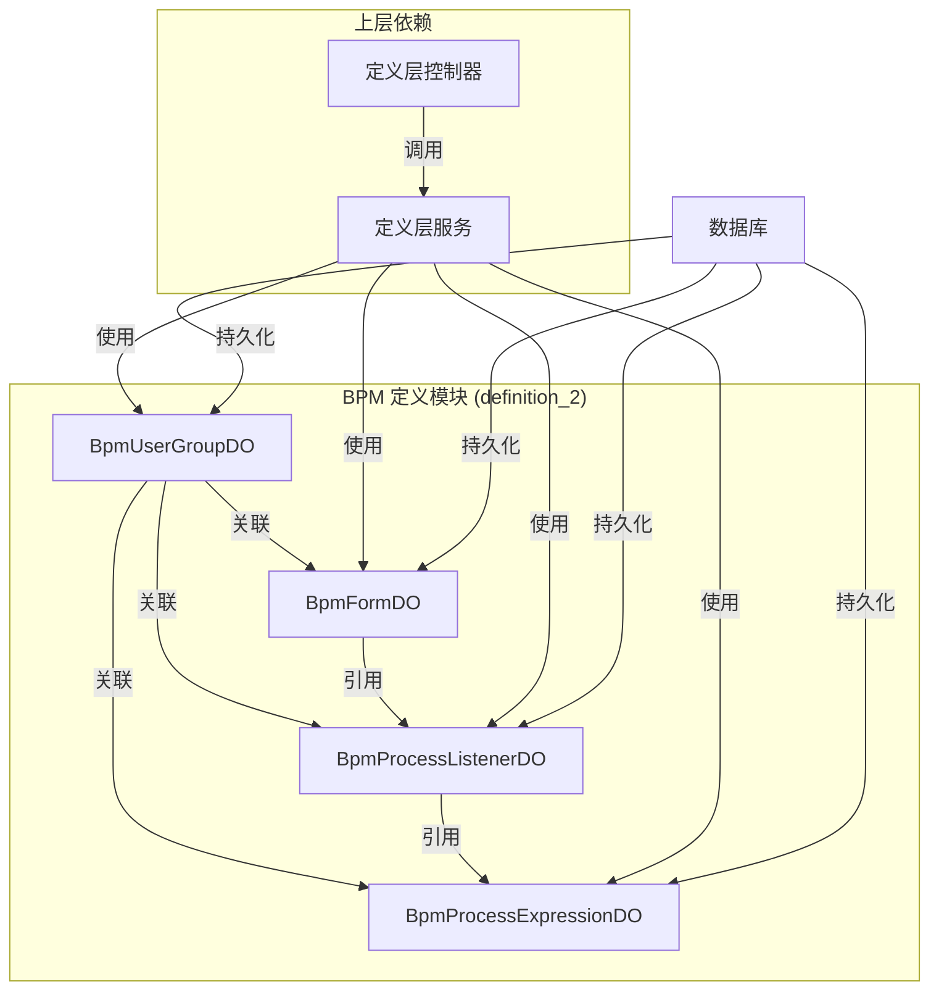
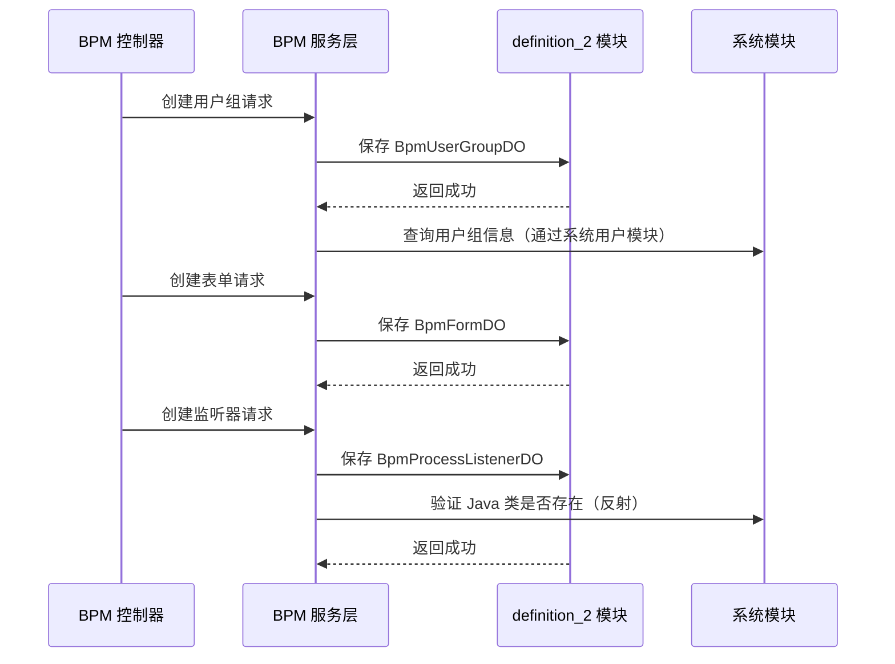
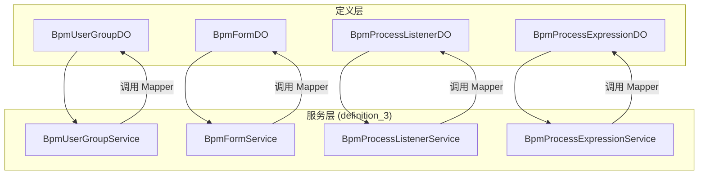
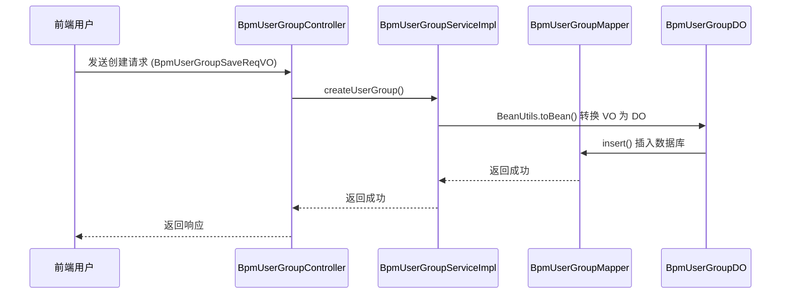
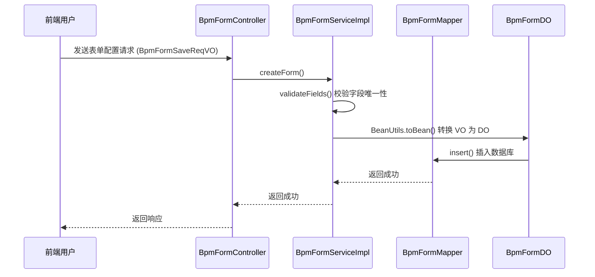

# BPM 定义模块 (definition_2)

## 1. 模块概述

**BPM 定义模块**是工作流管理系统（BPM）中负责定义层数据持久化的核心模块。该模块主要包含四个数据对象（DO），用于存储和管理 BPM 系统中的基础定义数据，包括用户组、表单定义、流程监听器和流程表达式等。

该模块属于 `yudao-module-bpm` 项目，位于 `dal/dataobject/definition` 目录下，是 BPM 模块定义层的基础数据层组件，为上层服务层和控制器层提供数据持久化支持。

## 2. 架构概览



### 模块关系图

```mermaid
graph LR
    subgraph "BPM 模块"
        subgraph "定义层"
            D1[definition_2]::|数据对象|
            D2[definition]::|控制器|
            D3[definition_3]::|服务层|
            D4[definition_4]::|转换层|
        end
        D1 --> D3
        D3 --> D2
        D3 --> D4
    end
    
    subgraph "依赖模块"
        S[yudao-module-system]::|用户/权限|
        F[yudao-module-bpm]::|Flowable引擎|
    end
    
    D1 --> S
    D1 --> F
```

## 3. 核心组件说明

### 3.1 BpmUserGroupDO - 用户组数据对象

**文件路径**: `yudao-module-bpm/src/main/java/cn/iocoder/yudao/module/bpm/dal/dataobject/definition/BpmUserGroupDO.java`

**功能描述**: 用于存储 BPM 系统中的用户组信息，支持将多个用户组织成组，便于在工作流中进行权限管理和任务分配。

**字段说明**:

| 字段名 | 类型 | 描述 | 备注 |
|--------|------|------|------|
| id | Long | 编号，自增 | 主键 |
| name | String | 组名 | 唯一标识 |
| description | String | 描述 | 可选 |
| status | Integer | 状态 | 枚举 `CommonStatusEnum` |
| userIds | Set<Long> | 成员用户编号数组 | 使用 `Jackson3TypeHandler` 序列化为 JSON |

**数据库表**: `bpm_user_group`

**使用场景**:
- 工作流中的用户组授权
- 任务分配时的组级指派
- 前端下拉选择框的用户组列表

### 3.2 BpmFormDO - 表单定义数据对象

**文件路径**: `yudao-module-bpm/src/main/java/cn/iocoder/yudao/module/bpm/dal/dataobject/definition/BpmFormDO.java`

**功能描述**: 用于存储 BPM 工作流的表单定义，支持动态配置表单，适用于需要灵活设计申请表的场景。表单配置采用 JSON 格式存储，支持通过表单设计器生成。

**字段说明**:

| 字段名 | 类型 | 描述 | 备注 |
|--------|------|------|------|
| id | Long | 编号 | 主键 |
| name | String | 表单名 | 唯一标识 |
| status | Integer | 状态 | 启用/禁用 |
| conf | String | 表单的配置 | JSON 格式 |
| fields | List<String> | 表单项数组 | 使用 `Jackson3TypeHandler` 序列化为 JSON |
| remark | String | 备注 | 可选 |

**数据库表**: `bpm_form`

**使用场景**:
- 动态表单配置（如请假申请、报销申请等）
- 与工作流引擎集成，作为流程实例的表单
- 支持表单设计器（form-generator）生成的 JSON 配置

### 3.3 BpmProcessListenerDO - 流程监听器数据对象

**文件路径**: `yudao-module-bpm/src/main/java/cn/iocoder/yudao/module/bpm/dal/dataobject/definition/BpmProcessListenerDO.java`

**功能描述**: 用于存储 BPM 流程监听器的模板定义。监听器本质上是在流程执行过程中触发特定逻辑的机制，支持在流程的不同阶段（如开始、结束、任务创建等）执行自定义代码。

**字段说明**:

| 字段名 | 类型 | 描述 | 备注 |
|--------|------|------|------|
| id | Long | 主键 ID，自增 | 主键 |
| name | String | 监听器名字 | 唯一标识 |
| status | Integer | 状态 | 枚举 `CommonStatusEnum` |
| type | String | 监听类型 | `execution` 或 `task` |
| event | String | 监听事件 | 根据 type 不同，事件含义不同 |
| valueType | String | 值类型 | `class` / `delegateExpression` / `expression` |
| value | String | 值 | 根据 valueType 不同含义不同 |

**监听类型说明**:
- **execution**: 执行监听器，对应 Flowable 的 `ExecutionListener`，事件包括 `start`、`end`
- **task**: 任务监听器，对应 Flowable 的 `TaskListener`，事件包括 `create`、`assignment`、`complete`、`delete`、`update`、`timeout`

**值类型说明**:
- **class**: Java 类，需实现 `JavaDelegate`（execution）或 `TaskListener`（task）
- **delegateExpression**: 委托表达式，Spring Bean 名称
- **expression**: 表达式，普通类的方法，需注册到 Spring 容器

**数据库表**: `bpm_process_listener`

**使用场景**:
- 流程启动前/后执行自定义逻辑
- 任务创建、完成时触发通知
- 任务指派时执行权限校验

### 3.4 BpmProcessExpressionDO - 流程表达式数据对象

**文件路径**: `yudao-module-bpm/src/main/java/cn/iocoder/yudao/module/bpm/dal/dataobject/definition/BpmProcessExpressionDO.java`

**功能描述**: 用于存储 BPM 流程表达式的定义。表达式通常用于在流程中动态计算条件、获取数据或执行逻辑，支持在流程决策点、任务分配等场景中使用。

**字段说明**:

| 字段名 | 类型 | 描述 | 备注 |
|--------|------|------|------|
| id | Long | 编号 | 主键 |
| name | String | 表达式名字 | 唯一标识 |
| status | Integer | 表达式状态 | 启用/禁用 |
| expression | String | 表达式内容 | 如 SpEL 表达式 |

**数据库表**: `bpm_process_expression`

**使用场景**:
- 流程决策条件计算
- 动态任务分配表达式
- 流程变量计算

## 4. 模块交互关系

### 4.1 与系统模块的交互



### 4.2 与 BPM 服务层的交互

定义层数据对象（DO）通过服务层（`definition_3`）与业务逻辑交互：



### 4.3 与数据库的交互

所有 DO 类都继承自 `BaseDO`，包含创建时间、更新时间等通用字段，并通过 MyBatis Plus 进行持久化操作。

## 5. 数据流转示例

### 5.1 用户组创建流程



### 5.2 表单配置保存流程



## 6. 依赖模块

| 模块 | 依赖说明 |
|------|----------|
| `yudao-framework-common` | 提供基础工具类、枚举（如 `CommonStatusEnum`）、MyBatis 基础组件 |
| `yudao-module-system` | 用户、权限、部门等系统基础数据引用 |
| `flowable-engine` | 工作流引擎的监听器、表达式等集成 |
| `mybatis-plus` | 数据持久化框架支持 |

## 7. 相关模块文档

- [BPM 控制器模块 (definition)](definition.md) - 提供 REST API 接口
- [BPM 服务模块 (definition_3)](definition_3.md) - 业务逻辑实现层
- [BPM 转换模块 (definition_4)](definition_4.md) - DO 与 VO 的转换实现
- [BPM 工作流引擎集成](bpm_flowable.md) - Flowable 引擎的定制配置

## 8. 总结

BPM 定义模块（definition_2）作为 BPM 系统的基础数据层，提供了四个核心数据对象，分别管理用户组、表单定义、流程监听器和流程表达式。这些 DO 类通过 MyBatis Plus 进行持久化，为上层服务层和控制器层提供数据支撑，是 BPM 工作流系统实现灵活配置和扩展的基础。
