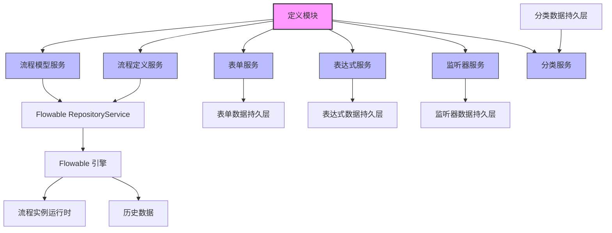
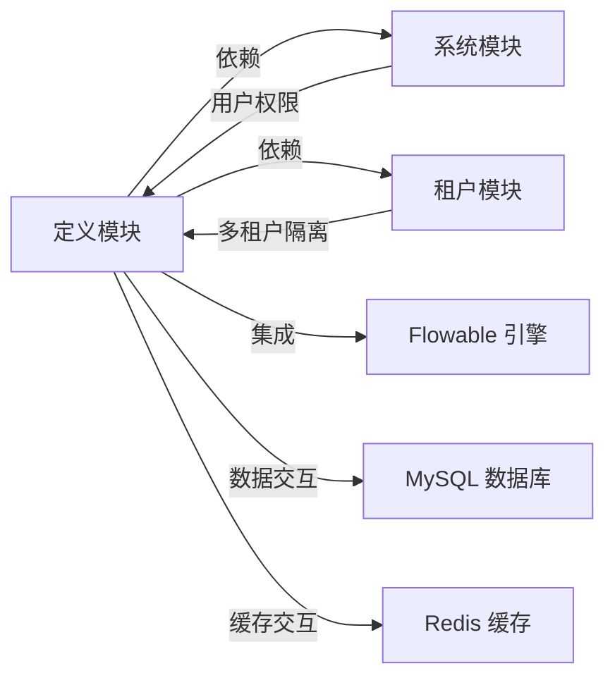
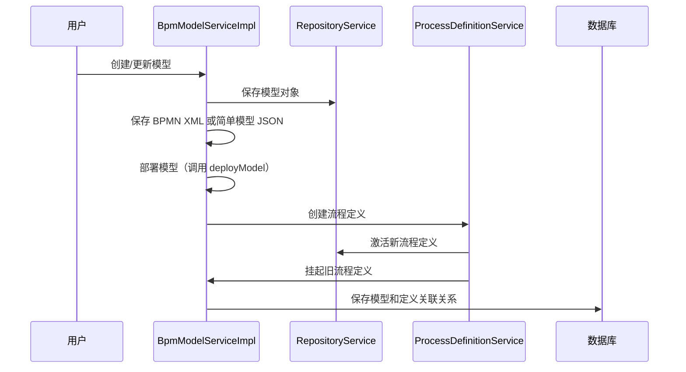

# BPM 定义模块 (definition_3) 文档

## 1. 模块概述

BPM 定义模块是工作流引擎的核心组成部分，主要负责流程模型、流程定义、表单、表达式、监听器及分类等定义对象的管理。该模块基于 Flowable 引擎，提供了完整的流程定义生命周期管理功能，包括模型的创建、部署、激活/挂起、删除等操作。

### 核心功能
- **流程模型管理**：支持 BPMN 和简单模型（仿钉钉快搭）的创建、更新、部署和删除
- **流程定义管理**：管理流程定义的激活/挂起状态、查询和版本控制
- **表单管理**：为流程模型配置动态表单，支持表单字段的增删改查
- **表达式管理**：支持流程表达式（如条件表达式）的创建和维护
- **监听器管理**：配置流程事件监听器（如任务监听器、执行监听器）
- **分类管理**：对流程模型进行分类管理，便于组织和检索

## 2. 架构概览

### 模块关系图

## 3. 核心服务组件

### 3.1 BpmModelServiceImpl - 流程模型服务

**功能描述**：负责流程模型（Model）的完整生命周期管理，包括模型的创建、更新、部署、删除和清理。支持两种模型类型：BPMN 标准模型和简单模型（仿钉钉快搭）。

**核心方法**：
- `createModel()`：创建新的流程模型
- `updateModel()`：更新现有模型
- `deployModel()`：部署模型到 Flowable 引擎，生成流程定义
- `deleteModel()`：删除模型并挂起相关流程定义
- `cleanModel()`：清理模型相关的流程实例和历史数据
- `getBpmnModelByDefinitionId()`：获取流程定义的 BPMN 模型

**依赖组件**：
- `RepositoryService`：Flowable 仓库服务，用于模型和流程定义的操作
- `BpmProcessDefinitionService`：流程定义服务，用于创建和更新流程定义
- `BpmFormService`：表单服务，用于验证表单配置
- `BpmTaskCandidateInvoker`：任务候选人验证器，用于校验任务分配规则

**数据流**：

### 3.2 BpmProcessDefinitionServiceImpl - 流程定义服务

**功能描述**：管理 Flowable 引擎中的流程定义（ProcessDefinition）和部署（Deployment）对象。提供流程定义的查询、激活/挂起、状态更新等操作。

**核心方法**：
- `getProcessDefinition()`：获取指定 ID 的流程定义
- `createProcessDefinition()`：创建流程定义（由模型部署触发）
- `updateProcessDefinitionState()`：激活或挂起流程定义
- `getProcessDefinitionPage()`：分页查询流程定义
- `canUserStartProcessDefinition()`：校验用户是否可以启动流程

**依赖组件**：
- `RepositoryService`：Flowable 仓库服务
- `BpmProcessDefinitionInfoMapper`：流程定义信息持久层
- `AdminUserApi`：用户服务 API，用于获取用户部门信息

**与模型服务的关系**：
- 模型部署时会调用 `createProcessDefinition()` 创建流程定义
- 流程定义与模型通过 `modelId` 和 `deploymentId` 关联
- 一个模型可以部署生成多个版本的流程定义

### 3.3 BpmFormServiceImpl - 表单服务

**功能描述**：管理流程关联的动态表单。表单用于流程实例的数据录入和展示，支持表单字段的配置和管理。

**核心方法**：
- `createForm()`：创建新表单
- `updateForm()`：更新表单配置
- `deleteForm()`：删除表单
- `getForm()`：获取表单详情
- `validateFields()`：校验表单字段不重复

**数据模型**：
- `BpmFormDO`：表单数据对象，包含表单配置信息和字段列表
- 表单与流程模型通过 `formId` 关联

**使用场景**：
- 流程模型部署时指定表单 ID
- 流程实例启动时加载表单数据
- 任务办理时展示和操作表单数据

### 3.4 BpmProcessExpressionServiceImpl - 表达式服务

**功能描述**：管理流程表达式，用于在流程中动态计算条件或值。表达式可以嵌入到 BPMN 模型中，实现条件流转、变量赋值等功能。

**核心方法**：
- `createProcessExpression()`：创建表达式
- `updateProcessExpression()`：更新表达式
- `deleteProcessExpression()`：删除表达式
- `getProcessExpressionPage()`：分页查询表达式

**数据模型**：
- `BpmProcessExpressionDO`：表达式数据对象，包含表达式 ID、名称、表达式内容等

**应用场景**：
- 网关条件表达式
- 任务分配表达式
- 变量赋值表达式

### 3.5 BpmProcessListenerServiceImpl - 监听器服务

**功能描述**：配置和管理流程事件监听器。监听器可以在流程执行的不同阶段（如任务创建、任务完成、流程启动等）触发自定义逻辑。

**核心方法**：
- `createProcessListener()`：创建监听器
- `updateProcessListener()`：更新监听器
- `deleteProcessListener()`：删除监听器
- `validateCreateProcessListenerValue()`：验证监听器值（类名或表达式）

**监听器类型**：
- `EXECUTION`：执行监听器，实现 `JavaDelegate` 接口
- `TASK`：任务监听器，实现 `TaskListener` 接口

**验证逻辑**：
- 类类型：验证类是否存在并实现对应接口
- 表达式类型：验证表达式格式 `${...}`

### 3.6 BpmCategoryServiceImpl - 分类服务

**功能描述**：对流程模型进行分类管理，便于组织和检索流程模型。支持分类的创建、更新、删除和排序。

**核心方法**：
- `createCategory()`：创建分类
- `updateCategory()`：更新分类
- `deleteCategory()`：删除分类（检查是否被模型使用）
- `updateCategorySortBatch()`：批量更新分类排序

**约束条件**：
- 分类名称和编码唯一
- 删除分类时检查是否有模型使用该分类

### 3.7 BpmUserGroupServiceImpl - 用户组服务

**功能描述**：管理系统中的用户组，用户组可用于流程中的任务分配和权限控制。

**核心方法**：
- `createUserGroup()`：创建用户组
- `updateUserGroup()`：更新用户组
- `deleteUserGroup()`：删除用户组
- `getUserGroupPage()`：分页查询用户组
- `validUserGroups()`：验证用户组存在且启用

**数据模型**：
- `BpmUserGroupDO`：用户组数据对象，包含用户组 ID、名称、状态等

## 4. 数据持久层

定义模块使用 MyBatis-Plus 进行数据持久层操作，每个服务对应一个 Mapper 接口和数据对象（DO）。

| 服务 | 数据对象 | Mapper |
|------|----------|--------|
| BpmModelService | BpmModelDO (Flowable 内置) | ModelQuery |
| BpmProcessDefinitionService | BpmProcessDefinitionInfoDO | BpmProcessDefinitionInfoMapper |
| BpmFormService | BpmFormDO | BpmFormMapper |
| BpmProcessExpressionService | BpmProcessExpressionDO | BpmProcessExpressionMapper |
| BpmProcessListenerService | BpmProcessListenerDO | BpmProcessListenerMapper |
| BpmCategoryService | BpmCategoryDO | BpmCategoryMapper |
| BpmUserGroupService | BpmUserGroupDO | BpmUserGroupMapper |

## 5. 与其他模块的交互

### 5.1 与租户模块的交互
- 所有定义操作都通过 `FlowableUtils.getTenantId()` 获取租户 ID，实现多租户数据隔离
- 租户配置在 `YudaoTenantAutoConfiguration` 中定义

### 5.2 与系统模块的交互
- 用户权限校验：通过 `AdminUserApi` 获取用户信息
- 字典数据：使用系统模块的字典服务
- 操作日志：通过系统模块的日志记录定义操作

### 5.3 与 Flowable 引擎的集成
- 使用 Flowable 的 `RepositoryService`、`RuntimeService`、`TaskService` 等核心服务
- 监听 Flowable 的事件和生命周期
- 扩展 Flowable 的默认行为（如自定义表达式函数、任务分配策略）

## 6. 异常处理

定义模块使用统一的异常处理机制，通过 `ServiceExceptionUtil` 抛出业务异常，错误码定义在 `ErrorCodeConstants` 中。常见异常包括：

- `MODEL_NOT_EXISTS`：模型不存在
- `PROCESS_DEFINITION_NOT_EXISTS`：流程定义不存在
- `FORM_NOT_EXISTS`：表单不存在
- `USER_GROUP_NOT_EXISTS`：用户组不存在
- `CATEGORY_DELETE_FAIL_MODEL_USED`：分类被模型使用，无法删除

## 7. 事务管理

定义模块中的关键操作使用 `@Transactional` 注解保证数据一致性：

- 模型部署（`deployModel()`）：创建流程定义、挂起旧模型、更新模型部署 ID 等操作在同一个事务中
- 模型删除（`deleteModel()`）：删除模型和挂起流程定义
- 模型清理（`cleanModel()`）：清理所有相关的流程实例、历史数据和任务
- 分类排序更新（`updateCategorySortBatch()`）：批量更新分类排序

## 8. 子模块文档

定义模块包含以下 7 个子模块，每个子模块都有详细的独立文档：

| 子模块 | 文档文件 | 核心职责 |
|--------|----------|----------|
| BPM 模型管理 | [definition_3_bpm_model.md](definition_3_bpm_model.md) | 流程模型的创建、部署、清理和版本管理 |
| BPM 流程定义 | [definition_3_bpm_process_definition.md](definition_3_bpm_process_definition.md) | 流程定义的生命周期管理（激活/挂起、查询） |
| BPM 表单管理 | [definition_3_bpm_form.md](definition_3_bpm_form.md) | 动态表单的配置和管理 |
| BPM 表达式管理 | [definition_3_bpm_process_expression.md](definition_3_bpm_process_expression.md) | 流程表达式的创建和维护 |
| BPM 监听器管理 | [definition_3_bpm_process_listener.md](definition_3_bpm_process_listener.md) | 流程事件监听器的配置 |
| BPM 分类管理 | [definition_3_bpm_category.md](definition_3_bpm_category.md) | 流程模型的分类组织 |
| BPM 用户组管理 | [definition_3_bpm_user_group.md](definition_3_bpm_user_group.md) | 用户组的创建和维护 |

详细文档请参考以上各子模块文档。

## 9. 配置说明

定义模块的相关配置主要在以下配置类中：

- `BpmFlowableConfiguration`：Flowable 引擎配置
- `BpmWebConfiguration`：Web 层配置
- 租户配置：`YudaoTenantAutoConfiguration`

## 10. 总结

BPM 定义模块是工作流系统的基石，提供了流程定义的全生命周期管理能力。通过整合 Flowable 引擎和自定义的业务逻辑，实现了灵活、可扩展的流程建模和部署能力。模块设计遵循分层架构，职责清晰，易于维护和扩展。
