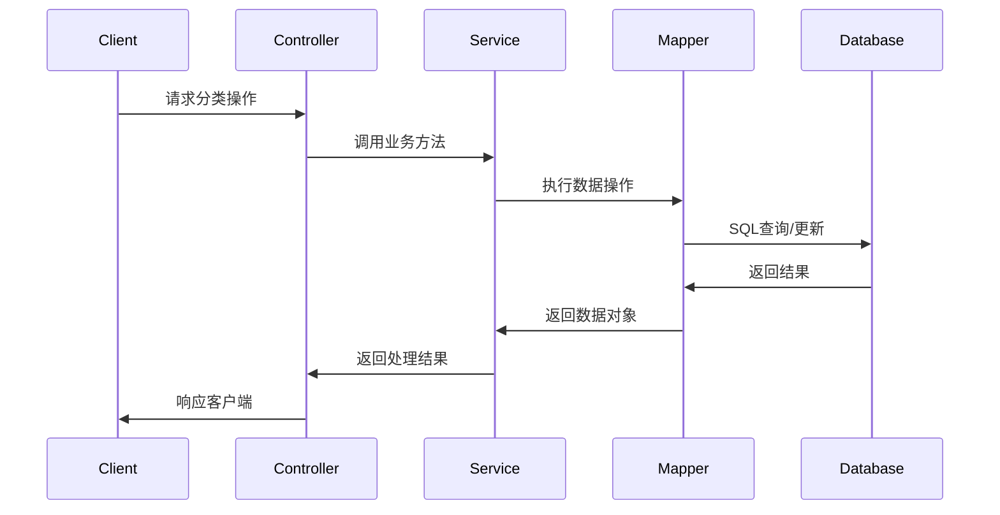
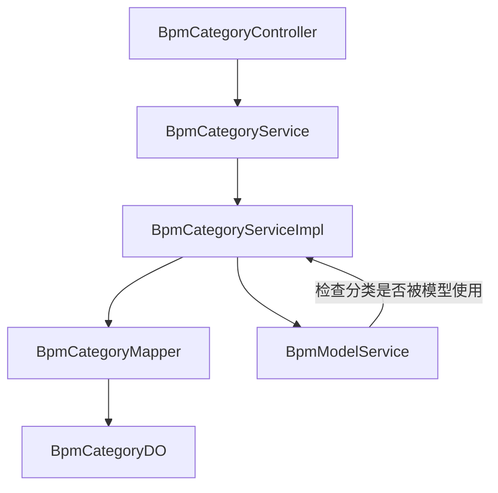
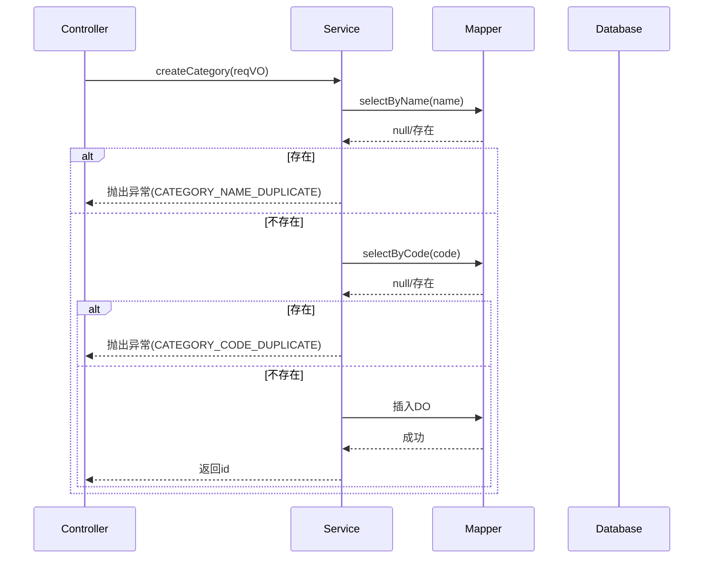
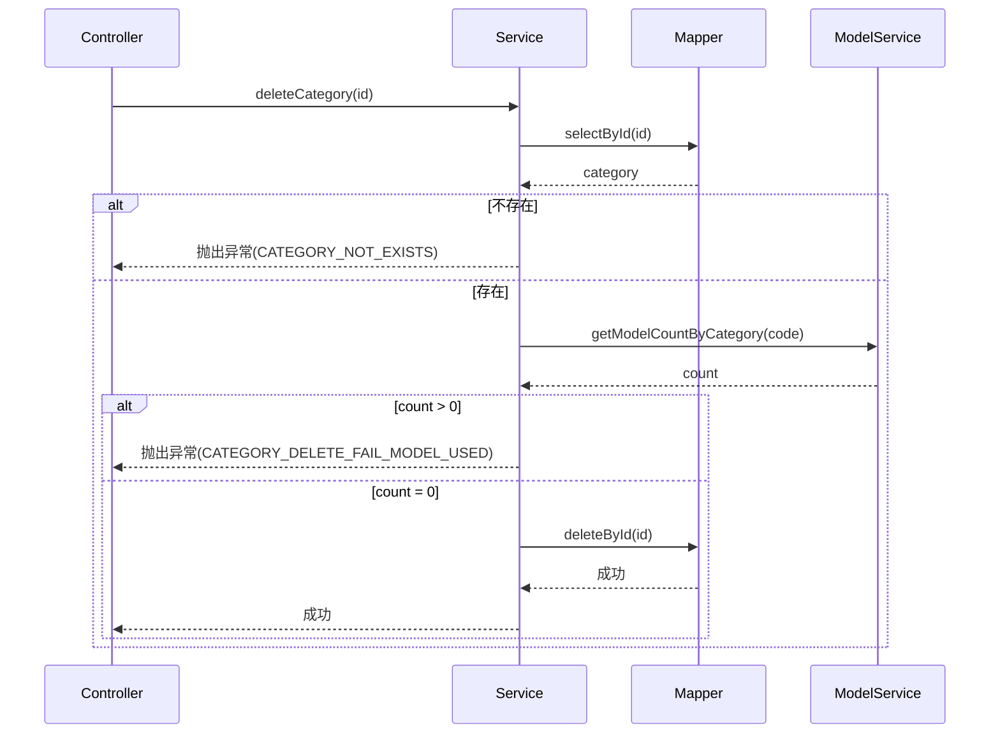
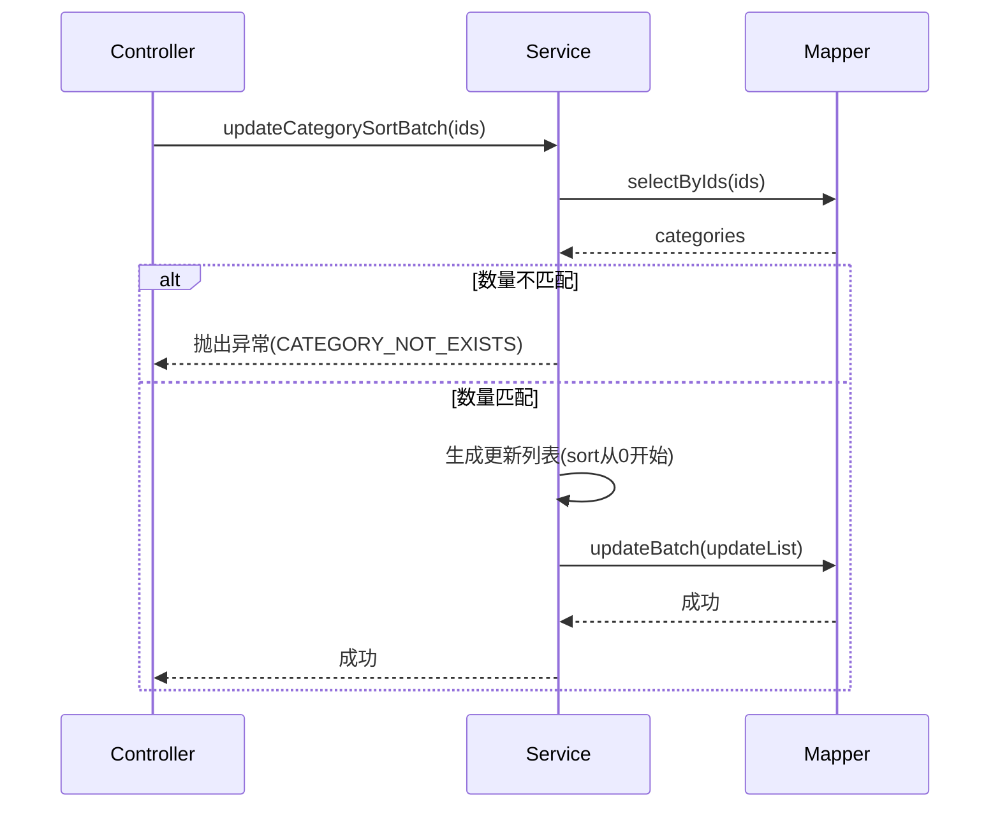

# BPM 流程分类模块 (BPM Category Module)

## 1. 模块概述

BPM 流程分类模块是工作流管理系统（BPM）中的基础配置模块，用于对业务流程进行分类管理。该模块提供了对流程分类的增删改查、排序维护等功能，是流程模型管理的基础支撑组件。

在整体架构中，该模块属于 `yudao-module-bpm` 模块，主要服务于流程定义、流程模型等上层业务，为流程的分类组织提供数据支持。

## 2. 架构设计

### 2.1 模块层级结构

```
yudao-module-bpm/
├── controller/              # 控制器层
│   └── admin/definition/
│       └── BpmCategoryController.java
├── service/definition/      # 服务层
│   ├── BpmCategoryService.java      # 接口
│   └── BpmCategoryServiceImpl.java  # 实现
├── dal/                     # 数据访问层
│   ├── mysql/category/
│   │   └── BpmCategoryMapper.java   # Mapper
│   └── dataobject/definition/
│       └── BpmCategoryDO.java       # 数据对象
└── controller/admin/definition/vo/category/
    ├── BpmCategorySaveReqVO.java    # 请求VO
    └── BpmCategoryPageReqVO.java    # 分页请求VO
```

### 2.2 组件关系图

```mermaid
classDiagram
    class BpmCategoryController {
        +createCategory()
        +updateCategory()
        +deleteCategory()
        +getCategory()
        +getCategoryPage()
        +getCategorySimpleList()
    }
    class BpmCategoryService {
        +createCategory()
        +updateCategory()
        +deleteCategory()
        +getCategory()
        +getCategoryPage()
        +getCategoryListByCode()
        +getCategoryListByStatus()
        +updateCategorySortBatch()
    }
    class BpmCategoryServiceImpl {
        +bpmCategoryMapper
        +modelService
    }
    class BpmCategoryMapper {
        +selectPage()
        +selectByName()
        +selectByCode()
        +selectListByCode()
        +selectListByStatus()
    }
    class BpmCategoryDO {
        +id
        +name
        +code
        +description
        +status
        +sort
    }

    BpmCategoryController -->> BpmCategoryService
    BpmCategoryService <|.. BpmCategoryServiceImpl
    BpmCategoryServiceImpl -->> BpmCategoryMapper
    BpmCategoryMapper -->> BpmCategoryDO
    BpmCategoryService -->> BpmModelService: 依赖检查
```

### 2.3 数据流图



## 3. 核心组件说明

### 3.1 数据对象 (DO) - `BpmCategoryDO`

位于 `yudao-module-bpm/src/main/java/cn/iocoder/yudao/module/bpm/dal/dataobject/definition/BpmCategoryDO.java`

```java
@Table("bpm_category")
@Data
@Builder
@NoArgsConstructor
@AllArgsConstructor
public class BpmCategoryDO extends BaseDO {
    /** 分类编号 */
    @TableId
    private Long id;
    
    /** 分类名 */
    private String name;
    
    /** 分类标志 */
    private String code;
    
    /** 分类描述 */
    private String description;
    
    /** 分类状态 (枚举: CommonStatusEnum) */
    private Integer status;
    
    /** 分类排序 */
    private Integer sort;
}
```

**字段说明：**
- `id`: 主键，自增
- `name`: 分类名称，唯一性校验
- `code`: 分类标志/编码，唯一性校验
- `description`: 分类描述
- `status`: 状态位，使用 `CommonStatusEnum` 枚举（启用/禁用）
- `sort`: 排序值，用于界面展示顺序

### 3.2 Mapper 层 - `BpmCategoryMapper`

位于 `yudao-module-bpm/src/main/java/cn/iocoder/yudao/module/bpm/dal/mysql/category/BpmCategoryMapper.java`

继承自 `BaseMapperX<BpmCategoryDO>`，扩展了以下自定义方法：

| 方法名 | 说明 |
|--------|------|
| `selectPage` | 分页查询，支持按 name/code/status/createTime 条件查询 |
| `selectByName` | 按名称查询，用于唯一性校验 |
| `selectByCode` | 按编码查询，用于唯一性校验 |
| `selectListByCode` | 按编码列表查询 |
| `selectListByStatus` | 按状态查询列表 |

### 3.3 服务层 - `BpmCategoryService` 与 `BpmCategoryServiceImpl`

**服务接口**定义了以下核心方法：

| 方法名 | 参数 | 返回 | 说明 |
|--------|------|------|------|
| `createCategory` | `BpmCategorySaveReqVO` | `Long` | 创建新分类，校验唯一性后插入 |
| `updateCategory` | `BpmCategorySaveReqVO` | `void` | 更新分类，校验存在性和唯一性 |
| `deleteCategory` | `Long id` | `void` | 删除分类，检查是否被模型使用 |
| `getCategory` | `Long id` | `BpmCategoryDO` | 根据ID获取分类 |
| `getCategoryPage` | `BpmCategoryPageReqVO` | `PageResult<BpmCategoryDO>` | 分页查询分类 |
| `getCategoryListByCode` | `Collection<String> codes` | `List<BpmCategoryDO>` | 按编码获取分类列表 |
| `getCategoryListByStatus` | `Integer status` | `List<BpmCategoryDO>` | 按状态获取分类列表 |
| `updateCategorySortBatch` | `List<Long> ids` | `void` | 批量更新排序（按传入顺序重新排序） |

**实现类关键逻辑：**

1. **创建流程**：
   - 校验分类名称和编码的唯一性
   - 将 VO 转换为 DO 并插入数据库

2. **更新流程**：
   - 校验分类存在
   - 校验名称和编码的唯一性（排除自身）
   - 更新数据库记录

3. **删除流程**：
   - 校验分类存在
   - **关键校验**：检查该分类是否被流程模型使用（通过 `modelService.getModelCountByCategory()`）
   - 若被使用则拒绝删除，防止数据不一致

4. **批量排序**：
   - 校验所有传入的ID都存在
   - 按传入顺序重新分配 sort 值（0, 1, 2, ...）
   - 批量更新

### 3.4 控制器层 - `BpmCategoryController`

提供 RESTful API 接口，路径前缀 `/bpm/category`：

| 请求方法 | 端点 | 说明 | 权限校验 |
|----------|------|------|----------|
| POST | `/create` | 创建分类 | `bpm:category:create` |
| PUT | `/update` | 更新分类 | `bpm:category:update` |
| PUT | `/update-sort-batch` | 批量更新排序 | `bpm:category:update` |
| DELETE | `/delete` | 删除分类 | `bpm:category:delete` |
| GET | `/get` | 获取分类详情 | `bpm:category:query` |
| GET | `/page` | 分页查询分类 | `bpm:category:query` |
| GET | `/simple-list` | 获取启用分类简列表 | 无权限（公开） |

**响应格式统一使用 `CommonResult`**，包含成功标志、数据和消息。

### 3.5 视图对象 (VO)

#### `BpmCategorySaveReqVO` - 创建/更新请求

```java
@Data
@Schema(description = "BPM 流程分类新增/修改 Request VO")
public class BpmCategorySaveReqVO {
    
    @Schema(description = "分类编号", example = "3167")
    private Long id;
    
    @Schema(description = "分类名", example = "王五")
    @NotEmpty(message = "分类名不能为空")
    private String name;
    
    @Schema(description = "分类描述", example = "你猜")
    private String description;
    
    @Schema(description = "分类标志", example = "OA")
    @NotEmpty(message = "分类标志不能为空")
    private String code;
    
    @Schema(description = "分类状态", example = "1")
    @NotNull(message = "分类状态不能为空")
    @InEnum(CommonStatusEnum.class)
    private Integer status;
    
    @Schema(description = "分类排序")
    @NotNull(message = "分类排序不能为空")
    private Integer sort;
}
```

#### `BpmCategoryPageReqVO` - 分页查询请求

继承自 `PageParam`，包含分页参数和查询条件：

```java
@Data
@Schema(description = "BPM 流程分类分页 Request VO")
public class BpmCategoryPageReqVO extends PageParam {
    
    @Schema(description = "分类名", example = "王五")
    private String name;
    
    @Schema(description = "分类标志", example = "OA")
    private String code;
    
    @Schema(description = "分类状态", example = "1")
    @InEnum(CommonStatusEnum.class)
    private Integer status;
    
    @Schema(description = "创建时间")
    @DateTimeFormat(pattern = "yyyy-MM-dd HH:mm:ss")
    private LocalDateTime[] createTime;
}
```

## 4. 依赖关系

### 4.1 内部依赖



### 4.2 外部依赖

- **BPM 模型模块**：`BpmModelService` 用于在删除分类时检查是否有模型使用该分类
- **通用工具类**：`BeanUtils`、`CollUtil`、`ObjUtil` 等用于对象转换和集合操作
- **异常处理**：`ServiceExceptionUtil` 抛出业务异常
- **枚举**：`CommonStatusEnum` 用于状态校验，`ErrorCodeConstants` 错误码

## 5. 业务流程

### 5.1 创建流程分类



### 5.2 删除流程分类（含防删除检查）



### 5.3 批量排序更新



## 6. 异常处理

模块使用统一的异常抛出机制，通过 `ServiceExceptionUtil.exception()` 抛出业务异常，错误码定义在 `ErrorCodeConstants` 中：

| 错误码 | 说明 | 触发场景 |
|--------|------|----------|
| `CATEGORY_NAME_DUPLICATE` | 分类名重复 | 创建/更新时名称已存在 |
| `CATEGORY_CODE_DUPLICATE` | 分类编码重复 | 创建/更新时编码已存在 |
| `CATEGORY_NOT_EXISTS` | 分类不存在 | 获取/更新/删除时ID不存在 |
| `CATEGORY_DELETE_FAIL_MODEL_USED` | 分类被模型使用 | 删除时该分类下有流程模型 |

## 7. 与其他模块的交互

### 7.1 与 BPM 模型模块 (`BpmModelService`)

- **交互场景**：删除分类前，检查是否有模型使用该分类
- **交互方式**：通过 `modelService.getModelCountByCategory(category.getCode())` 查询
- **依赖关系**：`BpmCategoryServiceImpl` 依赖 `BpmModelService`

### 7.2 与系统权限模块

- **权限控制**：所有接口通过 `@PreAuthorize` 注解进行权限校验
- **权限点**：
  - `bpm:category:create` - 创建权限
  - `bpm:category:update` - 更新/排序权限
  - `bpm:category:delete` - 删除权限
  - `bpm:category:query` - 查询权限

### 7.3 与前端 UI 模块

前端通过 REST API 与后端交互，使用的 VO 定义在 `yudao-ui` 模块中：

- `CategoryVO` - 分类对象
- 相关 API 文件：`yudao-ui/yudao-admin-vue3/src/api/bpm/category/index.ts`

## 8. 配置与扩展

### 8.1 自动配置

BPM 模块的整体配置在 `BpmFlowableConfiguration` 中，分类模块作为其中一部分，无需额外配置。

### 8.2 可扩展点

1. **状态扩展**：通过 `CommonStatusEnum` 枚举扩展分类状态
2. **排序策略**：`updateCategorySortBatch` 方法支持按传入顺序重新排序
3. **查询扩展**：Mapper 层支持按 name/code/status/createTime 多条件查询

## 9. 测试要点

1. **唯一性校验**：测试创建/更新时名称和编码的重复校验
2. **删除保护**：测试删除被模型使用的分类时抛出异常
3. **分页查询**：测试分页参数和查询条件的正确性
4. **批量排序**：测试排序更新后数据的正确性
5. **权限控制**：测试不同权限用户的接口访问控制

## 10. 参考文档

- [BPM 流程定义模块](definition_3_bpm_process_definition.md) - 流程定义管理
- [BPM 模型模块](definition_3_bpm_model.md) - 流程模型管理
- [BPM 表单模块](definition_3_bpm_form.md) - 表单配置管理
- [系统权限模块](system_security.md) - 权限控制体系
- [通用工具类](common_utils.md) - 常用工具说明
