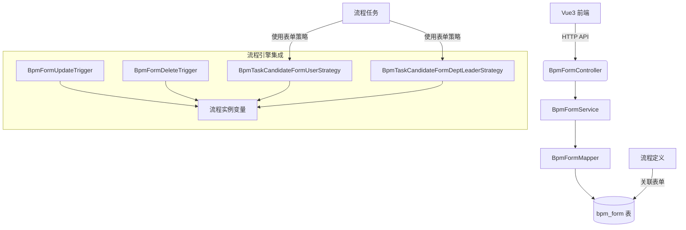
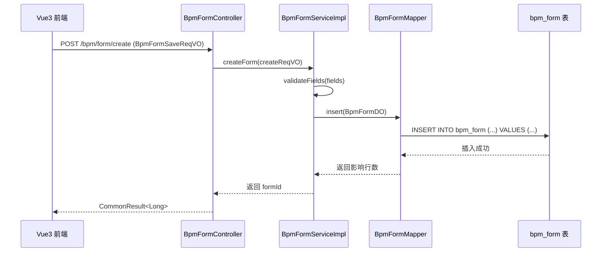
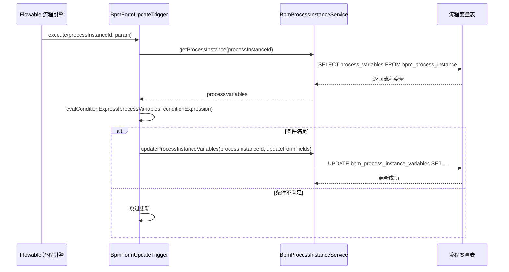
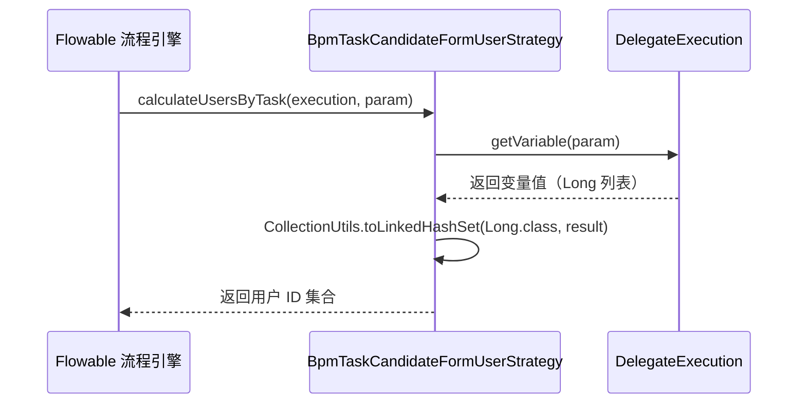

# 动态表单模块 (BPM Form Module) 文档

## 1. 概述

动态表单模块是 BPM（业务流程管理）系统中的核心组件，用于管理和配置与流程相关的动态表单。该模块支持表单的创建、更新、删除、查询等操作，并能与流程引擎无缝集成，实现表单数据与流程变量的自动同步。

**核心功能：**
- 动态表单的 CRUD 操作
- 表单字段管理（基于 JSON 格式存储）
- 与流程任务的候选人策略集成（表单用户、表单部门领导等）
- 流程触发器（表单更新、表单删除时触发流程变量变更）
- 与流程定义、流程实例的深度集成

**模块定位：**
```
┌─────────────────────────────────────────────────────┐
│                    BPM 模块                          │
│  ┌───────────────────────────────────────────────┐  │
│  │              动态表单子模块                   │  │
│  │  ┌───────────────────────────────────────┐    │  │
│  │  │  Controller: BpmFormController        │    │  │
│  │  │  Service: BpmFormServiceImpl          │    │  │
│  │  │  DO: BpmFormDO                        │    │  │
│  │  │  Trigger: BpmFormUpdateTrigger        │    │  │
│  │  │  Trigger: BpmFormDeleteTrigger        │    │  │
│  │  │  Strategy: BpmTaskCandidateForm*      │    │  │
│  │  └───────────────────────────────────────┘    │  │
│  └───────────────────────────────────────────────┘  │
└─────────────────────────────────────────────────────┘
```

## 2. 架构设计

### 2.1 系统架构图



### 2.2 组件关系图

```mermaid
classDiagram
    class BpmFormController {
        +createForm()
        +updateForm()
        +deleteForm()
        +getForm()
        +getFormSimpleList()
        +getFormPage()
    }
    class BpmFormService {
        +createForm()
        +updateForm()
        +deleteForm()
        +getForm()
        +getFormList()
        +getFormPage()
    }
    class BpmFormDO {
        +id
        +name
        +status
        +conf
        +fields
        +remark
        +createTime
    }
    class BpmFormMapper {
        +insert()
        +updateById()
        +deleteById()
        +selectById()
        +selectList()
        +selectByIds()
        +selectPage()
    }
    class BpmFormUpdateTrigger {
        +execute()
    }
    class BpmFormDeleteTrigger {
        +execute()
    }
    class BpmTaskCandidateFormUserStrategy {
        +calculateUsersByTask()
        +calculateUsersByActivity()
    }
    class BpmTaskCandidateFormDeptLeaderStrategy {
        +calculateUsersByTask()
        +calculateUsersByActivity()
    }

    BpmFormController --> BpmFormService
    BpmFormService --> BpmFormMapper
    BpmFormMapper --|持久化| BpmFormDO
    BpmFormUpdateTrigger --> BpmProcessInstanceService
    BpmFormDeleteTrigger --> BpmProcessInstanceService
    BpmTaskCandidateFormUserStrategy --> DelegateExecution
    BpmTaskCandidateFormDeptLeaderStrategy --> DelegateExecution
```

## 3. 核心组件说明

### 3.1 数据对象 (DO) - `BpmFormDO`

**文件路径:** `yudao-module-bpm/src/main/java/cn/iocoder/yudao/module/bpm/dal/dataobject/definition/BpmFormDO.java`

**表名:** `bpm_form`

| 字段 | 类型 | 描述 |
|------|------|------|
| id | Long | 主键编号 |
| name | String | 表单名称 |
| status | Integer | 状态（参见 CommonStatusEnum 枚举）|
| conf | String | 表单配置 JSON 字符串 |
| fields | List<String> | 表单项数组（JSON 字符串列表）|
| remark | String | 备注 |
| createTime | LocalDateTime | 创建时间 |

**特殊说明:**
- `fields` 字段使用 `Jackson3TypeHandler` 进行序列化和反序列化，存储的是 JSON 格式的表单项数组
- 每个表单项包含 `vModel`（字段属性名）和 `label`（字段标题）
- 表单配置 `conf` 直接保存 form-generator 生成的 JSON 串

### 3.2 服务层 (Service) - `BpmFormServiceImpl`

**文件路径:** `yudao-module-bpm/src/main/java/cn/iocoder/yudao/module/bpm/service/definition/BpmFormServiceImpl.java`

**接口:** `BpmFormService`

**主要方法:**

| 方法 | 参数 | 返回 | 描述 |
|------|------|------|------|
| createForm | `BpmFormSaveReqVO` | Long | 创建新表单，返回表单 ID |
| updateForm | `BpmFormSaveReqVO` | void | 更新现有表单 |
| deleteForm | `Long id` | void | 删除表单 |
| getForm | `Long id` | BpmFormDO | 根据 ID 获取表单 |
| getFormList | - | List<BpmFormDO> | 获取所有表单 |
| getFormList | `Collection<Long> ids` | List<BpmFormDO> | 根据 ID 列表获取表单 |
| getFormPage | `BpmFormPageReqVO` | PageResult<BpmFormDO> | 分页查询表单 |

**校验逻辑:**
- `validateFields()`: 检查表单字段是否重复（vModel 唯一性）
- `validateFormExists()`: 在更新/删除前校验表单是否存在

### 3.3 控制器 (Controller) - `BpmFormController`

**文件路径:** `yudao-module-bpm/src/main/java/cn/iocoder/yudao/module/bpm/controller/admin/definition/BpmFormController.java`

**API 端点:**

| HTTP 方法 | 端点 | 描述 | 权限 |
|-----------|------|------|------|
| POST | `/bpm/form/create` | 创建动态表单 | `bpm:form:create` |
| PUT | `/bpm/form/update` | 更新动态表单 | `bpm:form:update` |
| DELETE | `/bpm/form/delete` | 删除动态表单 | `bpm:form:delete` |
| GET | `/bpm/form/get` | 获取动态表单 | `bpm:form:query` |
| GET | `/bpm/form/list-all-simple` / `/simple-list` | 获取精简表单列表（用于下拉框）| - |
| GET | `/bpm/form/page` | 分页获取动态表单 | `bpm:form:query` |

### 3.4 数据传输对象 (DTO/VO)

#### 3.4.1 请求 VO

**BpmFormSaveReqVO** - 表单创建/更新请求

| 字段 | 类型 | 必填 | 描述 |
|------|------|------|------|
| id | Long | 否 | 表单编号（更新时使用）|
| name | String | 是 | 表单名称 |
| conf | String | 是 | 表单配置 JSON 字符串 |
| fields | List<String> | 是 | 表单项数组（JSON 字符串列表）|
| status | Integer | 是 | 表单状态 |
| remark | String | 否 | 备注 |

**BpmFormPageReqVO** - 分页查询请求

| 字段 | 类型 | 描述 |
|------|------|------|
| name | String | 表单名称（模糊匹配）|
| 继承自 PageParam | - | 分页参数（pageNum, pageSize, orderByClause）|

#### 3.4.2 响应 VO

**BpmFormRespVO** - 表单响应对象

包含所有 DO 字段 + `createTime` 创建时间字段。

**BpmFormFieldRespDTO** - 表单字段响应 DTO（内部使用）

| 字段 | 类型 | 描述 |
|------|------|------|
| label | String | 表单标题 |
| vModel | String | 表单字段的属性名 |

### 3.5 触发器 (Trigger)

#### 3.5.1 表单更新触发器 - `BpmFormUpdateTrigger`

**文件路径:** `yudao-module-bpm/src/main/java/cn/iocoder/yudao/module/bpm/service/task/trigger/form/BpmFormUpdateTrigger.java`

**触发类型:** `FORM_UPDATE`

**功能:** 当流程执行到特定节点时，根据配置更新流程中的表单变量。

**处理流程:**
1. 解析触发器配置（包含条件表达式和要更新的表单字段）
2. 获取当前流程实例的变量
3. 评估条件表达式（如果配置了条件）
4. 如果条件满足，调用 `processInstanceService.updateProcessInstanceVariables()` 更新流程变量

#### 3.5.2 表单删除触发器 - `BpmFormDeleteTrigger`

**文件路径:** `yudao-module-bpm/src/main/java/cn/iocoder/yudao/module/bpm/service/task/trigger/form/BpmFormDeleteTrigger.java`

**触发类型:** `FORM_DELETE`

**功能:** 当流程执行到特定节点时，根据配置删除流程中的表单变量。

**处理流程:**
1. 解析触发器配置（包含条件表达式和要删除的字段列表）
2. 获取当前流程实例的变量
3. 评估条件表达式（如果配置了条件）
4. 如果条件满足，调用 `processInstanceService.removeProcessInstanceVariables()` 删除指定字段

### 3.6 候选人策略 (Candidate Strategy)

#### 3.6.1 表单用户策略 - `BpmTaskCandidateFormUserStrategy`

**文件路径:** `yudao-module-bpm/src/main/java/cn/iocoder/yudao/module/bpm/framework/flowable/core/candidate/strategy/form/BpmTaskCandidateFormUserStrategy.java`

**策略类型:** `FORM_USER`

**功能:** 从流程变量中读取用户 ID 列表，作为任务候选人。

**使用场景:** 表单中有一个多选用户字段，选择的用户都可以处理该任务。

**参数:** 表单内用户字段名（如 `assigneeIds`），该字段在流程变量中存储为 Long 列表。

#### 3.6.2 表单部门领导策略 - `BpmTaskCandidateFormDeptLeaderStrategy`

**文件路径:** `yudao-module-bpm/src/main/java/cn/iocoder/yudao/module/bpm/framework/flowable/core/candidate/strategy/form/BpmTaskCandidateFormDeptLeaderStrategy.java`

**策略类型:** `FORM_DEPT_LEADER`

**功能:** 从流程变量中读取部门 ID，然后获取该部门的指定层级领导作为任务候选人。

**参数格式:** `表单部门字段名|部门层级`（例如：`deptId|2` 表示获取二级部门领导）

**使用场景:** 表单中有一个部门字段，需要该部门的上级领导来审批任务。

## 4. 数据流分析

### 4.1 创建表单的数据流



### 4.2 表单更新触发器的数据流



### 4.3 表单候选人策略的数据流



## 5. 与其他模块的集成

### 5.1 与流程定义模块集成

- 流程定义（`BpmProcessDefinition`）可以关联一个动态表单（通过 `formId` 字段）
- 在流程设计器中，可以为每个任务节点配置表单
- 表单配置中包含触发器设置（更新/删除触发器）

### 5.2 与任务管理模块集成

- 任务分配时，可以使用表单候选人策略来确定任务的处理人
- 任务办理时，可以填写表单数据，表单数据会自动保存到流程变量中

### 5.3 与简单模型配置集成

- 简单模型（Simple Model）的配置中包含 `FormTriggerSetting`，用于配置表单触发器
- 触发器配置包括条件表达式和要操作的表单字段

## 6. 配置项

### 6.1 表单状态枚举

参考 `CommonStatusEnum` 枚举，常见状态值：
- `1`: 启用
- `0`: 禁用

### 6.2 错误码

- `FORM_NOT_EXISTS`: 表单不存在
- `FORM_FIELD_REPEAT`: 表单字段重复

## 7. 扩展点

### 7.1 自定义候选人策略

可以通过实现 `BpmTaskCandidateStrategy` 接口来扩展新的候选人策略，并在流程配置中使用。

### 7.2 自定义触发器

可以通过实现 `BpmTrigger` 接口来扩展新的触发器类型，在流程节点的表单配置中引用。

### 7.3 表单字段校验

在 `BpmFormServiceImpl.validateFields()` 方法中可以添加更严格的字段校验逻辑（当前代码中有 TODO 注释，暂时禁用了重复校验以兼容新版表单设计器）。

## 8. 依赖关系

```mermaid
graph LR
    A[BpmFormServiceImpl] --> B[BpmFormMapper]
    A --> C[JsonUtils]
    A --> [BeanUtils]
    A --> [CollUtil]
    A --> [Assert]
    A --> [ErrorCodeConstants]
    A --> [ServiceExceptionUtil]
    
    B --> D[(bpm_form 表)]
    
    E[BpmFormUpdateTrigger] --> F[BpmProcessInstanceService]
    E --> [SimpleModelUtils]
    E --> [BpmnModelUtils]
    
    G[BpmFormDeleteTrigger] --> F
    
    H[BpmTaskCandidateFormUserStrategy] --> I[DelegateExecution]
    H --> [CollectionUtils]
    
    J[BpmTaskCandidateFormDeptLeaderStrategy] --> K[AbstractBpmTaskCandidateDeptLeaderStrategy]
```

## 9. 使用说明

### 9.1 创建新表单

```http
POST /bpm/form/create
Content-Type: application/json

{
  "name": "请假申请表单",
  "conf": "{...}",  // form-generator 生成的配置
  "fields": "[{\"vModel\":\"leaveType\",\"label\":\"请假类型\"},...]",
  "status": 1,
  "remark": "员工请假使用的表单"
}
```

### 9.2 在流程中使用表单

1. 在流程设计器中，为某个用户任务节点配置关联的表单
2. 在任务属性中，可以配置候选人策略（如表单用户、表单部门领导）
3. 可以配置表单触发器（任务开始时更新/删除某些流程变量）

### 9.3 获取表单列表（用于下拉框）

```http
GET /bpm/form/simple-list
```

返回精简的表单列表，仅包含 `id` 和 `name` 字段，适合在前端下拉框中使用。

## 10. 常见问题

### Q1: 表单字段重复校验为什么被禁用了？

A: 代码中有 TODO 注释说明，因为采用了新的表单设计器（Vue3 版本），暂时不需要校验字段重复。如果需要重新启用，可以修改 `validateFields()` 方法中的条件判断。

### Q2: 表单数据如何与流程变量同步？

A: 通过 `BpmFormUpdateTrigger` 和 `BpmFormDeleteTrigger` 两个触发器实现。当流程执行到配置了触发器的节点时，会根据触发器配置自动更新或删除流程变量。

### Q3: 如何使用表单部门领导策略？

A: 在流程任务的候选人配置中选择 `FORM_DEPT_LEADER` 策略，参数格式为 `表单部门字段名|部门层级`。例如，如果表单中有一个 `deptId` 字段，想要获取二级部门领导，则参数设置为 `deptId|2`。
