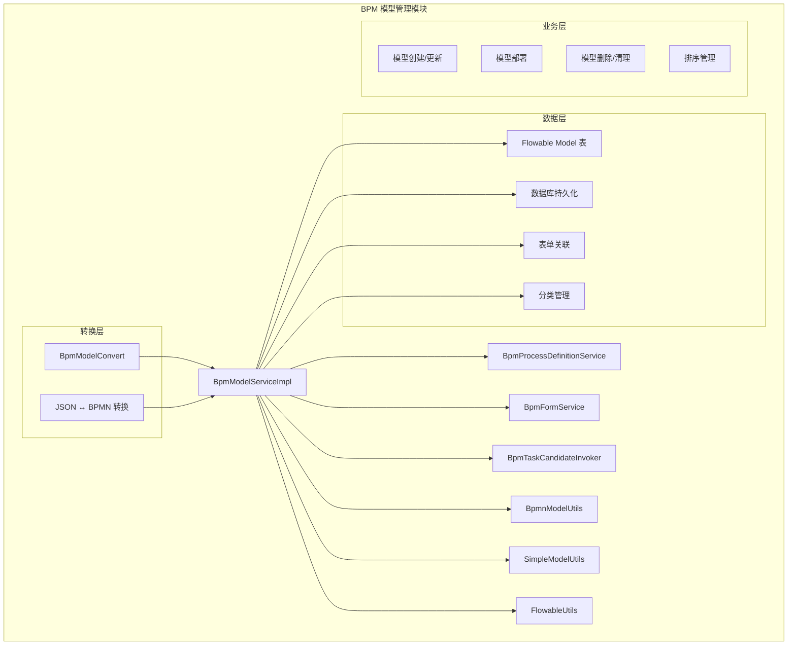
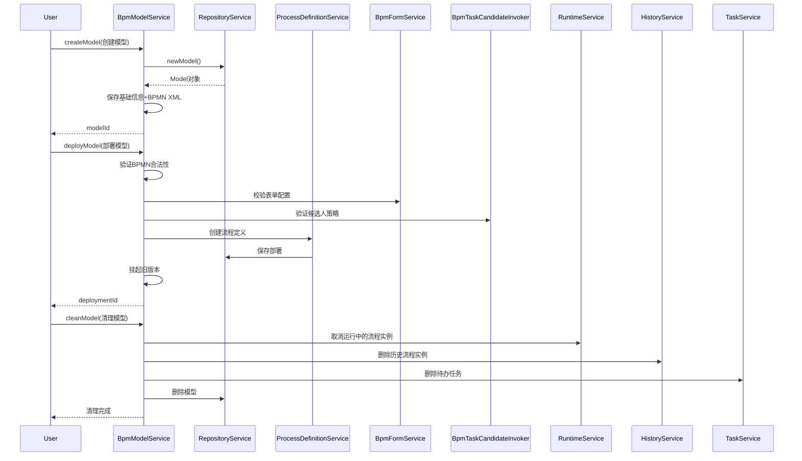
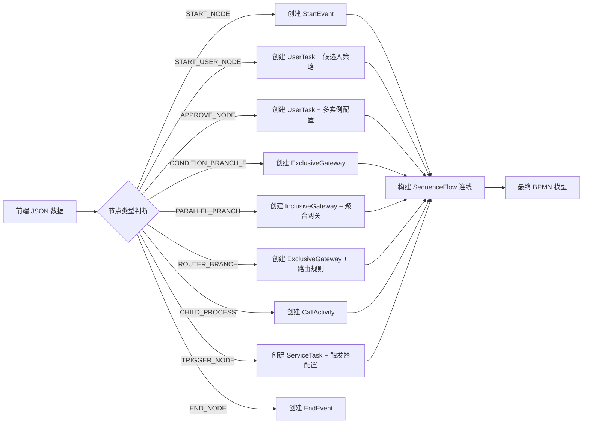
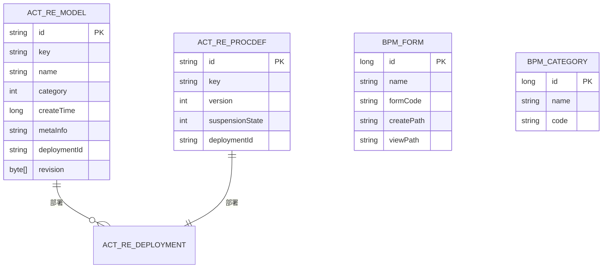
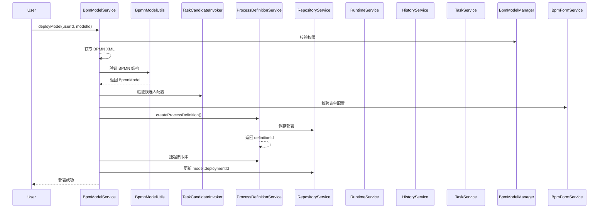

# BPM 模型管理模块 (definition_3_bpm_model)

## 1. 模块概述

BPM 模型管理模块是工作流引擎的核心组件，负责流程模型（Model）的创建、编辑、部署和管理。该模块基于 Flowable 引擎，提供了两种流程设计器支持：

- **标准 BPMN 设计器**：支持完整的 BPMN 2.0 规范
- **仿钉钉快搭设计器**：简化版的可视化流程设计，通过 JSON 数据结构描述流程

模块主要功能包括：
- 流程模型的 CRUD 操作
- 流程模型的部署与版本管理
- 表单配置关联
- 任务候选人策略配置
- 简单模型（JSON）到 BPMN 的转换
- 流程预测与模拟

## 2. 架构设计

### 2.1 整体架构



### 2.2 核心组件关系

| 组件 | 职责 | 关联模块 |
|------|------|----------|
| `BpmModelServiceImpl` | 模型业务逻辑核心 | RepositoryService, ProcessDefinitionService, FormService |
| `BpmModelConvert` | 对象转换（Model ↔ VO/DO） | BpmModelMetaInfoVO, BpmModelRespVO |
| `BpmnModelUtils` | BPMN 模型解析与操作 | Flowable BPMN 模型 |
| `SimpleModelUtils` | 简单模型（JSON）转 BPMN | 仿钉钉快搭设计器 |
| `BpmTaskCandidateInvoker` | 任务候选人策略验证 | 任务分配规则 |

## 3. 核心功能详解

### 3.1 模型生命周期



### 3.2 模型创建与保存

**创建流程：**
1. 校验流程标识（key）唯一性
2. 创建 Model 对象，设置 tenantId
3. 根据模型类型保存不同内容：
   - **BPMN 类型**：直接保存 BPMN XML
   - **SIMPLE 类型**：将 JSON 转换为 BPMN 模型，同时保存 JSON 数据

```java
// BpmModelServiceImpl.createModel()
if (BpmModelTypeEnum.BPMN.getType().equals(saveReqVO.getType()) && StrUtil.isNotEmpty(saveReqVO.getBpmnXml())) {
    updateModelBpmnXml(model.getId(), saveReqVO.getBpmnXml());
} else if (BpmModelTypeEnum.SIMPLE.getType().equals(saveReqVO.getType()) && saveReqVO.getSimpleModel() != null) {
    // JSON 转换成 bpmnModel
    BpmnModel bpmnModel = SimpleModelUtils.buildBpmnModel(model.getKey(), model.getName(), saveReqVO.getSimpleModel());
    updateModelBpmnXml(model.getId(), BpmnModelUtils.getBpmnXml(bpmnModel));
    updateModelSimpleJson(model.getId(), saveReqVO.getSimpleModel());
}
```

### 3.3 模型部署

部署是模型从编辑状态到可执行状态的关键步骤，包含以下验证：

1. **BPMN 合法性验证**：
   - 检查是否存在 StartEvent
   - 检查所有 UserTask 是否有 name
   - 验证第一个用户任务的候选人策略不能是"审批人自选"

2. **表单配置验证**：
   - 校验表单类型（NORMAL 或 CUSTOM）
   - 验证表单 ID 或自定义路径存在

3. **任务候选人策略验证**：通过 `BpmTaskCandidateInvoker` 验证 BPMN 中的任务分配配置

4. **创建流程定义**：调用 `ProcessDefinitionService.createProcessDefinition()`

5. **挂起旧版本**：确保只有最新部署的流程定义可以发起新流程

### 3.4 简单模型（JSON）转 BPMN

仿钉钉快搭设计器使用 JSON 描述流程，通过 `SimpleModelUtils` 转换为标准 BPMN 模型：



### 3.5 任务候选人策略

系统支持多种任务候选人分配策略，通过扩展元素存储在 BPMN 中：

| 策略类型 | 说明 | 适用场景 |
|----------|------|----------|
| `START_USER` | 发起人自己 | 第一个审批节点 |
| `DEPT_LEADER` | 部门主管 | 常规审批 |
| `USER_SELECT` | 审批人自选 | 灵活审批（部署时禁止用于第一个节点） |
| `EXPRESSION` | 表达式计算 | 复杂逻辑 |
| `FORM_USER` | 表单用户 | 从表单数据获取 |
| `FORM_DEPT_LEADER` | 表单部门主管 | 从表单数据获取 |

策略存储在 UserTask 的扩展元素中：
```xml
<userTask id="task1" name="审批">
  <extensionElements>
    <bpmn:candidateStrategy>3</bpmn:candidateStrategy>
    <bpmn:candidateParam>paramValue</bpmn:candidateParam>
  </extensionElements>
</userTask>
```

## 4. 数据模型

### 4.1 核心表结构



### 4.2 BpmModelMetaInfoVO 模型元数据

```json
{
  "formType": 1,           // 表单类型：1-正常，2-自定义
  "formId": 100,           // 表单ID（formType=1时）
  "formCustomCreatePath": "/custom/create",  // 自定义创建路径（formType=2时）
  "formCustomViewPath": "/custom/view",      // 自定义查看路径
  "managerUserIds": [1, 2],  // 管理用户ID列表
  "startUserIds": [1],       // 发起人用户ID列表
  "startDeptIds": [10],      // 发起人部门ID列表
  "sort": 1640995200000,     // 排序
  "tenantId": 100            // 租户ID
}
```

## 5. 关键类与方法

### 5.1 BpmModelServiceImpl

| 方法 | 说明 |
|------|------|
| `createModel()` | 创建新模型，支持 BPMN 和 SIMPLE 两种类型 |
| `updateModel()` | 更新模型信息 |
| `deployModel()` | 部署模型，创建流程定义并挂起旧版本 |
| `cleanModel()` | 清理模型相关的所有运行中和历史数据 |
| `updateModelState()` | 更新流程定义状态（激活/挂起） |
| `getSimpleModel()` | 获取简单模型的 JSON 数据 |
| `updateSimpleModel()` | 更新简单模型并重新生成 BPMN |

### 5.2 BpmnModelUtils

提供 BPMN 模型的工具方法：
- `getBpmnModel(byte[])`：解析 BPMN XML 为 BpmnModel 对象
- `getBpmnXml(BpmnModel)`：将 BpmnModel 转换为 BPMN XML
- `getStartEvent(BpmnModel)`：获取开始事件
- `parseCandidateStrategy(UserTask)`：解析候选人策略
- `evalConditionExpress(Map, String)`：评估条件表达式

### 5.3 SimpleModelUtils

简单模型（JSON）转换的核心工具：
- `buildBpmnModel(String, String, BpmSimpleModelNodeVO)`：将 JSON 转换为 BPMN 模型
- `simulateProcess(BpmSimpleModelNodeVO, Map[])`：流程预测模拟
- 各类 NodeConvert 实现：不同节点类型的转换逻辑（StartNodeConvert、ApproveNodeConvert 等）

## 6. 与其他模块的交互

### 6.1 与表单模块（BpmForm）

模型部署时需要关联表单，支持两种模式：
- **NORMAL**：关联系统中的表单（通过 formId）
- **CUSTOM**：使用自定义的创建/查看页面路径

### 6.2 与流程定义模块（BpmProcessDefinition）

部署模型时会：
1. 创建新的流程定义（ProcessDefinition）
2. 挂起同 key 的旧版本流程定义
3. 更新模型的 deploymentId 关联

### 6.3 与任务候选人模块（BpmTaskCandidateInvoker）

部署前验证任务节点的候选人配置是否合法，包括：
- 验证第一个用户任务的候选人策略
- 验证表达式策略的合法性

### 6.4 与多租户系统

所有操作自动添加 tenantId 过滤，使用 `FlowableUtils.getTenantId()` 获取当前租户 ID。

## 7. 异常处理

模块定义了多种异常场景，通过 `ErrorCodeConstants` 统一管理：

| 异常代码 | 说明 |
|----------|------|
| `MODEL_KEY_VALID` | 流程标识格式不合法（不是 NCName） |
| `MODEL_KEY_EXISTS` | 流程标识已存在 |
| `MODEL_NOT_EXISTS` | 流程模型不存在 |
| `MODEL_UPDATE_FAIL_NOT_MANAGER` | 用户没有模型管理权限 |
| `MODEL_DEPLOY_FAIL_BPMN_START_EVENT_NOT_EXISTS` | BPMN 缺少 StartEvent |
| `MODEL_DEPLOY_FAIL_BPMN_USER_TASK_NAME_NOT_EXISTS` | UserTask 没有设置 name |
| `MODEL_DEPLOY_FAIL_FIRST_USER_TASK_CANDIDATE_STRATEGY_ERROR` | 第一个用户任务候选人策略不合法 |
| `MODEL_DEPLOY_FAIL_FORM_NOT_CONFIG` | 表单未配置 |
| `FORM_NOT_EXISTS` | 表单不存在 |

## 8. 部署流程详解



## 9. 简单模型节点类型

仿钉钉快搭设计器支持的节点类型：

| 节点类型 | 类型值 | BPMN 元素 | 说明 |
|----------|--------|-----------|------|
| START_NODE | 0 | StartEvent | 开始节点（虚拟） |
| START_USER_NODE | 1 | UserTask | 发起人节点 |
| APPROVE_NODE | 2 | UserTask | 审批节点 |
| TRANSACTOR_NODE | 3 | UserTask | 事务节点（同审批） |
| COPY_NODE | 4 | ServiceTask | 抄送节点 |
| CONDITION_BRANCH_NODE | 5 | ExclusiveGateway | 条件分支 |
| PARALLEL_BRANCH_NODE | 6 | InclusiveGateway | 并行分支 |
| INCLUSIVE_BRANCH_NODE | 7 | InclusiveGateway | 包容分支 |
| ROUTER_BRANCH_NODE | 8 | ExclusiveGateway | 路由分支 |
| CHILD_PROCESS | 9 | CallActivity | 子流程 |
| TRIGGER_NODE | 10 | ServiceTask | 触发器节点 |
| DELAY_TIMER_NODE | 11 | ReceiveTask + BoundaryEvent | 延迟定时器 |
| END_NODE | 12 | EndEvent | 结束节点 |

## 10. 参考文档

- [BPM 流程定义管理](definition_3_bpm_process_definition.md)
- [BPM 表单管理](definition_3_bpm_form.md)
- [BPM 任务管理](definition_3_bpm_task.md)
- [Flowable 引擎官方文档](https://flowable.org/open-source/docs/)
