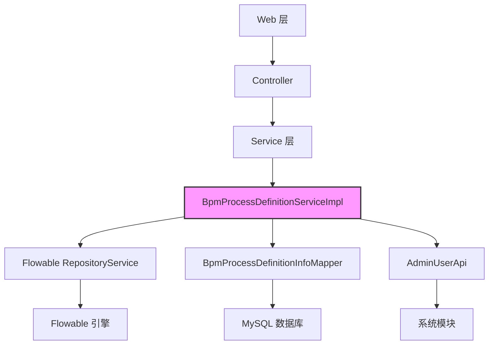
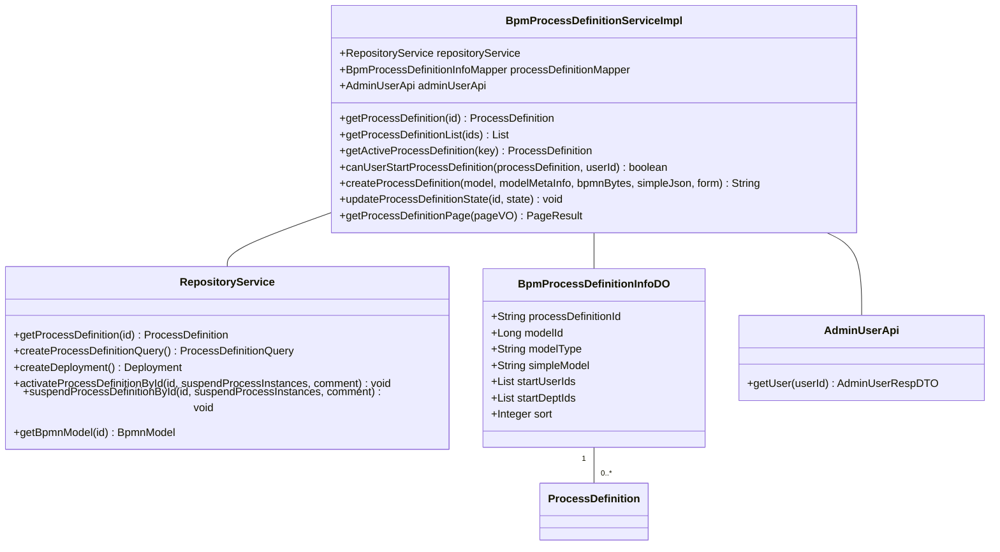
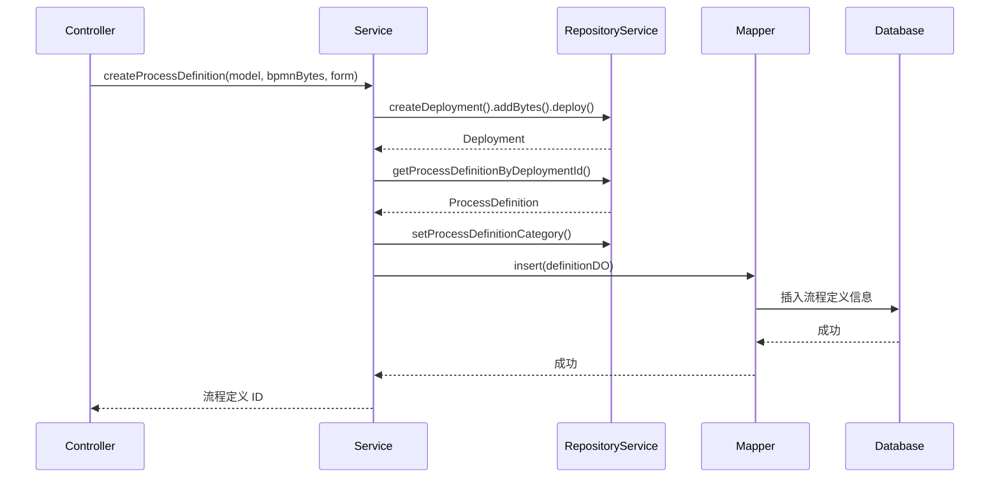
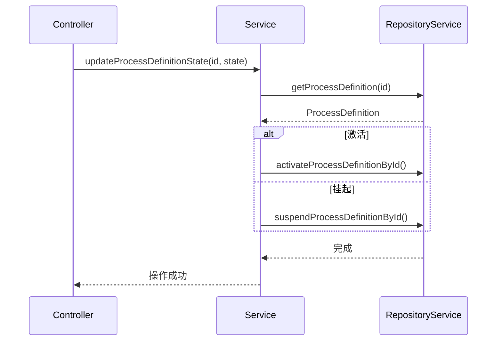
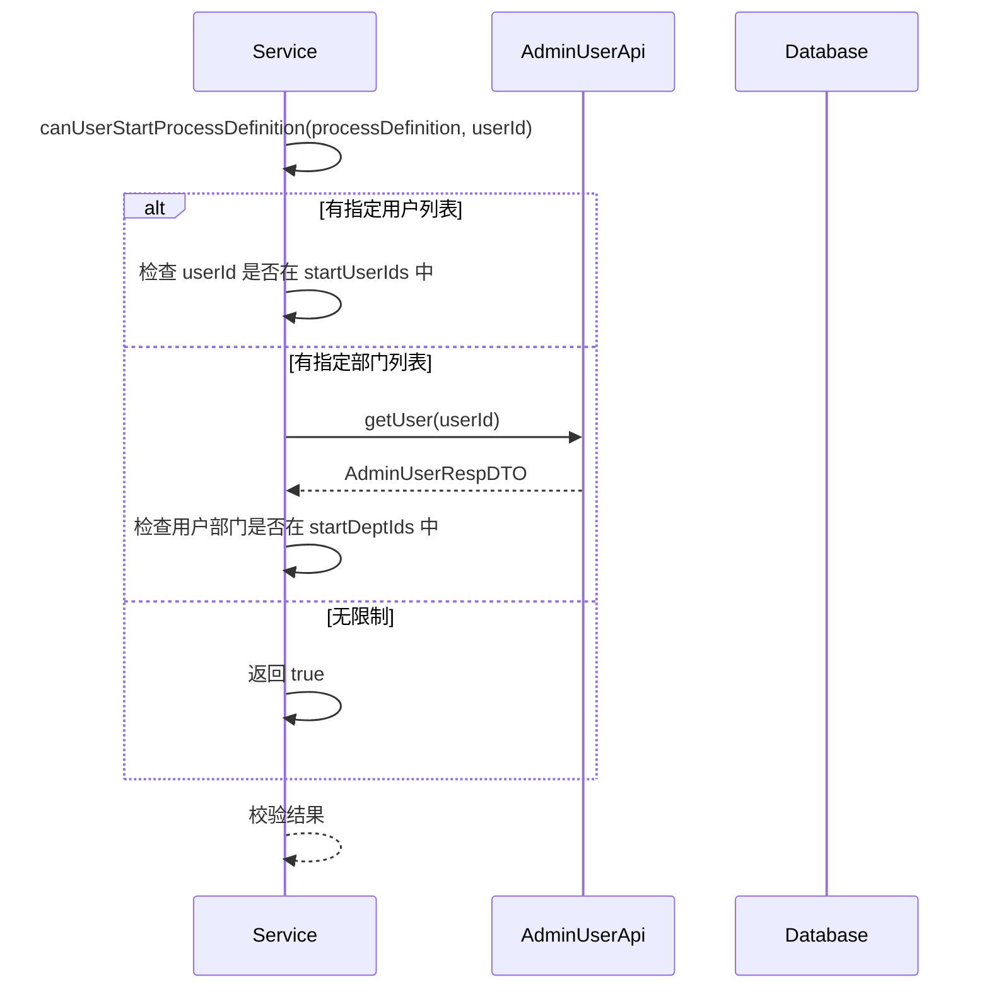
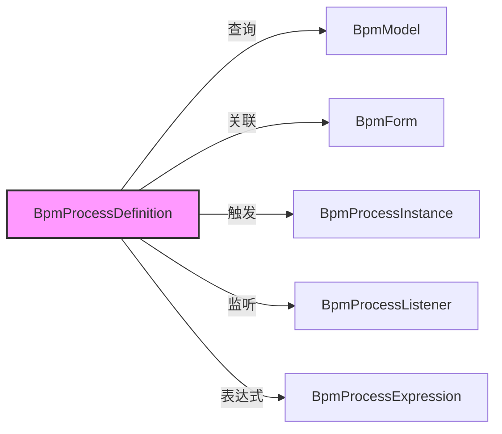
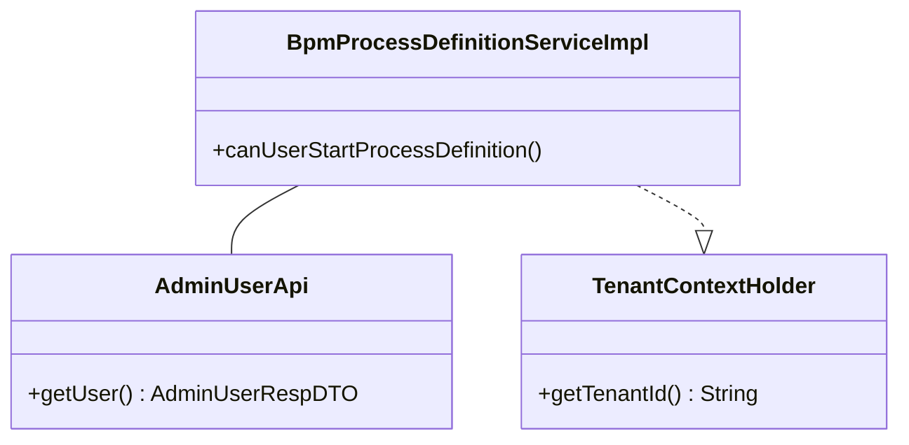

# BPM 流程定义模块文档 (BPM Process Definition Module)

## 1. 模块概述

BPM 流程定义模块是 Yudao 框架中业务流管理（Business Process Management）的核心组件，主要负责流程定义的生命周期管理、部署、激活/挂起、查询等操作。该模块基于 Flowable 引擎构建，提供了完整的流程定义管理能力。

### 1.1 核心功能

- 流程定义部署（Deployment）
- 流程定义激活与挂起（Activate/Suspend）
- 流程定义查询（Query）
- 流程定义与模型关联（Model Association）
- 流程定义权限校验（Permission Validation）
- 流程定义扩展信息管理（Extended Information）

### 1.2 模块定位

```
┌─────────────────────────────────────────────────────────────────┐
│                      BPM 模块                                   │
├─────────────────────────────────────────────────────────────────┤
│  ├─ 流程定义管理 (definition) ← 本模块                          │
│  ├─ 流程实例管理 (task)                                         │
│  ├─ 表单管理 (form)                                             │
│  ├─ 表达式管理 (expression)                                     │
│  ├─ 监听器管理 (listener)                                       │
│  └─ 评论管理 (comment)                                          │
└─────────────────────────────────────────────────────────────────┘
```

## 2. 架构设计

### 2.1 系统架构图



### 2.2 组件关系图



## 3. 核心组件说明

### 3.1 BpmProcessDefinitionServiceImpl

**路径**: `yudao-module-bpm/src/main/java/cn/iocoder/yudao/module/bpm/service/definition/BpmProcessDefinitionServiceImpl.java`

**功能描述**: 流程定义服务实现类，负责处理流程定义相关的业务逻辑。

**主要方法**:

| 方法名 | 描述 | 参数 | 返回值 |
|--------|------|------|--------|
| `getProcessDefinition` | 根据 ID 获取流程定义 | `String id` | `ProcessDefinition` |
| `getProcessDefinitionList` | 根据 ID 列表获取流程定义 | `Set<String> ids` | `List<ProcessDefinition>` |
| `getActiveProcessDefinition` | 根据 key 获取激活的流程定义 | `String key` | `ProcessDefinition` |
| `canUserStartProcessDefinition` | 校验用户是否可以发起流程 | `BpmProcessDefinitionInfoDO processDefinition, Long userId` | `boolean` |
| `createProcessDefinition` | 创建并部署流程定义 | `Model model, BpmModelMetaInfoVO modelMetaInfo, byte[] bpmnBytes, String simpleJson, BpmForm form` | `String (流程定义 ID)` |
| `updateProcessDefinitionState` | 更新流程定义状态（激活/挂起） | `String id, Integer state` | `void` |
| `getProcessDefinitionPage` | 分页查询流程定义 | `BpmProcessDefinitionPageReqVO pageVO` | `PageResult<ProcessDefinition>` |

### 3.2 关键数据对象

#### BpmProcessDefinitionInfoDO

**路径**: `yudao-module-bpm/src/main/java/cn/iocoder/yudao/module/bpm/dal/dataobject/definition/BpmProcessDefinitionInfoDO.java`

**字段说明**:

| 字段名 | 类型 | 描述 |
|--------|------|------|
| `processDefinitionId` | String | Flowable 流程定义 ID |
| `modelId` | String | 模型 ID |
| `modelType` | String | 模型类型 |
| `simpleModel` | String | 简单模型 JSON |
| `startUserIds` | List<Long> | 允许发起的用户 ID 列表 |
| `startDeptIds` | List<Long> | 允许发起的部门 ID 列表 |
| `sort` | Integer | 排序字段 |

### 3.3 依赖组件

#### RepositoryService (Flowable)

Flowable 引擎提供的仓库服务，用于管理流程定义、部署、模型等。

#### AdminUserApi

系统模块提供的用户 API，用于获取用户信息，进行权限校验。

#### BpmProcessDefinitionInfoMapper

流程定义信息的数据访问层，负责与数据库交互。

## 4. 核心流程

### 4.1 流程定义部署流程



### 4.2 流程定义激活/挂起流程



### 4.3 用户发起流程权限校验



## 5. 模块交互关系

### 5.1 与其他 BPM 子模块的关系



### 5.2 与系统模块的交互



## 6. 配置说明

### 6.1 自动配置类

**路径**: `yudao-module-bpm/src/main/java/cn/iocoder/yudao/module/bpm/framework/flowable/config/BpmFlowableConfiguration.java`

**功能**: Flowable 引擎的自动配置，包括数据库方言、表前缀等配置。

### 6.2 相关配置项

```yaml
bpm:
  flowable:
    table-prefix: ACT_  # Flowable 表前缀
    database-type: mysql # 数据库类型
```

## 7. 错误码定义

在 `ErrorCodeConstants` 中定义了以下与流程定义相关的错误码：

| 错误码 | 描述 |
|--------|------|
| `PROCESS_DEFINITION_KEY_NOT_MATCH` | 流程定义 key 不匹配 |
| `PROCESS_DEFINITION_NAME_NOT_MATCH` | 流程定义名称不匹配 |
| `PROCESS_DEFINITION_NOT_EXISTS` | 流程定义不存在 |

## 8. 使用示例

### 8.1 创建流程定义

```java
// 创建部署
Deployment deploy = repositoryService.createDeployment()
    .key(model.getKey()).name(model.getName())
    .addBytes("process.bpmn", bpmnBytes)
    .tenantId(FlowableUtils.getTenantId())
    .deploy();

// 插入扩展信息
BpmProcessDefinitionInfoDO definitionDO = new BpmProcessDefinitionInfoDO()
    .setModelId(model.getId())
    .setProcessDefinitionId(definition.getId())
    .setStartUserIds(Arrays.asList(1L, 2L))
    .setStartDeptIds(Arrays.asList(10L));
processDefinitionMapper.insert(definitionDO);
```

### 8.2 激活流程定义

```java
// 激活流程定义（不挂起实例）
repositoryService.activateProcessDefinitionById(processDefinitionId, false, null);

// 挂起流程定义（不挂起实例）
repositoryService.suspendProcessDefinitionById(processDefinitionId, false, null);
```

### 8.3 查询流程定义

```java
// 分页查询
PageResult<ProcessDefinition> result = bpmProcessDefinitionService.getProcessDefinitionPage(pageVO);

// 根据 key 获取激活的流程定义
ProcessDefinition definition = bpmProcessDefinitionService.getActiveProcessDefinition("leave-process");
```

## 9. 扩展点

### 9.1 自定义表达式

通过 `BpmProcessExpression` 可以实现自定义的候选人分配表达式，例如：

- `BpmTaskAssignLeaderExpression`: 分配给直属领导
- `BpmTaskAssignStartUserExpression`: 分配给发起人

### 9.2 自定义监听器

通过 `BpmProcessListener` 可以监听流程事件，例如：

- 流程实例创建
- 任务创建
- 流程完成

### 9.3 自定义表单

通过 `BpmForm` 可以将表单与流程定义关联，实现表单数据的自动填充和展示。

## 10. 参考文档

- [BPM 模型定义模块](definition_3_bpm_model.md)
- BPM 表单定义模块
- BPM 任务管理模块
- Flowable 官方文档
