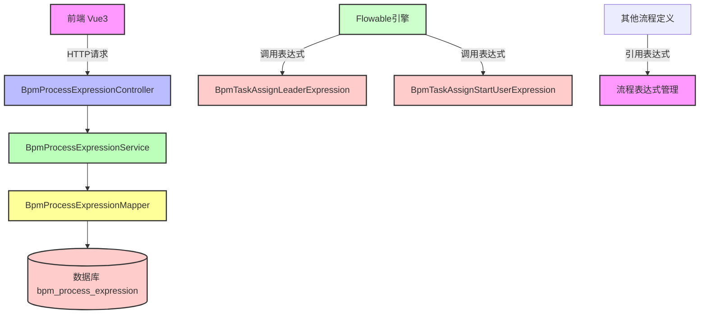
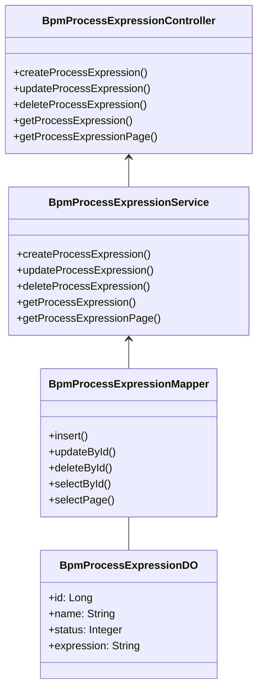
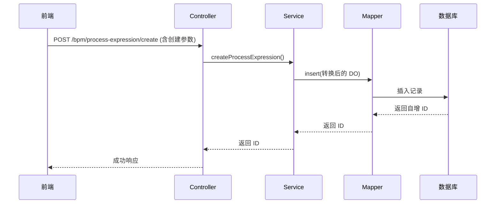
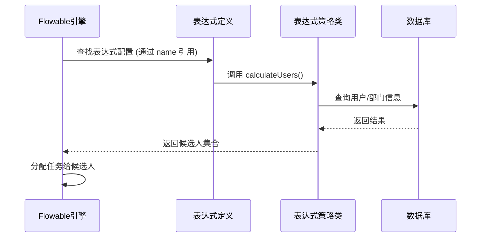

# BPM 流程表达式模块定义文档

## 1. 概述

BPM 流程表达式模块是 Yudaoo 工作流引擎中的核心组件之一，主要用于管理和配置流程中的动态表达式。这些表达式可以在流程执行过程中根据业务规则动态计算任务分配、条件判断等逻辑。

该模块提供了对流程表达式的完整 CRUD（创建、读取、更新、删除）操作，并支持与 Flowable 工作流引擎的集成，允许在流程定义中使用自定义表达式来实现灵活的流程控制。

## 2. 架构设计

### 2.1 系统架构图



### 2.2 组件关系图



## 3. 核心组件说明

### 3.1 数据对象 (DO)

**BpmProcessExpressionDO** - 流程表达式实体类

```java
@Table("bpm_process_expression")
@Data
@EqualsAndHashCode(callSuper = true)
@ToString(callSuper = true)
@Builder
@NoArgsConstructor
@AllArgsConstructor
public class BpmProcessExpressionDO extends BaseDO {
    
    /** 编号 */
    @TableId
    private Long id;
    
    /** 表达式名字 */
    private String name;
    
    /** 表达式状态 (枚举参考 common_status) */
    private Integer status;
    
    /** 表达式内容 */
    private String expression;
}
```

- **表名**: `bpm_process_expression`
- **主键**: `id` (使用序列生成)
- **字段说明**:
  - `id`: 唯一标识
  - `name`: 表达式名称，便于识别和管理
  - `status`: 表达式状态，通常使用枚举值表示启用/禁用等状态
  - `expression`: 实际的表达式内容，可以是 SpEL 表达式或其他支持的语言

### 3.2 控制器 (Controller)

**BpmProcessExpressionController** - REST API 接口层

提供标准的 RESTful API 接口，包括：

| HTTP 方法 | 路径 | 描述 | 权限 |
|-----------|------|------|------|
| POST | /bpm/process-expression/create | 创建流程表达式 | bpm:process-expression:create |
| PUT | /bpm/process-expression/update | 更新流程表达式 | bpm:process-expression:update |
| DELETE | /bpm/process-expression/delete | 删除流程表达式 | bpm:process-expression:delete |
| GET | /bpm/process-expression/get | 获取单个流程表达式 | bpm:process-expression:query |
| GET | /bpm/process-expression/page | 分页查询流程表达式 | bpm:process-expression:query |

### 3.3 服务层 (Service)

**BpmProcessExpressionServiceImpl** - 业务逻辑实现

主要功能：
- 创建新的流程表达式
- 更新现有流程表达式
- 删除流程表达式（带存在性校验）
- 获取单个流程表达式
- 分页查询流程表达式

关键代码逻辑：
```java
@Service
@Validated
public class BpmProcessExpressionServiceImpl implements BpmProcessExpressionService {

    @Resource
    private BpmProcessExpressionMapper processExpressionMapper;

    @Override
    public Long createProcessExpression(BpmProcessExpressionSaveReqVO createReqVO) {
        // 将 VO 转换为 DO
        BpmProcessExpressionDO processExpression = BeanUtils.toBean(createReqVO, BpmProcessExpressionDO.class);
        // 插入数据库
        processExpressionMapper.insert(processExpression);
        // 返回新记录的 ID
        return processExpression.getId();
    }

    @Override
    public void updateProcessExpression(BpmProcessExpressionSaveReqVO updateReqVO) {
        // 先校验记录是否存在
        validateProcessExpressionExists(updateReqVO.getId());
        // 转换并更新
        BpmProcessExpressionDO updateObj = BeanUtils.toBean(updateReqVO, BpmProcessExpressionDO.class);
        processExpressionMapper.updateById(updateObj);
    }

    private void validateProcessExpressionExists(Long id) {
        if (processExpressionMapper.selectById(id) == null) {
            throw exception(PROCESS_EXPRESSION_NOT_EXISTS);
        }
    }
}
```

### 3.4 视图对象 (VO)

#### 请求 VO

**BpmProcessExpressionSaveReqVO** - 新增/修改请求体

```java
@Data
public class BpmProcessExpressionSaveReqVO {
    
    private Long id;
    
    @NotEmpty(message = "表达式名字不能为空")
    private String name;
    
    @NotNull(message = "表达式状态不能为空")
    private Integer status;
    
    @NotEmpty(message = "表达式不能为空")
    private String expression;
}
```

**BpmProcessExpressionPageReqVO** - 分页查询请求体

```java
@Data
@EqualsAndHashCode(callSuper = true)
public class BpmProcessExpressionPageReqVO extends PageParam {
    
    private String name;
    
    @InEnum(CommonStatusEnum.class)
    private Integer status;
    
    @DateTimeFormat(pattern = FORMAT_YEAR_MONTH_DAY_HOUR_MINUTE_SECOND)
    private LocalDateTime[] createTime;
}
```

#### 响应 VO

**BpmProcessExpressionRespVO** - 响应体

包含所有 DO 字段以及创建时间，用于前端展示和导出 Excel。

### 3.5 表达式策略类

系统预置了一些常用的表达式策略，供流程定义中直接使用：

#### BpmTaskAssignLeaderExpression - 领导分配表达式

```java
@Component
@Deprecated
public class BpmTaskAssignLeaderExpression {
    
    public Set<Long> calculateUsers(DelegateExecution execution, int level) {
        // 根据指定层级获取发起人的上级领导
        // 返回该领导的用户 ID 集合
    }
}
```

用途：在流程任务中自动分配给指定层级的部门领导。

#### BpmTaskAssignStartUserExpression - 发起人分配表达式

```java
@Component
@Deprecated
public class BpmTaskAssignStartUserExpression {
    
    public Set<Long> calculateUsers(ExecutionEntityImpl execution) {
        // 直接返回流程发起人
        // 返回发起人的用户 ID 集合
    }
}
```

用途：将任务直接分配给流程的发起人。

#### VariableConvertByTypeExpressionFunction - 类型转换函数

```java
@Component
@Deprecated
public class VariableConvertByTypeExpressionFunction extends AbstractFlowableVariableExpressionFunction {
    
    public static Object convertByType(VariableContainer variableContainer, String variableName, Object parmaValue) {
        // 在表达式中进行变量类型转换
        // 兼容旧版本，计划于 2027 年移除
    }
}
```

用途：在 SpEL 表达式中提供类型转换功能。

## 4. 数据流程图

### 4.1 创建流程表达式



### 4.2 流程执行中使用表达式



## 5. 与其他模块的关系

### 5.1 BPM 模块内部集成

流程表达式模块与 BPM 模块的其他组件紧密集成：

- **BpmFormController**: 表单定义可能引用流程表达式
- **BpmProcessDefinitionController**: 流程定义中可以使用表达式作为条件或分配规则
- **BpmTaskController**: 任务处理时可能需要解析表达式来确定候选人

### 5.2 系统模块依赖

- **系统用户服务**: 通过 AdminUserApi 获取用户信息（用于领导分配表达式）
- **部门服务**: 通过 DeptApi 获取部门结构（用于领导分配表达式）
- **流程实例服务**: 通过 BpmProcessInstanceService 获取流程启动信息

### 5.3 Flowable 引擎集成

流程表达式模块扩展了 Flowable 引擎的功能，允许：
- 在流程定义中使用自定义表达式替代硬编码的用户/组
- 实现更灵活的任务分配策略
- 在运行时动态计算流程变量

## 6. API 详细说明

### 6.1 创建流程表达式

**请求**: `POST /bpm/process-expression/create`

**请求体**:
```json
{
  "name": "部门领导分配",
  "status": 1,
  "expression": "@BpmTaskAssignLeaderExpression.calculateUsers(#execution, 1)"
}
```

**响应**:
```json
{
  "code": 200,
  "message": "成功",
  "data": 1001
}
```

### 6.2 更新流程表达式

**请求**: `PUT /bpm/process-expression/update`

**请求体**:
```json
{
  "id": 1001,
  "name": "更新的表达式名称",
  "status": 1,
  "expression": "@BpmTaskAssignStartUserExpression.calculateUsers(#execution)"
}
```

**响应**:
```json
{
  "code": 200,
  "message": "成功",
  "data": true
}
```

### 6.3 删除流程表达式

**请求**: `DELETE /bpm/process-expression?id=1001`

**响应**:
```json
{
  "code": 200,
  "message": "成功",
  "data": true
}
```

### 6.4 获取流程表达式

**请求**: `GET /bpm/process-expression/get?id=1001`

**响应**:
```json
{
  "code": 200,
  "message": "成功",
  "data": {
    "id": 1001,
    "name": "部门领导分配",
    "status": 1,
    "expression": "@BpmTaskAssignLeaderExpression.calculateUsers(#execution, 1)",
    "createTime": "2024-01-01 10:00:00"
  }
}
```

### 6.5 分页查询流程表达式

**请求**: `GET /bpm/process-expression/page?name=领导&status=1&pageNum=1&pageSize=10`

**响应**:
```json
{
  "code": 200,
  "message": "成功",
  "data": {
    "list": [...],
    "pageNum": 1,
    "pageSize": 10,
    "size": 10,
    "page": 1,
    "pages": 5,
    "total": 50
  }
}
```

## 7. 使用场景示例

### 7.1 动态任务分配

在 BPMN 流程定义中，可以将某个用户任务的候选人设置为表达式引用：

```xml
<userTask id="approveTask" name="审批">
  <extensionElements>
    <flowable:candidateExpression expression="${@BpmProcessExpressionService.getExpressionByName('部门领导分配').expression}" />
  </extensionElements>
</userTask>
```

这样，每次流程执行到该任务时，都会调用对应的表达式来计算实际的审批人。

### 7.2 条件分支判断

在网关处使用表达式来决定流程走向：

```xml
<exclusiveGateway id="gateway" name="判断网关"/>
<sequenceFlow id="flow1" sourceRef="gateway" targetRef="task1">
  <conditionExpression xsi:type="tFormalExpression">
    ${@BpmProcessExpressionService.getExpressionByName('金额判断规则').expression}
  </conditionExpression>
</sequenceFlow>
```

### 7.3 复杂业务逻辑封装

将复杂的业务逻辑封装成可重用的表达式，避免在流程定义中写死逻辑：

```java
// 表达式内容示例
"@OrderCalculateService.calculateDiscount(#order, #context)"
```

## 8. 注意事项

1. **安全性**: 表达式执行可能存在安全风险，应限制可使用的表达式函数和方法
2. **性能**: 复杂的表达式可能会影响流程执行性能，建议进行缓存优化
3. **兼容性**: 部分预置的表达式策略标记为 @Deprecated，建议使用新的策略类替代
4. **错误处理**: 表达式执行失败时需要妥善处理，避免流程中断
5. **版本管理**: 表达式变更时应考虑对正在进行的流程实例的影响

## 9. 相关文档

- [BPM 流程定义模块](definition_3_bpm_process_definition.md)
- [BPM 表单模块](definition_3_bpm_form.md)
- [Flowable 引擎集成文档](flowable_integration.md)
- [系统权限体系](system_permission.md)
