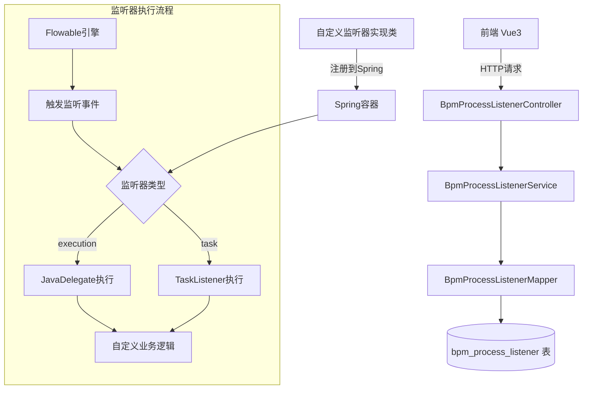
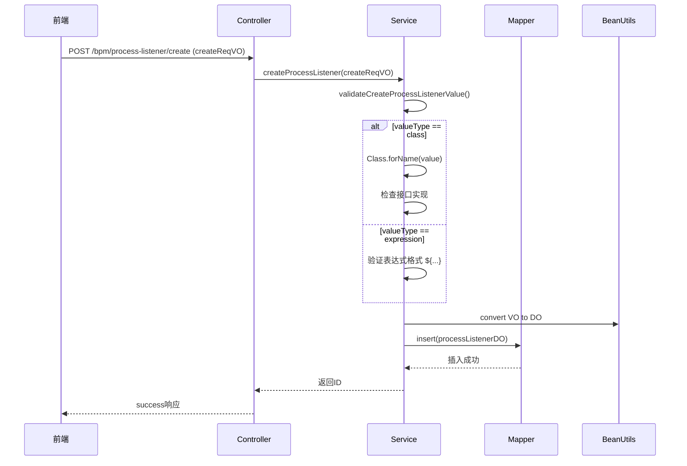
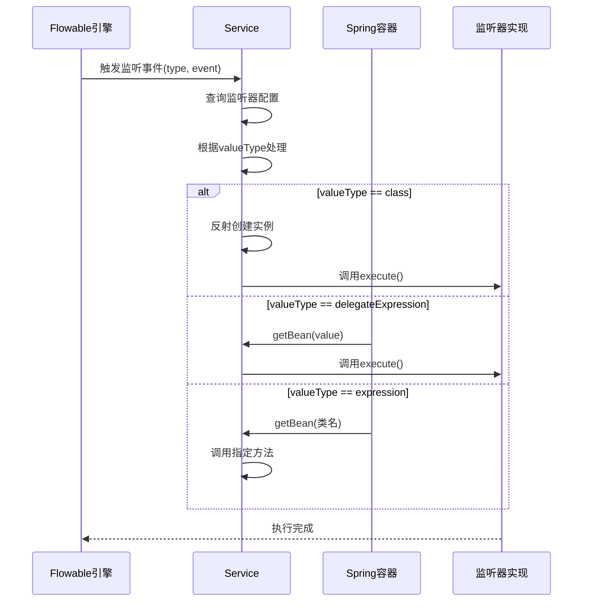
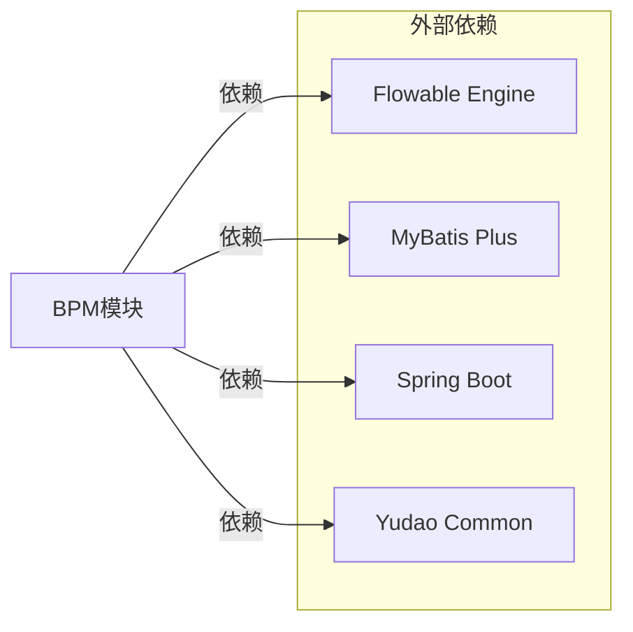

# BPM 流程监听器模块定义文档

## 1. 概述

BPM 流程监听器（Process Listener）是工作流引擎中用于监听流程执行过程中关键事件并进行自定义处理的机制。本模块基于 Flowable 引擎，提供了对流程监听器的完整 CRUD 管理功能，支持两种类型的监听器：

- **执行监听器（ExecutionListener）**：监听流程实例的生命周期事件（如开始、结束）
- **任务监听器（TaskListener）**：监听用户任务相关的事件（如创建、指派、完成等）

监听器支持三种值类型：
- **Java 类**：直接实现 `JavaDelegate` 或 `TaskListener` 接口
- **委托表达式（delegateExpression）**：Spring Bean 名称，需注册到 Spring 容器
- **表达式（expression）**：普通类的普通方法，通过 Spring 容器调用

## 2. 架构设计

### 2.1 系统架构图



### 2.2 组件关系图

```mermaid
classDiagram
    class BpmProcessListenerController {
        +createProcessListener()
        +updateProcessListener()
        +deleteProcessListener()
        +getProcessListener()
        +getProcessListenerPage()
    }
    
    class BpmProcessListenerServiceImpl {
        +createProcessListener()
        +updateProcessListener()
        +deleteProcessListener()
        +getProcessListener()
        +getProcessListenerPage()
        +validateCreateProcessListenerValue()
        +validateProcessListenerExists()
    }
    
    class BpmProcessListenerDO {
        +id
        +name
        +status
        +type
        +event
        +valueType
        +value
        +createTime
    }
    
    class BpmProcessListenerMapper {
        +insert()
        +updateById()
        +deleteById()
        +selectById()
        +selectPage()
    }
    
    class BpmProcessListenerTypeEnum {
        <<enum>>
        EXECUTION("execution", "执行监听器")
        TASK("task", "任务执行器")
    }
    
    class BpmProcessListenerValueTypeEnum {
        <<enum>>
        CLASS("class", "Java 类")
        DELEGATE_EXPRESSION("delegateExpression", "代理表达式")
        EXPRESSION("expression", "表达式")
    }
    
    BpmProcessListenerController <-- BpmProcessListenerServiceImpl
    BpmProcessListenerServiceImpl <-- BpmProcessListenerMapper
    BpmProcessListenerMapper --|操作| BpmProcessListenerDO
    BpmProcessListenerDO --|引用| BpmProcessListenerTypeEnum
    BpmProcessListenerDO --|引用| BpmProcessListenerValueTypeEnum
```

## 3. 核心组件说明

### 3.1 数据对象（DO）

**文件路径**: `yudao-module-bpm/src/main/java/cn/iocoder/yudao/module/bpm/dal/dataobject/definition/BpmProcessListenerDO.java`

```java
@Table(value = "bpm_process_listener")
@Data
@Builder
@NoArgsConstructor
@AllArgsConstructor
public class BpmProcessListenerDO extends BaseDO {
    
    @TableId
    private Long id;                    // 主键ID
    
    private String name;                // 监听器名字
    private Integer status;             // 状态 (CommonStatusEnum)
    private String type;                // 监听类型 (execution/task)
    private String event;               // 监听事件
    private String valueType;           // 值类型 (class/delegateExpression/expression)
    private String value;               // 值 (类名/表达式)
    private LocalDateTime createTime;   // 创建时间
}
```

**字段说明**:

| 字段 | 类型 | 必填 | 说明 |
|------|------|------|------|
| id | Long | 是 | 自增主键 |
| name | String | 是 | 监听器唯一标识名称 |
| status | Integer | 是 | 启用/禁用状态 |
| type | String | 是 | 监听器类型: execution/task |
| event | String | 是 | 监听的具体事件 |
| valueType | String | 是 | 值类型: class/delegateExpression/expression |
| value | String | 是 | 监听器实现内容 |
| createTime | LocalDateTime | 否 | 创建时间 |

### 3.2 服务层实现

**文件路径**: `yudao-module-bpm/src/main/java/cn/iocoder/yudao/module/bpm/service/definition/BpmProcessListenerServiceImpl.java`

#### 主要功能方法

| 方法名 | 参数 | 返回值 | 说明 |
|--------|------|--------|------|
| `createProcessListener` | `BpmProcessListenerSaveReqVO` | Long | 创建新监听器，返回ID |
| `updateProcessListener` | `BpmProcessListenerSaveReqVO` | void | 更新现有监听器 |
| `deleteProcessListener` | Long | void | 删除监听器 |
| `getProcessListener` | Long | BpmProcessListenerDO | 根据ID获取监听器 |
| `getProcessListenerPage` | `BpmProcessListenerPageReqVO` | PageResult<BpmProcessListenerDO> | 分页查询监听器 |

#### 校验逻辑

```mermaid
sequenceDiagram
    participant Controller as Controller
    participant Service as Service
    participant Mapper as Mapper
    
    Service->>Service: validateCreateProcessListenerValue()
    alt valueType == class
        Service->>Service: Class.forName(value)
        Service->>Service: 检查是否实现对应接口
        JavaDelegate|--| execution
        TaskListener |--| task
    else valueType != class
        Service->>Service: 检查表达式格式 ${...}
    end
    Service->>Mapper: insert/update/delete
```

### 3.3 控制器层

**文件路径**: `yudao-module-bpm/src/main/java/cn/iocoder/yudao/module/bpm/controller/admin/definition/BpmProcessListenerController.java`

#### API 端点

| HTTP 方法 | 路径 | 描述 | 权限 |
|-----------|------|------|------|
| POST | `/bpm/process-listener/create` | 创建流程监听器 | `bpm:process-listener:create` |
| PUT | `/bpm/process-listener/update` | 更新流程监听器 | `bpm:process-listener:update` |
| DELETE | `/bpm/process-listener/delete` | 删除流程监听器 | `bpm:process-listener:delete` |
| GET | `/bpm/process-listener/get` | 获取单个流程监听器 | `bpm:process-listener:query` |
| GET | `/bpm/process-listener/page` | 分页获取流程监听器 | `bpm:process-listener:query` |

### 3.4 枚举定义

#### 监听器类型

```java
public enum BpmProcessListenerTypeEnum {
    EXECUTION("execution", "执行监听器"),      // 监听流程生命周期
    TASK("task", "任务监听器");                 // 监听用户任务事件
}
```

#### 监听器值类型

```java
public enum BpmProcessListenerValueTypeEnum {
    CLASS("class", "Java 类"),                  // 直接实现接口
    DELEGATE_EXPRESSION("delegateExpression", "代理表达式"), // Spring Bean名称
    EXPRESSION("expression", "表达式");         // 普通方法调用
}
```

#### 监听事件说明

| 监听器类型 | 事件值 | 说明 |
|------------|--------|------|
| execution | start | 流程实例启动时触发 |
| execution | end | 流程实例结束时触发 |
| task | create | 任务创建时触发 |
| task | assignment | 任务指派时触发 |
| task | complete | 任务完成时触发 |
| task | delete | 任务删除时触发 |
| task | update | 任务更新时触发 |
| task | timeout | 任务超时时触发 |

## 4. 数据流分析

### 4.1 创建流程监听器数据流



### 4.2 监听器执行流程



## 5. 使用示例

### 5.1 创建自定义监听器类

```java
// 示例：执行监听器 - 流程开始时记录日志
public class ProcessStartListener implements JavaDelegate {
    @Override
    public void execute(DelegateExecution execution) throws Exception {
        System.out.println("流程开始: " + execution.getProcessInstanceId());
        // 可在此处执行业务逻辑，如发送通知、记录审计日志等
    }
}

// 示例：任务监听器 - 任务指派时发送邮件
public class TaskAssignmentListener implements TaskListener {
    @Override
    public notify(DelegateTask delegateTask) throws Exception {
        String assignee = delegateTask.getAssignee();
        // 发送邮件通知
        mailService.sendEmail(assignee, "新任务已指派");
    }
}
```

### 5.2 在流程定义中配置监听器

在 BPMN XML 文件中配置监听器：

```xml
<!-- 执行监听器示例 -->
<userTask id="userTask1" name="审批任务">
    <extensionElements>
        <flowable:executionListener event="start" 
            class="cn.iocoder.bpm.listener.ProcessStartListener"/>
        <flowable:executionListener event="end" 
            expression="${myService.onProcessEnd(execution)}"/>
    </extensionElements>
</userTask>

<!-- 任务监听器示例 -->
<userTask id="userTask2" name="领导审核">
    <extensionElements>
        <flowable:taskListener event="create" 
            delegateExpression="${taskAssignmentService}"/>
        <flowable:taskListener event="assignment" 
            class="cn.iocoder.bpm.listener.TaskAssignmentListener"/>
    </extensionElements>
</userTask>
```

### 5.3 REST API 调用示例

**创建监听器**:
```http
POST /bpm/process-listener/create
Content-Type: application/json

{
  "name": "流程开始监听器",
  "type": "execution",
  "event": "start",
  "status": 1,
  "valueType": "class",
  "value": "com.example.listener.ProcessStartListener"
}
```

**分页查询**:
```http
GET /bpm/process-listener/page?name=流程&status=1&page=1&size=10
```

## 6. 依赖关系

### 6.1 模块依赖



### 6.2 数据库依赖

- **表**: `bpm_process_listener`
- **序列**: `bpm_process_listener_seq` (用于 Oracle/PostgreSQL 等)

### 6.3 其他模块集成

| 模块 | 集成方式 | 说明 |
|------|----------|------|
| 权限模块 | `@PreAuthorize` | 控制API访问权限 |
| 代码生成模块 | 自动生成 | 支持通过代码生成功能生成监听器相关代码 |
| 缓存模块 | Redis | 监听器配置可缓存到Redis提升性能 |

## 7. 错误码定义

| 错误码 | 说明 | 处理建议 |
|--------|------|----------|
| PROCESS_LISTENER_CLASS_NOT_FOUND | 监听器类不存在 | 检查类名是否正确，确保类在classpath中 |
| PROCESS_LISTENER_CLASS_IMPLEMENTS_ERROR | 类未实现正确接口 | 确保实现 JavaDelegate (execution) 或 TaskListener (task) |
| PROCESS_LISTENER_EXPRESSION_INVALID | 表达式格式不正确 | 表达式必须以 `${` 开头，以 `}` 结尾 |
| PROCESS_LISTENER_NOT_EXISTS | 监听器不存在 | 检查ID是否正确 |

## 8. 扩展建议

### 8.1 添加新的监听事件类型

1. 在 `BpmProcessListenerEventTypeEnum` 中添加新事件
2. 在 `BpmProcessListenerDO` 中增加事件校验逻辑
3. 在前端VO中添加新事件的选项

### 8.2 支持更多值类型

1. 添加新的 `valueType` 枚举值
2. 在 `validateCreateProcessListenerValue()` 中添加新类型的校验逻辑
3. 在服务层添加对应的解析和执行逻辑

### 8.3 监听器版本控制

```java
// 建议在BpmProcessListenerDO中添加版本号
private Integer version;  // 乐观锁控制
private String description;  // 描述信息
```

## 9. 测试要点

### 9.1 单元测试重点

1. **值类型校验**: 验证 class、delegateExpression、expression 三种类型的正确性
2. **接口实现验证**: 验证 JavaDelegate 和 TaskListener 接口的实现检查
3. **异常处理**: 验证类找不到、接口不匹配、表达式格式错误等异常情况
4. **CRUD操作**: 验证创建、更新、删除、查询的完整流程

### 9.2 集成测试重点

1. **Flowable引擎集成**: 验证监听器在实际流程中的触发和执行
2. **Spring上下文**: 验证 delegateExpression 和 expression 类型的Bean查找
3. **事务一致性**: 验证监听器配置的原子性操作

## 10. 参考文档

- [Flowable官方文档 - 监听器](https://www.flowable.org/docs/userguide/index.html#listeners)
- [Yudao框架通用工具库](./yudao-common.md)
- [BPM模块整体架构](./bpm_module_architecture.md)
- [Flowable引擎配置](./bpm_flowable_configuration.md)
